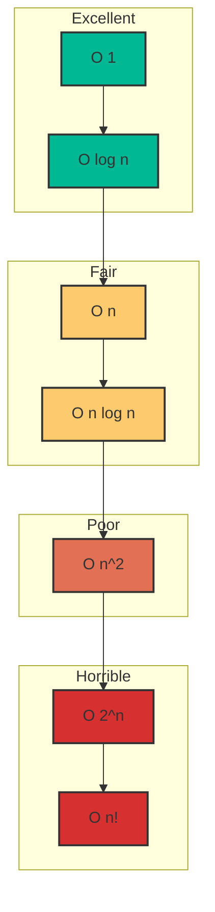

# Complexity Analysis Master Class

## Overview
Complexity analysis is the theoretical foundation of computer science that allows us to estimate the performance of algorithms as the input size grows. For a Senior/Staff Engineer, simply knowing Big O is not enough; you must be able to discuss **amortized complexity**, **space-time trade-offs**, and **system-level implications**.

## Fundamentals

### Big O Notation (Upper Bound)
Describes the **worst-case** scenario.
*   **O(1)**: Constant time. (Hash Map lookup, Array access)
*   **O(log n)**: Logarithmic time. (Binary Search, BST operations)
*   **O(n)**: Linear time. (Iterating an array)
*   **O(n log n)**: Log-linear time. (Merge Sort, Heap Sort)
*   **O(n²)**: Quadratic time. (Nested loops, Bubble Sort)
*   **O(2^n)**: Exponential time. (Recursive Fibonacci, Power Set)
*   **O(n!)**: Factorial time. (Permutations)

### Big Omega (Ω) and Big Theta (Θ)
*   **Ω (Big Omega)**: Best-case lower bound.
*   **Θ (Big Theta)**: Tight bound (average case often matches this).

### Amortized Analysis
The average time per operation over a sequence of operations.
*   *Example*: `ArrayList` resizing. Most adds are O(1), but occasionally O(n) when resizing. Amortized cost is O(1).

## Visual Complexity Comparison



## Calculating Complexity

### Iterative Algorithms
Count the loops.
*   Single loop: `O(n)`
*   Nested loop: `O(n^2)`
*   Two separate loops: `O(n + m)`

```java
// O(n^2)
for (int i = 0; i < n; i++) {
    for (int j = 0; j < n; j++) {
        // constant work
    }
}
```

### Recursive Algorithms
Use the **Recursion Tree Method** or **Master Theorem**.
*   **Time** = (Number of branches) ^ (Depth of tree)
*   **Space** = Depth of the recursion stack (Max depth)

#### Example: Fibonacci (Naive)
```java
int fib(int n) {
    if (n <= 1) return n;
    return fib(n-1) + fib(n-2);
}
```
*   **Time**: O(2^n) - Each call branches into two.
*   **Space**: O(n) - Max depth of stack.

## Space Complexity
*   **Auxiliary Space**: Extra space used by the algorithm.
*   **Total Space**: Input size + Auxiliary space.
*   **In-Place**: Uses O(1) auxiliary space (e.g., Heapsort).
*   **Out-of-Place**: Uses extra space (e.g., Merge Sort O(n)).

## 🏦 Banking Context: Latency vs. Throughput
In high-frequency trading (HFT):
*   **O(1)** is critical for the hot path (order matching).
*   **GC Pauses**: Java Garbage Collection can introduce unpredictable latency. Using **off-heap memory** or **object pooling** helps maintain consistent "complexity" in practice.
*   **Worst-case matters**: A 99.9th percentile latency spike (O(n) operation in a usually O(1) path) can cause slippage and financial loss.

## Interview Questions & Model Answers

### Q: "What is the difference between O(n) and amortized O(1)?"
**Answer**: "O(n) means every single operation takes linear time. Amortized O(1) means that while some individual operations might be expensive (like resizing an ArrayList), the average cost over a large sequence of operations is constant. In a real-time banking system, however, we might prefer a strict O(log n) over an amortized O(1) if that occasional O(n) spike violates our SLA."

### Q: "How does recursion affect space complexity?"
**Answer**: "Recursion implicitly uses the call stack. Each recursive call adds a frame to the stack. So, a recursive algorithm with depth D has at least O(D) space complexity. If D is large (e.g., traversing a skewed tree), we risk a `StackOverflowError`. In production systems, we often convert recursion to iteration to avoid this risk and control memory usage explicitly."

## Key Takeaways
1.  **Always mention Space Complexity**: Don't just analyze time.
2.  **Worst Case is King**: In interviews, assume worst-case unless asked otherwise.
3.  **Constants Matter in Real Life**: O(2n) is O(n), but in HFT, that factor of 2 matters.
4.  **Logarithms are Powerful**: O(log n) is practically constant for any realistic data size (log2 of 1 trillion is ~40).

---
**Next**: [Problem Solving Framework](02-problem-solving-framework.md)
