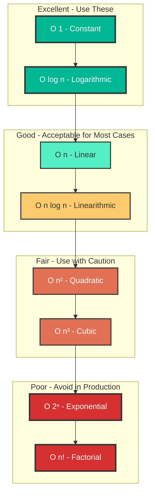
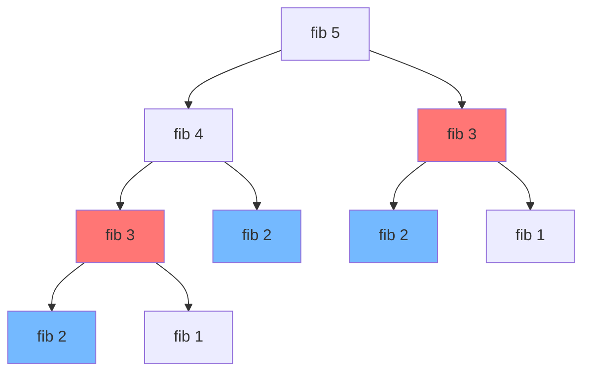

# Complexity Analysis: Complete Master Class

## Overview
Complexity analysis is the **theoretical foundation** of computer science that allows us to predict and compare algorithm performance as input size grows. For a Senior/Staff Engineer, mastering complexity analysis goes far beyond knowing Big O notation—it requires understanding **amortized complexity**, **space-time trade-offs**, **probabilistic analysis**, **cache complexity**, and **system-level performance implications**.

This comprehensive guide will transform you from someone who can identify O(n) to someone who can:
- Prove complexity bounds using mathematical techniques
- Design algorithms with specific complexity targets
- Make informed architectural decisions based on complexity analysis
- Discuss performance trade-offs with confidence in senior-level interviews

---

## Table of Contents
1. [Asymptotic Notation Fundamentals](#asymptotic-notation-fundamentals)
2. [Calculating Time Complexity](#calculating-time-complexity)
3. [Space Complexity Deep Dive](#space-complexity-deep-dive)
4. [Amortized Analysis](#amortized-analysis)
5. [Master Theorem](#master-theorem)
6. [Recurrence Relations](#recurrence-relations)
7. [Probabilistic Analysis](#probabilistic-analysis)
8. [Cache and Memory Hierarchy](#cache-and-memory-hierarchy)
9. [Interview Questions & Model Answers](#interview-questions--model-answers)
10. [Banking & Production Context](#banking--production-context)

---

## Asymptotic Notation Fundamentals

### Big O Notation (O) - Upper Bound
Describes the **worst-case** scenario. Formally: f(n) = O(g(n)) if there exist constants c > 0 and n₀ such that f(n) ≤ c·g(n) for all n ≥ n₀.

**Common Complexities (Best to Worst):**

| Notation | Name | Example Operations | Growth Rate |
|----------|------|-------------------|-------------|
| **O(1)** | Constant | Array access, HashMap get (average) | Doesn't grow |
| **O(log n)** | Logarithmic | Binary search, balanced BST operations | Very slow growth |
| **O(√n)** | Square root | Prime factorization | Slow growth |
| **O(n)** | Linear | Array traversal, linear search | Linear growth |
| **O(n log n)** | Linearithmic | Merge sort, heap sort, optimal comparison sorts | Moderate growth |
| **O(n²)** | Quadratic | Nested loops, bubble sort, selection sort | Fast growth |
| **O(n³)** | Cubic | Triple nested loops, naive matrix multiplication | Very fast growth |
| **O(2ⁿ)** | Exponential | Recursive Fibonacci, power set generation | Explosive growth |
| **O(n!)** | Factorial | Generating all permutations | Catastrophic growth |

### Big Omega (Ω) - Lower Bound
Describes the **best-case** scenario. Formally: f(n) = Ω(g(n)) if there exist constants c > 0 and n₀ such that f(n) ≥ c·g(n) for all n ≥ n₀.

**Example**: Binary search is Ω(1) because in the best case, the target is at the middle position.

### Big Theta (Θ) - Tight Bound
Describes the **average-case** or exact growth rate. Formally: f(n) = Θ(g(n)) if f(n) = O(g(n)) AND f(n) = Ω(g(n)).

**Example**: Merge sort is Θ(n log n) because it always performs n log n comparisons regardless of input.

### Little o and Little omega
- **o(g(n))**: Strictly less than (upper bound not tight)
- **ω(g(n))**: Strictly greater than (lower bound not tight)

---

## Visual Complexity Comparison



### Growth Rate Comparison (Practical Numbers)

| n | log n | n | n log n | n² | 2ⁿ |
|---|-------|---|---------|----|----|
| 10 | 3 | 10 | 33 | 100 | 1,024 |
| 100 | 7 | 100 | 664 | 10,000 | 1.27×10³⁰ |
| 1,000 | 10 | 1,000 | 9,966 | 1,000,000 | ∞ (practically) |
| 1,000,000 | 20 | 1,000,000 | 19,931,569 | 10¹² | ∞ |

**Key Insight**: For n=1,000,000:
- O(log n) = 20 operations (instant)
- O(n) = 1M operations (milliseconds)
- O(n²) = 1 trillion operations (minutes/hours)
- O(2ⁿ) = impossible to compute

---

## Calculating Time Complexity

### Rule 1: Drop Constants
O(2n) = O(n), O(500) = O(1)

**Why?** Asymptotic analysis focuses on growth rate, not exact operations.

### Rule 2: Drop Non-Dominant Terms
O(n² + n) = O(n²), O(n log n + n) = O(n log n)

### Rule 3: Different Inputs, Different Variables
```java
void process(int[] arr1, int[] arr2) {
    for (int i : arr1) { /* O(n) */ }
    for (int j : arr2) { /* O(m) */ }
}
// Total: O(n + m), NOT O(n)
```

### Iterative Algorithms

#### Example 1: Single Loop
```java
// O(n) - Linear time
public int sum(int[] nums) {
    int total = 0;
    for (int num : nums) {  // n iterations
        total += num;        // O(1) operation
    }
    return total;
}
```

#### Example 2: Nested Loops (Same Variable)
```java
// O(n²) - Quadratic time
public void printPairs(int[] nums) {
    for (int i = 0; i < nums.length; i++) {      // n iterations
        for (int j = 0; j < nums.length; j++) {  // n iterations
            System.out.println(nums[i] + "," + nums[j]);
        }
    }
}
// Total: n × n = O(n²)
```

#### Example 3: Nested Loops (Different Variables)
```java
// O(n × m) - NOT O(n²)
public void printPairs(int[] arr1, int[] arr2) {
    for (int i = 0; i < arr1.length; i++) {      // n iterations
        for (int j = 0; j < arr2.length; j++) {  // m iterations
            System.out.println(arr1[i] + "," + arr2[j]);
        }
    }
}
```

#### Example 4: Sequential Loops
```java
// O(n + m) which simplifies to O(n) if m < n
public void process(int[] arr1, int[] arr2) {
    for (int i : arr1) { /* ... */ }  // O(n)
    for (int j : arr2) { /* ... */ }  // O(m)
}
```

#### Example 5: Logarithmic Loop
```java
// O(log n) - Halving the problem space
public int binarySearch(int[] nums, int target) {
    int left = 0, right = nums.length - 1;
    
    while (left <= right) {           // log n iterations
        int mid = left + (right - left) / 2;
        if (nums[mid] == target) return mid;
        else if (nums[mid] < target) left = mid + 1;
        else right = mid - 1;
    }
    return -1;
}
```

**Why O(log n)?** Each iteration cuts the search space in half:
- n → n/2 → n/4 → n/8 → ... → 1
- Number of steps = log₂(n)

#### Example 6: Nested Loop with Dependent Variable
```java
// O(n²) but only n(n+1)/2 iterations
public void printTriangle(int n) {
    for (int i = 0; i < n; i++) {        // n iterations
        for (int j = 0; j <= i; j++) {   // i iterations (0, 1, 2, ..., n-1)
            System.out.print("*");
        }
        System.out.println();
    }
}
// Total: 0 + 1 + 2 + ... + (n-1) = n(n-1)/2 = O(n²)
```

### Recursive Algorithms

#### Method 1: Recursion Tree Method

**Example: Fibonacci (Naive)**
```java
int fib(int n) {
    if (n <= 1) return n;              // Base case: O(1)
    return fib(n-1) + fib(n-2);        // Two recursive calls
}
```

**Recursion Tree:**


**Analysis:**
- **Branching factor**: 2 (each call makes 2 more calls)
- **Depth**: n (fib(n) → fib(n-1) → ... → fib(0))
- **Total nodes**: 2⁰ + 2¹ + 2² + ... + 2ⁿ ≈ 2ⁿ⁺¹ - 1
- **Time**: O(2ⁿ) - Exponential!
- **Space**: O(n) - Maximum depth of call stack

#### Method 2: Recurrence Relation

**General Form**: T(n) = a·T(n/b) + f(n)
- a = number of recursive calls
- n/b = size of each subproblem
- f(n) = work done outside recursion

**Example: Binary Search**
```java
int binarySearch(int[] arr, int target, int left, int right) {
    if (left > right) return -1;                    // Base case
    int mid = left + (right - left) / 2;
    if (arr[mid] == target) return mid;
    if (arr[mid] < target) 
        return binarySearch(arr, target, mid + 1, right);
    return binarySearch(arr, target, left, mid - 1);
}
```

**Recurrence**: T(n) = T(n/2) + O(1)
- a = 1 (one recursive call)
- b = 2 (problem size halved)
- f(n) = O(1) (constant work)
- **Solution**: T(n) = O(log n)

---

## Space Complexity Deep Dive

Space complexity measures the **total memory** used by an algorithm relative to input size.

### Components of Space Complexity

1. **Input Space**: Memory for input data (usually not counted)
2. **Auxiliary Space**: Extra space used by the algorithm
3. **Total Space**: Input + Auxiliary

**In interviews, we typically discuss Auxiliary Space.**

### Space Complexity Categories

| Category | Description | Example |
|----------|-------------|---------|
| **O(1)** | Constant space | Swap two variables, iterative binary search |
| **O(log n)** | Logarithmic space | Recursive binary search (call stack) |
| **O(n)** | Linear space | Creating a copy of array, hash map for n elements |
| **O(n²)** | Quadratic space | 2D matrix, adjacency matrix for graph |

### In-Place vs Out-of-Place Algorithms

**In-Place**: Uses O(1) auxiliary space (modifies input)
```java
// In-place reversal: O(1) space
public void reverse(int[] arr) {
    int left = 0, right = arr.length - 1;
    while (left < right) {
        int temp = arr[left];
        arr[left] = arr[right];
        arr[right] = temp;
        left++;
        right--;
    }
}
```

**Out-of-Place**: Uses O(n) or more auxiliary space
```java
// Out-of-place reversal: O(n) space
public int[] reverse(int[] arr) {
    int[] result = new int[arr.length];  // O(n) space
    for (int i = 0; i < arr.length; i++) {
        result[i] = arr[arr.length - 1 - i];
    }
    return result;
}
```

### Recursion and Stack Space

**Every recursive call adds a frame to the call stack.**

```java
// O(n) space due to call stack
public int factorial(int n) {
    if (n <= 1) return 1;
    return n * factorial(n - 1);
}
```

**Call Stack Visualization for factorial(5):**
```
factorial(5)  ← Top of stack
factorial(4)
factorial(3)
factorial(2)
factorial(1)  ← Bottom (base case)
```
**Maximum stack depth = n → Space = O(n)**

### Tail Recursion Optimization

Some languages optimize tail-recursive calls to O(1) space. Java does NOT do this automatically.

```java
// Tail recursive (but Java won't optimize)
public int factorialTail(int n, int accumulator) {
    if (n <= 1) return accumulator;
    return factorialTail(n - 1, n * accumulator);  // Last operation is recursive call
}
```

**Better approach in Java**: Convert to iteration
```java
// Iterative: O(1) space
public int factorial(int n) {
    int result = 1;
    for (int i = 2; i <= n; i++) {
        result *= i;
    }
    return result;
}
```

---

## Amortized Analysis

**Amortized analysis** gives the average performance over a sequence of operations, even if individual operations might be expensive.

### Aggregate Method

**Example: Dynamic Array (ArrayList) Resizing**

```java
// Simplified ArrayList implementation
public class DynamicArray {
    private int[] arr;
    private int size;
    private int capacity;
    
    public DynamicArray() {
        capacity = 1;
        arr = new int[capacity];
        size = 0;
    }
    
    public void add(int value) {
        if (size == capacity) {
            // Resize: O(n) operation
            capacity *= 2;
            int[] newArr = new int[capacity];
            System.arraycopy(arr, 0, newArr, 0, size);  // Copy all elements
            arr = newArr;
        }
        arr[size++] = value;  // O(1) operation
    }
}
```

**Analysis of n insertions:**
- Most insertions: O(1) - just add to array
- Resize operations occur at sizes: 1, 2, 4, 8, 16, ..., n
- Resize costs: 1, 2, 4, 8, 16, ..., n
- Total resize cost: 1 + 2 + 4 + 8 + ... + n = 2n - 1 = O(n)
- Total cost for n insertions: O(n) + O(n) = O(n)
- **Amortized cost per insertion: O(n)/n = O(1)**

### Accounting Method

Assign different charges to different operations to account for expensive operations.

**Example**: Charge $3 for each insertion:
- $1 for the actual insertion
- $2 saved for future resizing

When resizing happens, we use the saved credits.

### Potential Method

Define a potential function Φ that represents "stored energy" in the data structure.

**Amortized cost = Actual cost + ΔΦ**

---

## Master Theorem

The **Master Theorem** provides a cookbook method for solving recurrences of the form:

**T(n) = a·T(n/b) + f(n)**

Where:
- a ≥ 1 (number of subproblems)
- b > 1 (factor by which problem size is reduced)
- f(n) = work done outside recursion

### Three Cases

Let **c = log_b(a)** (the critical exponent)

**Case 1**: If f(n) = O(n^(c-ε)) for some ε > 0 (f grows polynomially slower)
- **T(n) = Θ(n^c)**
- *Recursion dominates*

**Case 2**: If f(n) = Θ(n^c · log^k(n)) for some k ≥ 0
- **T(n) = Θ(n^c · log^(k+1)(n))**
- *Balanced*

**Case 3**: If f(n) = Ω(n^(c+ε)) for some ε > 0, AND a·f(n/b) ≤ k·f(n) for some k < 1 (regularity condition)
- **T(n) = Θ(f(n))**
- *Non-recursive work dominates*

### Master Theorem Examples

#### Example 1: Merge Sort
```java
void mergeSort(int[] arr, int left, int right) {
    if (left >= right) return;
    int mid = left + (right - left) / 2;
    mergeSort(arr, left, mid);           // T(n/2)
    mergeSort(arr, mid + 1, right);      // T(n/2)
    merge(arr, left, mid, right);        // O(n)
}
```

**Recurrence**: T(n) = 2T(n/2) + O(n)
- a = 2, b = 2, f(n) = n
- c = log₂(2) = 1
- f(n) = n = Θ(n^1) → **Case 2** with k=0
- **T(n) = Θ(n log n)**

#### Example 2: Binary Search
**Recurrence**: T(n) = T(n/2) + O(1)
- a = 1, b = 2, f(n) = 1
- c = log₂(1) = 0
- f(n) = 1 = Θ(n^0) → **Case 2** with k=0
- **T(n) = Θ(log n)**

#### Example 3: Karatsuba Multiplication
**Recurrence**: T(n) = 3T(n/2) + O(n)
- a = 3, b = 2, f(n) = n
- c = log₂(3) ≈ 1.585
- f(n) = n = O(n^1.585-ε) → **Case 1**
- **T(n) = Θ(n^log₂(3)) ≈ Θ(n^1.585)**

#### Example 4: Strassen's Matrix Multiplication
**Recurrence**: T(n) = 7T(n/2) + O(n²)
- a = 7, b = 2, f(n) = n²
- c = log₂(7) ≈ 2.807
- f(n) = n² = O(n^2.807-ε) → **Case 1**
- **T(n) = Θ(n^log₂(7)) ≈ Θ(n^2.807)**
- Better than naive O(n³)!

---

## Recurrence Relations

When Master Theorem doesn't apply, use these techniques:

### Substitution Method

1. Guess the form of the solution
2. Prove by induction

**Example**: T(n) = T(n-1) + n

**Guess**: T(n) = O(n²)

**Proof by induction**:
- Base case: T(1) = 1 = O(1²) ✓
- Inductive step: Assume T(k) ≤ ck² for all k < n
- T(n) = T(n-1) + n ≤ c(n-1)² + n = cn² - 2cn + c + n
- For c ≥ 1, this is ≤ cn² ✓

### Recursion Tree Method

Draw the tree and sum all levels.

**Example**: T(n) = 2T(n/2) + n²

```
Level 0:        n²                    Cost: n²
Level 1:    (n/2)²  (n/2)²            Cost: 2·(n/2)² = n²/2
Level 2:  4×(n/4)²                    Cost: 4·(n/4)² = n²/4
...
Level log n: n×(1)²                   Cost: n
```

Total = n²(1 + 1/2 + 1/4 + ...) = n²·2 = O(n²)

---

## Probabilistic Analysis

For algorithms with randomness (QuickSort, randomized algorithms).

### Expected Time Complexity

**QuickSort Average Case:**
- Best/Average: O(n log n)
- Worst: O(n²) (already sorted, bad pivot)
- **Expected**: Θ(n log n) with random pivot selection

### Randomized Algorithms

**Las Vegas**: Always correct, random runtime (QuickSort)
**Monte Carlo**: Random correctness, fixed runtime (Primality testing)

---

## Cache and Memory Hierarchy

Modern CPUs have multiple cache levels:
- **L1 Cache**: ~32KB, 1-2 cycles
- **L2 Cache**: ~256KB, 10-20 cycles
- **L3 Cache**: ~8MB, 40-75 cycles
- **RAM**: GBs, 200+ cycles

### Cache-Friendly Code

**Bad (Column-major access):**
```java
// Cache misses on every access
for (int col = 0; col < n; col++) {
    for (int row = 0; row < n; row++) {
        sum += matrix[row][col];  // Non-contiguous memory access
    }
}
```

**Good (Row-major access):**
```java
// Cache-friendly: sequential memory access
for (int row = 0; row < n; row++) {
    for (int col = 0; col < n; col++) {
        sum += matrix[row][col];  // Contiguous memory access
    }
}
```

**Impact**: 10-100x performance difference for large matrices!

---

## Interview Questions & Model Answers

### Q1: "What is the difference between O(n) and amortized O(1)?"

**Model Answer**:
"O(n) means every single operation takes linear time. Amortized O(1) means that while some individual operations might be expensive—like resizing an ArrayList which is O(n)—the average cost over a large sequence of operations is constant.

For example, in ArrayList, most insertions are O(1), but when the array is full, we resize by doubling capacity, which requires copying all n elements—an O(n) operation. However, this only happens at sizes 1, 2, 4, 8, ..., so the total cost of n insertions is O(n), giving an amortized O(1) per insertion.

In production systems, especially in banking where we have strict latency SLAs, we might prefer a data structure with guaranteed O(log n) over amortized O(1) if those occasional O(n) spikes could violate our 99.9th percentile latency requirements."

### Q2: "How does recursion affect space complexity?"

**Model Answer**:
"Recursion implicitly uses the call stack, where each recursive call adds a stack frame containing local variables, parameters, and return address. This means a recursive algorithm with depth D has at least O(D) space complexity.

For example, a recursive tree traversal has O(h) space where h is the height. For a balanced tree, h = log n, so space is O(log n). But for a skewed tree, h = n, giving O(n) space.

In production Java systems, deep recursion can cause StackOverflowError. The default stack size is typically 512KB-1MB, limiting recursion depth to a few thousand calls. That's why in production code, we often convert recursion to iteration using an explicit stack, giving us control over memory usage and avoiding stack overflow risks."

### Q3: "Explain the Master Theorem and when it applies."

**Model Answer**:
"The Master Theorem is a formula for solving divide-and-conquer recurrences of the form T(n) = a·T(n/b) + f(n), where we split the problem into 'a' subproblems of size n/b, and f(n) is the work done outside recursion.

The theorem compares f(n) with n^(log_b(a)):
- **Case 1**: If f(n) grows polynomially slower, recursion dominates → T(n) = Θ(n^log_b(a))
- **Case 2**: If they grow at the same rate, both contribute equally → T(n) = Θ(n^log_b(a) · log n)
- **Case 3**: If f(n) grows polynomially faster, the non-recursive work dominates → T(n) = Θ(f(n))

For example, Merge Sort has T(n) = 2T(n/2) + O(n). Here a=2, b=2, so log_b(a)=1, and f(n)=n grows at the same rate as n^1, so we're in Case 2, giving T(n) = Θ(n log n).

The Master Theorem doesn't apply when subproblems aren't equal size, or when the recurrence doesn't fit the form—like T(n) = T(n-1) + n. In those cases, we use substitution or recursion trees."

### Q4: "What's the space complexity of QuickSort?"

**Model Answer**:
"QuickSort's space complexity depends on the implementation:

**Best/Average case**: O(log n) - This is the recursion depth for balanced partitions. We recurse on the smaller partition first, ensuring depth ≤ log n.

**Worst case**: O(n) - When the pivot is always the smallest/largest element (e.g., already sorted array with naive pivot selection), we get a skewed recursion tree of depth n.

In production, we use randomized pivot selection or median-of-three to make worst-case extremely unlikely. Additionally, modern implementations switch to HeapSort if recursion depth exceeds 2·log n, guaranteeing O(log n) space.

For comparison, MergeSort always uses O(n) auxiliary space for the merge operation, making QuickSort more space-efficient in practice despite its O(n log n) time complexity being the same."

### Q5: "How do you analyze the complexity of nested loops with different bounds?"

**Model Answer**:
"I analyze each loop's iteration count and multiply them:

**Example 1 - Dependent bounds**:
```java
for (int i = 0; i < n; i++) {
    for (int j = i; j < n; j++) {
        // work
    }
}
```
Inner loop runs (n-i) times. Total iterations: n + (n-1) + (n-2) + ... + 1 = n(n+1)/2 = O(n²).

**Example 2 - Independent bounds**:
```java
for (int i = 0; i < n; i++) {
    for (int j = 0; j < m; j++) {
        // work
    }
}
```
This is O(n·m), NOT O(n²). We keep both variables because we don't know the relationship between n and m.

**Example 3 - Logarithmic inner loop**:
```java
for (int i = 0; i < n; i++) {
    for (int j = 1; j < n; j *= 2) {
        // work
    }
}
```
Outer loop: n iterations. Inner loop: log n iterations. Total: O(n log n).

The key is to carefully track what each loop variable depends on and not assume all loops are O(n)."

### Q6: "What's the complexity of HashMap operations in Java?"

**Model Answer**:
"HashMap operations (get, put, remove) are:
- **Average case**: O(1) - Direct bucket access via hash function
- **Worst case**: O(n) - All keys hash to same bucket (hash collision)

Java 8+ improved this: when a bucket has more than 8 entries, it converts from a linked list to a balanced tree (red-black tree), reducing worst-case to O(log n).

The O(1) average case assumes:
1. Good hash function with uniform distribution
2. Load factor ≤ 0.75 (HashMap resizes when 75% full)
3. Proper hashCode() and equals() implementation

In production banking systems, we're careful about:
- **Hash collision attacks**: Malicious inputs could deliberately cause collisions
- **Resize overhead**: Resizing is O(n), so we pre-size HashMaps when we know capacity
- **GC pressure**: HashMap creates many Entry objects; for ultra-low-latency, we might use primitive collections (Trove, FastUtil) to avoid object overhead."

### Q7: "Explain space-time trade-offs with an example."

**Model Answer**:
"Space-time trade-offs involve using extra memory to reduce time complexity, or vice versa.

**Classic Example: Fibonacci**

**Approach 1 - Naive Recursion**:
```java
int fib(int n) {
    if (n <= 1) return n;
    return fib(n-1) + fib(n-2);
}
```
- Time: O(2^n) - Exponential
- Space: O(n) - Recursion depth

**Approach 2 - Memoization** (Trade space for time):
```java
int fib(int n, int[] memo) {
    if (n <= 1) return n;
    if (memo[n] != 0) return memo[n];
    memo[n] = fib(n-1, memo) + fib(n-2, memo);
    return memo[n];
}
```
- Time: O(n) - Each fib(i) computed once
- Space: O(n) - Memo array + recursion stack

**Approach 3 - Iteration** (Optimize space):
```java
int fib(int n) {
    if (n <= 1) return n;
    int prev = 0, curr = 1;
    for (int i = 2; i <= n; i++) {
        int next = prev + curr;
        prev = curr;
        curr = next;
    }
    return curr;
}
```
- Time: O(n)
- Space: O(1) - Only two variables

In banking, we make these trade-offs constantly:
- **Caching**: Use memory (space) to avoid recomputation (time)
- **Indexes**: Use disk space to speed up queries
- **Precomputation**: Store results vs. compute on-demand

The choice depends on constraints: Is memory or CPU the bottleneck? What are latency requirements?"

---

## 🏦 Banking & Production Context

### High-Frequency Trading (HFT)

**Latency Requirements**: Microseconds matter. A 1ms delay can mean millions in lost opportunity.

**Complexity Implications**:
1. **O(1) is critical for hot path**: Order matching must be constant time
   - Use HashMap for order lookup
   - Use TreeMap (O(log n)) for price-level management
   
2. **GC Pauses**: Java's garbage collector can introduce unpredictable latency
   - **Solution**: Object pooling, off-heap memory, or even C++ for ultra-low-latency
   
3. **Cache Locality**: O(n) sequential access can be faster than O(log n) with cache misses
   - **Example**: Linear search in a small sorted array can beat binary search due to cache prefetching

### Risk Calculation

**Scenario**: Calculate Value at Risk (VaR) using Monte Carlo simulation

**Complexity**:
- Simulate 10,000 scenarios: O(10,000 × n) where n is portfolio size
- For n=1,000 instruments: 10 million calculations
- Must complete in seconds for real-time risk

**Optimization**:
- Parallel processing: Reduce wall-clock time (not complexity)
- Caching correlation matrices: Space-time trade-off
- Incremental updates: Avoid full recalculation

### Payment Processing

**Scenario**: Fraud detection on transaction stream

**Complexity Considerations**:
- **Real-time**: Must process each transaction in O(1) or O(log n)
- **Graph algorithms**: Detect fraud rings using connected components - O(V + E)
- **Sliding window**: Analyze last N transactions - O(N) space, O(1) per transaction

### Database Query Optimization

**Index Selection**: Classic space-time trade-off
- **No index**: O(n) scan, zero space overhead
- **B-tree index**: O(log n) lookup, significant space overhead
- **Hash index**: O(1) lookup (equality only), moderate space

**Join Complexity**:
- Nested loop join: O(n × m)
- Hash join: O(n + m) with O(n) space
- Merge join: O(n log n + m log m) if not sorted

---

## Key Takeaways

1. **Master the Fundamentals**: Big O, Omega, Theta are the language of complexity
2. **Always Analyze Both**: Time AND space complexity matter
3. **Worst Case is King**: In interviews and production, assume worst-case unless stated otherwise
4. **Amortized Analysis**: Understand when average cost differs from worst-case
5. **Master Theorem**: Memorize it—saves time in interviews
6. **Recursion = Stack Space**: Every recursive call costs memory
7. **Constants Matter in Production**: O(2n) = O(n) theoretically, but 2x matters in HFT
8. **Cache Awareness**: Modern performance is about memory hierarchy, not just operations
9. **Space-Time Trade-offs**: Often you can trade one for the other
10. **Context Matters**: O(n²) might be fine for n=100 but catastrophic for n=1,000,000

---

## Practice Problems

1. Analyze: `T(n) = 4T(n/2) + n²` using Master Theorem
2. Prove: Sum of 1 to n is O(n²) using substitution method
3. Calculate space complexity of in-order tree traversal (iterative)
4. Explain why HashMap resize is amortized O(1)
5. Compare: Binary search in array vs. BST search (time and space)

---

**Next**: [Problem Solving Framework](02-problem-solving-framework.md)
