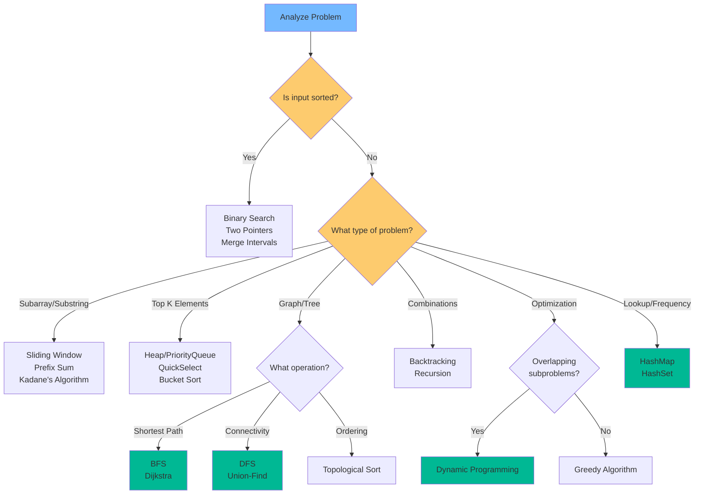

# Problem-Solving Framework: The Senior Engineer's Systematic Approach

## Overview
The difference between a Senior Engineer and a Junior Engineer is often not just technical knowledge, but the **systematic, methodical approach** to solving unknown problems. This framework ensures you never get stuck, communicate effectively with interviewers, and demonstrate senior-level thinking.

This comprehensive guide will teach you:
- A battle-tested 6-step framework used by Staff/Principal engineers
- Pattern recognition techniques to identify the right approach quickly
- Communication templates that impress interviewers
- Debugging strategies when stuck
- Time management for coding interviews
- How to handle hints and feedback gracefully

---

## Table of Contents
1. [The 6-Step Framework](#the-6-step-framework)
2. [Pattern Recognition System](#pattern-recognition-system)
3. [Communication Templates](#communication-templates)
4. [When You're Stuck: Recovery Strategies](#when-youre-stuck-recovery-strategies)
5. [Time Management](#time-management)
6. [Interview Transcript Examples](#interview-transcript-examples)
7. [Banking & Production Context](#banking--production-context)

---

## The 6-Step Framework

### Step 1: Understand (The "What")

**Goal**: Clarify the scope, constraints, and requirements before writing any code.

#### Questions to Ask

**Input Constraints:**
- "What is the range of inputs?" (int vs long, 32-bit vs 64-bit)
- "Can the input be empty or null?"
- "What's the maximum size of the input?" (n ≤ 10³ vs n ≤ 10⁶ matters!)
- "Are there duplicates allowed?"
- "Is the input sorted?" (Huge hint for Binary Search/Two Pointers)
- "Can the input be modified?" (In-place vs out-of-place)

**Output Requirements:**
- "What should I return if no solution exists?" (null, -1, empty array?)
- "Should the output be sorted?"
- "Are there multiple valid answers?" (Return any vs return all)

**Performance Constraints:**
- "What are the time/space constraints?"
- "Is there a preference between time and space optimization?"

**Edge Cases:**
- "How should I handle negative numbers?"
- "What about integer overflow?"
- "Are there any special characters or encoding issues?" (for strings)

#### Restate the Problem

**Always restate the problem in your own words:**

> "So, to confirm: I need to find the longest substring without repeating characters. The input is a string that could be empty, and I should return the length as an integer. If the string is empty, I return 0. Is that correct?"

This demonstrates:
- You're listening carefully
- You're clarifying assumptions
- You're thinking about edge cases

---

### Step 2: Examples (The "Check")

**Goal**: Verify understanding with concrete test cases and uncover edge cases.

#### Create Test Cases

**1. Happy Path (Standard Input)**
```
Input: "abcabcbb"
Output: 3 (substring "abc")
```

**2. Edge Cases**
```
Empty: ""           → 0
Single char: "a"    → 1
All same: "aaaa"    → 1
All unique: "abcd"  → 4
```

**3. Tricky Cases**
```
Input: "pwwkew"     → 3 (substring "wke")
Input: "dvdf"       → 3 (substring "vdf")
```

#### Walk Through an Example

**Demonstrate your understanding by manually solving one example:**

```
Input: "abcabcbb"

Step-by-step:
- Start: ""
- Add 'a': "a" (length 1)
- Add 'b': "ab" (length 2)
- Add 'c': "abc" (length 3) ← Maximum so far
- Add 'a': Duplicate! Reset to "bca"
- Continue...
Result: 3
```

**This shows:**
- You understand the problem mechanics
- You can trace through logic manually
- You're thinking about the algorithm before coding

---

### Step 3: Brute Force (The "Baseline")

**Goal**: Establish a working solution first, even if inefficient.

#### Why Start with Brute Force?

1. **Demonstrates problem-solving ability**: You can solve it, even if not optimally
2. **Establishes correctness**: Optimization is easier when you have a correct baseline
3. **Shows communication**: You're thinking out loud
4. **Provides comparison**: Helps measure improvement of optimized solution

#### State the Brute Force Approach

**Template:**
> "The brute force approach would be to [describe approach]. This would involve [nested loops / trying all combinations / etc.], giving us a time complexity of O(n²) and space complexity of O(1). Should I implement this, or would you like me to look for a more optimal solution first?"

**Example (Longest Substring Without Repeating Characters):**
> "The brute force would be to check every possible substring. For each starting position i, I'd check all substrings starting at i, and for each substring, verify if all characters are unique using a Set. This would be O(n³) time: O(n²) for all substrings, and O(n) to check uniqueness. That's quite expensive. I'm thinking we can optimize this to O(n) using a sliding window. Should I proceed with the optimized approach?"

#### When to Actually Implement Brute Force

- **Time is running out**: Get something working
- **Problem is very complex**: Brute force first, then optimize
- **Interviewer asks**: "Let's see the brute force first"

Otherwise, state it and move to optimization.

---

### Step 4: Optimize (The "How")

**Goal**: Find the efficient solution using pattern recognition and data structure selection.

#### Bottleneck Analysis

**Identify what's making your brute force slow:**

- "The bottleneck is the nested loop checking all pairs. Can we do this in one pass?"
- "We're repeatedly searching for an element. Can we use a HashMap for O(1) lookup?"
- "We're recalculating the same subproblems. Can we use memoization?"

#### Data Structure Brainstorm

**Match the problem to the right data structure:**

| Problem Characteristic | Data Structure | Complexity |
|------------------------|----------------|------------|
| Need quick lookup/existence check | **HashMap / HashSet** | O(1) average |
| Need min/max efficiently | **Heap / PriorityQueue** | O(log n) |
| Need sorted order | **TreeMap / TreeSet** | O(log n) |
| Sorted input | **Binary Search / Two Pointers** | O(log n) / O(n) |
| Range queries | **Prefix Sum / Segment Tree** | O(1) / O(log n) |
| Permutations/Subsets | **Backtracking** | O(2ⁿ) / O(n!) |
| Shortest path | **BFS / Dijkstra** | O(V+E) / O(E log V) |
| Optimization problem | **Dynamic Programming / Greedy** | Varies |

#### Pattern Recognition

**Ask yourself:**
1. **Is the input sorted?** → Binary Search, Two Pointers
2. **Subarray/Substring problem?** → Sliding Window, Prefix Sum
3. **Top K elements?** → Heap, QuickSelect
4. **Graph/Tree structure?** → BFS, DFS, Union-Find
5. **Combinations/Permutations?** → Backtracking
6. **Optimization (min/max)?** → DP, Greedy
7. **Need to track frequency?** → HashMap
8. **Need to track order?** → Stack, Queue, Deque

#### Space-Time Trade-off Discussion

**Demonstrate senior-level thinking:**

> "We could solve this in O(n) time using a HashMap to store visited elements, which would use O(n) space. Alternatively, if space is constrained, we could use a two-pointer approach with O(1) space, but that requires the input to be sorted first, which is O(n log n). Given that we're optimizing for time and n could be large, I'd recommend the HashMap approach. Does that align with the requirements?"

---

### Step 5: Implement (The "Code")

**Goal**: Write clean, production-ready, well-structured code.

#### Code Structure Template

```java
public ReturnType solutionName(InputType input) {
    // 1. Edge Case Handling
    if (input == null || input.length == 0) {
        return defaultValue;
    }
    
    // 2. Variable Initialization
    // Use descriptive names: maxLength, currentSum, leftPointer
    int result = 0;
    
    // 3. Data Structure Setup
    Map<Character, Integer> charIndexMap = new HashMap<>();
    
    // 4. Core Algorithm Logic
    for (int i = 0; i < input.length; i++) {
        // Clear, commented logic
        // Update data structures
        // Update result
    }
    
    // 5. Return Result
    return result;
}
```

#### Best Practices

**1. Modularize Complex Logic**
```java
// Good: Extract helper methods
public int solve(int[] nums) {
    if (!isValid(nums)) return -1;
    
    int result = 0;
    for (int num : nums) {
        if (meetsCondition(num)) {
            result += processElement(num);
        }
    }
    return result;
}

private boolean isValid(int[] nums) {
    return nums != null && nums.length > 0;
}

private boolean meetsCondition(int num) {
    return num > 0 && num % 2 == 0;
}

private int processElement(int num) {
    return num * num;
}
```

**2. Descriptive Variable Names**
```java
// Bad
int l = 0, r = n - 1, m = 0;

// Good
int leftPointer = 0;
int rightPointer = nums.length - 1;
int maxSum = 0;
```

**3. Handle Edge Cases First**
```java
public int findMax(int[] nums) {
    // Handle edge cases at the top
    if (nums == null || nums.length == 0) {
        throw new IllegalArgumentException("Input cannot be null or empty");
    }
    
    if (nums.length == 1) {
        return nums[0];
    }
    
    // Main logic
    int max = nums[0];
    for (int i = 1; i < nums.length; i++) {
        max = Math.max(max, nums[i]);
    }
    return max;
}
```

**4. Add Meaningful Comments**
```java
// Good: Explain WHY, not WHAT
// We use a HashMap to track the last seen index of each character
// This allows us to skip ahead when we find a duplicate
Map<Character, Integer> lastSeenIndex = new HashMap<>();

// Bad: Obvious comment
// Loop through the array
for (int i = 0; i < nums.length; i++) {
```

**5. Consider Integer Overflow**
```java
// Bad: Can overflow
int mid = (left + right) / 2;

// Good: Prevents overflow
int mid = left + (right - left) / 2;
```

---

### Step 6: Test & Verify (The "Proof")

**Goal**: Dry run your code and catch bugs before the interviewer does.

#### Dry Run Process

**1. Choose a Small Example**
```
Input: [2, 7, 11, 15], target = 9
```

**2. Create a Variable Tracking Table**

| Step | i | nums[i] | map | complement | Action |
|------|---|---------|-----|------------|--------|
| 0 | 0 | 2 | {} | 7 | Add {2:0} |
| 1 | 1 | 7 | {2:0} | 2 | Found! Return [0,1] |

**3. Walk Through Line by Line**
```java
public int[] twoSum(int[] nums, int target) {
    Map<Integer, Integer> map = new HashMap<>();  // map = {}
    
    for (int i = 0; i < nums.length; i++) {       // i = 0
        int complement = target - nums[i];         // complement = 9 - 2 = 7
        
        if (map.containsKey(complement)) {         // map has 7? No
            return new int[]{map.get(complement), i};
        }
        
        map.put(nums[i], i);                       // map = {2: 0}
    }
    
    // Next iteration: i = 1, nums[i] = 7
    // complement = 9 - 7 = 2
    // map has 2? Yes! Return [0, 1] ✓
    
    return new int[]{-1, -1};
}
```

#### Sanity Checks

**Ask yourself:**
- "Does this loop terminate?" (Check loop condition)
- "Can I get an index out of bounds?" (Check array access)
- "What if the input is empty?" (Edge case)
- "What if all elements are the same?" (Special case)
- "Can this overflow?" (Integer limits)
- "Is my logic correct for the first/last element?" (Boundary conditions)

#### Test with Edge Cases

**Run through your edge cases mentally:**
```
Empty array: []           → Should return default
Single element: [1]       → Should handle gracefully
All same: [5,5,5,5]       → Should work correctly
Negative numbers: [-1,-2] → Should handle signs
```

---

## Pattern Recognition System

### Decision Tree for Pattern Selection



### Pattern Identification Checklist

**When you see these keywords, think:**

| Keywords in Problem | Likely Pattern | Data Structure |
|---------------------|----------------|----------------|
| "longest substring", "maximum subarray" | Sliding Window | HashMap, Set |
| "sorted array", "find target" | Binary Search | Array |
| "two numbers sum to target" | Two Pointers | Array |
| "top k", "k largest/smallest" | Heap | PriorityQueue |
| "shortest path", "minimum steps" | BFS | Queue |
| "connected components", "cycle detection" | DFS | Graph |
| "all combinations", "all permutations" | Backtracking | Recursion |
| "minimum/maximum cost", "count ways" | Dynamic Programming | Array/Map |
| "frequency", "count occurrences" | Hashing | HashMap |
| "intervals", "merge", "overlap" | Sorting + Merge | Array |
| "in-order", "level-order" | Tree Traversal | Tree + Queue/Stack |

---

## Communication Templates

### Template 1: Problem Restatement

> "Let me make sure I understand the problem correctly. We need to [restate goal]. The input is [describe input], and we should return [describe output]. The constraints are [mention key constraints]. Is that correct?"

### Template 2: Brute Force Explanation

> "The brute force approach would be to [describe approach]. This would involve [explain mechanism], giving us O([complexity]) time and O([complexity]) space. However, this is inefficient because [explain bottleneck]. I believe we can optimize this to O([better complexity]) using [technique]. Should I proceed with the optimized approach?"

### Template 3: Optimized Approach Proposal

> "I'm thinking we can solve this using [pattern/technique]. The key insight is [explain insight]. We'll use [data structure] to [explain why]. This will give us O([time]) time complexity and O([space]) space complexity. Let me walk through an example to verify this approach."

### Template 4: Example Walkthrough

> "Let's trace through the example: [input]. Starting with [initial state], we [action]. After processing [element], our state is [new state]. Continuing this way, we get [final result]. This confirms our approach is correct."

### Template 5: Implementation Announcement

> "I'm going to implement this now. I'll start by handling edge cases, then set up my data structures, and finally implement the core logic. I'll use descriptive variable names and add comments for clarity."

### Template 6: Testing

> "Let me test this with a few cases. For the happy path [input], we get [output] ✓. For the edge case [edge input], we get [output] ✓. I'm also checking for [potential issue], which looks good."

### Template 7: Complexity Analysis

> "The time complexity is O([complexity]) because [explain why]. The space complexity is O([complexity]) due to [explain data structures used]. In the worst case, [describe worst case scenario]."

### Template 8: Follow-up Discussion

> "To extend this solution, we could [mention optimization]. If the constraints were different, such as [new constraint], we might use [alternative approach] instead. In a production system, we'd also want to consider [real-world concern]."

---

## When You're Stuck: Recovery Strategies

### Strategy 1: Simplify the Problem

**If the problem seems overwhelming:**

1. **Reduce the input size**: "What if n = 1? n = 2?"
2. **Remove constraints**: "What if the array was sorted?"
3. **Solve a related easier problem**: "What if we just needed to find ANY solution, not the optimal one?"

**Example:**
> "I'm finding this complex. Let me first solve the simpler version where we just need to check if a solution exists, rather than finding the optimal one. Once I have that working, I can extend it."

### Strategy 2: Work Backwards

**Start from the desired output:**

1. "What does the final answer look like?"
2. "What state do I need to be in to produce that answer?"
3. "How do I reach that state?"

### Strategy 3: Draw It Out

**Visualize the problem:**

- Draw arrays, trees, graphs on paper/whiteboard
- Trace through execution step-by-step
- Identify patterns visually

### Strategy 4: Talk Through Your Thinking

**Verbalize your thought process:**

> "I'm thinking about using a HashMap here, but I'm not sure what to use as the key. Let me think... We need to track [X], so maybe the key should be [Y]? Actually, that won't work because [Z]. Let me try a different approach..."

**This shows:**
- You're actively problem-solving
- You're self-correcting
- You're thinking critically

### Strategy 5: Ask for a Hint

**How to ask professionally:**

> "I'm considering two approaches: [A] and [B]. I'm leaning towards [A] because [reason], but I'm concerned about [issue]. Could you give me a hint on whether I'm on the right track?"

**Don't ask:**
> "I have no idea. Can you tell me the answer?"

### Strategy 6: Acknowledge and Pivot

**If you realize your approach is wrong:**

> "Actually, I realize this approach won't work because [reason]. Let me reconsider. [Pause to think]. I think a better approach would be [new approach]."

**This demonstrates:**
- Self-awareness
- Adaptability
- Problem-solving resilience

---

## Time Management

### Typical 45-Minute Interview Breakdown

| Phase | Time | Activity |
|-------|------|----------|
| **Understand** | 3-5 min | Clarify problem, ask questions, restate |
| **Examples** | 2-3 min | Create test cases, walk through example |
| **Brute Force** | 2-3 min | State brute force approach, analyze complexity |
| **Optimize** | 5-7 min | Identify pattern, choose data structure, explain approach |
| **Implement** | 15-20 min | Write code with good practices |
| **Test** | 5-7 min | Dry run, test edge cases, fix bugs |
| **Discuss** | 5-10 min | Complexity analysis, follow-ups, optimizations |

### Time-Saving Tips

1. **Don't code immediately**: Spend time upfront on design
2. **Use a template**: Have a mental code structure ready
3. **Type efficiently**: Practice typing common patterns
4. **Test as you go**: Don't wait until the end to test
5. **Know when to move on**: If stuck for >3 minutes, ask for hint

### Red Flags (You're Running Out of Time)

- **20 minutes in, haven't started coding**: Speed up
- **30 minutes in, code not working**: Simplify or ask for help
- **40 minutes in, still debugging**: Explain your approach verbally, acknowledge the bug

---

## Interview Transcript Examples

### Example 1: Two Sum Problem

**Interviewer**: "Given an array of integers and a target, return indices of two numbers that add up to the target."

**Candidate**: "Let me make sure I understand. I have an array of integers, possibly with duplicates, and a target integer. I need to return the indices of exactly two numbers that sum to the target. Can I assume there's always exactly one solution?"

**I**: "Yes, exactly one solution exists."

**C**: "Great. And can I use the same element twice?"

**I**: "No, each element can be used only once."

**C**: "Perfect. Let me work through an example. If the input is [2, 7, 11, 15] and target is 9, the answer would be [0, 1] because nums[0] + nums[1] = 2 + 7 = 9. Is that correct?"

**I**: "Correct."

**C**: "The brute force approach would be to check every pair of numbers using nested loops. That would be O(n²) time and O(1) space. However, I can optimize this to O(n) time using a HashMap. The key insight is that for each number x, I'm looking for target - x. I can store each number and its index in a HashMap as I iterate, and check if the complement exists. This gives us O(n) time and O(n) space. Should I implement this optimized approach?"

**I**: "Yes, please."

**C**: "I'll write the code now."

```java
public int[] twoSum(int[] nums, int target) {
    // Edge case: null or too small
    if (nums == null || nums.length < 2) {
        return new int[]{-1, -1};
    }
    
    // Map: number -> index
    Map<Integer, Integer> numToIndex = new HashMap<>();
    
    for (int i = 0; i < nums.length; i++) {
        int complement = target - nums[i];
        
        // Check if complement exists
        if (numToIndex.containsKey(complement)) {
            return new int[]{numToIndex.get(complement), i};
        }
        
        // Store current number
        numToIndex.put(nums[i], i);
    }
    
    // No solution found (shouldn't happen per problem statement)
    return new int[]{-1, -1};
}
```

**C**: "Let me test this with our example: [2, 7, 11, 15], target = 9. Starting with i=0, nums[0]=2, complement=7. Map is empty, so we add {2:0}. Next, i=1, nums[1]=7, complement=2. Map contains 2, so we return [0, 1]. That's correct. The time complexity is O(n) because we iterate once, and HashMap operations are O(1) average. Space is O(n) for the HashMap."

**I**: "Great! What if the array was sorted?"

**C**: "If sorted, we could use a two-pointer approach with O(1) space. We'd have left at 0 and right at n-1. If nums[left] + nums[right] < target, move left forward. If greater, move right backward. If equal, we found it. This would still be O(n) time but O(1) space, which is better if space is constrained."

---

### Example 2: Handling Being Stuck

**I**: "Find the longest palindromic substring."

**C**: "So I need to find the longest substring that reads the same forwards and backwards. Let me think through an example: 'babad'. The longest palindromic substring would be 'bab' or 'aba', both of length 3."

**C**: [Thinks for a moment] "I'm considering a few approaches. The brute force would be to check every substring, which is O(n³). I'm thinking about dynamic programming, but I'm not immediately seeing how to structure the state. Could you give me a hint on whether DP is the right direction?"

**I**: "DP works, but there's also an expand-around-center approach."

**C**: "Ah, expand-around-center! That makes sense. For each possible center (both single characters and pairs), we expand outward while the characters match. This would be O(n²) time and O(1) space. Let me implement that."

[Proceeds to code]

---

## 🏦 Banking & Production Context

### Reliability and Correctness

In banking interviews, after solving, **always discuss production concerns:**

**Questions to raise:**

1. **Thread Safety**: "How would this handle concurrent updates?"
   - "If multiple threads are accessing this HashMap, we'd need ConcurrentHashMap or external synchronization"

2. **Scale**: "What if the input is too large for memory?"
   - "We could process in batches or use a streaming approach"

3. **Precision**: "How do we handle floating point precision?"
   - "For financial calculations, we'd use BigDecimal instead of double to avoid rounding errors"

4. **Error Handling**: "What if the input is malformed?"
   - "We'd add validation and throw descriptive exceptions"

5. **Performance**: "What's the 99th percentile latency?"
   - "We'd need to profile and potentially optimize the hot path"

### Example: Payment Processing

**Problem**: Detect duplicate transactions in a stream

**Candidate**: "After implementing the HashSet-based solution for O(1) lookup, in production we'd also consider:
- **Persistence**: The HashSet is in-memory. If the service restarts, we lose state. We'd need a distributed cache like Redis.
- **Expiration**: We can't store transactions forever. We'd implement a sliding window, removing transactions older than N minutes.
- **Distributed Systems**: If we have multiple instances, we need a shared cache to ensure consistency.
- **Idempotency**: Even if we detect a duplicate, we need to ensure the response is the same as the original request."

---

## Key Takeaways

1. **Never start coding immediately**: Understand first
2. **Always create examples**: They guide your implementation
3. **State the brute force**: Shows you can solve it
4. **Optimize systematically**: Use pattern recognition
5. **Write clean code**: Modular, named well, commented
6. **Test thoroughly**: Dry run with examples
7. **Communicate constantly**: Think out loud
8. **Handle being stuck gracefully**: Simplify, ask hints
9. **Manage your time**: Know when to move on
10. **Think production**: Discuss real-world concerns

---

## Practice Exercises

1. **Practice the framework**: Solve 10 problems using the exact 6-step process
2. **Record yourself**: Practice explaining your approach out loud
3. **Time yourself**: Solve problems in 30-minute windows
4. **Mock interviews**: Practice with peers or platforms like Pramp
5. **Review solutions**: After solving, read optimal solutions and learn new patterns

---

**Next**: [Arrays and Strings](03-arrays-and-strings.md)
