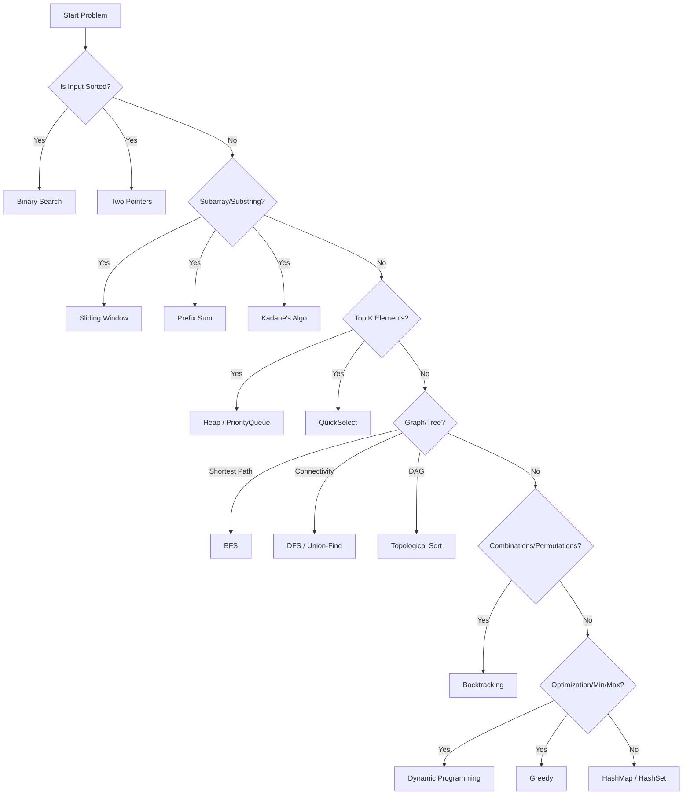

# Problem-Solving Framework

## Overview
The difference between a Senior Engineer and a Junior is often not just knowledge, but the **systematic approach** to solving unknown problems. This framework ensures you don't get stuck and communicate effectively.

## The 6-Step Framework

### 1. Understand (The "What")
**Goal**: Clarify the scope and constraints.
*   **Read carefully**: Don't skim.
*   **Ask Questions**:
    *   "What is the range of inputs?" (Int vs Long)
    *   "Can the input be empty or null?"
    *   "Are there duplicates?"
    *   "Is the array sorted?" (Huge hint for Binary Search/Two Pointers)
    *   "What are the time/space constraints?"

### 2. Examples (The "Check")
**Goal**: Verify understanding with concrete cases.
*   **Happy Path**: Standard input.
*   **Edge Cases**: Empty, Single element, All same elements.
*   **Negative Cases**: Invalid input (if applicable).

### 3. Brute Force (The "Baseline")
**Goal**: Get a working solution first.
*   Don't jump to optimization immediately.
*   State the brute force approach: "We could iterate through every pair..."
*   Analyze its complexity: "This would be O(n^2)."
*   Ask: "Should I implement this, or look for a more optimal approach?" (Usually, they want optimal).

### 4. Optimize (The "How")
**Goal**: Find the efficient solution using **Patterns**.
*   **Bottleneck Analysis**: "The bottleneck is the nested loop. Can we do this in one pass?"
*   **Data Structure Brainstorm**:
    *   Need quick lookup? -> **HashMap** / **HashSet**
    *   Need min/max efficiently? -> **Heap**
    *   Sorted input? -> **Binary Search** / **Two Pointers**
    *   Permutations/Subsets? -> **Backtracking**
    *   Shortest path? -> **BFS**
*   **Space-Time Trade-off**: "Can we use a Map to store visited items to reduce time to O(n)?"

### 5. Implement (The "Code")
**Goal**: Write clean, production-ready Java code.
*   **Modularize**: Use helper methods for complex logic (e.g., `isValid()`, `swap()`).
*   **Variable Naming**: Use `startIndex`, `currentSum` instead of `i`, `s`.
*   **Edge Case Handling**: Handle nulls/empty checks at the start.

```java
public int solve(int[] nums) {
    // 1. Handle Edge Cases
    if (nums == null || nums.length == 0) return 0;
    
    // 2. Initialize Variables
    int maxSoFar = nums[0];
    
    // 3. Core Logic
    for (int num : nums) {
        // ...
    }
    
    return maxSoFar;
}
```

### 6. Test & Verify (The "Proof")
**Goal**: Dry run and catch bugs.
*   **Dry Run**: Walk through your code with the example input. Track variable values line-by-line.
*   **Sanity Check**: "Does this loop terminate?" "Is the index out of bounds?"

## Pattern Recognition Flowchart



## Interview Communication Template

> "So, the problem asks us to find [X] given [Y].
> A constraint is [Z].
> 
> Let's take an example: [Walkthrough].
> 
> A brute force approach would be to [Approach], which gives O(N^2).
> However, since the array is sorted, I'm thinking we can use **Two Pointers** to reduce this to O(N).
> 
> I'll use a `left` pointer at 0 and `right` at `n-1`.
> 
> Does that sound like a good direction?"

## 🏦 Banking Context: Reliability
In banking interviews, after solving, ask:
*   "How would this handle concurrent updates?" (Thread safety)
*   "What if the input is too large for memory?" (Streaming/Batching)
*   "How do we handle floating point precision?" (BigDecimal vs Double)

---
**Next**: [Arrays and Strings](03-arrays-and-strings.md)
