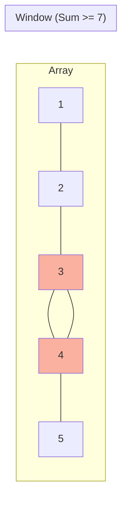

# Arrays and Strings

## Overview
Arrays and Strings are the bread and butter of coding interviews. While seemingly simple, they form the basis for complex patterns like **Sliding Window**, **Two Pointers**, and **Prefix Sums**. In Java, understanding the immutability of Strings and the memory layout of Arrays is crucial for performance.

## Fundamentals

### Arrays
*   **Fixed Size**: Once created, size cannot change.
*   **Contiguous Memory**: Allows O(1) random access.
*   **Types**:
    *   `int[] arr`: Primitive array (efficient, no overhead).
    *   `ArrayList<Integer>`: Dynamic array (resizes automatically, object overhead).

### Strings
*   **Immutability**: `String` in Java is immutable. Concatenation (`+`) in a loop creates O(n^2) garbage.
*   **StringBuilder**: Mutable sequence of characters. Use this for string manipulation.
*   **Internal Storage**: Since Java 9, Strings use `byte[]` (Compact Strings) instead of `char[]` (UTF-16) for memory efficiency if mostly Latin-1.

## Operations and Complexity

| Operation | Array (Static) | ArrayList (Dynamic) | String | StringBuilder |
|-----------|----------------|---------------------|--------|---------------|
| Access    | O(1)           | O(1)                | O(1)   | O(1)          |
| Search    | O(n)           | O(n)                | O(n)   | O(n)          |
| Insert    | N/A            | O(n) (Amortized O(1) at end) | N/A | O(n) (Amortized O(1) at end) |
| Delete    | N/A            | O(n)                | N/A    | O(n)          |

## Common Patterns

### 1. Two Pointers
Used for searching pairs in a sorted array or reversing.
*   **Pattern**: `left` at start, `right` at end. Move towards center.
*   **Complexity**: O(n) Time, O(1) Space.

### 2. Sliding Window
Used for subarray/substring problems (e.g., "Longest substring with...").
*   **Pattern**: Expand `right` to satisfy condition, shrink `left` to optimize.
*   **Complexity**: O(n) Time, O(1)/O(k) Space.

### 3. Prefix Sum
Used for range sum queries.
*   **Pattern**: `prefix[i] = prefix[i-1] + nums[i]`.
*   **Complexity**: O(n) Precomputation, O(1) Query.

## Visual Diagrams

### Sliding Window Visualization


## Interview Problems

### Problem 1: Longest Substring Without Repeating Characters (Medium)
**Pattern**: Sliding Window

```java
/**
 * Find the length of the longest substring without repeating characters.
 * Time: O(n)
 * Space: O(min(m, n)) where m is charset size
 */
public int lengthOfLongestSubstring(String s) {
    if (s == null || s.length() == 0) return 0;
    
    Map<Character, Integer> map = new HashMap<>();
    int left = 0;
    int maxLength = 0;
    
    for (int right = 0; right < s.length(); right++) {
        char c = s.charAt(right);
        
        // If duplicate found, move left pointer
        if (map.containsKey(c)) {
            left = Math.max(left, map.get(c) + 1);
        }
        
        map.put(c, right);
        maxLength = Math.max(maxLength, right - left + 1);
    }
    
    return maxLength;
}
```

### Problem 2: Container With Most Water (Medium)
**Pattern**: Two Pointers (Greedy)

```java
/**
 * Find two lines that together with the x-axis form a container, such that the container contains the most water.
 * Time: O(n)
 * Space: O(1)
 */
public int maxArea(int[] height) {
    int left = 0;
    int right = height.length - 1;
    int maxArea = 0;
    
    while (left < right) {
        int w = right - left;
        int h = Math.min(height[left], height[right]);
        maxArea = Math.max(maxArea, w * h);
        
        // Move the shorter line inward to potentially find a taller line
        if (height[left] < height[right]) {
            left++;
        } else {
            right--;
        }
    }
    
    return maxArea;
}
```

## 🏦 Banking Context: Ticker Data
*   **Scenario**: Processing a stream of stock prices to find the "Best Time to Buy and Sell Stock".
*   **Implementation**: This is a classic **Kadane's Algorithm** / One-pass approach.
*   **Optimization**: In HFT, we might use a **Ring Buffer** (Circular Array) to store the last N ticks efficiently without allocation overhead.

## Common Pitfalls
1.  **Off-by-one errors**: Careful with loop boundaries (`<` vs `<=`).
2.  **String Concatenation**: Never use `+=` in a loop. Use `StringBuilder`.
3.  **Array Index Out of Bounds**: Always check `index >= 0 && index < length`.
4.  **Null Checks**: Always check if array/string is null.

---
**Next**: [Linked Lists](04-linked-lists.md)
