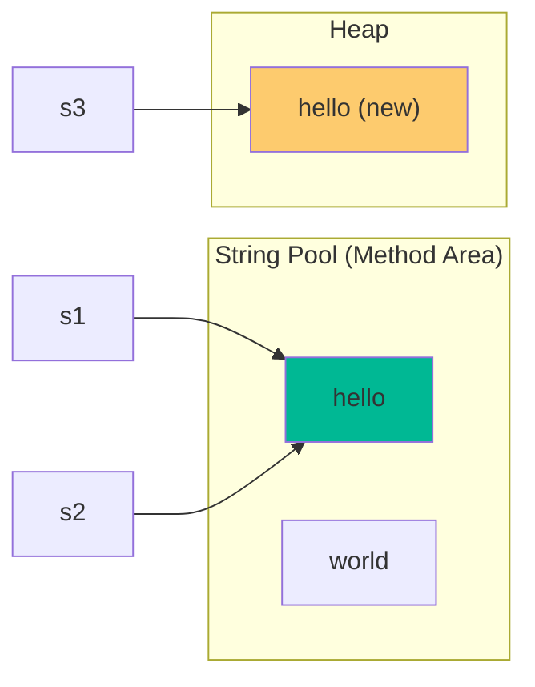

# Arrays and Strings: Complete Master Guide

## Overview
Arrays and Strings are the **foundation** of coding interviews and real-world software engineering. While they appear simple, they form the basis for sophisticated patterns like **Sliding Window**, **Two Pointers**, **Prefix Sums**, and **String Matching Algorithms**. 

For a Senior/Staff Engineer, mastering arrays and strings means:
- Understanding Java's memory model and string internals
- Recognizing and applying patterns instantly
- Writing optimal O(n) solutions instead of O(n²) brute force
- Discussing production concerns like memory efficiency and cache locality

This comprehensive guide covers everything from fundamentals to advanced techniques, with 15+ fully-solved problems.

---

## Table of Contents
1. [Fundamentals](#fundamentals)
2. [Java String Internals](#java-string-internals)
3. [Core Patterns](#core-patterns)
4. [String Matching Algorithms](#string-matching-algorithms)
5. [Advanced Techniques](#advanced-techniques)
6. [15+ Solved Problems](#solved-problems)
7. [Interview Questions & Answers](#interview-questions--answers)
8. [Banking & Production Context](#banking--production-context)

---

## Fundamentals

### Arrays in Java

**Definition**: Contiguous block of memory storing elements of the same type.

**Key Properties:**
- **Fixed Size**: Once created, size cannot change
- **Random Access**: O(1) access via index
- **Contiguous Memory**: Elements stored sequentially in memory
- **Type Safety**: All elements must be of declared type

**Types of Arrays:**

```java
// 1. Primitive Array (Most efficient)
int[] primitiveArray = new int[10];
// Memory: 10 * 4 bytes = 40 bytes (no object overhead)

// 2. Object Array
String[] objectArray = new String[10];
// Memory: 10 * 8 bytes (references) + actual String objects

// 3. Multi-dimensional Array
int[][] matrix = new int[5][10];
// Actually array of arrays: 5 references to int[10] arrays
```

**Array Operations Complexity:**

| Operation | Time | Notes |
|-----------|------|-------|
| Access by index | O(1) | Direct memory calculation |
| Search (unsorted) | O(n) | Must check each element |
| Search (sorted) | O(log n) | Binary search |
| Insert at end | O(1)* | *If space available |
| Insert at position | O(n) | Must shift elements |
| Delete at position | O(n) | Must shift elements |

### Dynamic Arrays (ArrayList)

**Java's ArrayList** provides dynamic resizing:

```java
List<Integer> list = new ArrayList<>();
// Initial capacity: 10
// Growth strategy: newCapacity = oldCapacity + (oldCapacity >> 1)
// i.e., grows by 50% each time
```

**ArrayList Internals:**

```java
public class ArrayList<E> {
    private Object[] elementData;  // Backing array
    private int size;              // Number of elements
    
    public boolean add(E e) {
        ensureCapacity(size + 1);
        elementData[size++] = e;
        return true;
    }
    
    private void ensureCapacity(int minCapacity) {
        if (minCapacity > elementData.length) {
            int newCapacity = elementData.length + (elementData.length >> 1);
            elementData = Arrays.copyOf(elementData, newCapacity);  // O(n)
        }
    }
}
```

**Complexity:**
- **Add**: Amortized O(1), worst-case O(n) during resize
- **Get**: O(1)
- **Remove**: O(n) - must shift elements

---

## Java String Internals

### String Immutability

**Strings in Java are immutable** - once created, they cannot be changed.

```java
String s = "hello";
s = s + " world";  // Creates NEW string, doesn't modify original
```

**Why Immutable?**
1. **Security**: Strings used in security-sensitive contexts (file paths, URLs)
2. **Thread Safety**: Can be shared across threads without synchronization
3. **String Pool**: Enables string interning for memory efficiency
4. **Hash Code Caching**: hashCode() can be cached since string never changes

### String Pool (Interning)

```java
String s1 = "hello";           // Created in string pool
String s2 = "hello";           // Reuses same object from pool
String s3 = new String("hello"); // Creates new object in heap

System.out.println(s1 == s2);  // true (same reference)
System.out.println(s1 == s3);  // false (different objects)
System.out.println(s1.equals(s3)); // true (same content)
```

**String Pool Visualization:**



### Compact Strings (Java 9+)

**Before Java 9**: Strings used `char[]` (2 bytes per character, UTF-16)

**Java 9+**: Strings use `byte[]` with encoding flag

```java
public final class String {
    private final byte[] value;  // Byte array instead of char[]
    private final byte coder;    // LATIN1 or UTF16
    
    // If all characters are Latin-1 (0-255), uses 1 byte per char
    // Otherwise, uses 2 bytes per char (UTF-16)
}
```

**Memory Savings**: ~50% for Latin-1 strings (English text)

### StringBuilder vs StringBuffer

**Problem with String concatenation:**

```java
// BAD: O(n²) time and creates n intermediate objects
String result = "";
for (int i = 0; i < n; i++) {
    result += i;  // Creates new string each time
}
```

**Solution: StringBuilder (mutable)**

```java
// GOOD: O(n) time
StringBuilder sb = new StringBuilder();
for (int i = 0; i < n; i++) {
    sb.append(i);  // Modifies existing buffer
}
String result = sb.toString();
```

**StringBuilder vs StringBuffer:**

| Feature | StringBuilder | StringBuffer |
|---------|---------------|--------------|
| Thread-safe | ❌ No | ✅ Yes (synchronized) |
| Performance | Faster | Slower (sync overhead) |
| Use case | Single-threaded | Multi-threaded |

**Rule**: Always use StringBuilder unless you need thread safety.

---

## Core Patterns

### Pattern 1: Two Pointers

**When to use:**
- Searching pairs in sorted array
- Reversing array/string
- Removing duplicates
- Partitioning array

**Template:**

```java
public void twoPointers(int[] arr) {
    int left = 0;
    int right = arr.length - 1;
    
    while (left < right) {
        // Process arr[left] and arr[right]
        
        if (condition) {
            left++;
        } else {
            right--;
        }
    }
}
```

**Example 1: Two Sum II (Sorted Array)**

```java
/**
 * Find two numbers that add up to target in sorted array.
 * Time: O(n), Space: O(1)
 */
public int[] twoSum(int[] numbers, int target) {
    int left = 0;
    int right = numbers.length - 1;
    
    while (left < right) {
        int sum = numbers[left] + numbers[right];
        
        if (sum == target) {
            return new int[]{left + 1, right + 1};  // 1-indexed
        } else if (sum < target) {
            left++;   // Need larger sum
        } else {
            right--;  // Need smaller sum
        }
    }
    
    return new int[]{-1, -1};  // No solution
}
```

**Example 2: Container With Most Water**

```java
/**
 * Find two lines that form container with most water.
 * Time: O(n), Space: O(1)
 */
public int maxArea(int[] height) {
    int left = 0;
    int right = height.length - 1;
    int maxArea = 0;
    
    while (left < right) {
        // Area = width × min(height)
        int width = right - left;
        int h = Math.min(height[left], height[right]);
        maxArea = Math.max(maxArea, width * h);
        
        // Move the shorter line inward (greedy choice)
        if (height[left] < height[right]) {
            left++;
        } else {
            right--;
        }
    }
    
    return maxArea;
}
```

**Why move the shorter line?** Moving the taller line can only decrease area (width decreases, height can't increase).

---

### Pattern 2: Sliding Window

**When to use:**
- Subarray/substring problems
- "Longest/shortest substring with..."
- "Maximum sum of subarray of size k"

**Template:**

```java
public int slidingWindow(String s) {
    int left = 0;
    int result = 0;
    Map<Character, Integer> window = new HashMap<>();
    
    for (int right = 0; right < s.length(); right++) {
        // 1. Expand window: add s[right]
        char c = s.charAt(right);
        window.put(c, window.getOrDefault(c, 0) + 1);
        
        // 2. Shrink window while condition violated
        while (/* window invalid */) {
            char leftChar = s.charAt(left);
            window.put(leftChar, window.get(leftChar) - 1);
            if (window.get(leftChar) == 0) {
                window.remove(leftChar);
            }
            left++;
        }
        
        // 3. Update result
        result = Math.max(result, right - left + 1);
    }
    
    return result;
}
```

**Example 1: Longest Substring Without Repeating Characters**

```java
/**
 * Find length of longest substring without repeating characters.
 * Time: O(n), Space: O(min(m, n)) where m is charset size
 */
public int lengthOfLongestSubstring(String s) {
    if (s == null || s.length() == 0) return 0;
    
    Map<Character, Integer> charToIndex = new HashMap<>();
    int left = 0;
    int maxLength = 0;
    
    for (int right = 0; right < s.length(); right++) {
        char c = s.charAt(right);
        
        // If duplicate found, move left past the previous occurrence
        if (charToIndex.containsKey(c)) {
            left = Math.max(left, charToIndex.get(c) + 1);
        }
        
        charToIndex.put(c, right);
        maxLength = Math.max(maxLength, right - left + 1);
    }
    
    return maxLength;
}
```

**Dry Run:**
```
Input: "abcabcbb"

right=0, c='a': map={a:0}, left=0, len=1
right=1, c='b': map={a:0,b:1}, left=0, len=2
right=2, c='c': map={a:0,b:1,c:2}, left=0, len=3 ← max
right=3, c='a': duplicate! left=max(0,0+1)=1, map={a:3,b:1,c:2}, len=3
right=4, c='b': duplicate! left=max(1,1+1)=2, map={a:3,b:4,c:2}, len=3
...
Result: 3
```

**Example 2: Minimum Window Substring (Hard)**

```java
/**
 * Find smallest substring of s containing all characters of t.
 * Time: O(S + T), Space: O(1) - fixed charset size
 */
public String minWindow(String s, String t) {
    if (s == null || t == null || s.length() == 0 || t.length() == 0) {
        return "";
    }
    
    // Count characters in t
    int[] targetCount = new int[128];
    for (char c : t.toCharArray()) {
        targetCount[c]++;
    }
    
    int left = 0;
    int minLen = Integer.MAX_VALUE;
    int minStart = 0;
    int required = t.length();  // Characters still needed
    
    for (int right = 0; right < s.length(); right++) {
        char c = s.charAt(right);
        
        // If this character is in t, decrement required count
        if (targetCount[c] > 0) {
            required--;
        }
        targetCount[c]--;
        
        // When window is valid, try to shrink it
        while (required == 0) {
            // Update minimum window
            if (right - left + 1 < minLen) {
                minLen = right - left + 1;
                minStart = left;
            }
            
            // Try to shrink from left
            char leftChar = s.charAt(left);
            targetCount[leftChar]++;
            if (targetCount[leftChar] > 0) {
                required++;  // Lost a required character
            }
            left++;
        }
    }
    
    return minLen == Integer.MAX_VALUE ? "" : s.substring(minStart, minStart + minLen);
}
```

---

### Pattern 3: Prefix Sum

**When to use:**
- Range sum queries
- Subarray sum problems
- Cumulative frequency

**Concept:**
```
prefix[i] = sum of elements from 0 to i
sum(i, j) = prefix[j] - prefix[i-1]
```

**Example: Range Sum Query**

```java
class NumArray {
    private int[] prefixSum;
    
    /**
     * Precompute prefix sums.
     * Time: O(n), Space: O(n)
     */
    public NumArray(int[] nums) {
        prefixSum = new int[nums.length + 1];
        for (int i = 0; i < nums.length; i++) {
            prefixSum[i + 1] = prefixSum[i] + nums[i];
        }
    }
    
    /**
     * Return sum of elements from i to j (inclusive).
     * Time: O(1)
     */
    public int sumRange(int i, int j) {
        return prefixSum[j + 1] - prefixSum[i];
    }
}
```

**Example: Subarray Sum Equals K**

```java
/**
 * Count number of subarrays with sum equal to k.
 * Time: O(n), Space: O(n)
 */
public int subarraySum(int[] nums, int k) {
    Map<Integer, Integer> prefixSumCount = new HashMap<>();
    prefixSumCount.put(0, 1);  // Empty subarray has sum 0
    
    int currentSum = 0;
    int count = 0;
    
    for (int num : nums) {
        currentSum += num;
        
        // If (currentSum - k) exists, we found a subarray
        // sum(i, j) = currentSum - previousSum = k
        // previousSum = currentSum - k
        if (prefixSumCount.containsKey(currentSum - k)) {
            count += prefixSumCount.get(currentSum - k);
        }
        
        prefixSumCount.put(currentSum, prefixSumCount.getOrDefault(currentSum, 0) + 1);
    }
    
    return count;
}
```

---

### Pattern 4: Kadane's Algorithm (Maximum Subarray)

**Problem**: Find contiguous subarray with maximum sum.

**Naive**: O(n²) - try all subarrays

**Kadane's**: O(n) - dynamic programming

```java
/**
 * Find maximum sum of contiguous subarray.
 * Time: O(n), Space: O(1)
 */
public int maxSubArray(int[] nums) {
    int maxSoFar = nums[0];
    int maxEndingHere = nums[0];
    
    for (int i = 1; i < nums.length; i++) {
        // Either extend existing subarray or start new one
        maxEndingHere = Math.max(nums[i], maxEndingHere + nums[i]);
        maxSoFar = Math.max(maxSoFar, maxEndingHere);
    }
    
    return maxSoFar;
}
```

**Intuition**: At each position, decide: "Should I add this element to my current subarray, or start a new subarray from here?"

**Dry Run:**
```
nums = [-2, 1, -3, 4, -1, 2, 1, -5, 4]

i=0: maxEndingHere=-2, maxSoFar=-2
i=1: maxEndingHere=max(1, -2+1)=1, maxSoFar=1
i=2: maxEndingHere=max(-3, 1-3)=-2, maxSoFar=1
i=3: maxEndingHere=max(4, -2+4)=4, maxSoFar=4
i=4: maxEndingHere=max(-1, 4-1)=3, maxSoFar=4
i=5: maxEndingHere=max(2, 3+2)=5, maxSoFar=5
i=6: maxEndingHere=max(1, 5+1)=6, maxSoFar=6 ← answer
...
```

---

## String Matching Algorithms

### Naive String Matching

**Time**: O(n × m) where n = text length, m = pattern length

```java
public int naiveSearch(String text, String pattern) {
    int n = text.length();
    int m = pattern.length();
    
    for (int i = 0; i <= n - m; i++) {
        int j;
        for (j = 0; j < m; j++) {
            if (text.charAt(i + j) != pattern.charAt(j)) {
                break;
            }
        }
        if (j == m) {
            return i;  // Pattern found at index i
        }
    }
    return -1;
}
```

### KMP (Knuth-Morris-Pratt) Algorithm

**Time**: O(n + m) - optimal for string matching

**Key Idea**: When mismatch occurs, use information from previous matches to avoid re-checking.

```java
/**
 * KMP string matching algorithm.
 * Time: O(n + m), Space: O(m)
 */
public int kmpSearch(String text, String pattern) {
    int n = text.length();
    int m = pattern.length();
    
    // Build LPS (Longest Proper Prefix which is also Suffix) array
    int[] lps = buildLPS(pattern);
    
    int i = 0;  // Index for text
    int j = 0;  // Index for pattern
    
    while (i < n) {
        if (text.charAt(i) == pattern.charAt(j)) {
            i++;
            j++;
        }
        
        if (j == m) {
            return i - j;  // Pattern found
        } else if (i < n && text.charAt(i) != pattern.charAt(j)) {
            if (j != 0) {
                j = lps[j - 1];  // Don't match lps[0..lps[j-1]] characters
            } else {
                i++;
            }
        }
    }
    
    return -1;
}

private int[] buildLPS(String pattern) {
    int m = pattern.length();
    int[] lps = new int[m];
    int len = 0;  // Length of previous longest prefix suffix
    int i = 1;
    
    while (i < m) {
        if (pattern.charAt(i) == pattern.charAt(len)) {
            len++;
            lps[i] = len;
            i++;
        } else {
            if (len != 0) {
                len = lps[len - 1];
            } else {
                lps[i] = 0;
                i++;
            }
        }
    }
    
    return lps;
}
```

### Rabin-Karp Algorithm (Rolling Hash)

**Time**: O(n + m) average, O(n × m) worst case

**Key Idea**: Use hashing to quickly compare pattern with substrings.

```java
/**
 * Rabin-Karp string matching using rolling hash.
 * Time: O(n + m) average, Space: O(1)
 */
public int rabinKarp(String text, String pattern) {
    int n = text.length();
    int m = pattern.length();
    int prime = 101;  // Prime number for hashing
    int d = 256;      // Number of characters in alphabet
    
    int patternHash = 0;
    int textHash = 0;
    int h = 1;
    
    // h = d^(m-1) % prime
    for (int i = 0; i < m - 1; i++) {
        h = (h * d) % prime;
    }
    
    // Calculate hash for pattern and first window of text
    for (int i = 0; i < m; i++) {
        patternHash = (d * patternHash + pattern.charAt(i)) % prime;
        textHash = (d * textHash + text.charAt(i)) % prime;
    }
    
    // Slide the pattern over text
    for (int i = 0; i <= n - m; i++) {
        // Check if hash matches
        if (patternHash == textHash) {
            // Verify character by character (to handle hash collisions)
            if (text.substring(i, i + m).equals(pattern)) {
                return i;
            }
        }
        
        // Calculate hash for next window
        if (i < n - m) {
            textHash = (d * (textHash - text.charAt(i) * h) + text.charAt(i + m)) % prime;
            if (textHash < 0) {
                textHash += prime;
            }
        }
    }
    
    return -1;
}
```

---

## Advanced Techniques

### In-Place Array Manipulation

**Problem**: Rotate array right by k steps

```java
/**
 * Rotate array in-place.
 * Time: O(n), Space: O(1)
 */
public void rotate(int[] nums, int k) {
    int n = nums.length;
    k = k % n;  // Handle k > n
    
    // Reverse entire array
    reverse(nums, 0, n - 1);
    // Reverse first k elements
    reverse(nums, 0, k - 1);
    // Reverse remaining elements
    reverse(nums, k, n - 1);
}

private void reverse(int[] nums, int start, int end) {
    while (start < end) {
        int temp = nums[start];
        nums[start] = nums[end];
        nums[end] = temp;
        start++;
        end--;
    }
}
```

**Example**: [1,2,3,4,5,6,7], k=3
1. Reverse all: [7,6,5,4,3,2,1]
2. Reverse first 3: [5,6,7,4,3,2,1]
3. Reverse last 4: [5,6,7,1,2,3,4] ✓

### Character Encoding and Unicode

**ASCII**: 7 bits (0-127), 128 characters
**Extended ASCII**: 8 bits (0-255), 256 characters
**Unicode**: Variable length, millions of characters
- **UTF-8**: 1-4 bytes per character (backward compatible with ASCII)
- **UTF-16**: 2 or 4 bytes per character (Java's internal representation)

```java
String s = "Hello 世界";  // Mix of ASCII and Chinese

// Character iteration (correct for Unicode)
for (int i = 0; i < s.length(); i++) {
    char c = s.charAt(i);  // May be half of a surrogate pair!
}

// Code point iteration (handles all Unicode correctly)
for (int i = 0; i < s.length(); ) {
    int codePoint = s.codePointAt(i);
    i += Character.charCount(codePoint);
}
```

---

## Solved Problems

### Problem 1: Valid Palindrome

```java
/**
 * Check if string is palindrome (alphanumeric only, case-insensitive).
 * Time: O(n), Space: O(1)
 */
public boolean isPalindrome(String s) {
    int left = 0;
    int right = s.length() - 1;
    
    while (left < right) {
        // Skip non-alphanumeric from left
        while (left < right && !Character.isLetterOrDigit(s.charAt(left))) {
            left++;
        }
        
        // Skip non-alphanumeric from right
        while (left < right && !Character.isLetterOrDigit(s.charAt(right))) {
            right--;
        }
        
        // Compare characters (case-insensitive)
        if (Character.toLowerCase(s.charAt(left)) != Character.toLowerCase(s.charAt(right))) {
            return false;
        }
        
        left++;
        right--;
    }
    
    return true;
}
```

### Problem 2: Group Anagrams

```java
/**
 * Group strings that are anagrams of each other.
 * Time: O(n × k log k) where k is max string length
 * Space: O(n × k)
 */
public List<List<String>> groupAnagrams(String[] strs) {
    Map<String, List<String>> map = new HashMap<>();
    
    for (String str : strs) {
        // Sort characters to create key
        char[] chars = str.toCharArray();
        Arrays.sort(chars);
        String key = new String(chars);
        
        map.putIfAbsent(key, new ArrayList<>());
        map.get(key).add(str);
    }
    
    return new ArrayList<>(map.values());
}
```

**Alternative (O(n × k) using character count):**

```java
public List<List<String>> groupAnagrams(String[] strs) {
    Map<String, List<String>> map = new HashMap<>();
    
    for (String str : strs) {
        // Create key from character counts
        int[] count = new int[26];
        for (char c : str.toCharArray()) {
            count[c - 'a']++;
        }
        
        StringBuilder keyBuilder = new StringBuilder();
        for (int i = 0; i < 26; i++) {
            if (count[i] > 0) {
                keyBuilder.append((char)('a' + i)).append(count[i]);
            }
        }
        String key = keyBuilder.toString();
        
        map.putIfAbsent(key, new ArrayList<>());
        map.get(key).add(str);
    }
    
    return new ArrayList<>(map.values());
}
```

### Problem 3: Longest Palindromic Substring

```java
/**
 * Find longest palindromic substring.
 * Time: O(n²), Space: O(1)
 */
public String longestPalindrome(String s) {
    if (s == null || s.length() < 2) return s;
    
    int start = 0;
    int maxLen = 0;
    
    for (int i = 0; i < s.length(); i++) {
        // Check for odd-length palindromes (center is single character)
        int len1 = expandAroundCenter(s, i, i);
        // Check for even-length palindromes (center is between two characters)
        int len2 = expandAroundCenter(s, i, i + 1);
        
        int len = Math.max(len1, len2);
        if (len > maxLen) {
            maxLen = len;
            start = i - (len - 1) / 2;
        }
    }
    
    return s.substring(start, start + maxLen);
}

private int expandAroundCenter(String s, int left, int right) {
    while (left >= 0 && right < s.length() && s.charAt(left) == s.charAt(right)) {
        left--;
        right++;
    }
    return right - left - 1;
}
```

### Problem 4: String to Integer (atoi)

```java
/**
 * Convert string to integer with error handling.
 * Time: O(n), Space: O(1)
 */
public int myAtoi(String s) {
    if (s == null || s.length() == 0) return 0;
    
    int i = 0;
    int n = s.length();
    
    // 1. Skip leading whitespace
    while (i < n && s.charAt(i) == ' ') {
        i++;
    }
    
    if (i == n) return 0;
    
    // 2. Check sign
    int sign = 1;
    if (s.charAt(i) == '+' || s.charAt(i) == '-') {
        sign = (s.charAt(i) == '-') ? -1 : 1;
        i++;
    }
    
    // 3. Convert digits
    int result = 0;
    while (i < n && Character.isDigit(s.charAt(i))) {
        int digit = s.charAt(i) - '0';
        
        // Check for overflow before multiplying
        if (result > Integer.MAX_VALUE / 10 || 
            (result == Integer.MAX_VALUE / 10 && digit > Integer.MAX_VALUE % 10)) {
            return (sign == 1) ? Integer.MAX_VALUE : Integer.MIN_VALUE;
        }
        
        result = result * 10 + digit;
        i++;
    }
    
    return result * sign;
}
```

### Problem 5: Longest Common Prefix

```java
/**
 * Find longest common prefix among array of strings.
 * Time: O(S) where S is sum of all characters
 * Space: O(1)
 */
public String longestCommonPrefix(String[] strs) {
    if (strs == null || strs.length == 0) return "";
    
    // Start with first string as prefix
    String prefix = strs[0];
    
    for (int i = 1; i < strs.length; i++) {
        // Shrink prefix until it matches start of current string
        while (strs[i].indexOf(prefix) != 0) {
            prefix = prefix.substring(0, prefix.length() - 1);
            if (prefix.isEmpty()) return "";
        }
    }
    
    return prefix;
}
```

---

## Interview Questions & Answers

### Q1: "Explain the difference between String, StringBuilder, and StringBuffer."

**Model Answer:**
"All three represent character sequences, but with key differences:

**String** is immutable. Once created, it cannot be modified. Any operation that appears to modify a String actually creates a new String object. This makes Strings thread-safe but inefficient for repeated modifications.

**StringBuilder** is mutable and not thread-safe. It's designed for single-threaded scenarios where you need to build or modify strings efficiently. Operations like append() modify the internal buffer without creating new objects, making it O(1) amortized instead of O(n).

**StringBuffer** is identical to StringBuilder but with synchronized methods, making it thread-safe. The synchronization overhead makes it slower than StringBuilder.

In production code, I use:
- **String** for immutable text (99% of cases)
- **StringBuilder** for string building in loops or complex concatenation
- **StringBuffer** rarely—only when multiple threads need to modify the same string, which is uncommon

For example, in a banking system processing transaction descriptions, I'd use StringBuilder to build the description string from multiple fields, then convert to String for storage."

### Q2: "What's the time complexity of string concatenation in a loop?"

**Model Answer:**
"String concatenation using the + operator in a loop is O(n²) because Strings are immutable.

Here's why: If you do `s += "x"` in a loop n times:
- Iteration 1: Create string of length 1
- Iteration 2: Create string of length 2 (copy 1 char + add 1)
- Iteration 3: Create string of length 3 (copy 2 chars + add 1)
- ...
- Iteration n: Create string of length n (copy n-1 chars + add 1)

Total characters copied: 0 + 1 + 2 + ... + (n-1) = n(n-1)/2 = O(n²)

The solution is StringBuilder, which maintains a resizable buffer. Appending is amortized O(1), making n appends O(n) total.

In production, especially in financial services where we process large datasets, this difference is critical. I've seen systems slow down by orders of magnitude due to string concatenation in loops."

### Q3: "How would you check if two strings are anagrams?"

**Model Answer:**
"There are several approaches with different trade-offs:

**Approach 1: Sorting** - O(n log n) time, O(1) space
```java
public boolean isAnagram(String s, String t) {
    if (s.length() != t.length()) return false;
    char[] sChars = s.toCharArray();
    char[] tChars = t.toCharArray();
    Arrays.sort(sChars);
    Arrays.sort(tChars);
    return Arrays.equals(sChars, tChars);
}
```

**Approach 2: Character Count** - O(n) time, O(1) space (fixed alphabet)
```java
public boolean isAnagram(String s, String t) {
    if (s.length() != t.length()) return false;
    int[] count = new int[26];
    for (int i = 0; i < s.length(); i++) {
        count[s.charAt(i) - 'a']++;
        count[t.charAt(i) - 'a']--;
    }
    for (int c : count) {
        if (c != 0) return false;
    }
    return true;
}
```

I prefer Approach 2 for ASCII/English text because it's O(n) and the space is constant (26 letters). For Unicode strings, I'd use a HashMap instead of an array. The sorting approach is simpler to implement and works for any character set, so I might use it for a quick prototype."

---

## 🏦 Banking & Production Context

### High-Frequency Trading: Ticker Symbol Processing

**Scenario**: Process millions of ticker symbols per second

**Optimization**:
```java
// BAD: Creates new strings
String ticker = "AAPL";
ticker = ticker.toUpperCase();  // New string
ticker = ticker.trim();         // New string

// GOOD: Minimize allocations
char[] ticker = {'A', 'A', 'P', 'L'};
// Process in-place
```

**Cache Locality**: Sequential array access is 10-100x faster than random access due to CPU cache prefetching.

### Payment Processing: String Validation

**Scenario**: Validate IBAN (International Bank Account Number)

```java
/**
 * Validate IBAN format and checksum.
 * Time: O(n), Space: O(n)
 */
public boolean isValidIBAN(String iban) {
    // Remove spaces and convert to uppercase
    iban = iban.replaceAll("\\s", "").toUpperCase();
    
    // Check length (varies by country)
    if (iban.length() < 15 || iban.length() > 34) {
        return false;
    }
    
    // Move first 4 characters to end
    String rearranged = iban.substring(4) + iban.substring(0, 4);
    
    // Replace letters with numbers (A=10, B=11, ..., Z=35)
    StringBuilder numericString = new StringBuilder();
    for (char c : rearranged.toCharArray()) {
        if (Character.isDigit(c)) {
            numericString.append(c);
        } else {
            numericString.append(c - 'A' + 10);
        }
    }
    
    // Perform mod 97 check
    return mod97(numericString.toString()) == 1;
}

private int mod97(String number) {
    int remainder = 0;
    for (char digit : number.toCharArray()) {
        remainder = (remainder * 10 + (digit - '0')) % 97;
    }
    return remainder;
}
```

### Risk Calculation: Parsing Financial Data

**Scenario**: Parse CSV with millions of rows

**Optimization**: Use `String.split()` sparingly (creates array), prefer manual parsing

```java
// SLOW: Creates many objects
String[] parts = line.split(",");

// FAST: Manual parsing
int comma1 = line.indexOf(',');
int comma2 = line.indexOf(',', comma1 + 1);
String field1 = line.substring(0, comma1);
String field2 = line.substring(comma1 + 1, comma2);
```

---

## Common Pitfalls

1. **Off-by-one errors**: Careful with `<` vs `<=`, `substring(start, end)` is exclusive of end
2. **String concatenation in loops**: Use StringBuilder
3. **Null checks**: Always check if string is null before calling methods
4. **Character vs String**: `'a'` is char, `"a"` is String
5. **Integer overflow**: When calculating mid: use `left + (right - left) / 2`
6. **Unicode handling**: Be aware of surrogate pairs for characters outside BMP

---

## Key Takeaways

1. **Arrays**: Fixed size, O(1) access, contiguous memory
2. **Strings**: Immutable, use StringBuilder for modifications
3. **Two Pointers**: O(n) for sorted array problems
4. **Sliding Window**: O(n) for substring/subarray problems
5. **Prefix Sum**: O(1) range queries after O(n) preprocessing
6. **KMP/Rabin-Karp**: O(n+m) string matching
7. **Always consider**: Time, space, and cache locality

---

**Next**: [Linked Lists](04-linked-lists.md)
