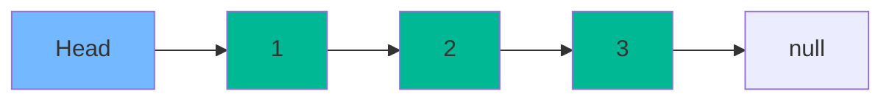
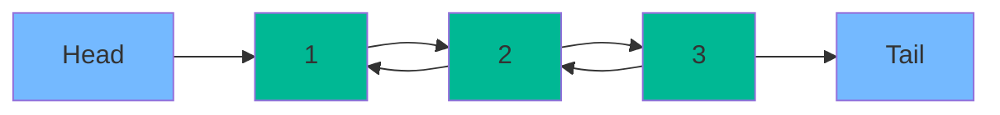
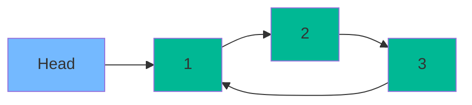

# Linked Lists: Complete Master Guide

## Overview
Linked Lists are **dynamic data structures** where elements (nodes) are stored in non-contiguous memory locations, connected via pointers/references. Unlike arrays, linked lists excel at insertions and deletions but sacrifice random access. They are fundamental for understanding:
- Pointer manipulation (critical for C/C++, important conceptually for Java)
- Building blocks for advanced structures (Graphs, Trees, Skip Lists)
- Memory management and cache performance
- Classic interview patterns (reversal, cycle detection, merging)

For a Senior/Staff Engineer, mastering linked lists means understanding memory layout, recognizing patterns instantly, and discussing trade-offs with arrays in production systems.

---

## Table of Contents
1. [Fundamentals](#fundamentals)
2. [Types of Linked Lists](#types-of-linked-lists)
3. [Memory Layout & Performance](#memory-layout--performance)
4. [Core Patterns](#core-patterns)
5. [15+ Solved Problems](#solved-problems)
6. [Advanced Techniques](#advanced-techniques)
7. [Interview Questions & Answers](#interview-questions--answers)
8. [Banking & Production Context](#banking--production-context)

---

## Fundamentals

### Node Structure

**Singly Linked List Node:**
```java
class ListNode {
    int val;
    ListNode next;
    
    ListNode(int val) {
        this.val = val;
        this.next = null;
    }
    
    ListNode(int val, ListNode next) {
        this.val = val;
        this.next = next;
    }
}
```

**Doubly Linked List Node:**
```java
class DoublyListNode {
    int val;
    DoublyListNode prev;
    DoublyListNode next;
    
    DoublyListNode(int val) {
        this.val = val;
        this.prev = null;
        this.next = null;
    }
}
```

### Operations Complexity

| Operation | Singly Linked List | Doubly Linked List | Array | ArrayList |
|-----------|--------------------|--------------------|-------|-----------|
| **Access by index** | O(n) | O(n) | O(1) | O(1) |
| **Search** | O(n) | O(n) | O(n) | O(n) |
| **Insert at head** | O(1) | O(1) | O(n) | O(n) |
| **Insert at tail** | O(1)* | O(1)* | O(1)** | O(1) amortized |
| **Insert at position** | O(n) | O(n) | O(n) | O(n) |
| **Delete at head** | O(1) | O(1) | O(n) | O(n) |
| **Delete at tail** | O(n) | O(1)* | O(1) | O(1) |
| **Delete given node** | O(n)*** | O(1)**** | O(n) | O(n) |

*\* Requires tail pointer*  
*\*\* If capacity available*  
*\*\*\* Need to find predecessor*  
*\*\*\*\* If we have reference to the node*

---

## Types of Linked Lists

### 1. Singly Linked List

**Structure:** Each node points to the next node.



**Pros:**
- Simple implementation
- Less memory per node (one pointer)
- Efficient forward traversal

**Cons:**
- Can't traverse backward
- Deleting a node requires predecessor

### 2. Doubly Linked List

**Structure:** Each node points to both next and previous nodes.



**Pros:**
- Bidirectional traversal
- O(1) deletion if we have node reference
- Easier to implement certain operations (e.g., LRU cache)

**Cons:**
- More memory (two pointers per node)
- More complex implementation

**Java's LinkedList** uses doubly linked list internally.

### 3. Circular Linked List

**Structure:** Last node points back to head (or first node).



**Use Cases:**
- Round-robin scheduling
- Circular buffers
- Josephus problem

---

## Memory Layout & Performance

### Array vs Linked List Memory

**Array:**
```
Memory: [1][2][3][4][5]  (Contiguous)
Address: 1000, 1004, 1008, 1012, 1016
```
- **Cache-friendly**: Sequential access benefits from CPU cache prefetching
- **Access**: Direct calculation: `address = base + (index × size)`

**Linked List:**
```
Memory: [1]→[2]→[3]→[4]→[5]  (Scattered)
Address: 1000→2500→1200→3000→1800
```
- **Cache-unfriendly**: Each node access may cause cache miss
- **Access**: Must traverse: `node = head; for (i times) node = node.next;`

### Performance Implications

**For n=1,000,000 elements:**
- **Array access**: ~1-2 nanoseconds (L1 cache hit)
- **Linked list traversal**: ~100-1000 nanoseconds (cache misses, pointer chasing)

**When to use Linked List:**
- Frequent insertions/deletions at head/tail
- Unknown or highly variable size
- Don't need random access
- Building blocks for other structures (graphs, trees)

**When to use Array/ArrayList:**
- Frequent random access
- Predictable size
- Sequential iteration (cache-friendly)
- Memory locality important

---

## Core Patterns

### Pattern 1: Fast & Slow Pointers (Floyd's Cycle Detection)

**When to use:**
- Detect cycles
- Find middle of list
- Find k-th element from end
- Check if list is palindrome

**Template:**
```java
public boolean hasCycle(ListNode head) {
    ListNode slow = head;
    ListNode fast = head;
    
    while (fast != null && fast.next != null) {
        slow = slow.next;           // Move 1 step
        fast = fast.next.next;      // Move 2 steps
        
        if (slow == fast) {
            return true;  // Cycle detected
        }
    }
    
    return false;
}
```

**Why it works:** If there's a cycle, fast will eventually catch slow (like runners on a circular track).

### Pattern 2: Dummy Head

**When to use:**
- Simplify edge cases (inserting/deleting at head)
- Merge operations
- Building new lists

**Template:**
```java
public ListNode solve(ListNode head) {
    ListNode dummy = new ListNode(0);
    dummy.next = head;
    
    // Now we can safely modify head
    // ...
    
    return dummy.next;  // New head
}
```

**Benefit:** Eliminates special case handling for head node.

### Pattern 3: In-Place Reversal

**When to use:**
- Reverse entire list
- Reverse in groups
- Palindrome checking

**Template:**
```java
public ListNode reverse(ListNode head) {
    ListNode prev = null;
    ListNode current = head;
    
    while (current != null) {
        ListNode nextTemp = current.next;  // Save next
        current.next = prev;               // Reverse link
        prev = current;                    // Move prev forward
        current = nextTemp;                // Move current forward
    }
    
    return prev;  // New head
}
```

### Pattern 4: Runner Technique

**When to use:**
- Find middle element
- Find k-th from end
- Reorder list

**Template:**
```java
// Find middle element
public ListNode findMiddle(ListNode head) {
    ListNode slow = head;
    ListNode fast = head;
    
    while (fast != null && fast.next != null) {
        slow = slow.next;
        fast = fast.next.next;
    }
    
    return slow;  // Middle element
}
```

---

## Solved Problems

### Problem 1: Reverse Linked List (Easy)

**Iterative Solution:**
```java
/**
 * Reverse a singly linked list.
 * Time: O(n), Space: O(1)
 */
public ListNode reverseList(ListNode head) {
    ListNode prev = null;
    ListNode current = head;
    
    while (current != null) {
        ListNode nextTemp = current.next;
        current.next = prev;
        prev = current;
        current = nextTemp;
    }
    
    return prev;
}
```

**Recursive Solution:**
```java
/**
 * Reverse a singly linked list recursively.
 * Time: O(n), Space: O(n) - call stack
 */
public ListNode reverseListRecursive(ListNode head) {
    // Base case
    if (head == null || head.next == null) {
        return head;
    }
    
    // Reverse rest of list
    ListNode newHead = reverseListRecursive(head.next);
    
    // Reverse current node
    head.next.next = head;
    head.next = null;
    
    return newHead;
}
```

**Dry Run (Iterative):**
```
Input: 1 → 2 → 3 → null

Initial: prev=null, current=1→2→3

Step 1: nextTemp=2→3, 1→null, prev=1, current=2→3
Step 2: nextTemp=3→null, 2→1→null, prev=2, current=3→null
Step 3: nextTemp=null, 3→2→1→null, prev=3, current=null

Result: 3 → 2 → 1 → null
```

### Problem 2: Linked List Cycle (Easy)

```java
/**
 * Detect if linked list has a cycle.
 * Time: O(n), Space: O(1)
 */
public boolean hasCycle(ListNode head) {
    if (head == null) return false;
    
    ListNode slow = head;
    ListNode fast = head;
    
    while (fast != null && fast.next != null) {
        slow = slow.next;
        fast = fast.next.next;
        
        if (slow == fast) {
            return true;
        }
    }
    
    return false;
}
```

### Problem 3: Linked List Cycle II (Medium)

**Find the start of the cycle:**

```java
/**
 * Find the node where cycle begins.
 * Time: O(n), Space: O(1)
 */
public ListNode detectCycle(ListNode head) {
    if (head == null) return null;
    
    // Phase 1: Detect cycle
    ListNode slow = head;
    ListNode fast = head;
    boolean hasCycle = false;
    
    while (fast != null && fast.next != null) {
        slow = slow.next;
        fast = fast.next.next;
        
        if (slow == fast) {
            hasCycle = true;
            break;
        }
    }
    
    if (!hasCycle) return null;
    
    // Phase 2: Find cycle start
    // Reset slow to head, move both at same speed
    slow = head;
    while (slow != fast) {
        slow = slow.next;
        fast = fast.next;
    }
    
    return slow;  // Cycle start
}
```

**Why this works:**
- Let distance from head to cycle start = F
- Let distance from cycle start to meeting point = a
- Let cycle length = C
- When they meet: slow traveled F + a, fast traveled F + a + nC (n laps)
- Since fast is 2x speed: 2(F + a) = F + a + nC
- Simplify: F + a = nC → F = nC - a
- So distance from head to cycle start = distance from meeting point to cycle start!

### Problem 4: Remove Nth Node From End (Medium)

```java
/**
 * Remove nth node from end of list.
 * Time: O(n), Space: O(1)
 */
public ListNode removeNthFromEnd(ListNode head, int n) {
    ListNode dummy = new ListNode(0);
    dummy.next = head;
    
    ListNode first = dummy;
    ListNode second = dummy;
    
    // Move first n+1 steps ahead
    for (int i = 0; i <= n; i++) {
        first = first.next;
    }
    
    // Move both until first reaches end
    while (first != null) {
        first = first.next;
        second = second.next;
    }
    
    // Remove nth node
    second.next = second.next.next;
    
    return dummy.next;
}
```

**Visualization:**
```
List: 1 → 2 → 3 → 4 → 5, n=2 (remove 4)

After moving first 3 steps: first=4, second=dummy
After moving both: first=null, second=3
Remove: 3.next = 3.next.next (skip 4)
Result: 1 → 2 → 3 → 5
```

### Problem 5: Merge Two Sorted Lists (Easy)

```java
/**
 * Merge two sorted linked lists.
 * Time: O(n + m), Space: O(1)
 */
public ListNode mergeTwoLists(ListNode l1, ListNode l2) {
    ListNode dummy = new ListNode(0);
    ListNode current = dummy;
    
    while (l1 != null && l2 != null) {
        if (l1.val <= l2.val) {
            current.next = l1;
            l1 = l1.next;
        } else {
            current.next = l2;
            l2 = l2.next;
        }
        current = current.next;
    }
    
    // Attach remaining nodes
    current.next = (l1 != null) ? l1 : l2;
    
    return dummy.next;
}
```

### Problem 6: Merge K Sorted Lists (Hard)

**Approach 1: Min Heap**
```java
/**
 * Merge k sorted linked lists using min heap.
 * Time: O(N log k) where N = total nodes, k = number of lists
 * Space: O(k) for heap
 */
public ListNode mergeKLists(ListNode[] lists) {
    if (lists == null || lists.length == 0) return null;
    
    PriorityQueue<ListNode> minHeap = new PriorityQueue<>((a, b) -> a.val - b.val);
    
    // Add head of each list
    for (ListNode node : lists) {
        if (node != null) {
            minHeap.offer(node);
        }
    }
    
    ListNode dummy = new ListNode(0);
    ListNode current = dummy;
    
    while (!minHeap.isEmpty()) {
        ListNode smallest = minHeap.poll();
        current.next = smallest;
        current = current.next;
        
        if (smallest.next != null) {
            minHeap.offer(smallest.next);
        }
    }
    
    return dummy.next;
}
```

**Approach 2: Divide and Conquer**
```java
/**
 * Merge k sorted lists using divide and conquer.
 * Time: O(N log k), Space: O(log k) - recursion stack
 */
public ListNode mergeKLists(ListNode[] lists) {
    if (lists == null || lists.length == 0) return null;
    return mergeHelper(lists, 0, lists.length - 1);
}

private ListNode mergeHelper(ListNode[] lists, int left, int right) {
    if (left == right) return lists[left];
    
    int mid = left + (right - left) / 2;
    ListNode l1 = mergeHelper(lists, left, mid);
    ListNode l2 = mergeHelper(lists, mid + 1, right);
    
    return mergeTwoLists(l1, l2);
}
```

### Problem 7: Reorder List (Medium)

**Problem:** L0 → L1 → ... → Ln-1 → Ln becomes L0 → Ln → L1 → Ln-1 → L2 → Ln-2 → ...

```java
/**
 * Reorder list in-place.
 * Time: O(n), Space: O(1)
 */
public void reorderList(ListNode head) {
    if (head == null || head.next == null) return;
    
    // Step 1: Find middle
    ListNode slow = head;
    ListNode fast = head;
    while (fast.next != null && fast.next.next != null) {
        slow = slow.next;
        fast = fast.next.next;
    }
    
    // Step 2: Reverse second half
    ListNode secondHalf = reverse(slow.next);
    slow.next = null;  // Split list
    
    // Step 3: Merge two halves
    ListNode first = head;
    ListNode second = secondHalf;
    
    while (second != null) {
        ListNode temp1 = first.next;
        ListNode temp2 = second.next;
        
        first.next = second;
        second.next = temp1;
        
        first = temp1;
        second = temp2;
    }
}

private ListNode reverse(ListNode head) {
    ListNode prev = null;
    while (head != null) {
        ListNode next = head.next;
        head.next = prev;
        prev = head;
        head = next;
    }
    return prev;
}
```

### Problem 8: Palindrome Linked List (Easy)

```java
/**
 * Check if linked list is palindrome.
 * Time: O(n), Space: O(1)
 */
public boolean isPalindrome(ListNode head) {
    if (head == null || head.next == null) return true;
    
    // Find middle
    ListNode slow = head;
    ListNode fast = head;
    while (fast != null && fast.next != null) {
        slow = slow.next;
        fast = fast.next.next;
    }
    
    // Reverse second half
    ListNode secondHalf = reverse(slow);
    
    // Compare
    ListNode p1 = head;
    ListNode p2 = secondHalf;
    boolean result = true;
    
    while (p2 != null) {
        if (p1.val != p2.val) {
            result = false;
            break;
        }
        p1 = p1.next;
        p2 = p2.next;
    }
    
    // Restore list (optional)
    reverse(secondHalf);
    
    return result;
}
```

### Problem 9: Copy List with Random Pointer (Medium)

```java
class Node {
    int val;
    Node next;
    Node random;
    
    Node(int val) {
        this.val = val;
    }
}

/**
 * Deep copy linked list with random pointers.
 * Time: O(n), Space: O(1) - in-place solution
 */
public Node copyRandomList(Node head) {
    if (head == null) return null;
    
    // Step 1: Create copy nodes interleaved with original
    Node current = head;
    while (current != null) {
        Node copy = new Node(current.val);
        copy.next = current.next;
        current.next = copy;
        current = copy.next;
    }
    
    // Step 2: Set random pointers for copies
    current = head;
    while (current != null) {
        if (current.random != null) {
            current.next.random = current.random.next;
        }
        current = current.next.next;
    }
    
    // Step 3: Separate lists
    Node dummy = new Node(0);
    Node copyCurrent = dummy;
    current = head;
    
    while (current != null) {
        copyCurrent.next = current.next;
        current.next = current.next.next;
        
        copyCurrent = copyCurrent.next;
        current = current.next;
    }
    
    return dummy.next;
}
```

### Problem 10: Add Two Numbers (Medium)

```java
/**
 * Add two numbers represented as linked lists (reverse order).
 * Time: O(max(m, n)), Space: O(max(m, n))
 */
public ListNode addTwoNumbers(ListNode l1, ListNode l2) {
    ListNode dummy = new ListNode(0);
    ListNode current = dummy;
    int carry = 0;
    
    while (l1 != null || l2 != null || carry != 0) {
        int sum = carry;
        
        if (l1 != null) {
            sum += l1.val;
            l1 = l1.next;
        }
        
        if (l2 != null) {
            sum += l2.val;
            l2 = l2.next;
        }
        
        carry = sum / 10;
        current.next = new ListNode(sum % 10);
        current = current.next;
    }
    
    return dummy.next;
}
```

---

## Advanced Techniques

### Skip List

**Concept:** Probabilistic data structure that allows O(log n) search in sorted linked list.

```java
class SkipListNode {
    int val;
    SkipListNode[] forward;  // Array of forward pointers
    
    SkipListNode(int val, int level) {
        this.val = val;
        this.forward = new SkipListNode[level + 1];
    }
}
```

**Use Case:** Alternative to balanced trees (Redis uses skip lists for sorted sets).

### XOR Linked List

**Concept:** Store XOR of previous and next addresses to save space (one pointer instead of two).

```
node.both = address(prev) XOR address(next)
```

**Note:** Not practical in Java (no direct memory addresses), but important concept.

---

## Interview Questions & Answers

### Q1: "When would you use a linked list over an array?"

**Model Answer:**
"I'd use a linked list when:

1. **Frequent insertions/deletions at head/tail**: Linked lists are O(1) for these operations, while arrays are O(n) due to shifting.

2. **Unknown or highly variable size**: Arrays require contiguous memory and resizing is expensive. Linked lists grow dynamically without reallocation.

3. **Building blocks for other structures**: Graphs, trees, and hash table collision resolution use linked structures.

However, I'd use arrays/ArrayLists when:
- **Random access is needed**: Arrays are O(1), linked lists are O(n)
- **Memory locality matters**: Arrays are cache-friendly; linked lists cause cache misses
- **Memory overhead is a concern**: Each linked list node has pointer overhead

In production banking systems, we rarely use raw linked lists. Java's LinkedList is used for queue implementations (LinkedBlockingQueue) or when we need efficient head/tail operations. For most cases, ArrayList is superior due to cache performance."

### Q2: "How do you detect a cycle in a linked list without extra space?"

**Model Answer:**
"I use Floyd's Cycle Detection Algorithm (fast and slow pointers):

```java
ListNode slow = head, fast = head;
while (fast != null && fast.next != null) {
    slow = slow.next;
    fast = fast.next.next;
    if (slow == fast) return true;  // Cycle detected
}
return false;
```

**Why it works:** If there's a cycle, the fast pointer will eventually lap the slow pointer, like runners on a circular track. The fast pointer gains one node per iteration, so it will catch slow in at most C iterations (where C is cycle length).

**Time:** O(n) - worst case, we traverse the entire list plus one cycle
**Space:** O(1) - only two pointers

To find the cycle start, after detection, reset slow to head and move both at the same speed. They'll meet at the cycle start due to the mathematical relationship between distances."

### Q3: "Explain the trade-offs between singly and doubly linked lists."

**Model Answer:**
"**Singly Linked List:**
- **Memory:** One pointer per node (4-8 bytes)
- **Traversal:** Forward only
- **Deletion:** O(n) - need predecessor
- **Use case:** Simple queues, stacks

**Doubly Linked List:**
- **Memory:** Two pointers per node (8-16 bytes) - 2x overhead
- **Traversal:** Bidirectional
- **Deletion:** O(1) if we have node reference
- **Use case:** LRU cache, browser history, undo/redo

In production:
- **Java's LinkedList** uses doubly linked list for flexibility
- **LRU Cache** requires doubly linked list for O(1) removal from middle
- **Memory-constrained systems** prefer singly linked lists

For example, in a banking system implementing an audit trail, I'd use a singly linked list since we only append and traverse forward. But for an LRU cache of recent transactions, I'd use a doubly linked list for efficient eviction."

---

## 🏦 Banking & Production Context

### Audit Trail / Blockchain

**Scenario:** Immutable ledger of financial transactions

**Structure:** Hash-linked list where each block contains:
- Transaction data
- Hash of previous block
- Timestamp

```java
class Block {
    String data;
    String previousHash;
    String hash;
    long timestamp;
    Block next;
    
    Block(String data, String previousHash) {
        this.data = data;
        this.previousHash = previousHash;
        this.timestamp = System.currentTimeMillis();
        this.hash = calculateHash();
    }
    
    String calculateHash() {
        return SHA256(previousHash + timestamp + data);
    }
}
```

**Why:** Any modification breaks the chain (hash mismatch), ensuring integrity.

### LRU Cache for Market Data

**Scenario:** Cache recent stock prices with eviction policy

```java
class LRUCache {
    class Node {
        int key, value;
        Node prev, next;
    }
    
    private Map<Integer, Node> cache;
    private Node head, tail;
    private int capacity;
    
    // O(1) get and put operations
    // Doubly linked list for O(1) removal
    // HashMap for O(1) lookup
}
```

**Production Consideration:** In HFT, we use off-heap memory to avoid GC pauses.

### Transaction Queue

**Scenario:** FIFO queue for payment processing

**Implementation:** LinkedBlockingQueue (Java's concurrent linked list)

```java
BlockingQueue<Transaction> queue = new LinkedBlockingQueue<>();

// Producer
queue.put(transaction);

// Consumer
Transaction tx = queue.take();  // Blocks if empty
```

**Why Linked List:** Unbounded growth, efficient head/tail operations.

---

## Common Pitfalls

1. **Losing references**: Always save `next` before modifying pointers
   ```java
   // WRONG
   current.next = prev;
   current = current.next;  // Lost reference!
   
   // RIGHT
   ListNode nextTemp = current.next;
   current.next = prev;
   current = nextTemp;
   ```

2. **Null pointer exceptions**: Check both `node != null` and `node.next != null`
   ```java
   while (fast != null && fast.next != null)  // Correct
   ```

3. **Cycle handling**: Infinite loops if cycle detection is missed

4. **Edge cases**: Empty list, single node, two nodes

5. **Memory leaks**: In languages with manual memory management, forgetting to free nodes

---

## Key Takeaways

1. **Linked lists trade random access for dynamic size and efficient insertions**
2. **Fast & slow pointers solve many linked list problems elegantly**
3. **Dummy head simplifies edge case handling**
4. **In-place operations save space but require careful pointer manipulation**
5. **Doubly linked lists enable O(1) deletion but use 2x memory**
6. **In production, arrays usually outperform due to cache locality**
7. **Linked structures are building blocks for graphs, trees, and hash tables**

---

**Next**: [Stacks and Queues](05-stacks-and-queues.md)
