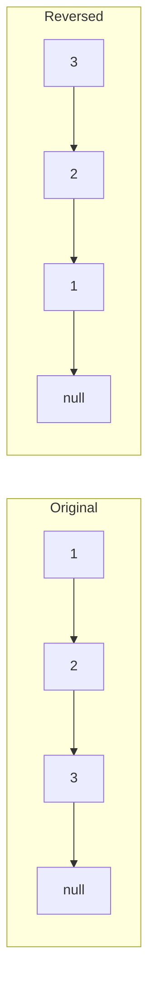

# Linked Lists

## Overview
Linked Lists are dynamic data structures where elements are stored in non-contiguous memory locations, connected by pointers. They are fundamental for understanding pointers/references and are the building blocks for Graphs and Trees.

## Fundamentals

### Types
1.  **Singly Linked List**: Each node points to the next. Traversal is one-way.
2.  **Doubly Linked List**: Each node points to next and previous. Traversal is two-way.
3.  **Circular Linked List**: Last node points back to head.

### Node Structure (Java)
```java
class ListNode {
    int val;
    ListNode next;
    // ListNode prev; // For Doubly Linked List
    
    ListNode(int val) {
        this.val = val;
        this.next = null;
    }
}
```

## Operations and Complexity

| Operation | Singly Linked List | Doubly Linked List | Array |
|-----------|--------------------|--------------------|-------|
| Access    | O(n)               | O(n)               | O(1)  |
| Search    | O(n)               | O(n)               | O(n)  |
| Insert (Head)| O(1)            | O(1)               | O(n)  |
| Insert (Tail)| O(1)*           | O(1)               | O(1)* |
| Delete (Head)| O(1)            | O(1)               | O(n)  |
| Delete (Node)| O(n)**          | O(1)***            | O(n)  |

*\* Assuming we have a tail pointer / capacity.*
*\*\* Need to find predecessor.*
*\*\*\* Assuming we have reference to the node.*

## Common Patterns

### 1. Fast & Slow Pointers (Tortoise and Hare)
Used for cycle detection and finding the middle.
*   **Cycle Detection**: If Fast catches Slow, there's a cycle.
*   **Middle**: When Fast reaches end, Slow is at middle.
*   **Complexity**: O(n) Time, O(1) Space.

### 2. Dummy Head
Used to simplify edge cases (inserting/deleting at head).
*   `ListNode dummy = new ListNode(0); dummy.next = head;`

### 3. In-Place Reversal
Reversing links without extra space.

## Visual Diagrams

### Reversing a Linked List


## Interview Problems

### Problem 1: Reverse Linked List (Easy)
**Pattern**: In-Place Reversal

```java
/**
 * Reverse a singly linked list.
 * Time: O(n)
 * Space: O(1)
 */
public ListNode reverseList(ListNode head) {
    ListNode prev = null;
    ListNode current = head;
    
    while (current != null) {
        ListNode nextTemp = current.next; // Save next
        current.next = prev;              // Reverse link
        prev = current;                   // Move prev
        current = nextTemp;               // Move current
    }
    
    return prev; // New head
}
```

### Problem 2: Linked List Cycle (Easy)
**Pattern**: Fast & Slow Pointers

```java
/**
 * Detect if a linked list has a cycle.
 * Time: O(n)
 * Space: O(1)
 */
public boolean hasCycle(ListNode head) {
    if (head == null) return false;
    
    ListNode slow = head;
    ListNode fast = head;
    
    while (fast != null && fast.next != null) {
        slow = slow.next;       // Move 1 step
        fast = fast.next.next;  // Move 2 steps
        
        if (slow == fast) {
            return true; // Collision = Cycle
        }
    }
    
    return false;
}
```

### Problem 3: Merge K Sorted Lists (Hard)
**Pattern**: Heap / Divide & Conquer

```java
/**
 * Merge k sorted linked lists.
 * Time: O(N log k) where N is total nodes, k is number of lists.
 * Space: O(k) for PriorityQueue
 */
public ListNode mergeKLists(ListNode[] lists) {
    if (lists == null || lists.length == 0) return null;
    
    PriorityQueue<ListNode> minHeap = new PriorityQueue<>((a, b) -> a.val - b.val);
    
    // Add head of each list to heap
    for (ListNode node : lists) {
        if (node != null) minHeap.offer(node);
    }
    
    ListNode dummy = new ListNode(0);
    ListNode tail = dummy;
    
    while (!minHeap.isEmpty()) {
        ListNode smallest = minHeap.poll();
        tail.next = smallest;
        tail = tail.next;
        
        if (smallest.next != null) {
            minHeap.offer(smallest.next);
        }
    }
    
    return dummy.next;
}
```

## 🏦 Banking Context: Audit Trails
*   **Scenario**: An immutable ledger of transactions (Blockchain concept).
*   **Structure**: A **Merkle Tree** or a **Hash-Linked List** where each block contains the hash of the previous block.
*   **Why**: Ensures data integrity. If any node is modified, the chain breaks.

## Common Pitfalls
1.  **Losing Reference**: Forgetting to save `next` before changing the pointer.
2.  **Null Pointer Exception**: Always check `if (node != null && node.next != null)`.
3.  **Cycle Handling**: Infinite loops if cycle detection is missed.

---
**Next**: [Stacks and Queues](05-stacks-and-queues.md)
