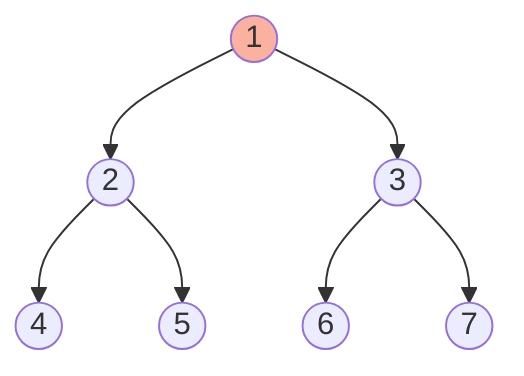

# Trees: Binary Trees - Complete Master Guide

## Overview
Binary trees are hierarchical data structures where each node has at most two children (left and right). They form the foundation for BSTs, heaps, tries, and many advanced structures.

**Key Insight**: Most tree problems are solved recursively—master the recursive pattern and you unlock hundreds of problems.

For Senior/Staff Engineers, mastering binary trees means:
- Fluent implementation of all traversals (inorder, preorder, postorder, level-order)
- Recognizing tree patterns (DFS, BFS, divide-and-conquer)
- Understanding tree properties (height, balance, completeness)
- Discussing production tree structures (file systems, DOM, org charts)

---

## Table of Contents
1. [Fundamentals](#fundamentals)
2. [Tree Traversals](#tree-traversals)
3. [Common Patterns](#common-patterns)
4. [15+ Solved Problems](#solved-problems)
5. [Advanced Topics](#advanced-topics)
6. [Interview Questions & Answers](#interview-questions--answers)
7. [Banking & Production Context](#banking--production-context)

---

## Fundamentals

### Tree Terminology

**Node**: Element containing data and pointers to children  
**Root**: Top node (no parent)  
**Leaf**: Node with no children  
**Internal node**: Node with at least one child  
**Height**: Longest path from root to leaf  
**Depth**: Path length from root to node  
**Level**: Depth + 1  

### Binary Tree Properties

**Complete Binary Tree**: All levels filled except possibly last (fills left-to-right)  
**Full Binary Tree**: Every node has 0 or 2 children  
**Perfect Binary Tree**: All internal nodes have 2 children, all leaves at same level  
**Balanced Binary Tree**: Height difference between left and right subtrees ≤ 1  

### Visualization



**Properties**:
- Height: 2
- Nodes: 7
- Leaves: 4, 5, 6, 7
- Internal nodes: 1, 2, 3

---

## Tree Node Definition

```java
/**
 * Binary tree node definition.
 */
class TreeNode {
    int val;
    TreeNode left;
    TreeNode right;
    
    TreeNode(int val) {
        this.val = val;
    }
    
    TreeNode(int val, TreeNode left, TreeNode right) {
        this.val = val;
        this.left = left;
        this.right = right;
    }
}
```

---

## Tree Traversals

### Inorder (Left-Root-Right)

**Use case**: Get sorted order in BST

```java
/**
 * Inorder traversal (recursive).
 * Time: O(n), Space: O(h)
 */
public void inorder(TreeNode root) {
    if (root == null) return;
    
    inorder(root.left);
    System.out.print(root.val + " ");
    inorder(root.right);
}

/**
 * Inorder traversal (iterative).
 * Time: O(n), Space: O(h)
 */
public List<Integer> inorderIterative(TreeNode root) {
    List<Integer> result = new ArrayList<>();
    Deque<TreeNode> stack = new ArrayDeque<>();
    TreeNode curr = root;
    
    while (curr != null || !stack.isEmpty()) {
        while (curr != null) {
            stack.push(curr);
            curr = curr.left;
        }
        
        curr = stack.pop();
        result.add(curr.val);
        curr = curr.right;
    }
    
    return result;
}
```

### Preorder (Root-Left-Right)

**Use case**: Copy tree, serialize tree

```java
/**
 * Preorder traversal (recursive).
 * Time: O(n), Space: O(h)
 */
public void preorder(TreeNode root) {
    if (root == null) return;
    
    System.out.print(root.val + " ");
    preorder(root.left);
    preorder(root.right);
}

/**
 * Preorder traversal (iterative).
 * Time: O(n), Space: O(h)
 */
public List<Integer> preorderIterative(TreeNode root) {
    List<Integer> result = new ArrayList<>();
    if (root == null) return result;
    
    Deque<TreeNode> stack = new ArrayDeque<>();
    stack.push(root);
    
    while (!stack.isEmpty()) {
        TreeNode node = stack.pop();
        result.add(node.val);
        
        if (node.right != null) stack.push(node.right);
        if (node.left != null) stack.push(node.left);
    }
    
    return result;
}
```

### Postorder (Left-Right-Root)

**Use case**: Delete tree, evaluate expression tree

```java
/**
 * Postorder traversal (recursive).
 * Time: O(n), Space: O(h)
 */
public void postorder(TreeNode root) {
    if (root == null) return;
    
    postorder(root.left);
    postorder(root.right);
    System.out.print(root.val + " ");
}

/**
 * Postorder traversal (iterative).
 * Time: O(n), Space: O(h)
 */
public List<Integer> postorderIterative(TreeNode root) {
    List<Integer> result = new ArrayList<>();
    if (root == null) return result;
    
    Deque<TreeNode> stack = new ArrayDeque<>();
    TreeNode curr = root;
    TreeNode lastVisited = null;
    
    while (curr != null || !stack.isEmpty()) {
        while (curr != null) {
            stack.push(curr);
            curr = curr.left;
        }
        
        TreeNode peekNode = stack.peek();
        
        if (peekNode.right != null && lastVisited != peekNode.right) {
            curr = peekNode.right;
        } else {
            result.add(peekNode.val);
            lastVisited = stack.pop();
        }
    }
    
    return result;
}
```

### Level Order (BFS)

**Use case**: Level-by-level processing

```java
/**
 * Level order traversal.
 * Time: O(n), Space: O(w) where w is max width
 */
public List<List<Integer>> levelOrder(TreeNode root) {
    List<List<Integer>> result = new ArrayList<>();
    if (root == null) return result;
    
    Queue<TreeNode> queue = new LinkedList<>();
    queue.offer(root);
    
    while (!queue.isEmpty()) {
        int levelSize = queue.size();
        List<Integer> currentLevel = new ArrayList<>();
        
        for (int i = 0; i < levelSize; i++) {
            TreeNode node = queue.poll();
            currentLevel.add(node.val);
            
            if (node.left != null) queue.offer(node.left);
            if (node.right != null) queue.offer(node.right);
        }
        
        result.add(currentLevel);
    }
    
    return result;
}
```

---

## Common Patterns

### Pattern 1: Recursive DFS

**Template**:
```java
public ReturnType solve(TreeNode root) {
    // Base case
    if (root == null) return baseValue;
    
    // Recursive calls
    ReturnType left = solve(root.left);
    ReturnType right = solve(root.right);
    
    // Combine results
    return combine(left, right, root.val);
}
```

### Pattern 2: Level Order (BFS)

**Template**:
```java
public void levelOrder(TreeNode root) {
    if (root == null) return;
    
    Queue<TreeNode> queue = new LinkedList<>();
    queue.offer(root);
    
    while (!queue.isEmpty()) {
        int size = queue.size();
        
        for (int i = 0; i < size; i++) {
            TreeNode node = queue.poll();
            // Process node
            
            if (node.left != null) queue.offer(node.left);
            if (node.right != null) queue.offer(node.right);
        }
    }
}
```

### Pattern 3: Divide and Conquer

**Template**:
```java
public TreeNode divideConquer(TreeNode root) {
    if (root == null) return null;
    
    // Divide
    TreeNode left = divideConquer(root.left);
    TreeNode right = divideConquer(root.right);
    
    // Conquer (merge)
    return merge(left, right, root);
}
```

---

## Solved Problems

### Problem 1: Maximum Depth (Easy)

```java
/**
 * Find maximum depth of binary tree.
 * Time: O(n), Space: O(h)
 */
public int maxDepth(TreeNode root) {
    if (root == null) return 0;
    
    int leftDepth = maxDepth(root.left);
    int rightDepth = maxDepth(root.right);
    
    return Math.max(leftDepth, rightDepth) + 1;
}
```

### Problem 2: Invert Binary Tree (Easy)

```java
/**
 * Invert binary tree (mirror).
 * Time: O(n), Space: O(h)
 */
public TreeNode invertTree(TreeNode root) {
    if (root == null) return null;
    
    TreeNode temp = root.left;
    root.left = invertTree(root.right);
    root.right = invertTree(temp);
    
    return root;
}
```

### Problem 3: Same Tree (Easy)

```java
/**
 * Check if two trees are identical.
 * Time: O(n), Space: O(h)
 */
public boolean isSameTree(TreeNode p, TreeNode q) {
    if (p == null && q == null) return true;
    if (p == null || q == null) return false;
    
    return p.val == q.val &&
           isSameTree(p.left, q.left) &&
           isSameTree(p.right, q.right);
}
```

### Problem 4: Symmetric Tree (Easy)

```java
/**
 * Check if tree is symmetric.
 * Time: O(n), Space: O(h)
 */
public boolean isSymmetric(TreeNode root) {
    return isMirror(root, root);
}

private boolean isMirror(TreeNode t1, TreeNode t2) {
    if (t1 == null && t2 == null) return true;
    if (t1 == null || t2 == null) return false;
    
    return t1.val == t2.val &&
           isMirror(t1.left, t2.right) &&
           isMirror(t1.right, t2.left);
}
```

### Problem 5: Path Sum (Easy)

```java
/**
 * Check if path from root to leaf sums to target.
 * Time: O(n), Space: O(h)
 */
public boolean hasPathSum(TreeNode root, int targetSum) {
    if (root == null) return false;
    
    if (root.left == null && root.right == null) {
        return root.val == targetSum;
    }
    
    return hasPathSum(root.left, targetSum - root.val) ||
           hasPathSum(root.right, targetSum - root.val);
}
```

### Problem 6: Diameter of Binary Tree (Easy)

```java
/**
 * Find diameter (longest path between any two nodes).
 * Time: O(n), Space: O(h)
 */
private int diameter = 0;

public int diameterOfBinaryTree(TreeNode root) {
    height(root);
    return diameter;
}

private int height(TreeNode node) {
    if (node == null) return 0;
    
    int leftHeight = height(node.left);
    int rightHeight = height(node.right);
    
    diameter = Math.max(diameter, leftHeight + rightHeight);
    
    return Math.max(leftHeight, rightHeight) + 1;
}
```

### Problem 7: Lowest Common Ancestor (Medium)

```java
/**
 * Find LCA of two nodes.
 * Time: O(n), Space: O(h)
 */
public TreeNode lowestCommonAncestor(TreeNode root, TreeNode p, TreeNode q) {
    if (root == null || root == p || root == q) {
        return root;
    }
    
    TreeNode left = lowestCommonAncestor(root.left, p, q);
    TreeNode right = lowestCommonAncestor(root.right, p, q);
    
    if (left != null && right != null) return root;
    return left != null ? left : right;
}
```

### Problem 8: Binary Tree Right Side View (Medium)

```java
/**
 * Return values visible from right side.
 * Time: O(n), Space: O(w)
 */
public List<Integer> rightSideView(TreeNode root) {
    List<Integer> result = new ArrayList<>();
    if (root == null) return result;
    
    Queue<TreeNode> queue = new LinkedList<>();
    queue.offer(root);
    
    while (!queue.isEmpty()) {
        int size = queue.size();
        
        for (int i = 0; i < size; i++) {
            TreeNode node = queue.poll();
            
            if (i == size - 1) {
                result.add(node.val);
            }
            
            if (node.left != null) queue.offer(node.left);
            if (node.right != null) queue.offer(node.right);
        }
    }
    
    return result;
}
```

### Problem 9: Construct Tree from Preorder and Inorder (Medium)

```java
/**
 * Construct tree from preorder and inorder traversals.
 * Time: O(n), Space: O(n)
 */
private int preIndex = 0;
private Map<Integer, Integer> inMap = new HashMap<>();

public TreeNode buildTree(int[] preorder, int[] inorder) {
    for (int i = 0; i < inorder.length; i++) {
        inMap.put(inorder[i], i);
    }
    
    return build(preorder, 0, inorder.length - 1);
}

private TreeNode build(int[] preorder, int inStart, int inEnd) {
    if (inStart > inEnd) return null;
    
    int rootVal = preorder[preIndex++];
    TreeNode root = new TreeNode(rootVal);
    
    int inIndex = inMap.get(rootVal);
    
    root.left = build(preorder, inStart, inIndex - 1);
    root.right = build(preorder, inIndex + 1, inEnd);
    
    return root;
}
```

### Problem 10: Serialize and Deserialize Binary Tree (Hard)

```java
/**
 * Serialize and deserialize binary tree.
 * Time: O(n), Space: O(n)
 */
public class Codec {
    public String serialize(TreeNode root) {
        StringBuilder sb = new StringBuilder();
        serializeHelper(root, sb);
        return sb.toString();
    }
    
    private void serializeHelper(TreeNode node, StringBuilder sb) {
        if (node == null) {
            sb.append("null,");
            return;
        }
        
        sb.append(node.val).append(",");
        serializeHelper(node.left, sb);
        serializeHelper(node.right, sb);
    }
    
    public TreeNode deserialize(String data) {
        Queue<String> queue = new LinkedList<>(Arrays.asList(data.split(",")));
        return deserializeHelper(queue);
    }
    
    private TreeNode deserializeHelper(Queue<String> queue) {
        String val = queue.poll();
        if (val.equals("null")) return null;
        
        TreeNode node = new TreeNode(Integer.parseInt(val));
        node.left = deserializeHelper(queue);
        node.right = deserializeHelper(queue);
        
        return node;
    }
}
```

### Problem 11: Binary Tree Maximum Path Sum (Hard)

```java
/**
 * Find maximum path sum (path can start/end anywhere).
 * Time: O(n), Space: O(h)
 */
private int maxSum = Integer.MIN_VALUE;

public int maxPathSum(TreeNode root) {
    maxGain(root);
    return maxSum;
}

private int maxGain(TreeNode node) {
    if (node == null) return 0;
    
    int leftGain = Math.max(maxGain(node.left), 0);
    int rightGain = Math.max(maxGain(node.right), 0);
    
    int pathSum = node.val + leftGain + rightGain;
    maxSum = Math.max(maxSum, pathSum);
    
    return node.val + Math.max(leftGain, rightGain);
}
```

---

## Advanced Topics

### Morris Traversal

**Inorder without stack** (O(1) space):

```java
/**
 * Morris inorder traversal.
 * Time: O(n), Space: O(1)
 */
public List<Integer> morrisInorder(TreeNode root) {
    List<Integer> result = new ArrayList<>();
    TreeNode curr = root;
    
    while (curr != null) {
        if (curr.left == null) {
            result.add(curr.val);
            curr = curr.right;
        } else {
            TreeNode pred = curr.left;
            while (pred.right != null && pred.right != curr) {
                pred = pred.right;
            }
            
            if (pred.right == null) {
                pred.right = curr;
                curr = curr.left;
            } else {
                pred.right = null;
                result.add(curr.val);
                curr = curr.right;
            }
        }
    }
    
    return result;
}
```

---

## Interview Questions & Answers

### Q1: "Explain the difference between tree height and depth."

**Model Answer:**
"Height and depth are related but different:

**Depth**: Distance from root to a specific node
- Root has depth 0
- Measured top-down
- Example: In a tree with root 1, child 2, grandchild 4:
  - Depth of 1: 0
  - Depth of 2: 1
  - Depth of 4: 2

**Height**: Distance from a node to its furthest leaf
- Leaves have height 0
- Measured bottom-up
- Example in same tree:
  - Height of 4: 0 (leaf)
  - Height of 2: 1
  - Height of 1: 2

**Tree height**: Height of root (longest path to any leaf)

**Key insight**: 
- Depth increases as you go down
- Height increases as you go up

**Production example**:
In file systems, depth determines indentation level (how nested a file is), while height determines maximum nesting depth (how deep the folder structure goes)."

### Q2: "When should you use BFS vs DFS for tree problems?"

**Model Answer:**
"I choose based on the problem requirements:

**Use BFS (Level Order) when**:
- Need level-by-level processing
- Finding shortest path (minimum depth)
- Right/left side view
- Level averages
- Zigzag traversal

**Use DFS when**:
- Need to explore all paths
- Finding maximum depth
- Path sum problems
- Tree construction
- Serialization

**Memory considerations**:
- BFS: O(width) - can be large for wide trees
- DFS: O(height) - can be large for deep trees

**Example**:
For a complete binary tree with 1M nodes:
- Height: ~20 (log₂ 1M)
- Max width: ~500K (at last level)
- BFS uses 500K space, DFS uses 20 space

**Production context**:
In org charts (banking hierarchy):
- Use BFS to find all employees at same level (VPs, MDs)
- Use DFS to find reporting chain depth (analyst to CEO)"

### Q3: "How do you handle tree problems with global state?"

**Model Answer:**
"Global state in tree problems requires careful handling:

**Common patterns**:

**1. Class-level variable**:
```java
private int maxDiameter = 0;

public int diameterOfBinaryTree(TreeNode root) {
    height(root);
    return maxDiameter;
}

private int height(TreeNode node) {
    // Update maxDiameter during traversal
}
```

**2. Pass by reference** (array/object):
```java
public int diameterOfBinaryTree(TreeNode root) {
    int[] max = new int[1];
    height(root, max);
    return max[0];
}
```

**3. Return multiple values** (avoid global state):
```java
class Result {
    int height;
    int diameter;
}

private Result solve(TreeNode node) {
    // Return both values
}
```

**Best practices**:
- Prefer returning values over global state
- If using global state, reset it between test cases
- Document side effects clearly

**Production example**:
In banking approval trees, we track:
- Global: Total approval amount (accumulate across all paths)
- Local: Current path amount (reset on backtrack)

Global state is acceptable when the alternative (passing many parameters) reduces readability."

---

## 🏦 Banking & Production Context

### Organization Hierarchy

**Scenario**: Model approval chain in banking.

```java
/**
 * Find common approver for two employees.
 */
class ApprovalChain {
    public Employee findCommonApprover(Employee emp1, Employee emp2, Employee ceo) {
        return lowestCommonAncestor(ceo, emp1, emp2);
    }
    
    private Employee lowestCommonAncestor(Employee root, Employee p, Employee q) {
        if (root == null || root == p || root == q) {
            return root;
        }
        
        Employee left = null, right = null;
        
        for (Employee report : root.directReports) {
            Employee result = lowestCommonAncestor(report, p, q);
            if (result != null) {
                if (left == null) left = result;
                else right = result;
            }
        }
        
        if (left != null && right != null) return root;
        return left != null ? left : right;
    }
}
```

### Transaction Approval Tree

**Scenario**: Calculate total amount requiring approval at each level.

```java
/**
 * Calculate approval amounts by level.
 */
class ApprovalCalculator {
    public List<Double> levelApprovals(TransactionNode root) {
        List<Double> result = new ArrayList<>();
        if (root == null) return result;
        
        Queue<TransactionNode> queue = new LinkedList<>();
        queue.offer(root);
        
        while (!queue.isEmpty()) {
            int size = queue.size();
            double levelSum = 0;
            
            for (int i = 0; i < size; i++) {
                TransactionNode node = queue.poll();
                levelSum += node.amount;
                
                if (node.left != null) queue.offer(node.left);
                if (node.right != null) queue.offer(node.right);
            }
            
            result.add(levelSum);
        }
        
        return result;
    }
}
```

---

## Key Takeaways

1. **Traversals**: Inorder (L-Root-R), Preorder (Root-L-R), Postorder (L-R-Root), Level Order (BFS)
2. **Recursive pattern**: Base case → Recursive calls → Combine results
3. **BFS vs DFS**: BFS for level-order, DFS for path problems
4. **Space complexity**: DFS O(h), BFS O(w)
5. **Common patterns**: Divide and conquer, level order, path sum
6. **Global state**: Use class variables or return multiple values
7. **Production**: Org charts, file systems, approval chains

---

**Next**: [Trees: Binary Search Trees](07-trees-bst.md)
