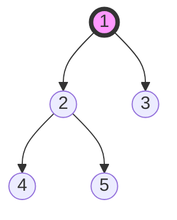

# Trees: Binary Trees

## Overview
Trees are hierarchical data structures. A Binary Tree is a tree where each node has at most two children (left and right). They are the basis for BSTs, Heaps, and many advanced structures.

## Fundamentals

### Terminology
*   **Root**: Top node.
*   **Leaf**: Node with no children.
*   **Height**: Number of edges from root to furthest leaf.
*   **Depth**: Number of edges from root to specific node.

### Traversals (CRITICAL)
1.  **Inorder (Left-Root-Right)**: Sorted order for BST.
2.  **Preorder (Root-Left-Right)**: Good for copying trees.
3.  **Postorder (Left-Right-Root)**: Good for deleting trees (bottom-up).
4.  **Level Order (BFS)**: Level by level.

## Operations and Complexity

| Operation | Binary Tree (Unbalanced) |
|-----------|--------------------------|
| Search    | O(n)                     |
| Insert    | O(n)                     |
| Delete    | O(n)                     |
| Height    | O(n)                     |

*Note: In a generic binary tree, there is no order, so we must visit every node in worst case.*

## Common Patterns

### 1. Recursion (DFS)
Most tree problems are solved recursively.
*   **Base Case**: `if (root == null) return ...`
*   **Recursive Step**: `solve(root.left); solve(root.right);`
*   **Combine**: `return result(left, right, root);`

### 2. Level Order Traversal (BFS)
Uses a Queue.
*   Useful for "Right side view", "Zigzag traversal", "Min depth".

## Visual Diagrams

### Tree Traversals

*   **Preorder**: 1 -> 2 -> 4 -> 5 -> 3
*   **Inorder**: 4 -> 2 -> 5 -> 1 -> 3
*   **Postorder**: 4 -> 5 -> 2 -> 3 -> 1

## Interview Problems

### Problem 1: Maximum Depth of Binary Tree (Easy)
**Pattern**: DFS (Recursion)

```java
/**
 * Find the maximum depth (height) of a binary tree.
 * Time: O(n)
 * Space: O(h) where h is height (O(n) worst case)
 */
public int maxDepth(TreeNode root) {
    if (root == null) return 0;
    
    int leftDepth = maxDepth(root.left);
    int rightDepth = maxDepth(root.right);
    
    return Math.max(leftDepth, rightDepth) + 1;
}
```

### Problem 2: Binary Tree Level Order Traversal (Medium)
**Pattern**: BFS (Queue)

```java
/**
 * Return level order traversal as List of Lists.
 * Time: O(n)
 * Space: O(n) (width of tree)
 */
public List<List<Integer>> levelOrder(TreeNode root) {
    List<List<Integer>> result = new ArrayList<>();
    if (root == null) return result;
    
    Queue<TreeNode> queue = new LinkedList<>();
    queue.offer(root);
    
    while (!queue.isEmpty()) {
        int levelSize = queue.size(); // Freeze size for current level
        List<Integer> currentLevel = new ArrayList<>();
        
        for (int i = 0; i < levelSize; i++) {
            TreeNode node = queue.poll();
            currentLevel.add(node.val);
            
            if (node.left != null) queue.offer(node.left);
            if (node.right != null) queue.offer(node.right);
        }
        result.add(currentLevel);
    }
    
    return result;
}
```

### Problem 3: Lowest Common Ancestor (Medium)
**Pattern**: DFS

```java
/**
 * Find LCA of two nodes p and q.
 * Time: O(n)
 * Space: O(h)
 */
public TreeNode lowestCommonAncestor(TreeNode root, TreeNode p, TreeNode q) {
    if (root == null || root == p || root == q) {
        return root;
    }
    
    TreeNode left = lowestCommonAncestor(root.left, p, q);
    TreeNode right = lowestCommonAncestor(root.right, p, q);
    
    if (left != null && right != null) return root; // Found both in different subtrees
    return (left != null) ? left : right; // Propagate the found node
}
```

## 🏦 Banking Context: Organization Hierarchies
*   **Scenario**: Modeling an approval chain (Analyst -> Associate -> VP -> MD).
*   **Application**: Finding the "Lowest Common Ancestor" (LCA) corresponds to finding the common manager who can approve a transaction involving two different departments.

## Common Pitfalls
1.  **Base Cases**: Forgetting `if (root == null)` is the #1 cause of StackOverflow.
2.  **Queue Size in BFS**: Must capture `queue.size()` *before* the inner loop to process level-by-level.
3.  **Object References**: In Java, `p == q` checks reference equality. In tree problems, usually nodes are unique objects.

---
**Next**: [Trees: Binary Search Trees](07-trees-bst.md)
