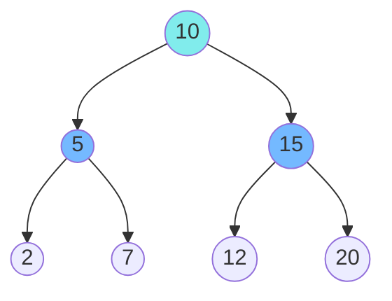

# Trees: Binary Search Trees (BST)

## Overview
A Binary Search Tree (BST) is a binary tree with a special property:
*   For any node, all nodes in the **left** subtree are **smaller**.
*   All nodes in the **right** subtree are **larger**.
*   This property enables **O(log n)** search, insert, and delete operations (if balanced).

## Fundamentals

### Properties
*   **Inorder Traversal** of a BST yields sorted values.
*   **Search**: Similar to Binary Search in an array.

## Operations and Complexity

| Operation | BST (Balanced) | BST (Skewed/Worst) |
|-----------|----------------|--------------------|
| Search    | O(log n)       | O(n)               |
| Insert    | O(log n)       | O(n)               |
| Delete    | O(log n)       | O(n)               |

*Note: To guarantee O(log n), we need Self-Balancing Trees (AVL, Red-Black).*

## Common Patterns

### 1. Validate BST
Check if a tree satisfies BST property.
*   **Trap**: Checking only immediate children is wrong. Must check range `(min, max)`.

### 2. Inorder Traversal
Used to get sorted elements or find Kth smallest.

## Visual Diagrams

### BST Property

*   Left Subtree (5, 2, 7) < 10
*   Right Subtree (15, 12, 20) > 10

## Interview Problems

### Problem 1: Validate Binary Search Tree (Medium)
**Pattern**: DFS with Range

```java
/**
 * Check if a binary tree is a valid BST.
 * Time: O(n)
 * Space: O(h)
 */
public boolean isValidBST(TreeNode root) {
    return validate(root, null, null);
}

private boolean validate(TreeNode node, Integer min, Integer max) {
    if (node == null) return true;
    
    if ((min != null && node.val <= min) || (max != null && node.val >= max)) {
        return false;
    }
    
    return validate(node.left, min, node.val) && validate(node.right, node.val, max);
}
```

### Problem 2: Kth Smallest Element in a BST (Medium)
**Pattern**: Inorder Traversal

```java
/**
 * Find the kth smallest element.
 * Time: O(n) (or O(k) if iterative)
 * Space: O(h)
 */
public int kthSmallest(TreeNode root, int k) {
    Deque<TreeNode> stack = new ArrayDeque<>();
    TreeNode curr = root;
    
    while (curr != null || !stack.isEmpty()) {
        while (curr != null) {
            stack.push(curr);
            curr = curr.left;
        }
        
        curr = stack.pop();
        k--;
        if (k == 0) return curr.val;
        
        curr = curr.right;
    }
    
    return -1; // Should not reach here
}
```

### Problem 3: Lowest Common Ancestor of a BST (Easy)
**Pattern**: BST Property

```java
/**
 * Find LCA in a BST.
 * Time: O(h)
 * Space: O(1) (Iterative)
 */
public TreeNode lowestCommonAncestor(TreeNode root, TreeNode p, TreeNode q) {
    TreeNode curr = root;
    while (curr != null) {
        if (p.val < curr.val && q.val < curr.val) {
            curr = curr.left; // Both in left subtree
        } else if (p.val > curr.val && q.val > curr.val) {
            curr = curr.right; // Both in right subtree
        } else {
            return curr; // Split point is LCA
        }
    }
    return null;
}
```

## 🏦 Banking Context: Order Books
*   **Scenario**: Storing limit orders in an exchange.
*   **Structure**: A **Red-Black Tree** (TreeMap in Java) is often used to store orders sorted by price.
*   **Why**: Allows O(log n) insertion of new orders, cancellation, and finding the "Best Bid" (Max) and "Best Ask" (Min).

## Common Pitfalls
1.  **Integer Overflow**: When validating BST, use `Long` or `null` for min/max boundaries to handle `Integer.MAX_VALUE`.
2.  **BST vs Binary Tree**: Don't assume a tree is a BST unless specified.
3.  **Duplicates**: Clarify if the BST allows duplicate values (usually left or right, or count in node).

---
**Next**: [Trees: Advanced](08-trees-advanced.md)
