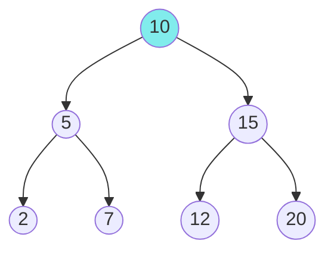

# Trees: Binary Search Trees (BST) - Complete Master Guide

## Overview
A Binary Search Tree (BST) is a binary tree with the **BST property**: for any node, all values in the left subtree are smaller, and all values in the right subtree are larger. This enables **O(log n)** search, insert, and delete operations when balanced.

**Key Insight**: BSTs combine the efficiency of binary search with the flexibility of linked structures.

For Senior/Staff Engineers, mastering BSTs means:
- Understanding BST operations and their complexity
- Recognizing when to use BST vs hash table
- Implementing BST validation correctly
- Discussing self-balancing trees (AVL, Red-Black) in production

---

## Table of Contents
1. [Fundamentals](#fundamentals)
2. [BST Operations](#bst-operations)
3. [Common Patterns](#common-patterns)
4. [15+ Solved Problems](#solved-problems)
5. [Advanced Topics](#advanced-topics)
6. [Interview Questions & Answers](#interview-questions--answers)
7. [Banking & Production Context](#banking--production-context)

---

## Fundamentals

### BST Property

**Definition**: For every node:
- All nodes in left subtree < node.val
- All nodes in right subtree > node.val
- Both subtrees are also BSTs

### Key Properties

**Inorder traversal**: Yields sorted sequence  
**Search**: Similar to binary search in array  
**Min element**: Leftmost node  
**Max element**: Rightmost node  

### Visualization



**Inorder**: 2, 5, 7, 10, 12, 15, 20 (sorted!)

---

## BST Operations

### Search

```java
/**
 * Search for value in BST.
 * Time: O(h), Space: O(1)
 */
public TreeNode search(TreeNode root, int val) {
    while (root != null && root.val != val) {
        root = val < root.val ? root.left : root.right;
    }
    return root;
}

// Recursive version
public TreeNode searchRecursive(TreeNode root, int val) {
    if (root == null || root.val == val) return root;
    
    return val < root.val ? 
           searchRecursive(root.left, val) : 
           searchRecursive(root.right, val);
}
```

### Insert

```java
/**
 * Insert value into BST.
 * Time: O(h), Space: O(1)
 */
public TreeNode insert(TreeNode root, int val) {
    if (root == null) return new TreeNode(val);
    
    TreeNode curr = root;
    while (true) {
        if (val < curr.val) {
            if (curr.left == null) {
                curr.left = new TreeNode(val);
                break;
            }
            curr = curr.left;
        } else {
            if (curr.right == null) {
                curr.right = new TreeNode(val);
                break;
            }
            curr = curr.right;
        }
    }
    
    return root;
}

// Recursive version
public TreeNode insertRecursive(TreeNode root, int val) {
    if (root == null) return new TreeNode(val);
    
    if (val < root.val) {
        root.left = insertRecursive(root.left, val);
    } else {
        root.right = insertRecursive(root.right, val);
    }
    
    return root;
}
```

### Delete

```java
/**
 * Delete node from BST.
 * Time: O(h), Space: O(h)
 */
public TreeNode deleteNode(TreeNode root, int key) {
    if (root == null) return null;
    
    if (key < root.val) {
        root.left = deleteNode(root.left, key);
    } else if (key > root.val) {
        root.right = deleteNode(root.right, key);
    } else {
        // Found node to delete
        
        // Case 1: Leaf node
        if (root.left == null && root.right == null) {
            return null;
        }
        
        // Case 2: One child
        if (root.left == null) return root.right;
        if (root.right == null) return root.left;
        
        // Case 3: Two children
        // Find inorder successor (min in right subtree)
        TreeNode successor = findMin(root.right);
        root.val = successor.val;
        root.right = deleteNode(root.right, successor.val);
    }
    
    return root;
}

private TreeNode findMin(TreeNode node) {
    while (node.left != null) {
        node = node.left;
    }
    return node;
}
```

---

## Common Patterns

### Pattern 1: BST Validation

**Problem**: Validate if tree is a valid BST.

**Key insight**: Must check range, not just immediate children!

```java
/**
 * Validate BST with range checking.
 * Time: O(n), Space: O(h)
 */
public boolean isValidBST(TreeNode root) {
    return validate(root, null, null);
}

private boolean validate(TreeNode node, Integer min, Integer max) {
    if (node == null) return true;
    
    if ((min != null && node.val <= min) || 
        (max != null && node.val >= max)) {
        return false;
    }
    
    return validate(node.left, min, node.val) &&
           validate(node.right, node.val, max);
}
```

### Pattern 2: Inorder Traversal

**Problem**: Kth smallest element.

```java
/**
 * Find kth smallest using inorder traversal.
 * Time: O(k), Space: O(h)
 */
public int kthSmallest(TreeNode root, int k) {
    Deque<TreeNode> stack = new ArrayDeque<>();
    TreeNode curr = root;
    
    while (curr != null || !stack.isEmpty()) {
        while (curr != null) {
            stack.push(curr);
            curr = curr.left;
        }
        
        curr = stack.pop();
        k--;
        if (k == 0) return curr.val;
        
        curr = curr.right;
    }
    
    return -1;
}
```

### Pattern 3: BST Property

**Problem**: Lowest Common Ancestor in BST.

```java
/**
 * Find LCA using BST property.
 * Time: O(h), Space: O(1)
 */
public TreeNode lowestCommonAncestor(TreeNode root, TreeNode p, TreeNode q) {
    while (root != null) {
        if (p.val < root.val && q.val < root.val) {
            root = root.left;
        } else if (p.val > root.val && q.val > root.val) {
            root = root.right;
        } else {
            return root;  // Split point
        }
    }
    return null;
}
```

---

## Solved Problems

### Problem 1: Validate Binary Search Tree (Medium)

```java
/**
 * Validate BST (complete solution).
 * Time: O(n), Space: O(h)
 */
public boolean isValidBST(TreeNode root) {
    return validate(root, null, null);
}

private boolean validate(TreeNode node, Integer min, Integer max) {
    if (node == null) return true;
    
    if ((min != null && node.val <= min) || 
        (max != null && node.val >= max)) {
        return false;
    }
    
    return validate(node.left, min, node.val) &&
           validate(node.right, node.val, max);
}
```

### Problem 2: Convert Sorted Array to BST (Easy)

```java
/**
 * Convert sorted array to balanced BST.
 * Time: O(n), Space: O(log n)
 */
public TreeNode sortedArrayToBST(int[] nums) {
    return buildBST(nums, 0, nums.length - 1);
}

private TreeNode buildBST(int[] nums, int left, int right) {
    if (left > right) return null;
    
    int mid = left + (right - left) / 2;
    TreeNode root = new TreeNode(nums[mid]);
    
    root.left = buildBST(nums, left, mid - 1);
    root.right = buildBST(nums, mid + 1, right);
    
    return root;
}
```

### Problem 3: Kth Smallest Element in BST (Medium)

```java
/**
 * Find kth smallest element.
 * Time: O(k), Space: O(h)
 */
public int kthSmallest(TreeNode root, int k) {
    Deque<TreeNode> stack = new ArrayDeque<>();
    TreeNode curr = root;
    
    while (curr != null || !stack.isEmpty()) {
        while (curr != null) {
            stack.push(curr);
            curr = curr.left;
        }
        
        curr = stack.pop();
        k--;
        if (k == 0) return curr.val;
        
        curr = curr.right;
    }
    
    return -1;
}
```

### Problem 4: Inorder Successor in BST (Medium)

```java
/**
 * Find inorder successor of node.
 * Time: O(h), Space: O(1)
 */
public TreeNode inorderSuccessor(TreeNode root, TreeNode p) {
    TreeNode successor = null;
    
    while (root != null) {
        if (p.val < root.val) {
            successor = root;
            root = root.left;
        } else {
            root = root.right;
        }
    }
    
    return successor;
}
```

### Problem 5: Recover Binary Search Tree (Medium)

```java
/**
 * Two nodes swapped by mistake, recover BST.
 * Time: O(n), Space: O(h)
 */
private TreeNode first = null;
private TreeNode second = null;
private TreeNode prev = null;

public void recoverTree(TreeNode root) {
    inorder(root);
    
    // Swap values
    int temp = first.val;
    first.val = second.val;
    second.val = temp;
}

private void inorder(TreeNode node) {
    if (node == null) return;
    
    inorder(node.left);
    
    if (prev != null && prev.val > node.val) {
        if (first == null) {
            first = prev;
        }
        second = node;
    }
    prev = node;
    
    inorder(node.right);
}
```

### Problem 6: Delete Node in BST (Medium)

```java
/**
 * Delete node from BST.
 * Time: O(h), Space: O(h)
 */
public TreeNode deleteNode(TreeNode root, int key) {
    if (root == null) return null;
    
    if (key < root.val) {
        root.left = deleteNode(root.left, key);
    } else if (key > root.val) {
        root.right = deleteNode(root.right, key);
    } else {
        // Found node
        if (root.left == null) return root.right;
        if (root.right == null) return root.left;
        
        // Two children: find successor
        TreeNode successor = findMin(root.right);
        root.val = successor.val;
        root.right = deleteNode(root.right, successor.val);
    }
    
    return root;
}

private TreeNode findMin(TreeNode node) {
    while (node.left != null) {
        node = node.left;
    }
    return node;
}
```

### Problem 7: Trim a Binary Search Tree (Medium)

```java
/**
 * Trim BST to range [low, high].
 * Time: O(n), Space: O(h)
 */
public TreeNode trimBST(TreeNode root, int low, int high) {
    if (root == null) return null;
    
    if (root.val < low) {
        return trimBST(root.right, low, high);
    }
    
    if (root.val > high) {
        return trimBST(root.left, low, high);
    }
    
    root.left = trimBST(root.left, low, high);
    root.right = trimBST(root.right, low, high);
    
    return root;
}
```

### Problem 8: Closest BST Value (Easy)

```java
/**
 * Find value closest to target.
 * Time: O(h), Space: O(1)
 */
public int closestValue(TreeNode root, double target) {
    int closest = root.val;
    
    while (root != null) {
        if (Math.abs(root.val - target) < Math.abs(closest - target)) {
            closest = root.val;
        }
        
        root = target < root.val ? root.left : root.right;
    }
    
    return closest;
}
```

### Problem 9: Range Sum of BST (Easy)

```java
/**
 * Sum of values in range [low, high].
 * Time: O(n), Space: O(h)
 */
public int rangeSumBST(TreeNode root, int low, int high) {
    if (root == null) return 0;
    
    if (root.val < low) {
        return rangeSumBST(root.right, low, high);
    }
    
    if (root.val > high) {
        return rangeSumBST(root.left, low, high);
    }
    
    return root.val + 
           rangeSumBST(root.left, low, high) + 
           rangeSumBST(root.right, low, high);
}
```

### Problem 10: Unique Binary Search Trees (Medium)

```java
/**
 * Count number of unique BSTs with n nodes.
 * Time: O(n²), Space: O(n)
 */
public int numTrees(int n) {
    int[] dp = new int[n + 1];
    dp[0] = 1;
    dp[1] = 1;
    
    for (int nodes = 2; nodes <= n; nodes++) {
        for (int root = 1; root <= nodes; root++) {
            int left = root - 1;
            int right = nodes - root;
            dp[nodes] += dp[left] * dp[right];
        }
    }
    
    return dp[n];
}
```

---

## Advanced Topics

### Self-Balancing Trees

**AVL Tree**: Height-balanced BST (|height(left) - height(right)| ≤ 1)  
**Red-Black Tree**: Balanced BST with color property  
**B-Tree**: Multi-way search tree (databases)  

**Java implementations**:
- `TreeMap`: Red-Black Tree
- `TreeSet`: Red-Black Tree

### BST Iterator

```java
/**
 * BST iterator for inorder traversal.
 * Time: O(1) amortized, Space: O(h)
 */
class BSTIterator {
    private Deque<TreeNode> stack = new ArrayDeque<>();
    
    public BSTIterator(TreeNode root) {
        pushLeft(root);
    }
    
    public int next() {
        TreeNode node = stack.pop();
        pushLeft(node.right);
        return node.val;
    }
    
    public boolean hasNext() {
        return !stack.isEmpty();
    }
    
    private void pushLeft(TreeNode node) {
        while (node != null) {
            stack.push(node);
            node = node.left;
        }
    }
}
```

---

## Interview Questions & Answers

### Q1: "Why is BST validation tricky? What's the common mistake?"

**Model Answer:**
"The common mistake is checking only immediate children:

**Wrong approach**:
```java
if (node.left != null && node.left.val >= node.val) return false;
if (node.right != null && node.right.val <= node.val) return false;
```

**Why it fails**:
```
    10
   /  \
  5    15
      /  \
     6   20
```
This passes the naive check but is invalid (6 < 10).

**Correct approach**: Track valid range for each node:
```java
validate(node.left, min, node.val)   // Left must be < node.val
validate(node.right, node.val, max)  // Right must be > node.val
```

**Key insight**: Every node has a valid range based on ancestors, not just parent.

**Production example**:
In banking, validating price levels in order books—a price must be within valid range based on all parent levels, not just immediate parent."

### Q2: "When should you use a BST vs a hash table?"

**Model Answer:**
"I choose based on requirements:

**Use BST when**:
- Need sorted order
- Range queries (find all in [low, high])
- Finding predecessor/successor
- Kth smallest/largest
- Example: Order book (prices sorted)

**Use Hash Table when**:
- Only need exact lookups
- Don't care about order
- Want O(1) average case
- Example: User session cache

**Comparison**:
| Operation | BST | Hash Table |
|-----------|-----|------------|
| Search | O(log n) | O(1) avg |
| Insert | O(log n) | O(1) avg |
| Delete | O(log n) | O(1) avg |
| Min/Max | O(log n) | O(n) |
| Range query | O(log n + k) | O(n) |
| Sorted order | O(n) | O(n log n) |

**Production example**:
In trading systems:
- Use TreeMap (BST) for order book (need best bid/ask)
- Use HashMap for order lookup by ID (just need fast access)

**Hybrid approach**: Maintain both—TreeMap for price levels, HashMap for order IDs."

### Q3: "Explain the three cases when deleting a node from a BST."

**Model Answer:**
"Deleting from BST has three cases:

**Case 1: Leaf node** (no children)
- Simply remove the node
- Time: O(h)
```java
if (root.left == null && root.right == null) {
    return null;
}
```

**Case 2: One child**
- Replace node with its child
- Time: O(h)
```java
if (root.left == null) return root.right;
if (root.right == null) return root.left;
```

**Case 3: Two children** (hardest)
- Find inorder successor (min in right subtree)
- Copy successor's value to current node
- Delete successor (which has at most one child)
- Time: O(h)
```java
TreeNode successor = findMin(root.right);
root.val = successor.val;
root.right = deleteNode(root.right, successor.val);
```

**Why inorder successor?**
- It's the next larger value
- Maintains BST property
- Has at most one child (right), so deletion is simple

**Alternative**: Use inorder predecessor (max in left subtree)

**Production example**:
In order matching systems, when canceling an order at a price level, we use BST deletion. If the price level has multiple orders (two children), we promote the next order (successor) to maintain the tree structure."

---

## 🏦 Banking & Production Context

### Order Book Implementation

**Scenario**: Implement limit order book for trading.

```java
/**
 * Order book using TreeMap (Red-Black Tree).
 */
class OrderBook {
    private TreeMap<Double, Queue<Order>> buyOrders;   // Descending
    private TreeMap<Double, Queue<Order>> sellOrders;  // Ascending
    
    public OrderBook() {
        buyOrders = new TreeMap<>(Collections.reverseOrder());
        sellOrders = new TreeMap<>();
    }
    
    public void addOrder(Order order) {
        TreeMap<Double, Queue<Order>> book = 
            order.side == Side.BUY ? buyOrders : sellOrders;
        
        book.computeIfAbsent(order.price, k -> new LinkedList<>())
            .offer(order);
        
        matchOrders();
    }
    
    public void cancelOrder(String orderId, double price, Side side) {
        TreeMap<Double, Queue<Order>> book = 
            side == Side.BUY ? buyOrders : sellOrders;
        
        Queue<Order> orders = book.get(price);
        if (orders != null) {
            orders.removeIf(o -> o.id.equals(orderId));
            if (orders.isEmpty()) {
                book.remove(price);
            }
        }
    }
    
    public double getBestBid() {
        return buyOrders.isEmpty() ? 0 : buyOrders.firstKey();
    }
    
    public double getBestAsk() {
        return sellOrders.isEmpty() ? 0 : sellOrders.firstKey();
    }
    
    private void matchOrders() {
        while (!buyOrders.isEmpty() && !sellOrders.isEmpty()) {
            double bestBid = buyOrders.firstKey();
            double bestAsk = sellOrders.firstKey();
            
            if (bestBid >= bestAsk) {
                // Execute trade
                Queue<Order> buyQueue = buyOrders.get(bestBid);
                Queue<Order> sellQueue = sellOrders.get(bestAsk);
                
                Order buy = buyQueue.peek();
                Order sell = sellQueue.peek();
                
                int quantity = Math.min(buy.quantity, sell.quantity);
                executeTrade(buy, sell, quantity, bestAsk);
                
                buy.quantity -= quantity;
                sell.quantity -= quantity;
                
                if (buy.quantity == 0) buyQueue.poll();
                if (sell.quantity == 0) sellQueue.poll();
                
                if (buyQueue.isEmpty()) buyOrders.remove(bestBid);
                if (sellQueue.isEmpty()) sellOrders.remove(bestAsk);
            } else {
                break;
            }
        }
    }
}
```

---

## Key Takeaways

1. **BST property**: Left < node < right (recursively)
2. **Inorder traversal**: Yields sorted sequence
3. **Operations**: Search/Insert/Delete O(log n) if balanced, O(n) if skewed
4. **Validation**: Must check range, not just immediate children
5. **Deletion**: Three cases (leaf, one child, two children)
6. **Production**: TreeMap/TreeSet use Red-Black Trees
7. **Use cases**: Order books, range queries, sorted data

---

**Next**: [Trees: Advanced](08-trees-advanced.md)
