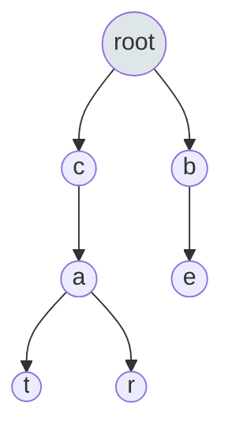

# Trees: Advanced (Trie, Segment Tree, AVL)

## Overview
While basic trees are common, advanced trees solve specific problems efficiently.
*   **Trie (Prefix Tree)**: String search and prefix matching.
*   **Segment Tree**: Range queries (sum, min, max) with updates.
*   **AVL / Red-Black**: Self-balancing BSTs (guarantee O(log n)).

## Fundamentals

### Trie (Prefix Tree)
*   **Structure**: N-ary tree where edges represent characters.
*   **Use Case**: Autocomplete, Spell Checker.
*   **Complexity**: O(L) where L is word length.

### Segment Tree
*   **Structure**: Binary tree where each node represents an interval.
*   **Use Case**: "Sum of elements from index i to j" with frequent updates.
*   **Complexity**: O(log n) for query and update.

## Visual Diagrams

### Trie Structure

*   Stores: "cat", "car", "be"

## Interview Problems

### Problem 1: Implement Trie (Prefix Tree) (Medium)
**Pattern**: Trie Construction

```java
class Trie {
    class TrieNode {
        TrieNode[] children = new TrieNode[26];
        boolean isEnd;
    }
    
    private TrieNode root;

    public Trie() {
        root = new TrieNode();
    }
    
    /** Inserts a word into the trie. Time: O(L) */
    public void insert(String word) {
        TrieNode node = root;
        for (char c : word.toCharArray()) {
            int idx = c - 'a';
            if (node.children[idx] == null) {
                node.children[idx] = new TrieNode();
            }
            node = node.children[idx];
        }
        node.isEnd = true;
    }
    
    /** Returns if the word is in the trie. Time: O(L) */
    public boolean search(String word) {
        TrieNode node = searchPrefix(word);
        return node != null && node.isEnd;
    }
    
    /** Returns if there is any word in the trie that starts with the given prefix. Time: O(L) */
    public boolean startsWith(String prefix) {
        return searchPrefix(prefix) != null;
    }
    
    private TrieNode searchPrefix(String word) {
        TrieNode node = root;
        for (char c : word.toCharArray()) {
            int idx = c - 'a';
            if (node.children[idx] == null) return null;
            node = node.children[idx];
        }
        return node;
    }
}
```

### Problem 2: Word Search II (Hard)
**Pattern**: Trie + Backtracking (DFS)

```java
/**
 * Find all words from the dictionary in the board.
 * Optimization: Build Trie from words, then DFS on board.
 */
public List<String> findWords(char[][] board, String[] words) {
    List<String> res = new ArrayList<>();
    TrieNode root = buildTrie(words);
    
    for (int i = 0; i < board.length; i++) {
        for (int j = 0; j < board[0].length; j++) {
            dfs(board, i, j, root, res);
        }
    }
    return res;
}
// ... (DFS implementation omitted for brevity, but key concept is pruning using Trie)
```

## 🏦 Banking Context: Ticker Symbol Lookup
*   **Scenario**: User types "GO...", system suggests "GOOG", "GOOGL", "GOLD".
*   **Implementation**: A **Trie** is the standard data structure for this low-latency prefix search.
*   **Optimization**: Store "Top K" most popular stocks in each Trie node to return suggestions faster (O(1) after reaching prefix node).

## Common Pitfalls
1.  **Memory Usage**: Tries can consume a lot of memory (pointers).
2.  **Character Set**: Don't assume only 'a'-'z'. If full ASCII, use `Map<Character, Node>` instead of array.

---
**Next**: [Heaps and Priority Queues](09-heaps-and-priority-queues.md)
