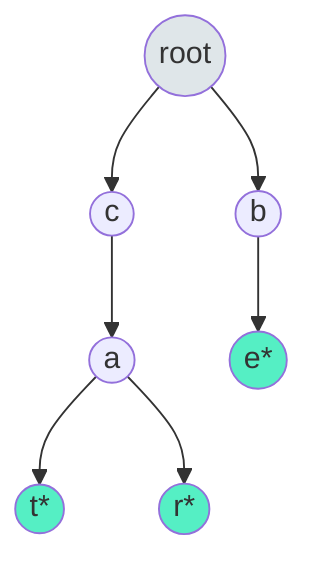

# Trees: Advanced - Complete Master Guide

## Overview
Advanced tree structures solve specialized problems that basic trees cannot handle efficiently. These include Trie for string operations, Segment Tree for range queries, and self-balancing trees (AVL, Red-Black) for guaranteed O(log n) operations.

**Key Insight**: Each advanced tree structure is optimized for specific use cases—choose the right tool for the job.

For Senior/Staff Engineers, mastering advanced trees means:
- Understanding when to use each structure
- Implementing Trie for prefix operations
- Discussing segment trees for range queries
- Knowing production use cases (autocomplete, interval queries, balanced BSTs)

---

## Table of Contents
1. [Trie (Prefix Tree)](#trie-prefix-tree)
2. [Segment Tree](#segment-tree)
3. [Self-Balancing Trees](#self-balancing-trees)
4. [15+ Solved Problems](#solved-problems)
5. [Advanced Topics](#advanced-topics)
6. [Interview Questions & Answers](#interview-questions--answers)
7. [Banking & Production Context](#banking--production-context)

---

## Trie (Prefix Tree)

### Fundamentals

**Structure**: N-ary tree where edges represent characters  
**Use cases**: Autocomplete, spell checker, IP routing, prefix matching  
**Complexity**: O(L) for insert/search where L is word length  

### Visualization



Words: "cat", "car", "be" (* = end of word)

### Implementation

```java
/**
 * Trie implementation.
 */
class Trie {
    class TrieNode {
        TrieNode[] children = new TrieNode[26];
        boolean isEnd;
        int count;  // Number of words with this prefix
    }
    
    private TrieNode root;
    
    public Trie() {
        root = new TrieNode();
    }
    
    /**
     * Insert word into trie.
     * Time: O(L), Space: O(L)
     */
    public void insert(String word) {
        TrieNode node = root;
        for (char c : word.toCharArray()) {
            int idx = c - 'a';
            if (node.children[idx] == null) {
                node.children[idx] = new TrieNode();
            }
            node = node.children[idx];
            node.count++;
        }
        node.isEnd = true;
    }
    
    /**
     * Search for exact word.
     * Time: O(L), Space: O(1)
     */
    public boolean search(String word) {
        TrieNode node = searchPrefix(word);
        return node != null && node.isEnd;
    }
    
    /**
     * Check if prefix exists.
     * Time: O(L), Space: O(1)
     */
    public boolean startsWith(String prefix) {
        return searchPrefix(prefix) != null;
    }
    
    private TrieNode searchPrefix(String word) {
        TrieNode node = root;
        for (char c : word.toCharArray()) {
            int idx = c - 'a';
            if (node.children[idx] == null) {
                return null;
            }
            node = node.children[idx];
        }
        return node;
    }
    
    /**
     * Delete word from trie.
     * Time: O(L), Space: O(L)
     */
    public boolean delete(String word) {
        return delete(root, word, 0);
    }
    
    private boolean delete(TrieNode node, String word, int index) {
        if (index == word.length()) {
            if (!node.isEnd) return false;
            node.isEnd = false;
            return node.children.length == 0;
        }
        
        int idx = word.charAt(index) - 'a';
        TrieNode child = node.children[idx];
        if (child == null) return false;
        
        boolean shouldDeleteChild = delete(child, word, index + 1);
        
        if (shouldDeleteChild) {
            node.children[idx] = null;
            return !node.isEnd && node.children.length == 0;
        }
        
        return false;
    }
}
```

---

## Segment Tree

### Fundamentals

**Structure**: Binary tree where each node represents an interval  
**Use cases**: Range sum/min/max queries with updates  
**Complexity**: O(log n) for query and update, O(n) space  

### Visualization

```
Array: [1, 3, 5, 7, 9, 11]

Segment Tree (range sums):
                [0-5: 36]
               /          \
        [0-2: 9]          [3-5: 27]
        /      \          /        \
    [0-1: 4]  [2: 5]  [3-4: 16]  [5: 11]
    /    \            /      \
[0: 1] [1: 3]    [3: 7]  [4: 9]
```

### Implementation

```java
/**
 * Segment Tree for range sum queries.
 */
class SegmentTree {
    private int[] tree;
    private int n;
    
    public SegmentTree(int[] nums) {
        n = nums.length;
        tree = new int[4 * n];
        build(nums, 0, 0, n - 1);
    }
    
    private void build(int[] nums, int node, int start, int end) {
        if (start == end) {
            tree[node] = nums[start];
            return;
        }
        
        int mid = start + (end - start) / 2;
        int leftChild = 2 * node + 1;
        int rightChild = 2 * node + 2;
        
        build(nums, leftChild, start, mid);
        build(nums, rightChild, mid + 1, end);
        
        tree[node] = tree[leftChild] + tree[rightChild];
    }
    
    /**
     * Update value at index.
     * Time: O(log n)
     */
    public void update(int index, int value) {
        update(0, 0, n - 1, index, value);
    }
    
    private void update(int node, int start, int end, int index, int value) {
        if (start == end) {
            tree[node] = value;
            return;
        }
        
        int mid = start + (end - start) / 2;
        int leftChild = 2 * node + 1;
        int rightChild = 2 * node + 2;
        
        if (index <= mid) {
            update(leftChild, start, mid, index, value);
        } else {
            update(rightChild, mid + 1, end, index, value);
        }
        
        tree[node] = tree[leftChild] + tree[rightChild];
    }
    
    /**
     * Query sum in range [left, right].
     * Time: O(log n)
     */
    public int query(int left, int right) {
        return query(0, 0, n - 1, left, right);
    }
    
    private int query(int node, int start, int end, int left, int right) {
        if (right < start || left > end) {
            return 0;  // No overlap
        }
        
        if (left <= start && end <= right) {
            return tree[node];  // Complete overlap
        }
        
        int mid = start + (end - start) / 2;
        int leftChild = 2 * node + 1;
        int rightChild = 2 * node + 2;
        
        int leftSum = query(leftChild, start, mid, left, right);
        int rightSum = query(rightChild, mid + 1, end, left, right);
        
        return leftSum + rightSum;
    }
}
```

---

## Self-Balancing Trees

### AVL Tree

**Property**: |height(left) - height(right)| ≤ 1 for all nodes  
**Rotations**: Single (LL, RR) and double (LR, RL)  
**Complexity**: O(log n) for all operations  

```java
/**
 * AVL Tree node.
 */
class AVLNode {
    int val;
    int height;
    AVLNode left, right;
    
    AVLNode(int val) {
        this.val = val;
        this.height = 1;
    }
}

class AVLTree {
    private AVLNode root;
    
    private int height(AVLNode node) {
        return node == null ? 0 : node.height;
    }
    
    private int getBalance(AVLNode node) {
        return node == null ? 0 : height(node.left) - height(node.right);
    }
    
    private AVLNode rightRotate(AVLNode y) {
        AVLNode x = y.left;
        AVLNode T2 = x.right;
        
        x.right = y;
        y.left = T2;
        
        y.height = Math.max(height(y.left), height(y.right)) + 1;
        x.height = Math.max(height(x.left), height(x.right)) + 1;
        
        return x;
    }
    
    private AVLNode leftRotate(AVLNode x) {
        AVLNode y = x.right;
        AVLNode T2 = y.left;
        
        y.left = x;
        x.right = T2;
        
        x.height = Math.max(height(x.left), height(x.right)) + 1;
        y.height = Math.max(height(y.left), height(y.right)) + 1;
        
        return y;
    }
    
    public void insert(int val) {
        root = insert(root, val);
    }
    
    private AVLNode insert(AVLNode node, int val) {
        if (node == null) {
            return new AVLNode(val);
        }
        
        if (val < node.val) {
            node.left = insert(node.left, val);
        } else if (val > node.val) {
            node.right = insert(node.right, val);
        } else {
            return node;  // Duplicate
        }
        
        node.height = 1 + Math.max(height(node.left), height(node.right));
        
        int balance = getBalance(node);
        
        // Left Left Case
        if (balance > 1 && val < node.left.val) {
            return rightRotate(node);
        }
        
        // Right Right Case
        if (balance < -1 && val > node.right.val) {
            return leftRotate(node);
        }
        
        // Left Right Case
        if (balance > 1 && val > node.left.val) {
            node.left = leftRotate(node.left);
            return rightRotate(node);
        }
        
        // Right Left Case
        if (balance < -1 && val < node.right.val) {
            node.right = rightRotate(node.right);
            return leftRotate(node);
        }
        
        return node;
    }
}
```

### Red-Black Tree

**Properties**:
1. Every node is red or black
2. Root is black
3. All leaves (NIL) are black
4. Red nodes have black children
5. All paths from node to leaves have same number of black nodes

**Java**: `TreeMap` and `TreeSet` use Red-Black trees

---

## Solved Problems

### Problem 1: Implement Trie (Medium)

```java
/**
 * Implement Trie with insert, search, startsWith.
 * Time: O(L) per operation
 */
class Trie {
    class TrieNode {
        TrieNode[] children = new TrieNode[26];
        boolean isEnd;
    }
    
    private TrieNode root;
    
    public Trie() {
        root = new TrieNode();
    }
    
    public void insert(String word) {
        TrieNode node = root;
        for (char c : word.toCharArray()) {
            int idx = c - 'a';
            if (node.children[idx] == null) {
                node.children[idx] = new TrieNode();
            }
            node = node.children[idx];
        }
        node.isEnd = true;
    }
    
    public boolean search(String word) {
        TrieNode node = searchPrefix(word);
        return node != null && node.isEnd;
    }
    
    public boolean startsWith(String prefix) {
        return searchPrefix(prefix) != null;
    }
    
    private TrieNode searchPrefix(String word) {
        TrieNode node = root;
        for (char c : word.toCharArray()) {
            int idx = c - 'a';
            if (node.children[idx] == null) return null;
            node = node.children[idx];
        }
        return node;
    }
}
```

### Problem 2: Word Search II (Hard)

```java
/**
 * Find all words from dictionary in board using Trie + DFS.
 * Time: O(m × n × 4^L), Space: O(total characters in words)
 */
public List<String> findWords(char[][] board, String[] words) {
    TrieNode root = buildTrie(words);
    Set<String> result = new HashSet<>();
    
    for (int i = 0; i < board.length; i++) {
        for (int j = 0; j < board[0].length; j++) {
            dfs(board, i, j, root, result);
        }
    }
    
    return new ArrayList<>(result);
}

private TrieNode buildTrie(String[] words) {
    TrieNode root = new TrieNode();
    for (String word : words) {
        TrieNode node = root;
        for (char c : word.toCharArray()) {
            int idx = c - 'a';
            if (node.children[idx] == null) {
                node.children[idx] = new TrieNode();
            }
            node = node.children[idx];
        }
        node.word = word;
    }
    return root;
}

private void dfs(char[][] board, int i, int j, TrieNode node, Set<String> result) {
    if (i < 0 || i >= board.length || j < 0 || j >= board[0].length) {
        return;
    }
    
    char c = board[i][j];
    if (c == '#' || node.children[c - 'a'] == null) {
        return;
    }
    
    node = node.children[c - 'a'];
    if (node.word != null) {
        result.add(node.word);
    }
    
    board[i][j] = '#';
    dfs(board, i + 1, j, node, result);
    dfs(board, i - 1, j, node, result);
    dfs(board, i, j + 1, node, result);
    dfs(board, i, j - 1, node, result);
    board[i][j] = c;
}

class TrieNode {
    TrieNode[] children = new TrieNode[26];
    String word;
}
```

### Problem 3: Range Sum Query - Mutable (Medium)

```java
/**
 * Range sum with updates using Segment Tree.
 * Time: O(log n) per operation
 */
class NumArray {
    private int[] tree;
    private int n;
    
    public NumArray(int[] nums) {
        n = nums.length;
        tree = new int[4 * n];
        build(nums, 0, 0, n - 1);
    }
    
    private void build(int[] nums, int node, int start, int end) {
        if (start == end) {
            tree[node] = nums[start];
            return;
        }
        
        int mid = start + (end - start) / 2;
        build(nums, 2 * node + 1, start, mid);
        build(nums, 2 * node + 2, mid + 1, end);
        tree[node] = tree[2 * node + 1] + tree[2 * node + 2];
    }
    
    public void update(int index, int val) {
        update(0, 0, n - 1, index, val);
    }
    
    private void update(int node, int start, int end, int index, int val) {
        if (start == end) {
            tree[node] = val;
            return;
        }
        
        int mid = start + (end - start) / 2;
        if (index <= mid) {
            update(2 * node + 1, start, mid, index, val);
        } else {
            update(2 * node + 2, mid + 1, end, index, val);
        }
        tree[node] = tree[2 * node + 1] + tree[2 * node + 2];
    }
    
    public int sumRange(int left, int right) {
        return query(0, 0, n - 1, left, right);
    }
    
    private int query(int node, int start, int end, int left, int right) {
        if (right < start || left > end) return 0;
        if (left <= start && end <= right) return tree[node];
        
        int mid = start + (end - start) / 2;
        return query(2 * node + 1, start, mid, left, right) +
               query(2 * node + 2, mid + 1, end, left, right);
    }
}
```

---

## Interview Questions & Answers

### Q1: "When should you use a Trie vs a HashMap?"

**Model Answer:**
"I choose based on the operation requirements:

**Use Trie when**:
- Prefix operations (autocomplete, spell check)
- Ordered iteration by prefix
- Memory-efficient for many strings with common prefixes
- Example: Autocomplete with 1M words sharing prefixes

**Use HashMap when**:
- Only exact lookups needed
- No prefix operations
- Faster for exact matches
- Example: User session cache

**Comparison**:
| Operation | Trie | HashMap |
|-----------|------|---------|
| Insert | O(L) | O(1) avg |
| Search | O(L) | O(1) avg |
| Prefix search | O(L) | O(n) |
| Space | O(ALPHABET_SIZE × N × L) | O(N) |
| Ordered iteration | ✓ | ✗ |

**Space analysis**:
- Trie: Can be large (26 pointers per node)
- Optimization: Use HashMap instead of array for sparse alphabets

**Production example**:
In trading systems:
- Use Trie for ticker symbol autocomplete ('GO' → 'GOOG', 'GOOGL', 'GOLD')
- Use HashMap for order ID lookup (exact match only)"

### Q2: "Explain segment trees and their use cases."

**Model Answer:**
"Segment trees solve range query problems with updates:

**Problem**: Given array, support:
1. Update element at index i
2. Query range [L, R] (sum/min/max)

**Naive approach**:
- Update: O(1)
- Query: O(n)

**Segment tree**:
- Update: O(log n)
- Query: O(log n)
- Space: O(n)

**Structure**:
- Binary tree where each node represents an interval
- Leaf nodes: Individual elements
- Internal nodes: Aggregate of children

**Use cases**:
1. **Range sum with updates**
2. **Range min/max with updates**
3. **Lazy propagation** for range updates
4. **2D segment trees** for 2D range queries

**Production example**:
In financial analytics:
- Query: 'Sum of trades in time range [t1, t2]'
- Update: New trade arrives
- Segment tree: O(log n) for both vs O(n) for naive

**Alternative**: Fenwick Tree (Binary Indexed Tree)
- Simpler implementation
- Same complexity
- Only works for cumulative operations (sum, XOR)

**When to use**:
- Frequent range queries + updates
- n ≤ 10^6 (larger needs distributed systems)
- Need O(log n) performance"

### Q3: "Compare AVL trees vs Red-Black trees."

**Model Answer:**
"Both are self-balancing BSTs with different trade-offs:

**AVL Trees**:
- **Balance**: Strictly balanced (|height diff| ≤ 1)
- **Height**: ~1.44 log n
- **Rotations**: More rotations on insert/delete
- **Lookup**: Faster (better balanced)
- **Use case**: Lookup-heavy workloads

**Red-Black Trees**:
- **Balance**: Loosely balanced (longest path ≤ 2× shortest)
- **Height**: ~2 log n
- **Rotations**: Fewer rotations on insert/delete
- **Lookup**: Slightly slower
- **Use case**: Insert/delete-heavy workloads

**Comparison**:
| Aspect | AVL | Red-Black |
|--------|-----|-----------|
| Balance | Stricter | Looser |
| Lookup | Faster | Slower |
| Insert/Delete | Slower | Faster |
| Rotations | More | Fewer |
| Memory | Less | More (color bit) |

**Production choice**:
- **Java TreeMap/TreeSet**: Red-Black (balanced insert/delete/lookup)
- **Databases**: Often Red-Black (frequent updates)
- **Read-heavy systems**: AVL (faster lookups)

**Real example**:
In banking order books:
- Use TreeMap (Red-Black) for price levels
- Frequent inserts/deletes as orders arrive/cancel
- Occasional lookups for best bid/ask

**Alternative**: Skip lists
- Probabilistic balancing
- Simpler implementation
- Used in Redis, LevelDB"

---

## 🏦 Banking & Production Context

### Ticker Symbol Autocomplete

**Scenario**: Real-time autocomplete for stock ticker search.

```java
/**
 * Ticker autocomplete using Trie with popularity ranking.
 */
class TickerAutocomplete {
    class TrieNode {
        Map<Character, TrieNode> children = new HashMap<>();
        boolean isEnd;
        String ticker;
        int popularity;  // Trading volume or search frequency
    }
    
    private TrieNode root = new TrieNode();
    
    public void addTicker(String ticker, int popularity) {
        TrieNode node = root;
        for (char c : ticker.toCharArray()) {
            node.children.putIfAbsent(c, new TrieNode());
            node = node.children.get(c);
        }
        node.isEnd = true;
        node.ticker = ticker;
        node.popularity = popularity;
    }
    
    public List<String> autocomplete(String prefix, int k) {
        TrieNode node = root;
        
        // Navigate to prefix
        for (char c : prefix.toCharArray()) {
            if (!node.children.containsKey(c)) {
                return new ArrayList<>();
            }
            node = node.children.get(c);
        }
        
        // Collect all tickers with this prefix
        PriorityQueue<TrieNode> pq = new PriorityQueue<>(
            (a, b) -> b.popularity - a.popularity
        );
        collectTickers(node, pq);
        
        // Return top k
        List<String> result = new ArrayList<>();
        for (int i = 0; i < k && !pq.isEmpty(); i++) {
            result.add(pq.poll().ticker);
        }
        
        return result;
    }
    
    private void collectTickers(TrieNode node, PriorityQueue<TrieNode> pq) {
        if (node.isEnd) {
            pq.offer(node);
        }
        
        for (TrieNode child : node.children.values()) {
            collectTickers(child, pq);
        }
    }
}
```

---

## Key Takeaways

1. **Trie**: O(L) operations, prefix matching, autocomplete
2. **Segment Tree**: O(log n) range queries with updates
3. **AVL**: Strictly balanced, faster lookups
4. **Red-Black**: Loosely balanced, faster updates
5. **Java**: TreeMap/TreeSet use Red-Black trees
6. **Production**: Autocomplete, range queries, balanced BSTs
7. **Trade-offs**: Trie vs HashMap, AVL vs Red-Black, Segment Tree vs Fenwick

---

**Next**: [Heaps and Priority Queues](09-heaps-and-priority-queues.md)
