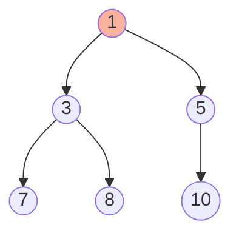

# Heaps and Priority Queues

## Overview
A Heap is a specialized tree-based data structure that satisfies the heap property:
*   **Min Heap**: Parent <= Children (Root is minimum).
*   **Max Heap**: Parent >= Children (Root is maximum).
*   It allows O(1) access to the min/max element and O(log n) insertion/deletion.

## Fundamentals

### Java Implementation
*   `PriorityQueue<E>` in Java is a **Min Heap** by default.
*   For **Max Heap**: `new PriorityQueue<>(Collections.reverseOrder())`.

### Operations and Complexity

| Operation | Binary Heap | Sorted Array | Unsorted Array |
|-----------|-------------|--------------|----------------|
| Insert    | O(log n)    | O(n)         | O(1)           |
| Delete Min| O(log n)    | O(n)         | O(n)           |
| Find Min  | O(1)        | O(1)         | O(n)           |

## Common Patterns

### 1. Top K Elements
Find the K largest/smallest elements.
*   **Pattern**: Use a Min Heap of size K to keep track of the K largest elements seen so far.
*   **Complexity**: O(N log K).

### 2. Merge K Sorted Lists
*   **Pattern**: Put head of each list into Min Heap.

### 3. Two Heaps (Median)
*   **Pattern**: Maintain a Max Heap (lower half) and Min Heap (upper half) to find median in O(1).

## Visual Diagrams

### Min Heap Structure (Array Representation)

*   Array: `[1, 3, 5, 7, 8, 10]`
*   Parent of `i`: `(i-1)/2`
*   Left Child: `2*i + 1`
*   Right Child: `2*i + 2`

## Interview Problems

### Problem 1: Kth Largest Element in an Array (Medium)
**Pattern**: Min Heap (or QuickSelect)

```java
/**
 * Find the kth largest element.
 * Time: O(N log K)
 * Space: O(K)
 */
public int findKthLargest(int[] nums, int k) {
    PriorityQueue<Integer> minHeap = new PriorityQueue<>();
    
    for (int num : nums) {
        minHeap.offer(num);
        if (minHeap.size() > k) {
            minHeap.poll(); // Remove smallest of the top k+1
        }
    }
    
    return minHeap.peek();
}
```

### Problem 2: Find Median from Data Stream (Hard)
**Pattern**: Two Heaps

```java
class MedianFinder {
    private PriorityQueue<Integer> maxHeap; // Lower half
    private PriorityQueue<Integer> minHeap; // Upper half

    public MedianFinder() {
        maxHeap = new PriorityQueue<>((a, b) -> b - a);
        minHeap = new PriorityQueue<>();
    }
    
    public void addNum(int num) {
        maxHeap.offer(num);
        minHeap.offer(maxHeap.poll());
        
        if (maxHeap.size() < minHeap.size()) {
            maxHeap.offer(minHeap.poll());
        }
    }
    
    public double findMedian() {
        if (maxHeap.size() == minHeap.size()) {
            return (maxHeap.peek() + minHeap.peek()) / 2.0;
        }
        return maxHeap.peek();
    }
}
```

## 🏦 Banking Context: Order Matching Engine
*   **Scenario**: Matching Buy orders (Bids) with Sell orders (Asks).
*   **Structure**:
    *   **Buy Orders**: Max Heap (Highest price has priority).
    *   **Sell Orders**: Min Heap (Lowest price has priority).
*   **Algorithm**: While `MaxBuy >= MinSell`, execute trade.
*   **Performance**: This is the core of any exchange (NASDAQ, NYSE). O(log N) matching is crucial.

## Common Pitfalls
1.  **Comparator Confusion**: Remember `(a, b) -> a - b` is Min Heap (Ascending), `(a, b) -> b - a` is Max Heap (Descending).
2.  **Removing Arbitrary Element**: `remove(Object o)` is O(n) in Java's PriorityQueue! Only `poll()` is O(log n). If you need O(log n) removal of arbitrary nodes, you need a `TreeSet` or a custom Heap with a HashMap index.

---
**Next**: [Hash Tables](10-hash-tables.md)
