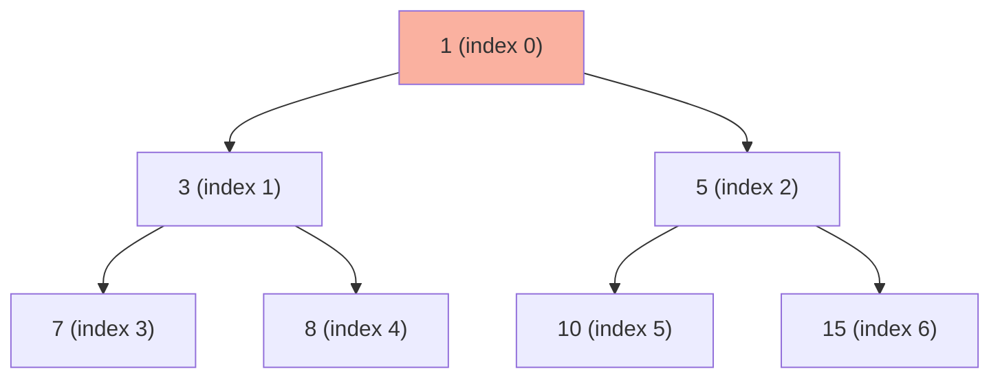

# Heaps and Priority Queues: Complete Master Guide

## Overview
Heaps are specialized tree-based data structures that maintain a **heap property**: in a min heap, every parent is smaller than its children; in a max heap, every parent is larger. This enables **O(1) access to min/max** and **O(log n) insertion/deletion**, making heaps essential for priority-based algorithms.

**Key Insight**: Heaps are the implementation behind Priority Queues, used in Dijkstra's algorithm, Huffman coding, task scheduling, and "Top K" problems.

For Senior/Staff Engineers, mastering heaps means:
- Understanding heap operations and complexity
- Recognizing "Top K" and "Two Heaps" patterns
- Implementing heap-based algorithms (Dijkstra, Heap Sort)
- Discussing production use cases (order matching, task scheduling)

---

## Table of Contents
1. [Fundamentals](#fundamentals)
2. [Heap Operations](#heap-operations)
3. [Common Patterns](#common-patterns)
4. [15+ Solved Problems](#solved-problems)
5. [Advanced Topics](#advanced-topics)
6. [Interview Questions & Answers](#interview-questions--answers)
7. [Banking & Production Context](#banking--production-context)

---

## Fundamentals

### What is a Heap?

**Definition**: A complete binary tree where every node satisfies the heap property.

**Min Heap**: Parent ≤ Children (root is minimum)
**Max Heap**: Parent ≥ Children (root is maximum)

**Complete Binary Tree**: All levels filled except possibly the last, which fills left-to-right.

### Array Representation

**Key insight**: Heaps are stored in arrays, not pointer-based trees!

```
Array: [1, 3, 5, 7, 8, 10, 15]

Tree representation:
       1
      / \
     3   5
    / \ / \
   7  8 10 15
```

**Index relationships**:
- Parent of `i`: `(i - 1) / 2`
- Left child of `i`: `2 * i + 1`
- Right child of `i`: `2 * i + 2`

### Visualization



---

## Heap Operations

### Insert (Bubble Up)

**Algorithm**:
1. Add element at end of array
2. Bubble up: swap with parent if heap property violated
3. Repeat until heap property satisfied

**Time**: O(log n)

```java
public void insert(int value) {
    heap.add(value);
    int index = heap.size() - 1;
    
    // Bubble up
    while (index > 0) {
        int parentIndex = (index - 1) / 2;
        if (heap.get(index) >= heap.get(parentIndex)) break;  // Min heap
        
        swap(index, parentIndex);
        index = parentIndex;
    }
}
```

### Extract Min/Max (Bubble Down)

**Algorithm**:
1. Save root value (min/max)
2. Move last element to root
3. Bubble down: swap with smaller child if heap property violated
4. Repeat until heap property satisfied

**Time**: O(log n)

```java
public int extractMin() {
    if (heap.isEmpty()) throw new NoSuchElementException();
    
    int min = heap.get(0);
    int last = heap.remove(heap.size() - 1);
    
    if (!heap.isEmpty()) {
        heap.set(0, last);
        bubbleDown(0);
    }
    
    return min;
}

private void bubbleDown(int index) {
    while (true) {
        int smallest = index;
        int left = 2 * index + 1;
        int right = 2 * index + 2;
        
        if (left < heap.size() && heap.get(left) < heap.get(smallest)) {
            smallest = left;
        }
        if (right < heap.size() && heap.get(right) < heap.get(smallest)) {
            smallest = right;
        }
        
        if (smallest == index) break;
        
        swap(index, smallest);
        index = smallest;
    }
}
```

### Peek

**Algorithm**: Return root without removing.

**Time**: O(1)

```java
public int peek() {
    if (heap.isEmpty()) throw new NoSuchElementException();
    return heap.get(0);
}
```

### Heapify (Build Heap)

**Algorithm**: Convert unsorted array to heap in O(n).

**Key insight**: Start from last non-leaf node, bubble down each.

```java
public void heapify(int[] arr) {
    heap = new ArrayList<>();
    for (int num : arr) heap.add(num);
    
    // Start from last non-leaf node
    for (int i = (heap.size() / 2) - 1; i >= 0; i--) {
        bubbleDown(i);
    }
}
```

**Why O(n)?** Most nodes are near bottom (few swaps), only top nodes need many swaps.

---

## Java PriorityQueue

### Basic Usage

```java
// Min heap (default)
PriorityQueue<Integer> minHeap = new PriorityQueue<>();

// Max heap
PriorityQueue<Integer> maxHeap = new PriorityQueue<>(Collections.reverseOrder());
// Or: new PriorityQueue<>((a, b) -> b - a);

// Custom comparator
PriorityQueue<int[]> pq = new PriorityQueue<>((a, b) -> a[0] - b[0]);

// Operations
minHeap.offer(5);      // Insert - O(log n)
int min = minHeap.poll();  // Extract min - O(log n)
int peek = minHeap.peek(); // View min - O(1)
```

### Comparator Patterns

```java
// Min heap (ascending)
(a, b) -> a - b
Integer::compare

// Max heap (descending)
(a, b) -> b - a
Collections.reverseOrder()

// Custom object
(a, b) -> {
    if (a.priority != b.priority) return a.priority - b.priority;
    return a.timestamp - b.timestamp;
}
```

---

## Common Patterns

### Pattern 1: Top K Elements

**Problem**: Find K largest/smallest elements.

**Strategy**: Use heap of size K.
- K largest: Min heap (remove smallest when size > K)
- K smallest: Max heap (remove largest when size > K)

```java
/**
 * Find K largest elements.
 * Time: O(n log k), Space: O(k)
 */
public int[] topKLargest(int[] nums, int k) {
    PriorityQueue<Integer> minHeap = new PriorityQueue<>();
    
    for (int num : nums) {
        minHeap.offer(num);
        if (minHeap.size() > k) {
            minHeap.poll();  // Remove smallest
        }
    }
    
    int[] result = new int[k];
    for (int i = k - 1; i >= 0; i--) {
        result[i] = minHeap.poll();
    }
    return result;
}
```

### Pattern 2: Two Heaps (Median)

**Problem**: Find median of data stream.

**Strategy**: 
- Max heap: Lower half of numbers
- Min heap: Upper half of numbers
- Median: Middle element(s)

```java
class MedianFinder {
    private PriorityQueue<Integer> maxHeap;  // Lower half
    private PriorityQueue<Integer> minHeap;  // Upper half
    
    public MedianFinder() {
        maxHeap = new PriorityQueue<>(Collections.reverseOrder());
        minHeap = new PriorityQueue<>();
    }
    
    public void addNum(int num) {
        // Always add to maxHeap first
        maxHeap.offer(num);
        
        // Balance: move largest from maxHeap to minHeap
        minHeap.offer(maxHeap.poll());
        
        // Ensure maxHeap has equal or one more element
        if (maxHeap.size() < minHeap.size()) {
            maxHeap.offer(minHeap.poll());
        }
    }
    
    public double findMedian() {
        if (maxHeap.size() == minHeap.size()) {
            return (maxHeap.peek() + minHeap.peek()) / 2.0;
        }
        return maxHeap.peek();
    }
}
```

### Pattern 3: Merge K Sorted Lists

**Problem**: Merge K sorted linked lists.

**Strategy**: Use min heap to track smallest element from each list.

```java
/**
 * Merge K sorted lists.
 * Time: O(n log k), Space: O(k)
 */
public ListNode mergeKLists(ListNode[] lists) {
    PriorityQueue<ListNode> minHeap = new PriorityQueue<>(
        (a, b) -> a.val - b.val
    );
    
    // Add first node from each list
    for (ListNode list : lists) {
        if (list != null) {
            minHeap.offer(list);
        }
    }
    
    ListNode dummy = new ListNode(0);
    ListNode current = dummy;
    
    while (!minHeap.isEmpty()) {
        ListNode node = minHeap.poll();
        current.next = node;
        current = current.next;
        
        if (node.next != null) {
            minHeap.offer(node.next);
        }
    }
    
    return dummy.next;
}
```

---

## Solved Problems

### Problem 1: Kth Largest Element (Medium)

```java
/**
 * Find kth largest element.
 * Time: O(n log k), Space: O(k)
 */
public int findKthLargest(int[] nums, int k) {
    PriorityQueue<Integer> minHeap = new PriorityQueue<>();
    
    for (int num : nums) {
        minHeap.offer(num);
        if (minHeap.size() > k) {
            minHeap.poll();
        }
    }
    
    return minHeap.peek();
}
```

### Problem 2: Top K Frequent Elements (Medium)

```java
/**
 * Find k most frequent elements.
 * Time: O(n log k), Space: O(n)
 */
public int[] topKFrequent(int[] nums, int k) {
    Map<Integer, Integer> freq = new HashMap<>();
    for (int num : nums) {
        freq.put(num, freq.getOrDefault(num, 0) + 1);
    }
    
    PriorityQueue<int[]> minHeap = new PriorityQueue<>(
        (a, b) -> a[1] - b[1]  // Sort by frequency
    );
    
    for (Map.Entry<Integer, Integer> entry : freq.entrySet()) {
        minHeap.offer(new int[]{entry.getKey(), entry.getValue()});
        if (minHeap.size() > k) {
            minHeap.poll();
        }
    }
    
    int[] result = new int[k];
    for (int i = 0; i < k; i++) {
        result[i] = minHeap.poll()[0];
    }
    return result;
}
```

### Problem 3: Kth Smallest Element in Sorted Matrix (Medium)

```java
/**
 * Find kth smallest in n×n matrix where each row/col is sorted.
 * Time: O(k log n), Space: O(n)
 */
public int kthSmallest(int[][] matrix, int k) {
    int n = matrix.length;
    PriorityQueue<int[]> minHeap = new PriorityQueue<>(
        (a, b) -> a[0] - b[0]  // Compare values
    );
    
    // Add first element from each row
    for (int i = 0; i < Math.min(n, k); i++) {
        minHeap.offer(new int[]{matrix[i][0], i, 0});
    }
    
    int result = 0;
    for (int i = 0; i < k; i++) {
        int[] curr = minHeap.poll();
        result = curr[0];
        int row = curr[1];
        int col = curr[2];
        
        if (col + 1 < n) {
            minHeap.offer(new int[]{matrix[row][col + 1], row, col + 1});
        }
    }
    
    return result;
}
```

### Problem 4: Meeting Rooms II (Medium)

```java
/**
 * Minimum meeting rooms needed.
 * Time: O(n log n), Space: O(n)
 */
public int minMeetingRooms(int[][] intervals) {
    Arrays.sort(intervals, (a, b) -> a[0] - b[0]);
    
    PriorityQueue<Integer> minHeap = new PriorityQueue<>();  // End times
    
    for (int[] interval : intervals) {
        if (!minHeap.isEmpty() && interval[0] >= minHeap.peek()) {
            minHeap.poll();  // Reuse room
        }
        minHeap.offer(interval[1]);  // Add end time
    }
    
    return minHeap.size();
}
```

### Problem 5: Task Scheduler (Medium)

```java
/**
 * Minimum time to complete tasks with cooldown.
 * Time: O(n), Space: O(1)
 */
public int leastInterval(char[] tasks, int n) {
    int[] freq = new int[26];
    for (char task : tasks) {
        freq[task - 'A']++;
    }
    
    PriorityQueue<Integer> maxHeap = new PriorityQueue<>(Collections.reverseOrder());
    for (int f : freq) {
        if (f > 0) maxHeap.offer(f);
    }
    
    int time = 0;
    
    while (!maxHeap.isEmpty()) {
        List<Integer> temp = new ArrayList<>();
        
        for (int i = 0; i <= n; i++) {
            if (!maxHeap.isEmpty()) {
                int count = maxHeap.poll();
                if (count > 1) {
                    temp.add(count - 1);
                }
            }
            time++;
            
            if (maxHeap.isEmpty() && temp.isEmpty()) {
                break;
            }
        }
        
        for (int count : temp) {
            maxHeap.offer(count);
        }
    }
    
    return time;
}
```

### Problem 6: Reorganize String (Medium)

```java
/**
 * Reorganize string so no two adjacent characters are same.
 * Time: O(n log k), Space: O(k) where k is unique characters
 */
public String reorganizeString(String s) {
    Map<Character, Integer> freq = new HashMap<>();
    for (char c : s.toCharArray()) {
        freq.put(c, freq.getOrDefault(c, 0) + 1);
    }
    
    PriorityQueue<char[]> maxHeap = new PriorityQueue<>(
        (a, b) -> b[1] - a[1]  // Sort by frequency
    );
    
    for (Map.Entry<Character, Integer> entry : freq.entrySet()) {
        maxHeap.offer(new char[]{entry.getKey(), entry.getValue()});
    }
    
    StringBuilder result = new StringBuilder();
    char[] prev = null;
    
    while (!maxHeap.isEmpty()) {
        char[] curr = maxHeap.poll();
        result.append(curr[0]);
        curr[1]--;
        
        if (prev != null && prev[1] > 0) {
            maxHeap.offer(prev);
        }
        
        prev = curr;
    }
    
    return result.length() == s.length() ? result.toString() : "";
}
```

### Problem 7: Sliding Window Maximum (Hard)

```java
/**
 * Maximum in each sliding window.
 * Time: O(n), Space: O(k) - using deque, not heap
 */
public int[] maxSlidingWindow(int[] nums, int k) {
    Deque<Integer> deque = new ArrayDeque<>();  // Stores indices
    int[] result = new int[nums.length - k + 1];
    
    for (int i = 0; i < nums.length; i++) {
        // Remove elements outside window
        while (!deque.isEmpty() && deque.peekFirst() < i - k + 1) {
            deque.pollFirst();
        }
        
        // Remove smaller elements
        while (!deque.isEmpty() && nums[deque.peekLast()] < nums[i]) {
            deque.pollLast();
        }
        
        deque.offerLast(i);
        
        if (i >= k - 1) {
            result[i - k + 1] = nums[deque.peekFirst()];
        }
    }
    
    return result;
}
```

---

## Advanced Topics

### Heap Sort

**Algorithm**: Build max heap, repeatedly extract max.

**Time**: O(n log n), **Space**: O(1) in-place

```java
public void heapSort(int[] arr) {
    // Build max heap
    for (int i = arr.length / 2 - 1; i >= 0; i--) {
        heapify(arr, arr.length, i);
    }
    
    // Extract elements one by one
    for (int i = arr.length - 1; i > 0; i--) {
        swap(arr, 0, i);
        heapify(arr, i, 0);
    }
}

private void heapify(int[] arr, int n, int i) {
    int largest = i;
    int left = 2 * i + 1;
    int right = 2 * i + 2;
    
    if (left < n && arr[left] > arr[largest]) largest = left;
    if (right < n && arr[right] > arr[largest]) largest = right;
    
    if (largest != i) {
        swap(arr, i, largest);
        heapify(arr, n, largest);
    }
}
```

### Fibonacci Heap

**Advanced heap** with better amortized complexity:
- Insert: O(1)
- Decrease key: O(1) amortized
- Extract min: O(log n) amortized

**Use case**: Dijkstra's algorithm, Prim's MST

---

## Interview Questions & Answers

### Q1: "Why use a min heap of size K for finding K largest elements?"

**Model Answer:**
"Using a min heap of size K is more efficient than using a max heap of size N.

**Min heap approach** (optimal):
- Maintain heap of K largest elements seen so far
- When heap size > K, remove smallest (heap root)
- Time: O(n log k), Space: O(k)

**Why it works**: The smallest element in our K-sized heap is the Kth largest overall. Any element smaller than this can't be in top K.

**Max heap approach** (suboptimal):
- Add all elements to max heap
- Extract max K times
- Time: O(n log n), Space: O(n)

**Comparison**:
- For n=1,000,000 and k=10:
  - Min heap: O(1M × log 10) ≈ 3.3M operations
  - Max heap: O(1M × log 1M) ≈ 20M operations

In production systems like real-time analytics, this difference is critical. For example, finding top 100 trending stocks from millions of trades—min heap is 100x more space-efficient."

### Q2: "Explain the two heaps pattern for finding median."

**Model Answer:**
"The two heaps pattern maintains median in O(1) time with O(log n) insertions:

**Structure**:
- Max heap: Lower half of numbers (largest at top)
- Min heap: Upper half of numbers (smallest at top)
- Invariant: |maxHeap.size() - minHeap.size()| ≤ 1

**Finding median**:
- If sizes equal: (maxHeap.peek() + minHeap.peek()) / 2
- If maxHeap larger: maxHeap.peek()

**Insertion**:
1. Add to maxHeap
2. Move largest from maxHeap to minHeap
3. Balance if minHeap becomes larger

**Why it works**: Median is always at the 'boundary' between the two heaps.

**Example**:
```
Numbers: [1, 3, 5, 7, 9]
MaxHeap (lower): [3, 1]  (max at top)
MinHeap (upper): [5, 7, 9]  (min at top)
Median: 5 (minHeap.peek())
```

This pattern is used in streaming analytics in banking—calculating median transaction amount in real-time without storing all transactions."

### Q3: "What's the time complexity of building a heap from an unsorted array?"

**Model Answer:**
"Building a heap from an unsorted array is **O(n)**, not O(n log n) as many assume.

**Naive approach** (O(n log n)):
- Insert elements one by one: n × O(log n)

**Heapify approach** (O(n)):
- Start from last non-leaf node
- Bubble down each node
- Work backwards to root

**Why O(n)?**
Most nodes are near the bottom and require few swaps:
- Bottom level (n/2 nodes): 0 swaps
- Next level (n/4 nodes): 1 swap max
- Next level (n/8 nodes): 2 swaps max
- ...
- Root (1 node): log n swaps

**Mathematical proof**:
```
T(n) = Σ(height × nodes at height)
     = 0×(n/2) + 1×(n/4) + 2×(n/8) + ... + log n×1
     = n × Σ(i/2^i) where i=0 to log n
     = n × 2 = O(n)
```

This is why `PriorityQueue(Collection)` constructor is O(n), not O(n log n). In production, when initializing a priority queue with existing data, always use the constructor rather than repeated insertions."

---

## 🏦 Banking & Production Context

### Order Matching Engine

**Scenario**: Match buy/sell orders in trading system.

```java
/**
 * Order matching engine using two heaps.
 */
class OrderMatchingEngine {
    private PriorityQueue<Order> buyOrders;   // Max heap (highest price)
    private PriorityQueue<Order> sellOrders;  // Min heap (lowest price)
    
    public OrderMatchingEngine() {
        buyOrders = new PriorityQueue<>((a, b) -> 
            Double.compare(b.price, a.price));  // Descending
        sellOrders = new PriorityQueue<>((a, b) -> 
            Double.compare(a.price, b.price));  // Ascending
    }
    
    public void addOrder(Order order) {
        if (order.type == OrderType.BUY) {
            buyOrders.offer(order);
        } else {
            sellOrders.offer(order);
        }
        
        matchOrders();
    }
    
    private void matchOrders() {
        while (!buyOrders.isEmpty() && !sellOrders.isEmpty()) {
            Order buy = buyOrders.peek();
            Order sell = sellOrders.peek();
            
            if (buy.price >= sell.price) {
                // Execute trade
                int quantity = Math.min(buy.quantity, sell.quantity);
                executeTrade(buy, sell, quantity, sell.price);
                
                buy.quantity -= quantity;
                sell.quantity -= quantity;
                
                if (buy.quantity == 0) buyOrders.poll();
                if (sell.quantity == 0) sellOrders.poll();
            } else {
                break;  // No match possible
            }
        }
    }
}
```

### Task Scheduling

**Scenario**: Schedule tasks by priority and deadline.

```java
/**
 * Priority-based task scheduler.
 */
class TaskScheduler {
    private PriorityQueue<Task> taskQueue;
    
    public TaskScheduler() {
        taskQueue = new PriorityQueue<>((a, b) -> {
            if (a.priority != b.priority) {
                return b.priority - a.priority;  // Higher priority first
            }
            return a.deadline - b.deadline;  // Earlier deadline first
        });
    }
    
    public void addTask(Task task) {
        taskQueue.offer(task);
    }
    
    public Task getNextTask() {
        return taskQueue.poll();
    }
}
```

---

## Key Takeaways

1. **Heap property**: Min heap (parent ≤ children), Max heap (parent ≥ children)
2. **Array representation**: Parent at `(i-1)/2`, children at `2i+1` and `2i+2`
3. **Operations**: Insert/Extract O(log n), Peek O(1), Heapify O(n)
4. **Top K pattern**: Use heap of size K (min heap for K largest)
5. **Two heaps pattern**: Find median in O(1) with O(log n) insertions
6. **Java PriorityQueue**: Min heap by default, use comparator for max heap
7. **Production**: Order matching, task scheduling, real-time analytics

---

**Next**: [Hash Tables](10-hash-tables.md)
