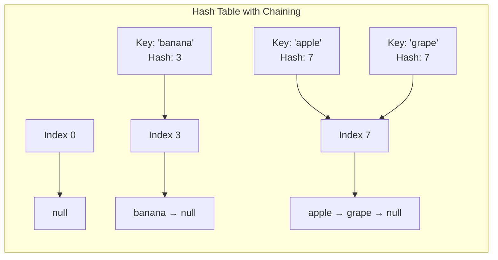

# Hash Tables: Complete Master Guide

## Overview
Hash Tables (Hash Maps) are the **most frequently used** data structure in coding interviews and production systems. They provide **O(1) average-case** time complexity for insertion, deletion, and lookup, making them essential for optimization.

For Senior/Staff Engineers, mastering hash tables means:
- Understanding collision resolution (chaining vs open addressing)
- Knowing when to use HashMap vs TreeMap vs LinkedHashMap
- Implementing custom hash functions
- Discussing distributed hashing (consistent hashing, sharding)
- Recognizing hash table patterns instantly

**Key Insight**: Hash tables trade space for time—use extra memory to achieve O(1) lookups.

---

## Table of Contents
1. [Fundamentals](#fundamentals)
2. [Java Implementation Details](#java-implementation-details)
3. [Common Patterns](#common-patterns)
4. [15+ Solved Problems](#solved-problems)
5. [Advanced Topics](#advanced-topics)
6. [Interview Questions & Answers](#interview-questions--answers)
7. [Banking & Production Context](#banking--production-context)

---

## Fundamentals

### How Hash Tables Work

**Core concept**: Map keys to array indices using a hash function.

**Steps**:
1. **Hash function**: `hash(key) → integer`
2. **Compression**: `index = hash % array.length`
3. **Store**: `array[index] = value`

**Example**:
```
key = "apple"
hash("apple") = 193487 (some large number)
index = 193487 % 16 = 7
array[7] = "red"
```

### Collision Resolution

**Problem**: Two keys hash to same index.

**Solution 1: Chaining (Java's approach)**
- Each bucket contains a linked list (or tree)
- Multiple entries can exist at same index

**Solution 2: Open Addressing**
- Find next available slot using probing
- Linear probing: try index+1, index+2, ...
- Quadratic probing: try index+1², index+2², ...

### Visualization



---

## Java Implementation Details

### HashMap Internals

**Structure** (Java 8+):
- Array of buckets (default size: 16)
- Each bucket: Linked List → Red-Black Tree (when > 8 elements)
- Load factor: 0.75 (resize when 75% full)

**Key methods**:
```java
HashMap<String, Integer> map = new HashMap<>();

// Put: O(1) average, O(log n) worst case (tree)
map.put("key", 1);

// Get: O(1) average
int value = map.get("key");

// GetOrDefault: Avoid null checks
int value = map.getOrDefault("key", 0);

// PutIfAbsent: Only insert if key doesn't exist
map.putIfAbsent("key", 1);

// Compute: Update based on current value
map.compute("key", (k, v) -> v == null ? 1 : v + 1);

// Merge: Combine values
map.merge("key", 1, Integer::sum);  // Increment by 1
```

### HashMap vs TreeMap vs LinkedHashMap

| Feature | HashMap | TreeMap | LinkedHashMap |
|---------|---------|---------|---------------|
| **Ordering** | None | Sorted by key | Insertion order |
| **Get/Put** | O(1) avg | O(log n) | O(1) avg |
| **Iteration** | Random | Sorted | Insertion order |
| **Null keys** | 1 allowed | Not allowed | 1 allowed |
| **Use case** | General purpose | Sorted keys needed | LRU cache |

### HashSet Internals

**Key insight**: HashSet is backed by HashMap!

```java
// HashSet implementation (simplified)
public class HashSet<E> {
    private HashMap<E, Object> map;
    private static final Object PRESENT = new Object();
    
    public boolean add(E e) {
        return map.put(e, PRESENT) == null;
    }
    
    public boolean contains(E e) {
        return map.containsKey(e);
    }
}
```

---

## Common Patterns

### Pattern 1: Frequency Map

**Use case**: Count occurrences.

```java
/**
 * Count character frequencies.
 */
public Map<Character, Integer> countFrequencies(String s) {
    Map<Character, Integer> freq = new HashMap<>();
    
    for (char c : s.toCharArray()) {
        freq.put(c, freq.getOrDefault(c, 0) + 1);
        // Or: freq.merge(c, 1, Integer::sum);
    }
    
    return freq;
}
```

### Pattern 2: Two Sum / Complement Pattern

**Use case**: Find pair that sums to target.

```java
/**
 * Two Sum pattern.
 * Time: O(n), Space: O(n)
 */
public int[] twoSum(int[] nums, int target) {
    Map<Integer, Integer> map = new HashMap<>();
    
    for (int i = 0; i < nums.length; i++) {
        int complement = target - nums[i];
        
        if (map.containsKey(complement)) {
            return new int[] { map.get(complement), i };
        }
        
        map.put(nums[i], i);
    }
    
    throw new IllegalArgumentException("No solution");
}
```

### Pattern 3: Deduplication

**Use case**: Remove duplicates.

```java
/**
 * Remove duplicates using HashSet.
 */
public List<Integer> removeDuplicates(int[] nums) {
    Set<Integer> seen = new HashSet<>();
    List<Integer> result = new ArrayList<>();
    
    for (int num : nums) {
        if (seen.add(num)) {  // add() returns false if already exists
            result.add(num);
        }
    }
    
    return result;
}
```

### Pattern 4: Grouping / Anagrams

**Use case**: Group items by some property.

```java
/**
 * Group anagrams.
 * Time: O(n × k log k), where k is max string length
 */
public List<List<String>> groupAnagrams(String[] strs) {
    Map<String, List<String>> map = new HashMap<>();
    
    for (String str : strs) {
        char[] chars = str.toCharArray();
        Arrays.sort(chars);
        String key = new String(chars);
        
        map.computeIfAbsent(key, k -> new ArrayList<>()).add(str);
    }
    
    return new ArrayList<>(map.values());
}
```

---

## Solved Problems

### Problem 1: Two Sum (Easy)

```java
/**
 * Find indices of two numbers that sum to target.
 * Time: O(n), Space: O(n)
 */
public int[] twoSum(int[] nums, int target) {
    Map<Integer, Integer> map = new HashMap<>();
    
    for (int i = 0; i < nums.length; i++) {
        int complement = target - nums[i];
        
        if (map.containsKey(complement)) {
            return new int[] { map.get(complement), i };
        }
        
        map.put(nums[i], i);
    }
    
    throw new IllegalArgumentException("No solution");
}
```

### Problem 2: Longest Consecutive Sequence (Medium)

```java
/**
 * Find length of longest consecutive sequence.
 * Time: O(n), Space: O(n)
 */
public int longestConsecutive(int[] nums) {
    Set<Integer> set = new HashSet<>();
    for (int num : nums) {
        set.add(num);
    }
    
    int longest = 0;
    
    for (int num : set) {
        // Only start counting if num is the start of a sequence
        if (!set.contains(num - 1)) {
            int currentNum = num;
            int currentStreak = 1;
            
            while (set.contains(currentNum + 1)) {
                currentNum++;
                currentStreak++;
            }
            
            longest = Math.max(longest, currentStreak);
        }
    }
    
    return longest;
}
```

**Why O(n)?** Each number is visited at most twice (once in outer loop, once in while loop).

### Problem 3: Subarray Sum Equals K (Medium)

```java
/**
 * Count subarrays with sum = k.
 * Time: O(n), Space: O(n)
 */
public int subarraySum(int[] nums, int k) {
    Map<Integer, Integer> prefixSumCount = new HashMap<>();
    prefixSumCount.put(0, 1);  // Base case: empty subarray
    
    int count = 0;
    int prefixSum = 0;
    
    for (int num : nums) {
        prefixSum += num;
        
        // If (prefixSum - k) exists, we found a subarray
        count += prefixSumCount.getOrDefault(prefixSum - k, 0);
        
        prefixSumCount.put(prefixSum, prefixSumCount.getOrDefault(prefixSum, 0) + 1);
    }
    
    return count;
}
```

**Key insight**: `sum[i...j] = prefixSum[j] - prefixSum[i-1]`

### Problem 4: LRU Cache (Medium)

```java
/**
 * LRU Cache using HashMap + Doubly Linked List.
 * Time: O(1) for get and put
 */
class LRUCache {
    private class Node {
        int key, value;
        Node prev, next;
        Node(int key, int value) {
            this.key = key;
            this.value = value;
        }
    }
    
    private Map<Integer, Node> cache;
    private Node head, tail;
    private int capacity;
    
    public LRUCache(int capacity) {
        this.capacity = capacity;
        cache = new HashMap<>();
        head = new Node(0, 0);
        tail = new Node(0, 0);
        head.next = tail;
        tail.prev = head;
    }
    
    public int get(int key) {
        if (!cache.containsKey(key)) return -1;
        
        Node node = cache.get(key);
        remove(node);
        addToHead(node);
        return node.value;
    }
    
    public void put(int key, int value) {
        if (cache.containsKey(key)) {
            Node node = cache.get(key);
            node.value = value;
            remove(node);
            addToHead(node);
        } else {
            if (cache.size() == capacity) {
                cache.remove(tail.prev.key);
                remove(tail.prev);
            }
            
            Node newNode = new Node(key, value);
            cache.put(key, newNode);
            addToHead(newNode);
        }
    }
    
    private void remove(Node node) {
        node.prev.next = node.next;
        node.next.prev = node.prev;
    }
    
    private void addToHead(Node node) {
        node.next = head.next;
        node.prev = head;
        head.next.prev = node;
        head.next = node;
    }
}
```

### Problem 5: Valid Anagram (Easy)

```java
/**
 * Check if two strings are anagrams.
 * Time: O(n), Space: O(1) - at most 26 characters
 */
public boolean isAnagram(String s, String t) {
    if (s.length() != t.length()) return false;
    
    int[] count = new int[26];
    
    for (int i = 0; i < s.length(); i++) {
        count[s.charAt(i) - 'a']++;
        count[t.charAt(i) - 'a']--;
    }
    
    for (int c : count) {
        if (c != 0) return false;
    }
    
    return true;
}
```

### Problem 6: Top K Frequent Elements (Medium)

```java
/**
 * Find k most frequent elements.
 * Time: O(n), Space: O(n) - using bucket sort
 */
public int[] topKFrequent(int[] nums, int k) {
    // Count frequencies
    Map<Integer, Integer> freq = new HashMap<>();
    for (int num : nums) {
        freq.put(num, freq.getOrDefault(num, 0) + 1);
    }
    
    // Bucket sort by frequency
    List<Integer>[] buckets = new List[nums.length + 1];
    for (int num : freq.keySet()) {
        int count = freq.get(num);
        if (buckets[count] == null) {
            buckets[count] = new ArrayList<>();
        }
        buckets[count].add(num);
    }
    
    // Collect top k
    int[] result = new int[k];
    int idx = 0;
    
    for (int i = buckets.length - 1; i >= 0 && idx < k; i--) {
        if (buckets[i] != null) {
            for (int num : buckets[i]) {
                result[idx++] = num;
                if (idx == k) break;
            }
        }
    }
    
    return result;
}
```

### Problem 7: Copy List with Random Pointer (Medium)

```java
/**
 * Deep copy linked list with random pointers.
 * Time: O(n), Space: O(n)
 */
public Node copyRandomList(Node head) {
    if (head == null) return null;
    
    Map<Node, Node> map = new HashMap<>();
    
    // First pass: create all nodes
    Node curr = head;
    while (curr != null) {
        map.put(curr, new Node(curr.val));
        curr = curr.next;
    }
    
    // Second pass: connect pointers
    curr = head;
    while (curr != null) {
        map.get(curr).next = map.get(curr.next);
        map.get(curr).random = map.get(curr.random);
        curr = curr.next;
    }
    
    return map.get(head);
}
```

### Problem 8: Isomorphic Strings (Easy)

```java
/**
 * Check if two strings are isomorphic.
 * Time: O(n), Space: O(1) - at most 256 characters
 */
public boolean isIsomorphic(String s, String t) {
    if (s.length() != t.length()) return false;
    
    Map<Character, Character> mapS = new HashMap<>();
    Map<Character, Character> mapT = new HashMap<>();
    
    for (int i = 0; i < s.length(); i++) {
        char c1 = s.charAt(i);
        char c2 = t.charAt(i);
        
        if (mapS.containsKey(c1)) {
            if (mapS.get(c1) != c2) return false;
        } else {
            mapS.put(c1, c2);
        }
        
        if (mapT.containsKey(c2)) {
            if (mapT.get(c2) != c1) return false;
        } else {
            mapT.put(c2, c1);
        }
    }
    
    return true;
}
```

---

## Advanced Topics

### Custom Hash Function

**Requirements for good hash function**:
1. **Deterministic**: Same input → same output
2. **Uniform distribution**: Minimize collisions
3. **Fast to compute**: O(1) ideally

**Example**:
```java
@Override
public int hashCode() {
    int result = 17;
    result = 31 * result + field1.hashCode();
    result = 31 * result + field2.hashCode();
    return result;
}
```

**Why 31?** Prime number, good distribution, JVM optimizes `31 * x` to `(x << 5) - x`.

### Consistent Hashing

**Problem**: Distribute keys across N servers. When servers are added/removed, minimize rehashing.

**Solution**: Hash both keys and servers onto a ring. Each key goes to the next server clockwise.

**Use case**: Distributed caching (Redis, Memcached), load balancing.

### Bloom Filters

**Problem**: Check if element might be in set, with false positives allowed.

**Advantage**: Extremely space-efficient (bits instead of full elements).

**Use case**: Spam filtering, database query optimization.

---

## Interview Questions & Answers

### Q1: "Explain how HashMap handles collisions in Java."

**Model Answer:**
"Java's HashMap uses **chaining** to handle collisions. Each bucket in the underlying array can hold multiple entries.

**Before Java 8**:
- Each bucket was a linked list
- Worst case: O(n) for get/put if all keys hash to same bucket

**Java 8+ optimization**:
- When a bucket exceeds 8 entries, it converts to a **Red-Black Tree**
- Worst case improves to O(log n)
- When bucket shrinks below 6 entries, converts back to linked list

**Why this matters in production**:
In high-throughput systems, we need predictable performance. The tree conversion prevents hash collision attacks where malicious input could degrade performance to O(n).

**Load factor**: HashMap resizes when 75% full (default load factor 0.75). This balances space vs time—higher load factor saves memory but increases collisions.

I've seen production issues where custom hash functions caused excessive collisions, degrading performance. Proper hashCode() implementation is critical."

### Q2: "When would you use TreeMap instead of HashMap?"

**Model Answer:**
"I choose TreeMap when I need **sorted keys** or **range queries**:

**TreeMap advantages**:
- Keys are sorted (natural order or custom Comparator)
- Range queries: `subMap(fromKey, toKey)`
- Floor/ceiling operations: `floorKey()`, `ceilingKey()`
- First/last: `firstKey()`, `lastKey()`

**TreeMap disadvantages**:
- O(log n) operations vs O(1) for HashMap
- More memory overhead (tree structure)
- No null keys allowed

**Use cases**:
1. **Time-series data**: Store events by timestamp, query ranges
2. **Order book**: Trading system with prices sorted
3. **Leaderboard**: Maintain sorted scores

**Example - Order book**:
```java
TreeMap<Double, Integer> bids = new TreeMap<>(Collections.reverseOrder());
TreeMap<Double, Integer> asks = new TreeMap<>();

// Get best bid/ask in O(log n)
double bestBid = bids.firstKey();
double bestAsk = asks.firstKey();
```

In most cases, I default to HashMap for performance, only using TreeMap when sorting is essential."

### Q3: "How would you implement a distributed cache?"

**Model Answer:**
"I'd design a distributed cache using **consistent hashing** and **replication**:

**Architecture**:
1. **Consistent hashing**: Map keys to servers on a ring
2. **Virtual nodes**: Each physical server has multiple positions on ring
3. **Replication**: Store each key on N consecutive servers

**Implementation**:
```java
class DistributedCache {
    private TreeMap<Integer, Server> ring;  // Hash ring
    private int virtualNodes = 150;
    
    public Server getServer(String key) {
        int hash = hash(key);
        
        // Find next server on ring
        Map.Entry<Integer, Server> entry = ring.ceilingEntry(hash);
        if (entry == null) {
            entry = ring.firstEntry();  // Wrap around
        }
        
        return entry.getValue();
    }
}
```

**Benefits**:
- **Scalability**: Add/remove servers with minimal rehashing
- **Fault tolerance**: Replicas handle server failures
- **Load balancing**: Virtual nodes distribute load evenly

**Production considerations**:
- **Monitoring**: Track hit rate, latency, memory usage
- **Eviction policy**: LRU, LFU, or TTL-based
- **Consistency**: Choose between strong vs eventual consistency

This is exactly how Redis Cluster and Memcached work in production banking systems for session management and API response caching."

---

## 🏦 Banking & Production Context

### Idempotency with Request Deduplication

**Scenario**: Prevent duplicate payment processing.

```java
/**
 * Idempotent payment processor using HashMap.
 */
class PaymentProcessor {
    private Map<String, PaymentResponse> processedRequests = new ConcurrentHashMap<>();
    
    public PaymentResponse processPayment(PaymentRequest request) {
        String requestId = request.getRequestId();
        
        // Check if already processed
        if (processedRequests.containsKey(requestId)) {
            return processedRequests.get(requestId);  // Return cached response
        }
        
        // Process payment
        PaymentResponse response = executePayment(request);
        
        // Cache response
        processedRequests.put(requestId, response);
        
        return response;
    }
}
```

### Session Management

**Scenario**: Store user sessions in distributed cache.

```java
/**
 * Session store using Redis (distributed HashMap).
 */
class SessionStore {
    private Jedis redis;
    
    public void saveSession(String sessionId, UserSession session) {
        redis.setex(sessionId, 3600, serialize(session));  // 1 hour TTL
    }
    
    public UserSession getSession(String sessionId) {
        String data = redis.get(sessionId);
        return data != null ? deserialize(data) : null;
    }
}
```

### Rate Limiting

**Scenario**: Limit API requests per user.

```java
/**
 * Rate limiter using HashMap.
 */
class RateLimiter {
    private Map<String, Queue<Long>> requestTimestamps = new ConcurrentHashMap<>();
    private int maxRequests = 100;
    private long windowMs = 60_000;  // 1 minute
    
    public boolean allowRequest(String userId) {
        long now = System.currentTimeMillis();
        
        Queue<Long> timestamps = requestTimestamps.computeIfAbsent(
            userId, k -> new LinkedList<>()
        );
        
        // Remove old timestamps
        while (!timestamps.isEmpty() && now - timestamps.peek() > windowMs) {
            timestamps.poll();
        }
        
        if (timestamps.size() < maxRequests) {
            timestamps.offer(now);
            return true;
        }
        
        return false;
    }
}
```

---

## Key Takeaways

1. **O(1) average case**: Hash tables are the go-to for optimization
2. **Collision handling**: Java uses chaining + tree conversion
3. **HashMap vs TreeMap**: Use TreeMap only when sorted keys needed
4. **hashCode() and equals()**: Must override both together
5. **Patterns**: Frequency map, two sum, deduplication, grouping
6. **Production**: Idempotency, caching, rate limiting, session management
7. **Distributed**: Consistent hashing for distributed caches

---

**Next**: [Graphs: Fundamentals](11-graphs-fundamentals.md)
