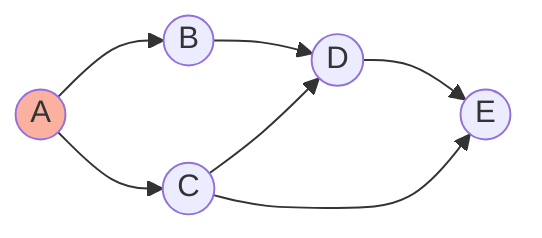

# Graphs: Fundamentals - Complete Master Guide

## Overview
Graphs are the **most versatile** data structure, modeling relationships in social networks, road maps, dependencies, computer networks, and financial systems. Unlike trees, graphs can have cycles and multiple paths between nodes.

**Key Insight**: Most complex real-world problems are graph problems in disguise.

For Senior/Staff Engineers, mastering graphs means:
- Understanding graph representations (adjacency list vs matrix)
- Implementing BFS and DFS fluently
- Recognizing graph patterns (cycle detection, topological sort, connected components)
- Discussing production graph systems (Neo4j, knowledge graphs, fraud detection)

---

## Table of Contents
1. [Fundamentals](#fundamentals)
2. [Graph Representations](#graph-representations)
3. [Graph Traversals](#graph-traversals)
4. [Common Patterns](#common-patterns)
5. [15+ Solved Problems](#solved-problems)
6. [Advanced Topics](#advanced-topics)
7. [Interview Questions & Answers](#interview-questions--answers)
8. [Banking & Production Context](#banking--production-context)

---

## Fundamentals

### Terminology

**Vertex (Node)**: A point in the graph  
**Edge**: Connection between two vertices  
**Degree**: Number of edges connected to a vertex  
**Path**: Sequence of vertices connected by edges  
**Cycle**: Path that starts and ends at same vertex  

### Graph Types

**Directed vs Undirected**:
- Directed: One-way edges (Twitter follows)
- Undirected: Two-way edges (Facebook friends)

**Weighted vs Unweighted**:
- Weighted: Edges have costs (road distances)
- Unweighted: All edges equal (social connections)

**Cyclic vs Acyclic**:
- Cyclic: Contains cycles
- Acyclic: No cycles (DAG - Directed Acyclic Graph, Trees)

**Connected vs Disconnected**:
- Connected: Path exists between any two vertices
- Disconnected: Some vertices unreachable

### Visualization



---

## Graph Representations

### Adjacency List (Preferred)

**Structure**: Array/Map of lists

**Pros**:
- Space efficient for sparse graphs: O(V + E)
- Fast to iterate neighbors
- Most common in interviews

**Cons**:
- Checking if edge exists: O(degree)

**Implementation**:
```java
// Option 1: Array of lists (vertices 0 to n-1)
List<Integer>[] graph = new ArrayList[n];
for (int i = 0; i < n; i++) {
    graph[i] = new ArrayList<>();
}

// Option 2: HashMap (flexible vertex IDs)
Map<Integer, List<Integer>> graph = new HashMap<>();

// Option 3: Edge list (for algorithms like Kruskal's)
List<int[]> edges = new ArrayList<>();  // [from, to, weight]
```

### Adjacency Matrix

**Structure**: 2D array

**Pros**:
- Check if edge exists: O(1)
- Simple implementation

**Cons**:
- Space: O(V²) - wasteful for sparse graphs
- Iterate neighbors: O(V)

**Implementation**:
```java
int[][] graph = new int[n][n];
graph[i][j] = 1;  // Edge from i to j
```

### Comparison

| Operation | Adjacency List | Adjacency Matrix |
|-----------|----------------|------------------|
| **Space** | O(V + E) | O(V²) |
| **Add edge** | O(1) | O(1) |
| **Check edge** | O(degree) | O(1) |
| **Iterate neighbors** | O(degree) | O(V) |
| **Best for** | Sparse graphs | Dense graphs |

---

## Graph Traversals

### Breadth-First Search (BFS)

**Strategy**: Explore layer by layer (like ripples in water)

**Data structure**: Queue

**Use cases**:
- Shortest path in unweighted graph
- Level-order traversal
- Connected components

**Template**:
```java
/**
 * BFS template.
 * Time: O(V + E), Space: O(V)
 */
public void bfs(int start, List<Integer>[] graph) {
    Queue<Integer> queue = new LinkedList<>();
    Set<Integer> visited = new HashSet<>();
    
    queue.offer(start);
    visited.add(start);
    
    while (!queue.isEmpty()) {
        int node = queue.poll();
        // Process node
        
        for (int neighbor : graph[node]) {
            if (!visited.contains(neighbor)) {
                visited.add(neighbor);
                queue.offer(neighbor);
            }
        }
    }
}
```

**BFS with levels**:
```java
public void bfsLevels(int start, List<Integer>[] graph) {
    Queue<Integer> queue = new LinkedList<>();
    Set<Integer> visited = new HashSet<>();
    
    queue.offer(start);
    visited.add(start);
    int level = 0;
    
    while (!queue.isEmpty()) {
        int size = queue.size();
        
        for (int i = 0; i < size; i++) {
            int node = queue.poll();
            // Process node at this level
            
            for (int neighbor : graph[node]) {
                if (!visited.contains(neighbor)) {
                    visited.add(neighbor);
                    queue.offer(neighbor);
                }
            }
        }
        
        level++;
    }
}
```

### Depth-First Search (DFS)

**Strategy**: Go deep as possible, then backtrack

**Data structure**: Stack (recursion or explicit)

**Use cases**:
- Cycle detection
- Topological sort
- Path finding
- Connected components

**Template (Recursive)**:
```java
/**
 * DFS template (recursive).
 * Time: O(V + E), Space: O(V)
 */
public void dfs(int node, List<Integer>[] graph, Set<Integer> visited) {
    if (visited.contains(node)) return;
    
    visited.add(node);
    // Process node
    
    for (int neighbor : graph[node]) {
        dfs(neighbor, graph, visited);
    }
}
```

**Template (Iterative)**:
```java
public void dfsIterative(int start, List<Integer>[] graph) {
    Deque<Integer> stack = new ArrayDeque<>();
    Set<Integer> visited = new HashSet<>();
    
    stack.push(start);
    
    while (!stack.isEmpty()) {
        int node = stack.pop();
        
        if (visited.contains(node)) continue;
        visited.add(node);
        // Process node
        
        for (int neighbor : graph[node]) {
            if (!visited.contains(neighbor)) {
                stack.push(neighbor);
            }
        }
    }
}
```

### BFS vs DFS Comparison

| Aspect | BFS | DFS |
|--------|-----|-----|
| **Data structure** | Queue | Stack/Recursion |
| **Order** | Level by level | Deep first |
| **Shortest path** | ✓ (unweighted) | ✗ |
| **Memory** | O(width) | O(height) |
| **Use case** | Shortest path | Cycle detection, topological sort |

---

## Common Patterns

### Pattern 1: Number of Islands

**Problem**: Count connected components in 2D grid.

```java
/**
 * Count islands (connected components).
 * Time: O(m × n), Space: O(m × n)
 */
public int numIslands(char[][] grid) {
    if (grid == null || grid.length == 0) return 0;
    
    int count = 0;
    
    for (int i = 0; i < grid.length; i++) {
        for (int j = 0; j < grid[0].length; j++) {
            if (grid[i][j] == '1') {
                count++;
                dfs(grid, i, j);
            }
        }
    }
    
    return count;
}

private void dfs(char[][] grid, int i, int j) {
    if (i < 0 || i >= grid.length || j < 0 || j >= grid[0].length || 
        grid[i][j] == '0') {
        return;
    }
    
    grid[i][j] = '0';  // Mark as visited
    
    dfs(grid, i + 1, j);
    dfs(grid, i - 1, j);
    dfs(grid, i, j + 1);
    dfs(grid, i, j - 1);
}
```

### Pattern 2: Cycle Detection

**Undirected graph**:
```java
/**
 * Detect cycle in undirected graph.
 * Time: O(V + E), Space: O(V)
 */
public boolean hasCycle(List<Integer>[] graph) {
    Set<Integer> visited = new HashSet<>();
    
    for (int i = 0; i < graph.length; i++) {
        if (!visited.contains(i)) {
            if (dfs(i, -1, graph, visited)) {
                return true;
            }
        }
    }
    
    return false;
}

private boolean dfs(int node, int parent, List<Integer>[] graph, Set<Integer> visited) {
    visited.add(node);
    
    for (int neighbor : graph[node]) {
        if (!visited.contains(neighbor)) {
            if (dfs(neighbor, node, graph, visited)) {
                return true;
            }
        } else if (neighbor != parent) {
            return true;  // Cycle found
        }
    }
    
    return false;
}
```

**Directed graph**:
```java
/**
 * Detect cycle in directed graph.
 * Time: O(V + E), Space: O(V)
 */
public boolean hasCycleDirected(List<Integer>[] graph) {
    Set<Integer> visited = new HashSet<>();
    Set<Integer> recStack = new HashSet<>();
    
    for (int i = 0; i < graph.length; i++) {
        if (dfs(i, graph, visited, recStack)) {
            return true;
        }
    }
    
    return false;
}

private boolean dfs(int node, List<Integer>[] graph, Set<Integer> visited, Set<Integer> recStack) {
    if (recStack.contains(node)) return true;  // Cycle in current path
    if (visited.contains(node)) return false;  // Already explored
    
    visited.add(node);
    recStack.add(node);
    
    for (int neighbor : graph[node]) {
        if (dfs(neighbor, graph, visited, recStack)) {
            return true;
        }
    }
    
    recStack.remove(node);  // Backtrack
    return false;
}
```

### Pattern 3: Topological Sort

**Problem**: Order tasks with dependencies.

```java
/**
 * Topological sort (DFS-based).
 * Time: O(V + E), Space: O(V)
 */
public List<Integer> topologicalSort(List<Integer>[] graph) {
    Set<Integer> visited = new HashSet<>();
    Deque<Integer> stack = new ArrayDeque<>();
    
    for (int i = 0; i < graph.length; i++) {
        if (!visited.contains(i)) {
            dfs(i, graph, visited, stack);
        }
    }
    
    List<Integer> result = new ArrayList<>();
    while (!stack.isEmpty()) {
        result.add(stack.pop());
    }
    
    return result;
}

private void dfs(int node, List<Integer>[] graph, Set<Integer> visited, Deque<Integer> stack) {
    visited.add(node);
    
    for (int neighbor : graph[node]) {
        if (!visited.contains(neighbor)) {
            dfs(neighbor, graph, visited, stack);
        }
    }
    
    stack.push(node);  // Add after visiting all neighbors
}
```

**Kahn's Algorithm (BFS-based)**:
```java
/**
 * Topological sort using Kahn's algorithm.
 * Time: O(V + E), Space: O(V)
 */
public List<Integer> topologicalSortKahn(List<Integer>[] graph, int n) {
    int[] indegree = new int[n];
    
    // Calculate indegrees
    for (int i = 0; i < n; i++) {
        for (int neighbor : graph[i]) {
            indegree[neighbor]++;
        }
    }
    
    Queue<Integer> queue = new LinkedList<>();
    for (int i = 0; i < n; i++) {
        if (indegree[i] == 0) {
            queue.offer(i);
        }
    }
    
    List<Integer> result = new ArrayList<>();
    
    while (!queue.isEmpty()) {
        int node = queue.poll();
        result.add(node);
        
        for (int neighbor : graph[node]) {
            indegree[neighbor]--;
            if (indegree[neighbor] == 0) {
                queue.offer(neighbor);
            }
        }
    }
    
    return result.size() == n ? result : new ArrayList<>();  // Check for cycle
}
```

---

## Solved Problems

### Problem 1: Clone Graph (Medium)

```java
/**
 * Clone undirected graph.
 * Time: O(V + E), Space: O(V)
 */
public Node cloneGraph(Node node) {
    if (node == null) return null;
    
    Map<Node, Node> map = new HashMap<>();
    return dfs(node, map);
}

private Node dfs(Node node, Map<Node, Node> map) {
    if (map.containsKey(node)) {
        return map.get(node);
    }
    
    Node clone = new Node(node.val);
    map.put(node, clone);
    
    for (Node neighbor : node.neighbors) {
        clone.neighbors.add(dfs(neighbor, map));
    }
    
    return clone;
}
```

### Problem 2: Course Schedule (Medium)

```java
/**
 * Can finish all courses (cycle detection).
 * Time: O(V + E), Space: O(V)
 */
public boolean canFinish(int numCourses, int[][] prerequisites) {
    List<Integer>[] graph = new ArrayList[numCourses];
    for (int i = 0; i < numCourses; i++) {
        graph[i] = new ArrayList<>();
    }
    
    for (int[] prereq : prerequisites) {
        graph[prereq[1]].add(prereq[0]);
    }
    
    Set<Integer> visited = new HashSet<>();
    Set<Integer> recStack = new HashSet<>();
    
    for (int i = 0; i < numCourses; i++) {
        if (hasCycle(i, graph, visited, recStack)) {
            return false;
        }
    }
    
    return true;
}

private boolean hasCycle(int node, List<Integer>[] graph, Set<Integer> visited, Set<Integer> recStack) {
    if (recStack.contains(node)) return true;
    if (visited.contains(node)) return false;
    
    visited.add(node);
    recStack.add(node);
    
    for (int neighbor : graph[node]) {
        if (hasCycle(neighbor, graph, visited, recStack)) {
            return true;
        }
    }
    
    recStack.remove(node);
    return false;
}
```

### Problem 3: Pacific Atlantic Water Flow (Medium)

```java
/**
 * Find cells that can flow to both oceans.
 * Time: O(m × n), Space: O(m × n)
 */
public List<List<Integer>> pacificAtlantic(int[][] heights) {
    int m = heights.length, n = heights[0].length;
    boolean[][] pacific = new boolean[m][n];
    boolean[][] atlantic = new boolean[m][n];
    
    // DFS from Pacific edges
    for (int i = 0; i < m; i++) dfs(heights, pacific, i, 0);
    for (int j = 0; j < n; j++) dfs(heights, pacific, 0, j);
    
    // DFS from Atlantic edges
    for (int i = 0; i < m; i++) dfs(heights, atlantic, i, n - 1);
    for (int j = 0; j < n; j++) dfs(heights, atlantic, m - 1, j);
    
    List<List<Integer>> result = new ArrayList<>();
    for (int i = 0; i < m; i++) {
        for (int j = 0; j < n; j++) {
            if (pacific[i][j] && atlantic[i][j]) {
                result.add(Arrays.asList(i, j));
            }
        }
    }
    
    return result;
}

private void dfs(int[][] heights, boolean[][] visited, int i, int j) {
    visited[i][j] = true;
    
    int[][] dirs = {{0,1}, {0,-1}, {1,0}, {-1,0}};
    for (int[] dir : dirs) {
        int ni = i + dir[0], nj = j + dir[1];
        if (ni >= 0 && ni < heights.length && nj >= 0 && nj < heights[0].length &&
            !visited[ni][nj] && heights[ni][nj] >= heights[i][j]) {
            dfs(heights, visited, ni, nj);
        }
    }
}
```

### Problem 4: Word Ladder (Hard)

```java
/**
 * Shortest transformation sequence.
 * Time: O(M² × N), Space: O(M² × N)
 */
public int ladderLength(String beginWord, String endWord, List<String> wordList) {
    Set<String> wordSet = new HashSet<>(wordList);
    if (!wordSet.contains(endWord)) return 0;
    
    Queue<String> queue = new LinkedList<>();
    queue.offer(beginWord);
    int level = 1;
    
    while (!queue.isEmpty()) {
        int size = queue.size();
        
        for (int i = 0; i < size; i++) {
            String word = queue.poll();
            if (word.equals(endWord)) return level;
            
            char[] chars = word.toCharArray();
            for (int j = 0; j < chars.length; j++) {
                char original = chars[j];
                
                for (char c = 'a'; c <= 'z'; c++) {
                    chars[j] = c;
                    String newWord = new String(chars);
                    
                    if (wordSet.contains(newWord)) {
                        queue.offer(newWord);
                        wordSet.remove(newWord);
                    }
                }
                
                chars[j] = original;
            }
        }
        
        level++;
    }
    
    return 0;
}
```

### Problem 5: Surrounded Regions (Medium)

```java
/**
 * Capture surrounded regions.
 * Time: O(m × n), Space: O(m × n)
 */
public void solve(char[][] board) {
    int m = board.length, n = board[0].length;
    
    // Mark border-connected 'O's
    for (int i = 0; i < m; i++) {
        if (board[i][0] == 'O') dfs(board, i, 0);
        if (board[i][n-1] == 'O') dfs(board, i, n - 1);
    }
    for (int j = 0; j < n; j++) {
        if (board[0][j] == 'O') dfs(board, 0, j);
        if (board[m-1][j] == 'O') dfs(board, m - 1, j);
    }
    
    // Flip surrounded 'O's to 'X', restore marked to 'O'
    for (int i = 0; i < m; i++) {
        for (int j = 0; j < n; j++) {
            if (board[i][j] == 'O') board[i][j] = 'X';
            else if (board[i][j] == 'T') board[i][j] = 'O';
        }
    }
}

private void dfs(char[][] board, int i, int j) {
    if (i < 0 || i >= board.length || j < 0 || j >= board[0].length || 
        board[i][j] != 'O') {
        return;
    }
    
    board[i][j] = 'T';  // Temporary mark
    
    dfs(board, i + 1, j);
    dfs(board, i - 1, j);
    dfs(board, i, j + 1);
    dfs(board, i, j - 1);
}
```

---

## Interview Questions & Answers

### Q1: "When should you use BFS vs DFS?"

**Model Answer:**
"I choose based on the problem requirements:

**Use BFS when**:
- Finding shortest path in unweighted graph
- Level-order traversal needed
- Exploring nearby nodes first (e.g., social network connections)
- Memory allows (BFS uses more memory for wide graphs)

**Use DFS when**:
- Detecting cycles
- Topological sorting
- Path finding (any path, not shortest)
- Memory constrained (DFS uses less memory for wide graphs)
- Backtracking problems

**Example - Social Network**:
- 'Find shortest connection path': BFS (guarantees shortest)
- 'Find if connection exists': DFS (uses less memory)

**Memory comparison**:
- BFS: O(width) - stores entire level
- DFS: O(height) - stores path from root

In production, for fraud detection in banking, we use BFS to find shortest path between suspicious accounts, but DFS for deep investigation of transaction chains."

### Q2: "How do you detect a cycle in a directed vs undirected graph?"

**Model Answer:**
"The approaches differ significantly:

**Undirected graph**:
- Track visited nodes and parent
- If we visit a node that's visited but not parent → cycle
- Time: O(V + E)

```java
if (visited.contains(neighbor) && neighbor != parent) {
    return true;  // Cycle found
}
```

**Directed graph**:
- Track visited nodes and recursion stack
- If we visit a node in current recursion stack → cycle
- Time: O(V + E)

```java
if (recStack.contains(node)) return true;  // Cycle in current path
if (visited.contains(node)) return false;  // Already explored
```

**Why different?**:
- Undirected: Any back edge is a cycle
- Directed: Only back edges in current DFS path are cycles

**Production example**:
In dependency management (Maven, npm), we detect cycles in directed graphs to prevent circular dependencies. In social networks (undirected), we detect cycles to find friend groups."

### Q3: "Explain topological sort and when it's used."

**Model Answer:**
"Topological sort orders vertices in a DAG such that for every directed edge u→v, u comes before v.

**Requirements**:
- Must be a DAG (no cycles)
- Only works on directed graphs

**Two algorithms**:

**1. DFS-based** (post-order):
- DFS from each unvisited node
- Add to stack after visiting all neighbors
- Pop stack for result
- Time: O(V + E)

**2. Kahn's algorithm** (BFS-based):
- Calculate indegrees
- Start with nodes having indegree 0
- Remove edges, add new zero-indegree nodes
- Time: O(V + E)

**Use cases**:
1. **Build systems**: Compile dependencies in order
2. **Course scheduling**: Take prerequisites first
3. **Task scheduling**: Execute tasks respecting dependencies

**Production example**:
In banking, we use topological sort for:
- Transaction processing order (settlement dependencies)
- Regulatory reporting (some reports depend on others)
- Database migration scripts (schema dependencies)

**Cycle detection**: If topological sort doesn't include all nodes, graph has cycle."

---

## 🏦 Banking & Production Context

### Transaction Graph Analysis

**Scenario**: Detect money laundering rings.

```java
/**
 * Detect circular money flow (cycle detection).
 */
class MoneyLaunderingDetector {
    public List<List<Integer>> detectCircularFlow(List<Transaction> transactions) {
        Map<Integer, List<Integer>> graph = buildGraph(transactions);
        List<List<Integer>> cycles = new ArrayList<>();
        
        Set<Integer> visited = new HashSet<>();
        Set<Integer> recStack = new HashSet<>();
        List<Integer> path = new ArrayList<>();
        
        for (int account : graph.keySet()) {
            if (!visited.contains(account)) {
                detectCycles(account, graph, visited, recStack, path, cycles);
            }
        }
        
        return cycles;
    }
    
    private boolean detectCycles(int node, Map<Integer, List<Integer>> graph,
                                  Set<Integer> visited, Set<Integer> recStack,
                                  List<Integer> path, List<List<Integer>> cycles) {
        visited.add(node);
        recStack.add(node);
        path.add(node);
        
        for (int neighbor : graph.getOrDefault(node, new ArrayList<>())) {
            if (recStack.contains(neighbor)) {
                // Found cycle
                int cycleStart = path.indexOf(neighbor);
                cycles.add(new ArrayList<>(path.subList(cycleStart, path.size())));
                return true;
            }
            
            if (!visited.contains(neighbor)) {
                if (detectCycles(neighbor, graph, visited, recStack, path, cycles)) {
                    return true;
                }
            }
        }
        
        recStack.remove(node);
        path.remove(path.size() - 1);
        return false;
    }
}
```

### Dependency Resolution

**Scenario**: Order regulatory reports by dependencies.

```java
/**
 * Order reports using topological sort.
 */
class ReportScheduler {
    public List<String> scheduleReports(Map<String, List<String>> dependencies) {
        // Build graph
        Map<String, List<String>> graph = new HashMap<>();
        Map<String, Integer> indegree = new HashMap<>();
        
        for (String report : dependencies.keySet()) {
            graph.putIfAbsent(report, new ArrayList<>());
            indegree.putIfAbsent(report, 0);
            
            for (String dep : dependencies.get(report)) {
                graph.putIfAbsent(dep, new ArrayList<>());
                graph.get(dep).add(report);
                indegree.put(report, indegree.getOrDefault(report, 0) + 1);
            }
        }
        
        // Kahn's algorithm
        Queue<String> queue = new LinkedList<>();
        for (String report : indegree.keySet()) {
            if (indegree.get(report) == 0) {
                queue.offer(report);
            }
        }
        
        List<String> order = new ArrayList<>();
        
        while (!queue.isEmpty()) {
            String report = queue.poll();
            order.add(report);
            
            for (String dependent : graph.get(report)) {
                indegree.put(dependent, indegree.get(dependent) - 1);
                if (indegree.get(dependent) == 0) {
                    queue.offer(dependent);
                }
            }
        }
        
        return order.size() == indegree.size() ? order : null;  // Null if cycle
    }
}
```

---

## Key Takeaways

1. **Representations**: Adjacency list (sparse), adjacency matrix (dense)
2. **BFS**: Queue, shortest path, level-order
3. **DFS**: Stack/recursion, cycle detection, topological sort
4. **Cycle detection**: Different for directed vs undirected
5. **Topological sort**: DFS or Kahn's algorithm
6. **Connected components**: DFS/BFS from each unvisited node
7. **Production**: Fraud detection, dependency resolution, social networks

---

**Next**: [Graphs: Algorithms](12-graphs-algorithms.md)
