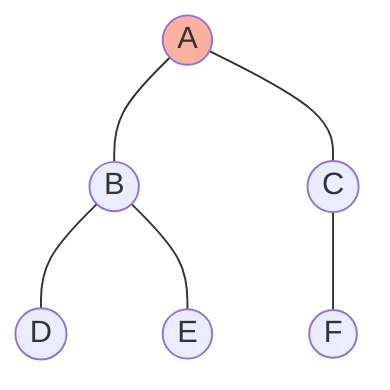

# Graphs: Fundamentals

## Overview
Graphs model relationships. They are the most versatile data structure, representing social networks, road maps, dependencies, and computer networks.

## Fundamentals

### Terminology
*   **Vertex (Node)**: A point in the graph.
*   **Edge**: Connection between two vertices.
*   **Directed vs Undirected**: One-way vs Two-way streets.
*   **Weighted vs Unweighted**: Edges have cost vs all equal.
*   **Cyclic vs Acyclic**: Contains a loop vs no loops (Tree/DAG).

### Representations
1.  **Adjacency Matrix**: 2D array `adj[i][j] = 1`. Good for dense graphs. Space O(V^2).
2.  **Adjacency List**: `List<List<Integer>>`. Good for sparse graphs. Space O(V + E). **(Preferred for Interviews)**.

## Graph Traversals (CRITICAL)

### 1. Breadth-First Search (BFS)
*   **Strategy**: Explore neighbors layer by layer.
*   **Data Structure**: Queue.
*   **Use Case**: Shortest path in unweighted graph.

### 2. Depth-First Search (DFS)
*   **Strategy**: Go deep as possible, then backtrack.
*   **Data Structure**: Stack (Recursion).
*   **Use Case**: Path finding, Cycle detection, Topological sort.

## Visual Diagrams

### BFS vs DFS

*   **BFS Order**: A -> B, C -> D, E, F
*   **DFS Order**: A -> B -> D -> E -> C -> F (one possible path)

## Implementation in Java

### Graph Node Definition
```java
// Option 1: HashMap for Adjacency List (Most flexible)
Map<Integer, List<Integer>> graph = new HashMap<>();

// Option 2: Array of Lists (If vertices are 0 to N-1)
List<Integer>[] graph = new ArrayList[N];
```

### BFS Template
```java
public void bfs(int start, Map<Integer, List<Integer>> graph) {
    Queue<Integer> queue = new LinkedList<>();
    Set<Integer> visited = new HashSet<>();
    
    queue.offer(start);
    visited.add(start);
    
    while (!queue.isEmpty()) {
        int node = queue.poll();
        // Process node
        
        for (int neighbor : graph.getOrDefault(node, new ArrayList<>())) {
            if (!visited.contains(neighbor)) {
                visited.add(neighbor);
                queue.offer(neighbor);
            }
        }
    }
}
```

### DFS Template (Recursive)
```java
public void dfs(int node, Map<Integer, List<Integer>> graph, Set<Integer> visited) {
    if (visited.contains(node)) return;
    
    visited.add(node);
    // Process node
    
    for (int neighbor : graph.getOrDefault(node, new ArrayList<>())) {
        dfs(neighbor, graph, visited);
    }
}
```

## 🏦 Banking Context: Transaction Graphs
*   **Scenario**: Detecting money laundering rings.
*   **Graph**: Vertices = Accounts, Edges = Transactions.
*   **Algorithm**: **Cycle Detection** (DFS) or finding **Strongly Connected Components** to identify circular flow of money (A -> B -> C -> A) used to obscure funds.

## Common Pitfalls
1.  **Infinite Loops**: Forgetting `visited` set causes infinite loops in cyclic graphs.
2.  **Disconnected Components**: Standard BFS/DFS only visits nodes reachable from start. You must loop through all nodes to visit a disconnected graph.
    ```java
    for (int i = 0; i < n; i++) {
        if (!visited.contains(i)) bfs(i);
    }
    ```

---
**Next**: [Graphs: Algorithms](12-graphs-algorithms.md)
