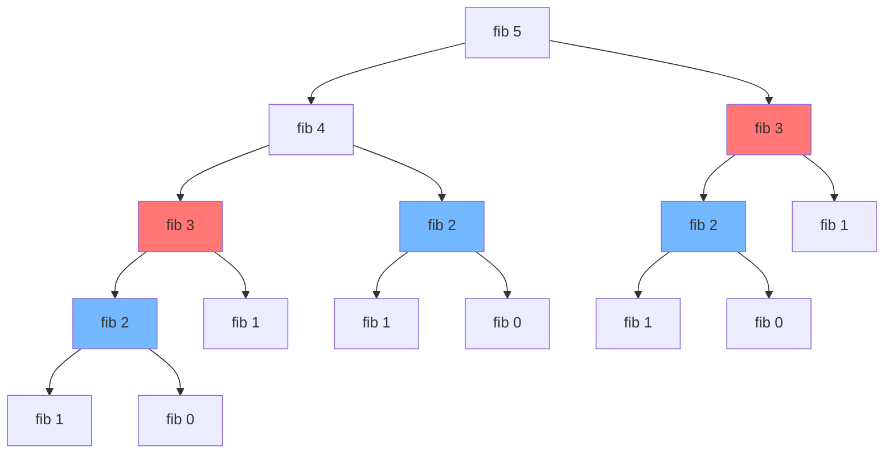

# Dynamic Programming: Complete Master Guide

## Overview
Dynamic Programming (DP) is one of the **most important and challenging** topics in coding interviews. It's an optimization technique that solves complex problems by breaking them into simpler overlapping subproblems. DP is essentially **smart recursion** - we solve each subproblem once and store the result to avoid redundant computation.

For Senior/Staff Engineers, mastering DP means:
- Recognizing DP problems instantly (optimal substructure + overlapping subproblems)
- Choosing between top-down (memoization) and bottom-up (tabulation)
- Optimizing space complexity
- Explaining the thought process clearly in interviews

**DP is hard but learnable through patterns.** This guide will transform you from someone who struggles with DP to someone who can solve most DP problems systematically.

---

## Table of Contents
1. [Fundamentals](#fundamentals)
2. [When to Use DP](#when-to-use-dp)
3. [Top-Down vs Bottom-Up](#top-down-vs-bottom-up)
4. [The DP Framework](#the-dp-framework)
5. [15+ Solved Problems](#solved-problems)
6. [Space Optimization](#space-optimization)
7. [Interview Questions & Answers](#interview-questions--answers)
8. [Banking & Production Context](#banking--production-context)

---

## Fundamentals

### What is Dynamic Programming?

**Definition**: An algorithmic paradigm that solves problems by combining solutions to subproblems.

**Key Insight**: Instead of solving the same subproblem multiple times (like naive recursion), we solve it once and store the result.

**Formula**: DP = Recursion + Memoization (or Iteration + Tabulation)

### Classic Example: Fibonacci

**Naive Recursion (Exponential Time):**
```java
int fib(int n) {
    if (n <= 1) return n;
    return fib(n-1) + fib(n-2);  // Recalculates same values many times
}
// Time: O(2^n), Space: O(n) - call stack
```

**Recursion Tree for fib(5):**


**Problem**: fib(3) is calculated 3 times, fib(2) is calculated 5 times!

**DP Solution 1: Memoization (Top-Down):**
```java
int fib(int n, int[] memo) {
    if (n <= 1) return n;
    if (memo[n] != 0) return memo[n];  // Already calculated
    memo[n] = fib(n-1, memo) + fib(n-2, memo);
    return memo[n];
}
// Time: O(n), Space: O(n)
```

**DP Solution 2: Tabulation (Bottom-Up):**
```java
int fib(int n) {
    if (n <= 1) return n;
    int[] dp = new int[n + 1];
    dp[0] = 0;
    dp[1] = 1;
    for (int i = 2; i <= n; i++) {
        dp[i] = dp[i-1] + dp[i-2];
    }
    return dp[n];
}
// Time: O(n), Space: O(n)
```

**DP Solution 3: Space-Optimized:**
```java
int fib(int n) {
    if (n <= 1) return n;
    int prev2 = 0, prev1 = 1;
    for (int i = 2; i <= n; i++) {
        int current = prev1 + prev2;
        prev2 = prev1;
        prev1 = current;
    }
    return prev1;
}
// Time: O(n), Space: O(1)
```

---

## When to Use DP

### Two Key Properties

**1. Optimal Substructure**
- Optimal solution contains optimal solutions to subproblems
- Example: Shortest path from A to C through B = shortest(A→B) + shortest(B→C)

**2. Overlapping Subproblems**
- Same subproblems are solved multiple times
- Example: fib(5) requires fib(3) multiple times

### DP Problem Indicators

**Keywords that suggest DP:**
- "Minimize/Maximize"
- "Count number of ways"
- "Longest/Shortest"
- "Optimal"
- "Can you reach/achieve"

**Problem types:**
- Optimization problems (min/max cost, longest/shortest path)
- Counting problems (number of ways to do X)
- Decision problems (can we achieve X?)

### DP vs Greedy vs Divide & Conquer

| Approach | When to Use | Example |
|----------|-------------|---------|
| **DP** | Overlapping subproblems, optimal substructure | Fibonacci, Knapsack |
| **Greedy** | Optimal substructure, greedy choice property | Activity Selection, Huffman Coding |
| **Divide & Conquer** | Independent subproblems | Merge Sort, Binary Search |

---

## Top-Down vs Bottom-Up

### Top-Down (Memoization)

**Approach**: Start with the original problem, recursively break down, cache results.

**Pros:**
- More intuitive (follows natural recursion)
- Only solves needed subproblems
- Easier to write initially

**Cons:**
- Recursion overhead (call stack)
- Risk of stack overflow for deep recursion
- Harder to optimize space

**Template:**
```java
public int solve(int n, int[] memo) {
    // Base case
    if (n <= baseCase) return baseValue;
    
    // Check memo
    if (memo[n] != -1) return memo[n];
    
    // Recursive relation
    memo[n] = /* compute from solve(n-1), solve(n-2), etc. */;
    
    return memo[n];
}
```

### Bottom-Up (Tabulation)

**Approach**: Start with base cases, iteratively build up to the answer.

**Pros:**
- No recursion overhead
- Easier to optimize space
- Better for very large inputs

**Cons:**
- Less intuitive initially
- Solves all subproblems (even if not needed)
- Harder to write for complex problems

**Template:**
```java
public int solve(int n) {
    // Initialize DP table
    int[] dp = new int[n + 1];
    
    // Base cases
    dp[0] = baseValue0;
    dp[1] = baseValue1;
    
    // Fill table iteratively
    for (int i = 2; i <= n; i++) {
        dp[i] = /* compute from dp[i-1], dp[i-2], etc. */;
    }
    
    return dp[n];
}
```

---

## The DP Framework

### 5-Step Process

**Step 1: Define the State**
- What variables define a subproblem?
- Example: `dp[i]` = answer for input i
- Example: `dp[i][j]` = answer for substring s[0...i] and t[0...j]

**Step 2: Find the Recurrence Relation**
- How do we compute dp[i] from previous states?
- Example: `dp[i] = dp[i-1] + dp[i-2]` (Fibonacci)
- Example: `dp[i] = max(dp[i-1], dp[i-2] + nums[i])` (House Robber)

**Step 3: Initialize Base Cases**
- What are the simplest subproblems we can solve directly?
- Example: `dp[0] = 0, dp[1] = 1` (Fibonacci)

**Step 4: Determine Iteration Order**
- In what order should we fill the DP table?
- Usually: smaller to larger (bottom-up)

**Step 5: Identify the Answer**
- Where in the DP table is our final answer?
- Example: `dp[n]` or `max(dp[0...n])`

---

## Solved Problems

### Problem 1: Climbing Stairs (Easy)

**Problem**: You're climbing stairs. Each time you can climb 1 or 2 steps. How many ways to reach the top?

**Analysis:**
- State: `dp[i]` = ways to reach step i
- Recurrence: `dp[i] = dp[i-1] + dp[i-2]`
  - Can reach step i from step i-1 (1 step) or step i-2 (2 steps)
- Base: `dp[0] = 1, dp[1] = 1`

**Solution:**
```java
/**
 * Count ways to climb n stairs.
 * Time: O(n), Space: O(1) - optimized
 */
public int climbStairs(int n) {
    if (n <= 2) return n;
    
    int prev2 = 1;  // dp[0]
    int prev1 = 2;  // dp[1]
    
    for (int i = 3; i <= n; i++) {
        int current = prev1 + prev2;
        prev2 = prev1;
        prev1 = current;
    }
    
    return prev1;
}
```

### Problem 2: House Robber (Medium)

**Problem**: Rob houses in a row. Can't rob adjacent houses. Maximize money.

**Analysis:**
- State: `dp[i]` = max money robbing houses 0...i
- Recurrence: `dp[i] = max(dp[i-1], dp[i-2] + nums[i])`
  - Either skip house i (take dp[i-1]) or rob it (dp[i-2] + nums[i])
- Base: `dp[0] = nums[0], dp[1] = max(nums[0], nums[1])`

**Solution:**
```java
/**
 * Maximum money from robbing houses.
 * Time: O(n), Space: O(1)
 */
public int rob(int[] nums) {
    if (nums.length == 0) return 0;
    if (nums.length == 1) return nums[0];
    
    int prev2 = nums[0];
    int prev1 = Math.max(nums[0], nums[1]);
    
    for (int i = 2; i < nums.length; i++) {
        int current = Math.max(prev1, prev2 + nums[i]);
        prev2 = prev1;
        prev1 = current;
    }
    
    return prev1;
}
```

**Dry Run:**
```
nums = [2, 7, 9, 3, 1]

i=0: prev2=2
i=1: prev1=max(2,7)=7
i=2: current=max(7, 2+9)=11, prev2=7, prev1=11
i=3: current=max(11, 7+3)=11, prev2=11, prev1=11
i=4: current=max(11, 11+1)=12, prev2=11, prev1=12

Result: 12 (rob houses 0, 2, 4)
```

### Problem 3: Coin Change (Medium)

**Problem**: Given coins and amount, find minimum coins to make amount.

**Analysis:**
- State: `dp[i]` = min coins to make amount i
- Recurrence: `dp[i] = min(dp[i - coin] + 1)` for all coins
- Base: `dp[0] = 0`

**Solution:**
```java
/**
 * Minimum coins to make amount.
 * Time: O(amount × coins.length), Space: O(amount)
 */
public int coinChange(int[] coins, int amount) {
    int[] dp = new int[amount + 1];
    Arrays.fill(dp, amount + 1);  // Infinity
    dp[0] = 0;
    
    for (int i = 1; i <= amount; i++) {
        for (int coin : coins) {
            if (i >= coin) {
                dp[i] = Math.min(dp[i], dp[i - coin] + 1);
            }
        }
    }
    
    return dp[amount] > amount ? -1 : dp[amount];
}
```

**Dry Run:**
```
coins = [1, 2, 5], amount = 11

dp[0] = 0
dp[1] = min(dp[1-1]+1) = 1  (use coin 1)
dp[2] = min(dp[2-1]+1, dp[2-2]+1) = min(2, 1) = 1  (use coin 2)
dp[3] = min(dp[3-1]+1, dp[3-2]+1) = min(2, 2) = 2
dp[4] = min(dp[4-1]+1, dp[4-2]+1) = min(3, 2) = 2
dp[5] = min(dp[5-1]+1, dp[5-2]+1, dp[5-5]+1) = min(3, 3, 1) = 1
...
dp[11] = 3  (5+5+1)
```

### Problem 4: Longest Increasing Subsequence (Medium)

**Problem**: Find length of longest increasing subsequence.

**Solution 1: DP O(n²)**
```java
/**
 * LIS using DP.
 * Time: O(n²), Space: O(n)
 */
public int lengthOfLIS(int[] nums) {
    int n = nums.length;
    int[] dp = new int[n];
    Arrays.fill(dp, 1);  // Each element is a subsequence of length 1
    
    int maxLen = 1;
    
    for (int i = 1; i < n; i++) {
        for (int j = 0; j < i; j++) {
            if (nums[i] > nums[j]) {
                dp[i] = Math.max(dp[i], dp[j] + 1);
            }
        }
        maxLen = Math.max(maxLen, dp[i]);
    }
    
    return maxLen;
}
```

**Solution 2: Binary Search O(n log n)**
```java
/**
 * LIS using binary search.
 * Time: O(n log n), Space: O(n)
 */
public int lengthOfLIS(int[] nums) {
    List<Integer> tails = new ArrayList<>();
    
    for (int num : nums) {
        int pos = Collections.binarySearch(tails, num);
        if (pos < 0) {
            pos = -(pos + 1);
        }
        
        if (pos == tails.size()) {
            tails.add(num);
        } else {
            tails.set(pos, num);
        }
    }
    
    return tails.size();
}
```

### Problem 5: Longest Common Subsequence (Medium)

**Problem**: Find length of LCS of two strings.

**Analysis:**
- State: `dp[i][j]` = LCS length of s1[0...i-1] and s2[0...j-1]
- Recurrence:
  - If s1[i-1] == s2[j-1]: `dp[i][j] = dp[i-1][j-1] + 1`
  - Else: `dp[i][j] = max(dp[i-1][j], dp[i][j-1])`

**Solution:**
```java
/**
 * Longest common subsequence.
 * Time: O(m × n), Space: O(m × n)
 */
public int longestCommonSubsequence(String text1, String text2) {
    int m = text1.length();
    int n = text2.length();
    int[][] dp = new int[m + 1][n + 1];
    
    for (int i = 1; i <= m; i++) {
        for (int j = 1; j <= n; j++) {
            if (text1.charAt(i-1) == text2.charAt(j-1)) {
                dp[i][j] = dp[i-1][j-1] + 1;
            } else {
                dp[i][j] = Math.max(dp[i-1][j], dp[i][j-1]);
            }
        }
    }
    
    return dp[m][n];
}
```

**DP Table Example:**
```
text1 = "abcde", text2 = "ace"

    ""  a  c  e
""   0  0  0  0
a    0  1  1  1
b    0  1  1  1
c    0  1  2  2
d    0  1  2  2
e    0  1  2  3

Result: 3 (subsequence "ace")
```

### Problem 6: 0/1 Knapsack (Classic)

**Problem**: Given weights, values, and capacity, maximize value without exceeding capacity.

**Analysis:**
- State: `dp[i][w]` = max value using items 0...i-1 with capacity w
- Recurrence:
  - If weight[i-1] > w: `dp[i][w] = dp[i-1][w]` (can't include)
  - Else: `dp[i][w] = max(dp[i-1][w], dp[i-1][w-weight[i-1]] + value[i-1])`

**Solution:**
```java
/**
 * 0/1 Knapsack problem.
 * Time: O(n × capacity), Space: O(n × capacity)
 */
public int knapsack(int[] weights, int[] values, int capacity) {
    int n = weights.length;
    int[][] dp = new int[n + 1][capacity + 1];
    
    for (int i = 1; i <= n; i++) {
        for (int w = 1; w <= capacity; w++) {
            if (weights[i-1] <= w) {
                dp[i][w] = Math.max(
                    dp[i-1][w],  // Don't include item
                    dp[i-1][w - weights[i-1]] + values[i-1]  // Include item
                );
            } else {
                dp[i][w] = dp[i-1][w];
            }
        }
    }
    
    return dp[n][capacity];
}
```

### Problem 7: Edit Distance (Hard)

**Problem**: Minimum operations (insert, delete, replace) to convert word1 to word2.

**Solution:**
```java
/**
 * Edit distance (Levenshtein distance).
 * Time: O(m × n), Space: O(m × n)
 */
public int minDistance(String word1, String word2) {
    int m = word1.length();
    int n = word2.length();
    int[][] dp = new int[m + 1][n + 1];
    
    // Base cases
    for (int i = 0; i <= m; i++) dp[i][0] = i;  // Delete all
    for (int j = 0; j <= n; j++) dp[0][j] = j;  // Insert all
    
    for (int i = 1; i <= m; i++) {
        for (int j = 1; j <= n; j++) {
            if (word1.charAt(i-1) == word2.charAt(j-1)) {
                dp[i][j] = dp[i-1][j-1];  // No operation needed
            } else {
                dp[i][j] = 1 + Math.min(
                    Math.min(
                        dp[i-1][j],    // Delete from word1
                        dp[i][j-1]     // Insert to word1
                    ),
                    dp[i-1][j-1]       // Replace
                );
            }
        }
    }
    
    return dp[m][n];
}
```

### Problem 8: Maximum Product Subarray (Medium)

**Problem**: Find contiguous subarray with largest product.

**Key Insight**: Track both max and min (negative × negative = positive).

**Solution:**
```java
/**
 * Maximum product subarray.
 * Time: O(n), Space: O(1)
 */
public int maxProduct(int[] nums) {
    int maxSoFar = nums[0];
    int maxEndingHere = nums[0];
    int minEndingHere = nums[0];
    
    for (int i = 1; i < nums.length; i++) {
        int temp = maxEndingHere;
        maxEndingHere = Math.max(nums[i], 
            Math.max(maxEndingHere * nums[i], minEndingHere * nums[i]));
        minEndingHere = Math.min(nums[i], 
            Math.min(temp * nums[i], minEndingHere * nums[i]));
        maxSoFar = Math.max(maxSoFar, maxEndingHere);
    }
    
    return maxSoFar;
}
```

---

## Space Optimization

### Technique 1: Rolling Array

**When**: DP only depends on previous row/column.

**Example: Fibonacci**
```java
// Before: O(n) space
int[] dp = new int[n + 1];

// After: O(1) space
int prev2 = 0, prev1 = 1;
```

### Technique 2: 1D Array for 2D DP

**Example: 0/1 Knapsack**
```java
// Before: O(n × capacity) space
int[][] dp = new int[n + 1][capacity + 1];

// After: O(capacity) space - iterate backwards
int[] dp = new int[capacity + 1];
for (int i = 0; i < n; i++) {
    for (int w = capacity; w >= weights[i]; w--) {
        dp[w] = Math.max(dp[w], dp[w - weights[i]] + values[i]);
    }
}
```

---

## Interview Questions & Answers

### Q1: "How do you identify a DP problem?"

**Model Answer:**
"I look for three key indicators:

1. **Optimization or counting**: Words like 'minimum', 'maximum', 'count ways', 'longest', 'shortest'

2. **Overlapping subproblems**: If I sketch the recursion tree, do I see repeated subproblems? For example, in Fibonacci, fib(3) is calculated multiple times.

3. **Optimal substructure**: Can I build the optimal solution from optimal solutions to subproblems? For example, the shortest path from A to C through B is the shortest A→B plus shortest B→C.

If all three are present, it's likely DP. Then I follow my framework:
- Define the state (what does dp[i] represent?)
- Find the recurrence relation
- Initialize base cases
- Determine iteration order
- Identify where the answer is

In interviews, I always start by explaining this thought process before coding."

### Q2: "When should you use top-down vs bottom-up DP?"

**Model Answer:**
"I choose based on the problem characteristics:

**Top-Down (Memoization)** when:
- The recursion is natural and easy to express
- We don't need to solve all subproblems (sparse DP)
- The problem has complex state transitions
- Example: Longest Increasing Subsequence with specific constraints

**Bottom-Up (Tabulation)** when:
- We need to solve all subproblems anyway
- Space optimization is important (easier to optimize iteratively)
- We want to avoid recursion overhead
- The problem has clear iteration order
- Example: Fibonacci, Coin Change

In production systems, I prefer bottom-up because:
- No stack overflow risk for large inputs
- Better cache locality (sequential array access)
- Easier to parallelize in some cases

However, in interviews, I often start with top-down because it's easier to explain and matches the recursive thinking, then optimize to bottom-up if needed."

### Q3: "Explain the difference between DP and greedy algorithms."

**Model Answer:**
"Both solve optimization problems, but with different approaches:

**Greedy**:
- Makes locally optimal choice at each step
- Never reconsiders previous choices
- Doesn't guarantee global optimum (unless greedy choice property holds)
- Example: Activity Selection - always pick earliest ending activity

**Dynamic Programming**:
- Considers all possibilities at each step
- Builds solution from subproblems
- Guarantees global optimum
- Example: 0/1 Knapsack - try including and excluding each item

**When greedy works**: If the problem has the greedy choice property (local optimum leads to global optimum) and optimal substructure. Examples: Huffman Coding, Dijkstra's Algorithm.

**When DP is needed**: When greedy fails because local optimum doesn't guarantee global optimum. Example: In 0/1 Knapsack, greedily picking highest value items might miss the optimal combination.

In interviews, I always check if greedy works first (it's simpler), but most hard problems require DP."

---

## 🏦 Banking & Production Context

### Options Pricing (Binomial Model)

**Scenario**: Calculate option price using binomial tree.

```java
/**
 * Binomial options pricing model.
 * Work backwards from expiration to present.
 */
public double optionPrice(double S, double K, double r, double sigma, int n) {
    double dt = T / n;
    double u = Math.exp(sigma * Math.sqrt(dt));  // Up factor
    double d = 1 / u;  // Down factor
    double p = (Math.exp(r * dt) - d) / (u - d);  // Risk-neutral probability
    
    double[][] dp = new double[n + 1][n + 1];
    
    // Terminal payoff
    for (int j = 0; j <= n; j++) {
        double ST = S * Math.pow(u, n - j) * Math.pow(d, j);
        dp[n][j] = Math.max(ST - K, 0);  // Call option payoff
    }
    
    // Work backwards (DP)
    for (int i = n - 1; i >= 0; i--) {
        for (int j = 0; j <= i; j++) {
            dp[i][j] = Math.exp(-r * dt) * (p * dp[i+1][j] + (1-p) * dp[i+1][j+1]);
        }
    }
    
    return dp[0][0];
}
```

### Value at Risk (VaR) Calculation

**Scenario**: Calculate maximum expected loss over time period.

Uses DP for portfolio optimization under risk constraints.

### Optimal Trading Strategy

**Scenario**: Buy/sell stock with transaction fees.

```java
/**
 * Maximum profit with transaction fee.
 * State: dp[i][0] = max profit on day i with no stock
 *        dp[i][1] = max profit on day i with stock
 */
public int maxProfit(int[] prices, int fee) {
    int n = prices.length;
    int hold = -prices[0];  // Bought on day 0
    int sold = 0;           // No stock on day 0
    
    for (int i = 1; i < n; i++) {
        int newHold = Math.max(hold, sold - prices[i]);
        int newSold = Math.max(sold, hold + prices[i] - fee);
        hold = newHold;
        sold = newSold;
    }
    
    return sold;
}
```

---

## Key Takeaways

1. **DP = Recursion + Memoization**: Solve each subproblem once
2. **Two properties**: Optimal substructure + overlapping subproblems
3. **Framework**: State → Recurrence → Base → Order → Answer
4. **Top-down vs Bottom-up**: Choose based on problem and constraints
5. **Space optimization**: Often can reduce from O(n²) to O(n) or O(1)
6. **Practice patterns**: 1D DP, 2D DP, Knapsack, Strings, Trees
7. **Interview strategy**: Explain thought process, start simple, optimize

---

**Next**: [DP Patterns: 1D](14-dp-patterns-1d.md)
