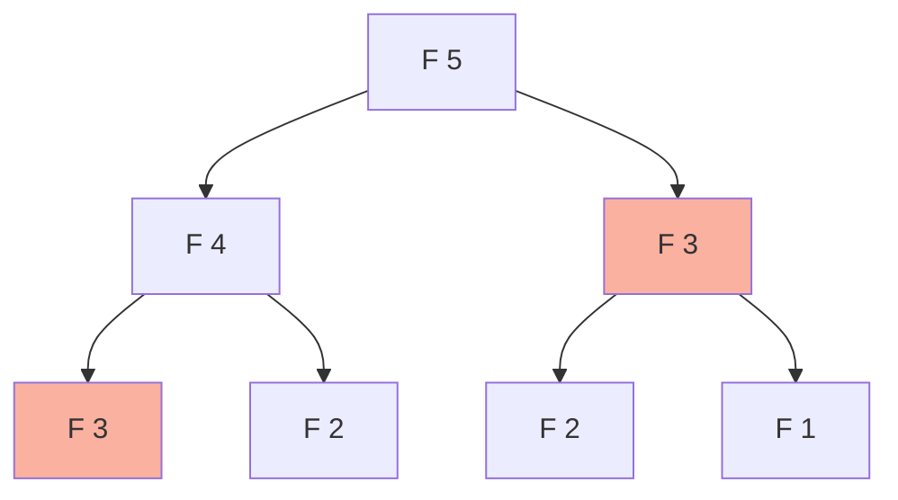

# Dynamic Programming: Introduction

## Overview
Dynamic Programming (DP) is an optimization technique for solving problems by breaking them down into simpler subproblems. It is essentially **Recursion + Memoization** or **Iterative Tabulation**.

## Fundamentals

### When to use DP?
1.  **Optimal Substructure**: Optimal solution to problem contains optimal solutions to subproblems.
2.  **Overlapping Subproblems**: Recursive solution solves the same subproblems repeatedly.

### Approaches
1.  **Top-Down (Memoization)**:
    *   Recursive.
    *   Store result of function calls in a map/array.
    *   Easier to write conceptually.
2.  **Bottom-Up (Tabulation)**:
    *   Iterative.
    *   Fill a table (array) starting from base cases.
    *   Often saves stack space and allows space optimization.

## Visual Diagrams

### Fibonacci Recursion Tree (Without DP)

*   Notice `F(3)` is calculated twice. DP eliminates this redundancy.

## General Framework for Solving DP

1.  **Define State**: What variables define a subproblem? (e.g., `dp[i]`).
2.  **Recurrence Relation**: How do we transition? (e.g., `dp[i] = dp[i-1] + dp[i-2]`).
3.  **Base Case**: Initialization (e.g., `dp[0] = 0`).
4.  **Answer**: Where is the result? (e.g., `dp[n]`).

## Interview Problems

### Problem 1: Climbing Stairs (Easy)
**Pattern**: 1D DP (Fibonacci)

```java
/**
 * Count ways to reach top.
 * Recurrence: ways(i) = ways(i-1) + ways(i-2)
 * Time: O(n)
 * Space: O(1) (Optimized)
 */
public int climbStairs(int n) {
    if (n <= 2) return n;
    
    int oneStepBefore = 2;
    int twoStepsBefore = 1;
    int allWays = 0;
    
    for (int i = 3; i <= n; i++) {
        allWays = oneStepBefore + twoStepsBefore;
        twoStepsBefore = oneStepBefore;
        oneStepBefore = allWays;
    }
    
    return allWays;
}
```

## 🏦 Banking Context: Risk Modeling
*   **Scenario**: Calculating Value at Risk (VaR) or Option Pricing (Binomial Options Pricing Model).
*   **DP Application**: The price of an option at time `t` depends on possible prices at time `t+1`. We work backwards from expiration (Bottom-Up DP) to calculate the present value.

---
**Next**: [DP Patterns: 1D](14-dp-patterns-1d.md)
