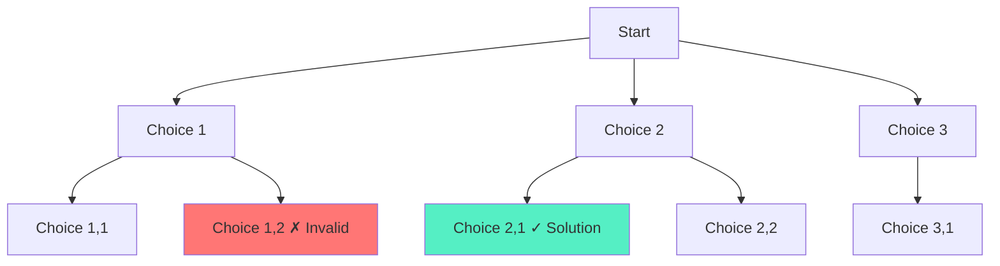

# Backtracking and Recursion: Complete Master Guide

## Overview
Backtracking is a powerful algorithmic paradigm for solving **constraint satisfaction** and **combinatorial** problems. It systematically explores all possible solutions by building candidates incrementally and abandoning ("backtracking") candidates that cannot lead to valid solutions.

**Key Insight**: Backtracking = DFS on a state space tree + pruning invalid branches.

For Senior/Staff Engineers, mastering backtracking means:
- Recognizing backtracking problems (permutations, combinations, subsets)
- Writing clean recursive code with proper state management
- Optimizing with pruning and memoization
- Understanding time complexity (often exponential)

---

## Table of Contents
1. [Fundamentals](#fundamentals)
2. [The Backtracking Template](#the-backtracking-template)
3. [Common Patterns](#common-patterns)
4. [15+ Solved Problems](#solved-problems)
5. [Optimization Techniques](#optimization-techniques)
6. [Interview Questions & Answers](#interview-questions--answers)
7. [Banking & Production Context](#banking--production-context)

---

## Fundamentals

### What is Backtracking?

**Definition**: Incrementally build candidates for solutions and abandon candidates ("backtrack") as soon as it's determined they cannot lead to a valid solution.

**Three key steps**:
1. **Choose**: Make a choice and add it to current state
2. **Explore**: Recursively explore with this choice
3. **Unchoose**: Remove the choice (backtrack) and try next option

**Visualization**:


### When to Use Backtracking

**Problem indicators**:
- "Find all possible..."
- "Generate all combinations/permutations..."
- "Can you place N items with constraints..."
- "Solve puzzle/game..."

**Common problem types**:
- Permutations and combinations
- Subset generation
- Constraint satisfaction (N-Queens, Sudoku)
- Path finding with constraints
- Partition problems

---

## The Backtracking Template

### Universal Template

```java
/**
 * Universal backtracking template.
 */
public void backtrack(List<Solution> result, State current, Input input) {
    // Base case: found a solution
    if (isGoal(current)) {
        result.add(new State(current));  // Make a copy!
        return;
    }
    
    // Try all possible choices
    for (Choice choice : getChoices(input, current)) {
        // Pruning: skip invalid choices
        if (!isValid(choice, current)) {
            continue;
        }
        
        // Make choice
        current.add(choice);
        
        // Explore with this choice
        backtrack(result, current, input);
        
        // Undo choice (backtrack)
        current.remove(choice);
    }
}
```

**Critical details**:
- **Copy state**: `result.add(new State(current))` - must copy, not reference
- **Pruning**: Check validity before recursing (optimization)
- **Backtrack**: Always undo changes after recursion

---

## Common Patterns

### Pattern 1: Permutations

**Problem**: Generate all permutations of array.

```java
/**
 * Generate all permutations.
 * Time: O(n!), Space: O(n) - recursion depth
 */
public List<List<Integer>> permute(int[] nums) {
    List<List<Integer>> result = new ArrayList<>();
    backtrack(result, new ArrayList<>(), nums, new boolean[nums.length]);
    return result;
}

private void backtrack(List<List<Integer>> result, List<Integer> current, 
                       int[] nums, boolean[] used) {
    if (current.size() == nums.length) {
        result.add(new ArrayList<>(current));
        return;
    }
    
    for (int i = 0; i < nums.length; i++) {
        if (used[i]) continue;  // Already used
        
        // Choose
        current.add(nums[i]);
        used[i] = true;
        
        // Explore
        backtrack(result, current, nums, used);
        
        // Unchoose
        current.remove(current.size() - 1);
        used[i] = false;
    }
}
```

### Pattern 2: Combinations

**Problem**: Generate all combinations of k numbers from 1 to n.

```java
/**
 * Generate all combinations.
 * Time: O(C(n,k)), Space: O(k)
 */
public List<List<Integer>> combine(int n, int k) {
    List<List<Integer>> result = new ArrayList<>();
    backtrack(result, new ArrayList<>(), 1, n, k);
    return result;
}

private void backtrack(List<List<Integer>> result, List<Integer> current,
                       int start, int n, int k) {
    if (current.size() == k) {
        result.add(new ArrayList<>(current));
        return;
    }
    
    for (int i = start; i <= n; i++) {
        current.add(i);
        backtrack(result, current, i + 1, n, k);  // i+1 to avoid duplicates
        current.remove(current.size() - 1);
    }
}
```

### Pattern 3: Subsets

**Problem**: Generate all subsets (power set).

```java
/**
 * Generate all subsets.
 * Time: O(2^n), Space: O(n)
 */
public List<List<Integer>> subsets(int[] nums) {
    List<List<Integer>> result = new ArrayList<>();
    backtrack(result, new ArrayList<>(), nums, 0);
    return result;
}

private void backtrack(List<List<Integer>> result, List<Integer> current,
                       int[] nums, int start) {
    result.add(new ArrayList<>(current));  // Add current subset
    
    for (int i = start; i < nums.length; i++) {
        current.add(nums[i]);
        backtrack(result, current, nums, i + 1);
        current.remove(current.size() - 1);
    }
}
```

---

## Solved Problems

### Problem 1: Letter Combinations of Phone Number (Medium)

```java
/**
 * Generate all letter combinations from phone number.
 * Time: O(4^n), Space: O(n)
 */
public List<String> letterCombinations(String digits) {
    List<String> result = new ArrayList<>();
    if (digits.isEmpty()) return result;
    
    String[] mapping = {"", "", "abc", "def", "ghi", "jkl", "mno", "pqrs", "tuv", "wxyz"};
    backtrack(result, new StringBuilder(), digits, 0, mapping);
    return result;
}

private void backtrack(List<String> result, StringBuilder current,
                       String digits, int index, String[] mapping) {
    if (index == digits.length()) {
        result.add(current.toString());
        return;
    }
    
    String letters = mapping[digits.charAt(index) - '0'];
    for (char c : letters.toCharArray()) {
        current.append(c);
        backtrack(result, current, digits, index + 1, mapping);
        current.deleteCharAt(current.length() - 1);
    }
}
```

### Problem 2: N-Queens (Hard)

```java
/**
 * Place N queens on N×N board.
 * Time: O(N!), Space: O(N)
 */
public List<List<String>> solveNQueens(int n) {
    List<List<String>> result = new ArrayList<>();
    char[][] board = new char[n][n];
    for (char[] row : board) Arrays.fill(row, '.');
    
    backtrack(result, board, 0, new HashSet<>(), new HashSet<>(), new HashSet<>());
    return result;
}

private void backtrack(List<List<String>> result, char[][] board, int row,
                       Set<Integer> cols, Set<Integer> diag1, Set<Integer> diag2) {
    if (row == board.length) {
        result.add(construct(board));
        return;
    }
    
    for (int col = 0; col < board.length; col++) {
        int d1 = row - col;
        int d2 = row + col;
        
        if (cols.contains(col) || diag1.contains(d1) || diag2.contains(d2)) {
            continue;  // Conflict
        }
        
        // Place queen
        board[row][col] = 'Q';
        cols.add(col);
        diag1.add(d1);
        diag2.add(d2);
        
        backtrack(result, board, row + 1, cols, diag1, diag2);
        
        // Remove queen
        board[row][col] = '.';
        cols.remove(col);
        diag1.remove(d1);
        diag2.remove(d2);
    }
}

private List<String> construct(char[][] board) {
    List<String> result = new ArrayList<>();
    for (char[] row : board) {
        result.add(new String(row));
    }
    return result;
}
```

### Problem 3: Sudoku Solver (Hard)

```java
/**
 * Solve Sudoku puzzle.
 * Time: O(9^(n²)) worst case, Space: O(1)
 */
public void solveSudoku(char[][] board) {
    backtrack(board);
}

private boolean backtrack(char[][] board) {
    for (int row = 0; row < 9; row++) {
        for (int col = 0; col < 9; col++) {
            if (board[row][col] != '.') continue;
            
            for (char num = '1'; num <= '9'; num++) {
                if (isValid(board, row, col, num)) {
                    board[row][col] = num;
                    
                    if (backtrack(board)) {
                        return true;  // Solution found
                    }
                    
                    board[row][col] = '.';  // Backtrack
                }
            }
            
            return false;  // No valid number for this cell
        }
    }
    
    return true;  // All cells filled
}

private boolean isValid(char[][] board, int row, int col, char num) {
    // Check row
    for (int i = 0; i < 9; i++) {
        if (board[row][i] == num) return false;
    }
    
    // Check column
    for (int i = 0; i < 9; i++) {
        if (board[i][col] == num) return false;
    }
    
    // Check 3×3 box
    int boxRow = (row / 3) * 3;
    int boxCol = (col / 3) * 3;
    for (int i = 0; i < 3; i++) {
        for (int j = 0; j < 3; j++) {
            if (board[boxRow + i][boxCol + j] == num) return false;
        }
    }
    
    return true;
}
```

### Problem 4: Word Search (Medium)

```java
/**
 * Find if word exists in board.
 * Time: O(m×n×4^L), Space: O(L) where L is word length
 */
public boolean exist(char[][] board, String word) {
    for (int i = 0; i < board.length; i++) {
        for (int j = 0; j < board[0].length; j++) {
            if (backtrack(board, word, i, j, 0)) {
                return true;
            }
        }
    }
    return false;
}

private boolean backtrack(char[][] board, String word, int row, int col, int index) {
    if (index == word.length()) return true;
    
    if (row < 0 || row >= board.length || col < 0 || col >= board[0].length ||
        board[row][col] != word.charAt(index)) {
        return false;
    }
    
    char temp = board[row][col];
    board[row][col] = '#';  // Mark as visited
    
    boolean found = backtrack(board, word, row + 1, col, index + 1) ||
                    backtrack(board, word, row - 1, col, index + 1) ||
                    backtrack(board, word, row, col + 1, index + 1) ||
                    backtrack(board, word, row, col - 1, index + 1);
    
    board[row][col] = temp;  // Restore
    
    return found;
}
```

### Problem 5: Palindrome Partitioning (Medium)

```java
/**
 * Partition string into palindromes.
 * Time: O(n×2^n), Space: O(n)
 */
public List<List<String>> partition(String s) {
    List<List<String>> result = new ArrayList<>();
    backtrack(result, new ArrayList<>(), s, 0);
    return result;
}

private void backtrack(List<List<String>> result, List<String> current,
                       String s, int start) {
    if (start == s.length()) {
        result.add(new ArrayList<>(current));
        return;
    }
    
    for (int end = start + 1; end <= s.length(); end++) {
        String substring = s.substring(start, end);
        if (isPalindrome(substring)) {
            current.add(substring);
            backtrack(result, current, s, end);
            current.remove(current.size() - 1);
        }
    }
}

private boolean isPalindrome(String s) {
    int left = 0, right = s.length() - 1;
    while (left < right) {
        if (s.charAt(left++) != s.charAt(right--)) {
            return false;
        }
    }
    return true;
}
```

### Problem 6: Generate Parentheses (Medium)

```java
/**
 * Generate all valid parentheses combinations.
 * Time: O(4^n / √n) - Catalan number, Space: O(n)
 */
public List<String> generateParenthesis(int n) {
    List<String> result = new ArrayList<>();
    backtrack(result, new StringBuilder(), 0, 0, n);
    return result;
}

private void backtrack(List<String> result, StringBuilder current,
                       int open, int close, int max) {
    if (current.length() == max * 2) {
        result.add(current.toString());
        return;
    }
    
    if (open < max) {
        current.append('(');
        backtrack(result, current, open + 1, close, max);
        current.deleteCharAt(current.length() - 1);
    }
    
    if (close < open) {
        current.append(')');
        backtrack(result, current, open, close + 1, max);
        current.deleteCharAt(current.length() - 1);
    }
}
```

### Problem 7: Combination Sum (Medium)

```java
/**
 * Find all combinations that sum to target.
 * Time: O(2^n), Space: O(target/min)
 */
public List<List<Integer>> combinationSum(int[] candidates, int target) {
    List<List<Integer>> result = new ArrayList<>();
    Arrays.sort(candidates);  // For pruning
    backtrack(result, new ArrayList<>(), candidates, target, 0);
    return result;
}

private void backtrack(List<List<Integer>> result, List<Integer> current,
                       int[] candidates, int remain, int start) {
    if (remain < 0) return;  // Pruning
    if (remain == 0) {
        result.add(new ArrayList<>(current));
        return;
    }
    
    for (int i = start; i < candidates.length; i++) {
        if (candidates[i] > remain) break;  // Pruning
        
        current.add(candidates[i]);
        backtrack(result, current, candidates, remain - candidates[i], i);
        current.remove(current.size() - 1);
    }
}
```

---

## Optimization Techniques

### 1. Pruning

**Skip branches that cannot lead to valid solutions.**

```java
// Example: Combination Sum
if (candidates[i] > remain) break;  // No point continuing
```

### 2. Sorting

**Sort input to enable pruning.**

```java
Arrays.sort(candidates);  // Allows early termination
```

### 3. Memoization

**Cache results of subproblems (converts to DP).**

```java
Map<String, List<String>> memo = new HashMap<>();
```

### 4. Bit Manipulation for Subsets

**Generate subsets using bit masks (alternative to backtracking).**

```java
for (int mask = 0; mask < (1 << n); mask++) {
    List<Integer> subset = new ArrayList<>();
    for (int i = 0; i < n; i++) {
        if ((mask & (1 << i)) != 0) {
            subset.add(nums[i]);
        }
    }
    result.add(subset);
}
```

---

## Interview Questions & Answers

### Q1: "Explain the difference between backtracking and dynamic programming."

**Model Answer:**
"Both solve problems by exploring subproblems, but with key differences:

**Backtracking**:
- Explores all possible solutions by building candidates incrementally
- Abandons candidates that violate constraints (pruning)
- Used for combinatorial problems (permutations, N-Queens)
- Time: Often exponential (O(2^n), O(n!))
- No overlapping subproblems

**Dynamic Programming**:
- Solves each subproblem once and stores result
- Requires overlapping subproblems and optimal substructure
- Used for optimization problems (shortest path, max profit)
- Time: Polynomial (O(n²), O(n×m))
- Memoizes results

**Example**:
- Backtracking: Generate all permutations of [1,2,3]
- DP: Find longest increasing subsequence

Sometimes we can convert backtracking to DP by adding memoization, but only if subproblems overlap. For example, in Fibonacci, naive recursion becomes DP with memoization."

### Q2: "How do you optimize backtracking solutions?"

**Model Answer:**
"I use several optimization techniques:

**1. Pruning**: Skip invalid branches early
```java
if (currentSum > target) return;  // Don't explore further
```

**2. Sorting**: Enable early termination
```java
Arrays.sort(candidates);
if (candidates[i] > remain) break;
```

**3. Constraint propagation**: Update constraints as we go
```java
// N-Queens: Track occupied columns, diagonals
Set<Integer> cols, diag1, diag2;
```

**4. Choose optimal order**: Try most constrained choices first
```java
// Sudoku: Fill cells with fewest possibilities first
```

**5. Memoization**: Cache results if subproblems overlap
```java
Map<State, Result> memo;
```

In production, I've used backtracking for resource allocation problems in banking systems. Pruning is critical—without it, the search space explodes. For example, in portfolio construction with regulatory constraints, we prune entire branches that violate capital requirements early."

### Q3: "What's the time complexity of generating all permutations?"

**Model Answer:**
"The time complexity is **O(n! × n)**:

**Why n!?**
- There are n! permutations of n elements
- For n=5: 5! = 120 permutations

**Why × n?**
- Each permutation requires O(n) time to copy to result list

**Space complexity**: O(n)
- Recursion depth: O(n)
- Current permutation: O(n)
- Not counting output space

**Breakdown**:
```
Level 0: 1 call
Level 1: n calls
Level 2: n×(n-1) calls
...
Level n: n! calls

Total: 1 + n + n(n-1) + ... + n! ≈ O(n!)
```

This exponential growth is why backtracking problems are computationally expensive. In interviews, I always mention this and discuss whether the problem size allows exponential solutions. For n > 15-20, backtracking may be impractical without aggressive pruning."

---

## 🏦 Banking & Production Context

### Portfolio Construction with Constraints

**Scenario**: Select assets satisfying regulatory constraints.

```java
/**
 * Find portfolios satisfying constraints.
 * Constraints: max 5% in tech, min 10% in bonds, etc.
 */
class PortfolioOptimizer {
    public List<Portfolio> findValidPortfolios(List<Asset> assets, Constraints constraints) {
        List<Portfolio> result = new ArrayList<>();
        backtrack(result, new Portfolio(), assets, 0, constraints);
        return result;
    }
    
    private void backtrack(List<Portfolio> result, Portfolio current,
                           List<Asset> assets, int index, Constraints constraints) {
        if (!constraints.isValid(current)) return;  // Pruning
        
        if (index == assets.size()) {
            if (constraints.isComplete(current)) {
                result.add(new Portfolio(current));
            }
            return;
        }
        
        // Try including asset
        current.add(assets.get(index));
        backtrack(result, current, assets, index + 1, constraints);
        current.remove(assets.get(index));
        
        // Try excluding asset
        backtrack(result, current, assets, index + 1, constraints);
    }
}
```

### Trade Execution Optimization

**Scenario**: Find optimal sequence of trades to minimize market impact.

Uses backtracking with pruning based on liquidity constraints.

---

## Key Takeaways

1. **Template**: Choose → Explore → Unchoose
2. **Copy state**: Always copy when adding to result
3. **Pruning**: Skip invalid branches early
4. **Time complexity**: Often exponential (O(2^n), O(n!))
5. **Use cases**: Permutations, combinations, constraint satisfaction
6. **Optimization**: Sorting, pruning, memoization
7. **Production**: Portfolio construction, resource allocation

---

**Next**: [Greedy Algorithms](19-greedy-algorithms.md)
