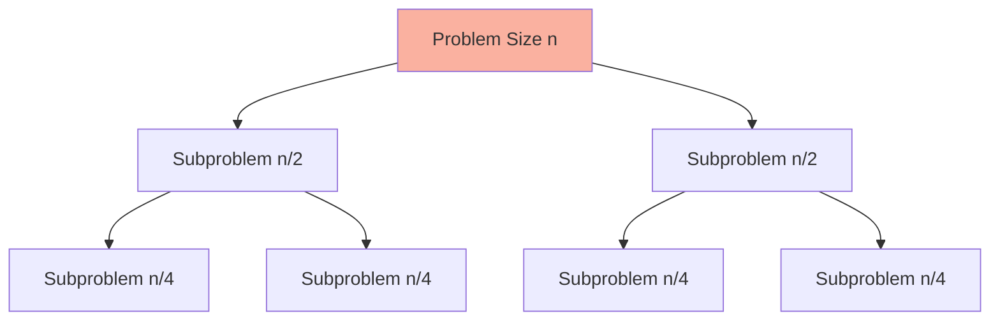

# Divide and Conquer - Complete Master Guide

## Overview
Divide and Conquer is a powerful algorithmic paradigm that breaks problems into smaller subproblems, solves them recursively, and combines their solutions. It's the foundation for many efficient algorithms including merge sort, quick sort, and binary search.

**Key Insight**: Divide and Conquer = Divide + Conquer + Combine

For Senior/Staff Engineers, mastering divide and conquer means:
- Understanding the three-step pattern
- Analyzing complexity using Master Theorem
- Recognizing when to use divide and conquer vs dynamic programming
- Discussing production applications (MapReduce, parallel processing)

---

## Table of Contents
1. [Fundamentals](#fundamentals)
2. [Master Theorem](#master-theorem)
3. [Common Patterns](#common-patterns)
4. [15+ Solved Problems](#solved-problems)
5. [Advanced Topics](#advanced-topics)
6. [Interview Questions & Answers](#interview-questions--answers)
7. [Banking & Production Context](#banking--production-context)

---

## Fundamentals

### The Three Steps

**1. Divide**: Break problem into smaller subproblems  
**2. Conquer**: Solve subproblems recursively  
**3. Combine**: Merge solutions of subproblems  

### Template

```java
public ReturnType divideAndConquer(Input input) {
    // Base case
    if (isBaseCase(input)) {
        return solveDirectly(input);
    }
    
    // Divide
    List<SubInput> subproblems = divide(input);
    
    // Conquer
    List<SubResult> subresults = new ArrayList<>();
    for (SubInput sub : subproblems) {
        subresults.add(divideAndConquer(sub));
    }
    
    // Combine
    return combine(subresults);
}
```

### Visualization



---

## Master Theorem

### Formula

For recurrence: **T(n) = aT(n/b) + f(n)**

Where:
- `a`: Number of subproblems
- `b`: Factor by which problem size is divided
- `f(n)`: Cost of divide + combine steps

### Three Cases

**Case 1**: If f(n) = O(n^c) where c < log_b(a)  
→ **T(n) = Θ(n^(log_b(a)))**

**Case 2**: If f(n) = Θ(n^c) where c = log_b(a)  
→ **T(n) = Θ(n^c log n)**

**Case 3**: If f(n) = Ω(n^c) where c > log_b(a)  
→ **T(n) = Θ(f(n))**

### Examples

**Merge Sort**: T(n) = 2T(n/2) + O(n)
- a=2, b=2, f(n)=n
- log_2(2) = 1, so c = 1
- Case 2: **T(n) = O(n log n)**

**Binary Search**: T(n) = T(n/2) + O(1)
- a=1, b=2, f(n)=1
- log_2(1) = 0, so c = 0
- Case 2: **T(n) = O(log n)**

**Strassen's Matrix Multiplication**: T(n) = 7T(n/2) + O(n²)
- a=7, b=2, f(n)=n²
- log_2(7) ≈ 2.81 > 2
- Case 1: **T(n) = O(n^2.81)**

---

## Common Patterns

### Pattern 1: Merge Sort

```java
/**
 * Merge sort implementation.
 * Time: O(n log n), Space: O(n)
 */
public void mergeSort(int[] arr) {
    if (arr.length <= 1) return;
    
    mergeSortHelper(arr, 0, arr.length - 1);
}

private void mergeSortHelper(int[] arr, int left, int right) {
    if (left >= right) return;
    
    // Divide
    int mid = left + (right - left) / 2;
    
    // Conquer
    mergeSortHelper(arr, left, mid);
    mergeSortHelper(arr, mid + 1, right);
    
    // Combine
    merge(arr, left, mid, right);
}

private void merge(int[] arr, int left, int mid, int right) {
    int[] temp = new int[right - left + 1];
    int i = left, j = mid + 1, k = 0;
    
    while (i <= mid && j <= right) {
        if (arr[i] <= arr[j]) {
            temp[k++] = arr[i++];
        } else {
            temp[k++] = arr[j++];
        }
    }
    
    while (i <= mid) temp[k++] = arr[i++];
    while (j <= right) temp[k++] = arr[j++];
    
    System.arraycopy(temp, 0, arr, left, temp.length);
}
```

### Pattern 2: Quick Sort

```java
/**
 * Quick sort implementation.
 * Time: O(n log n) average, O(n²) worst, Space: O(log n)
 */
public void quickSort(int[] arr) {
    quickSortHelper(arr, 0, arr.length - 1);
}

private void quickSortHelper(int[] arr, int left, int right) {
    if (left >= right) return;
    
    // Divide (partition)
    int pivotIndex = partition(arr, left, right);
    
    // Conquer
    quickSortHelper(arr, left, pivotIndex - 1);
    quickSortHelper(arr, pivotIndex + 1, right);
}

private int partition(int[] arr, int left, int right) {
    int pivot = arr[right];
    int i = left - 1;
    
    for (int j = left; j < right; j++) {
        if (arr[j] <= pivot) {
            i++;
            swap(arr, i, j);
        }
    }
    
    swap(arr, i + 1, right);
    return i + 1;
}

private void swap(int[] arr, int i, int j) {
    int temp = arr[i];
    arr[i] = arr[j];
    arr[j] = temp;
}
```

### Pattern 3: Binary Search (Divide and Conquer)

```java
/**
 * Binary search using divide and conquer.
 * Time: O(log n), Space: O(log n)
 */
public int binarySearch(int[] arr, int target) {
    return binarySearchHelper(arr, target, 0, arr.length - 1);
}

private int binarySearchHelper(int[] arr, int target, int left, int right) {
    if (left > right) return -1;
    
    // Divide
    int mid = left + (right - left) / 2;
    
    if (arr[mid] == target) return mid;
    
    // Conquer
    if (target < arr[mid]) {
        return binarySearchHelper(arr, target, left, mid - 1);
    } else {
        return binarySearchHelper(arr, target, mid + 1, right);
    }
}
```

---

## Solved Problems

### Problem 1: Maximum Subarray (Medium)

```java
/**
 * Find maximum sum subarray using divide and conquer.
 * Time: O(n log n), Space: O(log n)
 */
public int maxSubArray(int[] nums) {
    return maxSubArrayHelper(nums, 0, nums.length - 1);
}

private int maxSubArrayHelper(int[] nums, int left, int right) {
    if (left == right) return nums[left];
    
    int mid = left + (right - left) / 2;
    
    int leftMax = maxSubArrayHelper(nums, left, mid);
    int rightMax = maxSubArrayHelper(nums, mid + 1, right);
    int crossMax = maxCrossingSum(nums, left, mid, right);
    
    return Math.max(Math.max(leftMax, rightMax), crossMax);
}

private int maxCrossingSum(int[] nums, int left, int mid, int right) {
    int leftSum = Integer.MIN_VALUE;
    int sum = 0;
    for (int i = mid; i >= left; i--) {
        sum += nums[i];
        leftSum = Math.max(leftSum, sum);
    }
    
    int rightSum = Integer.MIN_VALUE;
    sum = 0;
    for (int i = mid + 1; i <= right; i++) {
        sum += nums[i];
        rightSum = Math.max(rightSum, sum);
    }
    
    return leftSum + rightSum;
}
```

### Problem 2: Merge K Sorted Lists (Hard)

```java
/**
 * Merge k sorted lists using divide and conquer.
 * Time: O(n log k), Space: O(log k)
 */
public ListNode mergeKLists(ListNode[] lists) {
    if (lists == null || lists.length == 0) return null;
    return mergeKListsHelper(lists, 0, lists.length - 1);
}

private ListNode mergeKListsHelper(ListNode[] lists, int left, int right) {
    if (left == right) return lists[left];
    
    int mid = left + (right - left) / 2;
    
    ListNode l1 = mergeKListsHelper(lists, left, mid);
    ListNode l2 = mergeKListsHelper(lists, mid + 1, right);
    
    return mergeTwoLists(l1, l2);
}

private ListNode mergeTwoLists(ListNode l1, ListNode l2) {
    ListNode dummy = new ListNode(0);
    ListNode curr = dummy;
    
    while (l1 != null && l2 != null) {
        if (l1.val <= l2.val) {
            curr.next = l1;
            l1 = l1.next;
        } else {
            curr.next = l2;
            l2 = l2.next;
        }
        curr = curr.next;
    }
    
    curr.next = (l1 != null) ? l1 : l2;
    return dummy.next;
}
```

### Problem 3: Count of Smaller Numbers After Self (Hard)

```java
/**
 * Count smaller numbers after self using merge sort.
 * Time: O(n log n), Space: O(n)
 */
public List<Integer> countSmaller(int[] nums) {
    int n = nums.length;
    int[] result = new int[n];
    int[] indices = new int[n];
    
    for (int i = 0; i < n; i++) {
        indices[i] = i;
    }
    
    mergeSort(nums, indices, result, 0, n - 1);
    
    List<Integer> list = new ArrayList<>();
    for (int count : result) {
        list.add(count);
    }
    return list;
}

private void mergeSort(int[] nums, int[] indices, int[] result, int left, int right) {
    if (left >= right) return;
    
    int mid = left + (right - left) / 2;
    mergeSort(nums, indices, result, left, mid);
    mergeSort(nums, indices, result, mid + 1, right);
    merge(nums, indices, result, left, mid, right);
}

private void merge(int[] nums, int[] indices, int[] result, int left, int mid, int right) {
    int[] temp = new int[right - left + 1];
    int i = left, j = mid + 1, k = 0;
    int rightCount = 0;
    
    while (i <= mid && j <= right) {
        if (nums[indices[j]] < nums[indices[i]]) {
            temp[k++] = indices[j++];
            rightCount++;
        } else {
            result[indices[i]] += rightCount;
            temp[k++] = indices[i++];
        }
    }
    
    while (i <= mid) {
        result[indices[i]] += rightCount;
        temp[k++] = indices[i++];
    }
    
    while (j <= right) {
        temp[k++] = indices[j++];
    }
    
    System.arraycopy(temp, 0, indices, left, temp.length);
}
```

### Problem 4: Closest Pair of Points (Medium)

```java
/**
 * Find closest pair of points in 2D plane.
 * Time: O(n log n), Space: O(n)
 */
public double closestPair(int[][] points) {
    Arrays.sort(points, (a, b) -> a[0] - b[0]);
    return closestPairHelper(points, 0, points.length - 1);
}

private double closestPairHelper(int[][] points, int left, int right) {
    if (right - left <= 3) {
        return bruteForce(points, left, right);
    }
    
    int mid = left + (right - left) / 2;
    int midX = points[mid][0];
    
    double leftMin = closestPairHelper(points, left, mid);
    double rightMin = closestPairHelper(points, mid + 1, right);
    
    double d = Math.min(leftMin, rightMin);
    
    List<int[]> strip = new ArrayList<>();
    for (int i = left; i <= right; i++) {
        if (Math.abs(points[i][0] - midX) < d) {
            strip.add(points[i]);
        }
    }
    
    return Math.min(d, stripClosest(strip, d));
}

private double bruteForce(int[][] points, int left, int right) {
    double min = Double.MAX_VALUE;
    for (int i = left; i <= right; i++) {
        for (int j = i + 1; j <= right; j++) {
            min = Math.min(min, distance(points[i], points[j]));
        }
    }
    return min;
}

private double stripClosest(List<int[]> strip, double d) {
    double min = d;
    strip.sort((a, b) -> a[1] - b[1]);
    
    for (int i = 0; i < strip.size(); i++) {
        for (int j = i + 1; j < strip.size() && 
             (strip.get(j)[1] - strip.get(i)[1]) < min; j++) {
            min = Math.min(min, distance(strip.get(i), strip.get(j)));
        }
    }
    
    return min;
}

private double distance(int[] p1, int[] p2) {
    int dx = p1[0] - p2[0];
    int dy = p1[1] - p2[1];
    return Math.sqrt(dx * dx + dy * dy);
}
```

### Problem 5: Median of Two Sorted Arrays (Hard)

```java
/**
 * Find median of two sorted arrays.
 * Time: O(log(min(m,n))), Space: O(1)
 */
public double findMedianSortedArrays(int[] nums1, int[] nums2) {
    if (nums1.length > nums2.length) {
        return findMedianSortedArrays(nums2, nums1);
    }
    
    int m = nums1.length, n = nums2.length;
    int left = 0, right = m;
    
    while (left <= right) {
        int partition1 = left + (right - left) / 2;
        int partition2 = (m + n + 1) / 2 - partition1;
        
        int maxLeft1 = (partition1 == 0) ? Integer.MIN_VALUE : nums1[partition1 - 1];
        int minRight1 = (partition1 == m) ? Integer.MAX_VALUE : nums1[partition1];
        
        int maxLeft2 = (partition2 == 0) ? Integer.MIN_VALUE : nums2[partition2 - 1];
        int minRight2 = (partition2 == n) ? Integer.MAX_VALUE : nums2[partition2];
        
        if (maxLeft1 <= minRight2 && maxLeft2 <= minRight1) {
            if ((m + n) % 2 == 0) {
                return (Math.max(maxLeft1, maxLeft2) + Math.min(minRight1, minRight2)) / 2.0;
            } else {
                return Math.max(maxLeft1, maxLeft2);
            }
        } else if (maxLeft1 > minRight2) {
            right = partition1 - 1;
        } else {
            left = partition1 + 1;
        }
    }
    
    throw new IllegalArgumentException();
}
```

---

## Interview Questions & Answers

### Q1: "When should you use divide and conquer vs dynamic programming?"

**Model Answer:**
"I choose based on subproblem overlap:

**Use Divide and Conquer when**:
- Subproblems are independent (no overlap)
- Can solve in parallel
- Examples: Merge sort, quick sort, binary search

**Use Dynamic Programming when**:
- Subproblems overlap (same subproblem solved multiple times)
- Need to cache results
- Examples: Fibonacci, longest common subsequence

**Key difference**:
```
Divide and Conquer: T(n) = 2T(n/2) + O(n) → O(n log n)
Dynamic Programming: T(n) = T(n-1) + T(n-2) → O(2^n) without memoization, O(n) with

Fibonacci:
- Divide and Conquer: Recalculates same values → O(2^n)
- DP with memoization: Caches results → O(n)
```

**Production example**:
In banking:
- Use divide and conquer for parallel transaction processing (independent)
- Use DP for portfolio optimization (overlapping subproblems)

**Hybrid**: Some problems use both—divide into independent subproblems, solve each with DP."

### Q2: "Explain the Master Theorem and give examples."

**Model Answer:**
"Master Theorem analyzes divide-and-conquer recurrences of form T(n) = aT(n/b) + f(n):

**Parameters**:
- `a`: Number of subproblems
- `b`: Factor of size reduction
- `f(n)`: Work outside recursion

**Three cases** (comparing f(n) with n^(log_b(a))):

**Case 1**: f(n) grows slower → T(n) = Θ(n^(log_b(a)))
**Case 2**: f(n) grows same → T(n) = Θ(n^(log_b(a)) log n)
**Case 3**: f(n) grows faster → T(n) = Θ(f(n))

**Examples**:

**Merge Sort**: T(n) = 2T(n/2) + O(n)
- a=2, b=2, f(n)=n
- log_2(2) = 1, so n^1 = n
- Case 2: T(n) = O(n log n)

**Binary Search**: T(n) = T(n/2) + O(1)
- a=1, b=2, f(n)=1
- log_2(1) = 0, so n^0 = 1
- Case 2: T(n) = O(log n)

**Karatsuba Multiplication**: T(n) = 3T(n/2) + O(n)
- a=3, b=2, f(n)=n
- log_2(3) ≈ 1.58 > 1
- Case 1: T(n) = O(n^1.58)

**Production use**: Analyzing algorithm scalability before implementation."

### Q3: "Why is merge sort preferred over quick sort in certain scenarios?"

**Model Answer:**
"I choose based on requirements:

**Merge Sort advantages**:
- **Stable**: Preserves relative order of equal elements
- **Guaranteed O(n log n)**: No worst case O(n²)
- **Predictable**: Always same performance
- **External sorting**: Works well with disk-based data
- **Parallel**: Easy to parallelize

**Quick Sort advantages**:
- **In-place**: O(1) space vs merge sort's O(n)
- **Cache-friendly**: Better locality of reference
- **Average case faster**: Lower constant factors
- **Practical**: Usually faster in practice

**When to use Merge Sort**:
1. **Stability required**: Sorting objects by multiple keys
2. **Linked lists**: No random access penalty
3. **External sorting**: Large datasets on disk
4. **Guaranteed performance**: Real-time systems
5. **Parallel processing**: Easy to distribute

**When to use Quick Sort**:
1. **Memory constrained**: In-place sorting
2. **Arrays**: Random access available
3. **Average case matters**: Most data is random
4. **Cache performance**: Important for large datasets

**Production example**:
In banking:
- Use merge sort for transaction logs (stability for timestamp ties)
- Use quick sort for in-memory price sorting (memory efficient)

**Java's choice**: 
- `Arrays.sort(primitives)`: Dual-pivot quick sort
- `Arrays.sort(objects)`: Timsort (merge sort variant) for stability"

---

## 🏦 Banking & Production Context

### MapReduce for Transaction Processing

**Scenario**: Process billions of transactions in parallel.

```java
/**
 * MapReduce pattern for transaction aggregation.
 */
class TransactionProcessor {
    public Map<String, Double> aggregateTransactions(List<Transaction> transactions) {
        // Divide
        int processors = Runtime.getRuntime().availableProcessors();
        int chunkSize = transactions.size() / processors;
        List<List<Transaction>> chunks = new ArrayList<>();
        
        for (int i = 0; i < transactions.size(); i += chunkSize) {
            chunks.add(transactions.subList(i, 
                Math.min(i + chunkSize, transactions.size())));
        }
        
        // Conquer (Map phase - parallel)
        List<Map<String, Double>> partialResults = chunks.parallelStream()
            .map(this::mapPhase)
            .collect(Collectors.toList());
        
        // Combine (Reduce phase)
        return reducePhase(partialResults);
    }
    
    private Map<String, Double> mapPhase(List<Transaction> chunk) {
        Map<String, Double> result = new HashMap<>();
        for (Transaction txn : chunk) {
            result.merge(txn.accountId, txn.amount, Double::sum);
        }
        return result;
    }
    
    private Map<String, Double> reducePhase(List<Map<String, Double>> partialResults) {
        Map<String, Double> final Result = new HashMap<>();
        for (Map<String, Double> partial : partialResults) {
            partial.forEach((key, value) -> 
                finalResult.merge(key, value, Double::sum));
        }
        return finalResult;
    }
}
```

---

## Key Takeaways

1. **Three steps**: Divide, Conquer, Combine
2. **Master Theorem**: Analyze complexity of divide-and-conquer algorithms
3. **vs DP**: Use D&C for independent subproblems, DP for overlapping
4. **Merge Sort**: O(n log n) guaranteed, stable, O(n) space
5. **Quick Sort**: O(n log n) average, in-place, unstable
6. **Parallelization**: D&C naturally parallelizes (MapReduce)
7. **Production**: Transaction processing, parallel algorithms, sorting

---

**Next**: [Binary Search](21-binary-search.md)
