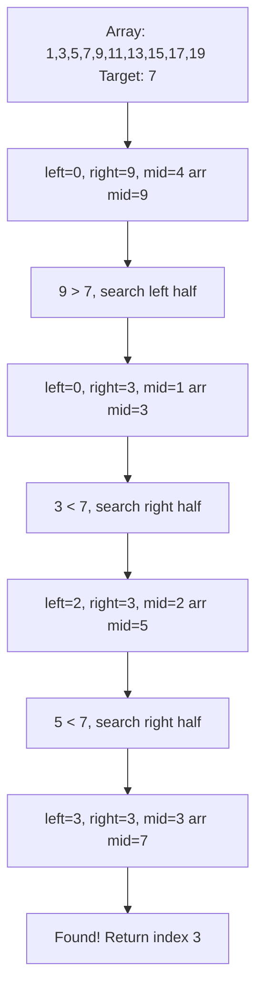

# Binary Search: Complete Master Guide

## Overview
Binary Search is one of the **most fundamental and powerful** algorithmic techniques. It reduces search space by half in each step, achieving **O(log n)** time complexity. Beyond simple searching, binary search is used in optimization problems, finding boundaries, and "binary search on answer" patterns.

For Senior/Staff Engineers, mastering binary search means:
- Writing bug-free binary search code (tricky edge cases!)
- Recognizing when to apply binary search (monotonicity)
- Using "binary search on answer" for optimization problems
- Understanding variants (lower_bound, upper_bound, rotated arrays)

**Key Insight**: Binary search works on any **monotonic** function, not just sorted arrays.

---

## Table of Contents
1. [Fundamentals](#fundamentals)
2. [Templates & Variants](#templates--variants)
3. [Common Patterns](#common-patterns)
4. [15+ Solved Problems](#solved-problems)
5. [Binary Search on Answer](#binary-search-on-answer)
6. [Interview Questions & Answers](#interview-questions--answers)
7. [Banking & Production Context](#banking--production-context)

---

## Fundamentals

### The Core Idea

**Problem**: Find target in sorted array.

**Naive approach**: Linear search - O(n)

**Binary search**: Check middle element, eliminate half - O(log n)

**Why log n?** Each iteration halves the search space:
- n → n/2 → n/4 → n/8 → ... → 1
- Number of steps = log₂(n)

**Example**: Array of 1 million elements
- Linear search: up to 1,000,000 comparisons
- Binary search: at most 20 comparisons (log₂(1,000,000) ≈ 20)

### Visualization



---

## Templates & Variants

### Template 1: Standard Binary Search

**Use when**: Find exact target in sorted array.

```java
/**
 * Standard binary search.
 * Returns index of target, or -1 if not found.
 * Time: O(log n), Space: O(1)
 */
public int binarySearch(int[] nums, int target) {
    int left = 0;
    int right = nums.length - 1;
    
    while (left <= right) {
        int mid = left + (right - left) / 2;  // Prevent overflow
        
        if (nums[mid] == target) {
            return mid;
        } else if (nums[mid] < target) {
            left = mid + 1;  // Search right half
        } else {
            right = mid - 1;  // Search left half
        }
    }
    
    return -1;  // Not found
}
```

**Critical details:**
- `mid = left + (right - left) / 2` prevents integer overflow
- `left <= right` (not `left < right`) to handle single element
- `left = mid + 1` and `right = mid - 1` (not `mid`) to avoid infinite loop

### Template 2: Lower Bound (First Occurrence)

**Use when**: Find first position where `nums[i] >= target`.

```java
/**
 * Find first position >= target (lower_bound in C++).
 * Returns index, or nums.length if all elements < target.
 */
public int lowerBound(int[] nums, int target) {
    int left = 0;
    int right = nums.length;  // Note: length, not length-1
    
    while (left < right) {  // Note: <, not <=
        int mid = left + (right - left) / 2;
        
        if (nums[mid] < target) {
            left = mid + 1;
        } else {
            right = mid;  // Note: mid, not mid-1
        }
    }
    
    return left;
}
```

### Template 3: Upper Bound (Last Occurrence)

**Use when**: Find last position where `nums[i] <= target`.

```java
/**
 * Find last position <= target (upper_bound in C++).
 * Returns index, or -1 if all elements > target.
 */
public int upperBound(int[] nums, int target) {
    int left = -1;
    int right = nums.length - 1;
    
    while (left < right) {
        int mid = left + (right - left + 1) / 2;  // Ceiling division
        
        if (nums[mid] <= target) {
            left = mid;
        } else {
            right = mid - 1;
        }
    }
    
    return left;
}
```

### Template 4: Binary Search on Answer

**Use when**: Find minimum/maximum value that satisfies a condition.

```java
/**
 * Find minimum value that satisfies condition.
 * Condition must be monotonic: if check(x) is true, check(x+1) is also true.
 */
public int binarySearchOnAnswer(int left, int right) {
    while (left < right) {
        int mid = left + (right - left) / 2;
        
        if (check(mid)) {
            right = mid;  // Try smaller values
        } else {
            left = mid + 1;  // Need larger values
        }
    }
    
    return left;
}

private boolean check(int value) {
    // Return true if 'value' satisfies the condition
    return /* condition */;
}
```

---

## Common Patterns

### Pattern 1: Search in Rotated Sorted Array

**Problem**: Array was sorted, then rotated. Find target.

**Example**: `[4,5,6,7,0,1,2]`, target = 0

**Key insight**: One half is always sorted.

```java
/**
 * Search in rotated sorted array.
 * Time: O(log n), Space: O(1)
 */
public int search(int[] nums, int target) {
    int left = 0, right = nums.length - 1;
    
    while (left <= right) {
        int mid = left + (right - left) / 2;
        
        if (nums[mid] == target) return mid;
        
        // Left half is sorted
        if (nums[left] <= nums[mid]) {
            if (target >= nums[left] && target < nums[mid]) {
                right = mid - 1;  // Target in left half
            } else {
                left = mid + 1;   // Target in right half
            }
        }
        // Right half is sorted
        else {
            if (target > nums[mid] && target <= nums[right]) {
                left = mid + 1;   // Target in right half
            } else {
                right = mid - 1;  // Target in left half
            }
        }
    }
    
    return -1;
}
```

### Pattern 2: Find Peak Element

**Problem**: Find any peak (element greater than neighbors).

```java
/**
 * Find peak element.
 * Time: O(log n), Space: O(1)
 */
public int findPeakElement(int[] nums) {
    int left = 0, right = nums.length - 1;
    
    while (left < right) {
        int mid = left + (right - left) / 2;
        
        if (nums[mid] < nums[mid + 1]) {
            left = mid + 1;  // Peak is on right
        } else {
            right = mid;     // Peak is on left or at mid
        }
    }
    
    return left;
}
```

### Pattern 3: Search in 2D Matrix

**Problem**: Search in row-wise and column-wise sorted matrix.

```java
/**
 * Search in 2D matrix (each row sorted, first element of row > last of previous).
 * Time: O(log(m×n)), Space: O(1)
 */
public boolean searchMatrix(int[][] matrix, int target) {
    if (matrix.length == 0) return false;
    
    int m = matrix.length;
    int n = matrix[0].length;
    int left = 0, right = m * n - 1;
    
    while (left <= right) {
        int mid = left + (right - left) / 2;
        int midValue = matrix[mid / n][mid % n];  // Convert 1D to 2D
        
        if (midValue == target) {
            return true;
        } else if (midValue < target) {
            left = mid + 1;
        } else {
            right = mid - 1;
        }
    }
    
    return false;
}
```

---

## Solved Problems

### Problem 1: First Bad Version (Easy)

**Problem**: Find first bad version using `isBadVersion(version)` API.

```java
/**
 * Find first bad version.
 * Time: O(log n), Space: O(1)
 */
public int firstBadVersion(int n) {
    int left = 1, right = n;
    
    while (left < right) {
        int mid = left + (right - left) / 2;
        
        if (isBadVersion(mid)) {
            right = mid;  // First bad is at mid or before
        } else {
            left = mid + 1;  // First bad is after mid
        }
    }
    
    return left;
}
```

### Problem 2: Find Minimum in Rotated Sorted Array (Medium)

```java
/**
 * Find minimum in rotated sorted array.
 * Time: O(log n), Space: O(1)
 */
public int findMin(int[] nums) {
    int left = 0, right = nums.length - 1;
    
    while (left < right) {
        int mid = left + (right - left) / 2;
        
        if (nums[mid] > nums[right]) {
            left = mid + 1;  // Minimum is in right half
        } else {
            right = mid;     // Minimum is in left half or at mid
        }
    }
    
    return nums[left];
}
```

### Problem 3: Koko Eating Bananas (Medium)

**Problem**: Find minimum eating speed K to finish all bananas in H hours.

**Pattern**: Binary search on answer (speed).

```java
/**
 * Minimum eating speed.
 * Time: O(n × log m), where m is max pile size
 * Space: O(1)
 */
public int minEatingSpeed(int[] piles, int h) {
    int left = 1;
    int right = Arrays.stream(piles).max().getAsInt();
    
    while (left < right) {
        int mid = left + (right - left) / 2;
        
        if (canFinish(piles, h, mid)) {
            right = mid;  // Try slower speed
        } else {
            left = mid + 1;  // Need faster speed
        }
    }
    
    return left;
}

private boolean canFinish(int[] piles, int h, int speed) {
    long hours = 0;
    for (int pile : piles) {
        hours += (pile + speed - 1) / speed;  // Ceiling division
    }
    return hours <= h;
}
```

**Dry Run:**
```
piles = [3,6,7,11], h = 8

Binary search on speed [1, 11]:
mid = 6: hours = 1+1+2+2 = 6 ≤ 8 ✓ → try slower [1, 6]
mid = 3: hours = 1+2+3+4 = 10 > 8 ✗ → need faster [4, 6]
mid = 5: hours = 1+2+2+3 = 8 ≤ 8 ✓ → try slower [4, 5]
mid = 4: hours = 1+2+2+3 = 8 ≤ 8 ✓ → try slower [4, 4]

Answer: 4
```

### Problem 4: Capacity To Ship Packages Within D Days (Medium)

```java
/**
 * Minimum ship capacity to ship all packages in D days.
 * Time: O(n × log(sum - max)), Space: O(1)
 */
public int shipWithinDays(int[] weights, int days) {
    int left = Arrays.stream(weights).max().getAsInt();  // Min capacity
    int right = Arrays.stream(weights).sum();             // Max capacity
    
    while (left < right) {
        int mid = left + (right - left) / 2;
        
        if (canShip(weights, days, mid)) {
            right = mid;  // Try smaller capacity
        } else {
            left = mid + 1;  // Need larger capacity
        }
    }
    
    return left;
}

private boolean canShip(int[] weights, int days, int capacity) {
    int daysNeeded = 1;
    int currentLoad = 0;
    
    for (int weight : weights) {
        if (currentLoad + weight > capacity) {
            daysNeeded++;
            currentLoad = 0;
        }
        currentLoad += weight;
    }
    
    return daysNeeded <= days;
}
```

### Problem 5: Find K Closest Elements (Medium)

```java
/**
 * Find k closest elements to x.
 * Time: O(log n + k), Space: O(1)
 */
public List<Integer> findClosestElements(int[] arr, int k, int x) {
    int left = 0;
    int right = arr.length - k;
    
    while (left < right) {
        int mid = left + (right - left) / 2;
        
        // Compare distances from x
        if (x - arr[mid] > arr[mid + k] - x) {
            left = mid + 1;  // Window should be more to the right
        } else {
            right = mid;     // Window should be more to the left
        }
    }
    
    List<Integer> result = new ArrayList<>();
    for (int i = left; i < left + k; i++) {
        result.add(arr[i]);
    }
    return result;
}
```

### Problem 6: Split Array Largest Sum (Hard)

**Problem**: Split array into m subarrays, minimize the largest sum.

```java
/**
 * Minimize largest subarray sum.
 * Time: O(n × log(sum)), Space: O(1)
 */
public int splitArray(int[] nums, int m) {
    int left = Arrays.stream(nums).max().getAsInt();  // Min possible max sum
    int right = Arrays.stream(nums).sum();             // Max possible max sum
    
    while (left < right) {
        int mid = left + (right - left) / 2;
        
        if (canSplit(nums, m, mid)) {
            right = mid;  // Try smaller max sum
        } else {
            left = mid + 1;  // Need larger max sum
        }
    }
    
    return left;
}

private boolean canSplit(int[] nums, int m, int maxSum) {
    int subarrays = 1;
    int currentSum = 0;
    
    for (int num : nums) {
        if (currentSum + num > maxSum) {
            subarrays++;
            currentSum = 0;
        }
        currentSum += num;
    }
    
    return subarrays <= m;
}
```

### Problem 7: Median of Two Sorted Arrays (Hard)

```java
/**
 * Find median of two sorted arrays.
 * Time: O(log(min(m,n))), Space: O(1)
 */
public double findMedianSortedArrays(int[] nums1, int[] nums2) {
    if (nums1.length > nums2.length) {
        return findMedianSortedArrays(nums2, nums1);  // Ensure nums1 is smaller
    }
    
    int m = nums1.length;
    int n = nums2.length;
    int left = 0, right = m;
    
    while (left <= right) {
        int partition1 = left + (right - left) / 2;
        int partition2 = (m + n + 1) / 2 - partition1;
        
        int maxLeft1 = (partition1 == 0) ? Integer.MIN_VALUE : nums1[partition1 - 1];
        int minRight1 = (partition1 == m) ? Integer.MAX_VALUE : nums1[partition1];
        
        int maxLeft2 = (partition2 == 0) ? Integer.MIN_VALUE : nums2[partition2 - 1];
        int minRight2 = (partition2 == n) ? Integer.MAX_VALUE : nums2[partition2];
        
        if (maxLeft1 <= minRight2 && maxLeft2 <= minRight1) {
            // Found correct partition
            if ((m + n) % 2 == 0) {
                return (Math.max(maxLeft1, maxLeft2) + Math.min(minRight1, minRight2)) / 2.0;
            } else {
                return Math.max(maxLeft1, maxLeft2);
            }
        } else if (maxLeft1 > minRight2) {
            right = partition1 - 1;
        } else {
            left = partition1 + 1;
        }
    }
    
    throw new IllegalArgumentException();
}
```

---

## Binary Search on Answer

### When to Use

**Pattern recognition**: Problem asks for "minimum/maximum value that satisfies condition".

**Requirements**:
1. Answer space is monotonic
2. We can check if a value satisfies the condition in reasonable time

**Examples**:
- "Minimum speed to finish in H hours" (Koko Bananas)
- "Minimum capacity to ship in D days"
- "Minimum pages to allocate to M students"

### Template

```java
public int binarySearchOnAnswer(/* parameters */) {
    int left = /* minimum possible answer */;
    int right = /* maximum possible answer */;
    
    while (left < right) {
        int mid = left + (right - left) / 2;
        
        if (check(mid)) {
            right = mid;  // mid works, try smaller
        } else {
            left = mid + 1;  // mid doesn't work, need larger
        }
    }
    
    return left;
}

private boolean check(int value) {
    // Can we achieve the goal with this value?
    return /* condition */;
}
```

---

## Interview Questions & Answers

### Q1: "Why do we use `mid = left + (right - left) / 2` instead of `(left + right) / 2`?"

**Model Answer:**
"We use `left + (right - left) / 2` to prevent integer overflow.

If `left` and `right` are both large (close to `Integer.MAX_VALUE`), then `left + right` could overflow and become negative, giving us an incorrect `mid`.

For example:
- `left = 2,000,000,000`
- `right = 2,100,000,000`
- `left + right = 4,100,000,000` → overflows to negative number!

Using `left + (right - left) / 2`:
- `right - left = 100,000,000`
- `(right - left) / 2 = 50,000,000`
- `left + 50,000,000 = 2,050,000,000` ✓

In production systems, especially in financial applications dealing with large transaction IDs or timestamps, this overflow protection is critical. I've seen bugs in production where binary search failed on large datasets due to this exact issue."

### Q2: "Explain the difference between the three binary search templates."

**Model Answer:**
"There are three main templates, each for different use cases:

**Template 1: Exact match** (`while (left <= right)`)
- Use when finding exact target
- Returns -1 if not found
- `left = mid + 1`, `right = mid - 1`

**Template 2: Lower bound** (`while (left < right)`)
- Finds first position >= target
- Always returns valid index (or length)
- `right = mid` (not `mid - 1`)

**Template 3: Upper bound** (`while (left < right)`)
- Finds last position <= target
- Uses ceiling division: `mid = left + (right - left + 1) / 2`
- `left = mid` (not `mid + 1`)

The key difference is how we handle the boundaries. Template 1 can eliminate `mid` from search space. Templates 2 and 3 keep `mid` as a potential answer.

In interviews, I always clarify which variant is needed. For example, 'find first occurrence' needs Template 2, while 'find exact match' needs Template 1."

### Q3: "How do you recognize when to use binary search on answer?"

**Model Answer:**
"I look for three indicators:

**1. Optimization keywords**: 'minimize', 'maximize', 'smallest', 'largest'

**2. Monotonic answer space**: If value X works, then all values > X also work (or vice versa). This creates a boundary we can binary search for.

**3. Checkable condition**: We can verify if a given value satisfies the constraint in polynomial time.

**Example - Koko Eating Bananas**:
- Question: 'Minimum speed to finish in H hours'
- Monotonicity: If speed K works, speed K+1 also works
- Check function: Can we finish with speed K? → O(n) to verify

**Example - Capacity To Ship Packages**:
- Question: 'Minimum capacity to ship in D days'
- Monotonicity: If capacity C works, capacity C+1 also works
- Check function: Can we ship with capacity C? → O(n) to verify

This pattern appears frequently in resource allocation problems in banking: 'minimum servers to handle peak load', 'minimum buffer size for transaction queue', etc."

---

## 🏦 Banking & Production Context

### Historical Data Query

**Scenario**: Find first transaction after timestamp T in sorted transaction log.

```java
/**
 * Find first transaction after timestamp.
 * Time: O(log n)
 */
public Transaction findFirstAfter(List<Transaction> transactions, long timestamp) {
    int left = 0, right = transactions.size();
    
    while (left < right) {
        int mid = left + (right - left) / 2;
        
        if (transactions.get(mid).getTimestamp() <= timestamp) {
            left = mid + 1;
        } else {
            right = mid;
        }
    }
    
    return left < transactions.size() ? transactions.get(left) : null;
}
```

### Rate Limiting with Binary Search

**Scenario**: Find how many requests in last N seconds.

```java
/**
 * Count requests in time window using binary search.
 */
public int countRecentRequests(List<Long> timestamps, long currentTime, long windowMs) {
    long startTime = currentTime - windowMs;
    
    // Find first timestamp >= startTime
    int left = lowerBound(timestamps, startTime);
    
    return timestamps.size() - left;
}
```

### Price Discovery in Order Book

**Scenario**: Find best price in sorted order book.

Binary search to find price level with sufficient liquidity.

---

## Key Takeaways

1. **Prevent overflow**: Use `left + (right - left) / 2`
2. **Three templates**: Exact match, lower bound, upper bound
3. **Binary search on answer**: Recognize monotonic answer space
4. **Edge cases**: Empty array, single element, duplicates
5. **Invariants**: Maintain `left <= answer <= right`
6. **Production use**: Timestamp queries, rate limiting, resource allocation
7. **Time complexity**: O(log n) for search, O(n log n) for binary search on answer

---

**Next**: [Bit Manipulation](22-bit-manipulation.md)
