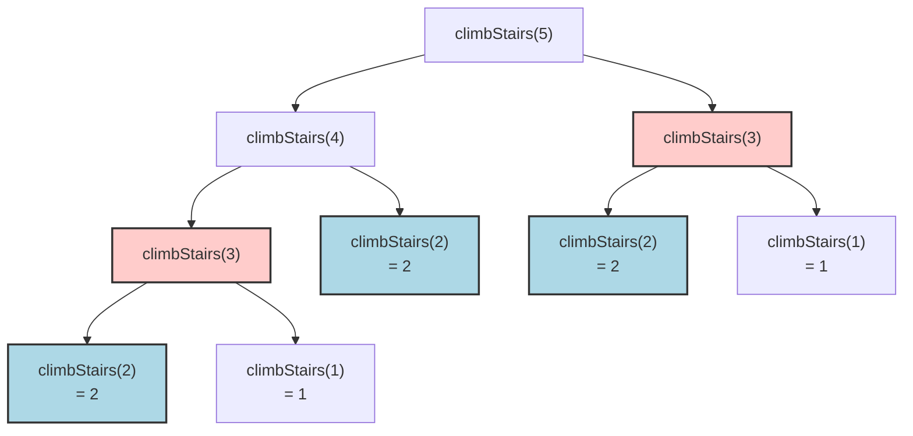

# 01. Climbing Stairs

## Problem Description

You are climbing a staircase. It takes `n` steps to reach the top.
Each time you can either climb `1` or `2` steps. In how many distinct ways can you climb to the top?

**Example 1:**
- **Input:** `n = 2`
- **Output:** `2`
- **Explanation:** There are two ways to climb to the top.
  1. 1 step + 1 step
  2. 2 steps

**Example 2:**
- **Input:** `n = 3`
- **Output:** `3`
- **Explanation:** There are three ways to climb to the top.
  1. 1 step + 1 step + 1 step
  2. 1 step + 2 steps
  3. 2 steps + 1 step

**Constraints:**
- `1 <= n <= 45`

---

## 1. Recursive Solution (Intuitive Approach)

The problem asks for the number of ways to reach step `n`. 
To reach step `n`, you could have only come from two places:
1. One step below (step `n-1`)
2. Two steps below (step `n-2`)

Therefore, the total ways to reach step `n` is the sum of the ways to reach step `n-1` and the ways to reach step `n-2`. This forms a Fibonacci-like recurrence relation.

### Java Implementation (Naive Recursion)

```java
class Solution {
    public int climbStairs(int n) {
        // Base cases: 
        // 1 way to reach step 1 (1)
        // 2 ways to reach step 2 (1+1, 2)
        if (n == 1) return 1;
        if (n == 2) return 2;
        
        // Recursive step
        return climbStairs(n - 1) + climbStairs(n - 2);
    }
}
```

---

## 2. Recursion Tree Visualization

Let's visualize the recursive calls for `n = 5`. Notice the **overlapping subproblems**.



*Notice how `climbStairs(3)` is calculated twice (red nodes) and `climbStairs(2)` is calculated three times (blue nodes). As `n` grows, this redundancy causes exponential time complexity.*

---

## 3. Bottom-Up DP Solution (Tabulation)

To eliminate redundant calculations, we can build the solution from the base cases up to `n` using an array. Wait, do we even need an array? We only ever need the last two values (step `n-1` and step `n-2`) to compute the current step `n`. This allows us to optimize space from $O(n)$ to $O(1)$.

### Java Implementation (Iterative DP with Space Optimization)

```java
class Solution {
    public int climbStairs(int n) {
        // Base cases
        if (n == 1) return 1;
        if (n == 2) return 2;
        
        // DP variables initialized for n=1 and n=2
        int prev2 = 1; // ways to reach step 1
        int prev1 = 2; // ways to reach step 2
        
        // Iterate from step 3 up to n
        for (int i = 3; i <= n; i++) {
            int current = prev1 + prev2;
            
            // Shift perspective forward
            prev2 = prev1;
            prev1 = current;
        }
        
        return prev1; 
    }
}
```

---

## 4. DP Array Visualization

To truly understand tabulation, let's visualize the actual DP Array (size `n + 1`) being filled step-by-step for `n = 5`.

**1. Initialization & Base Cases:**
We know that climbing to step 1 has 1 way, and climbing to step 2 has 2 ways. These are our base cases.
```text
Index (i) : [ 0, 1, 2, 3, 4, 5 ]
dp array  : [ 0, 1, 2, 0, 0, 0 ]
                 ^  ^
            Base Cases mapped from Recursion
```

**2. Solving Subproblems (Iterative filling):**

**Step i = 3:** `dp[3] = dp[2] + dp[1] = 2 + 1 = 3`
```text
Index (i) : [ 0,  1,  2, [3],  4,  5 ]
dp array  : [ 0, (1),(2), 3 ,  0,  0 ]
```

**Step i = 4:** `dp[4] = dp[3] + dp[2] = 3 + 2 = 5`
```text
Index (i) : [ 0,  1,  2,  3, [4],  5 ]
dp array  : [ 0,  1, (2),(3), 5 ,  0 ]
```

**Step i = 5:** `dp[5] = dp[4] + dp[3] = 5 + 3 = 8`
```text
Index (i) : [ 0,  1,  2,  3,  4, [5] ]
dp array  : [ 0,  1,  2, (3),(5), 8  ]
                 Final Answer ^^^
```

**Final Answer:** `dp[5] = 8`. There are 8 total ways to reach step 5.

*(Note: In the space-optimized $O(1)$ solution provided earlier, we simply use two variables to track the two previous array cells `(prev1, prev2)` instead of allocating the entire array, but the logical filling process remains identical!)*

---

## 5. Complexity Analysis

### Naive Recursive Solution
- **Time Complexity:** $O(2^n)$. Each node branches into two recursive calls, creating a tree of depth $n$.
- **Space Complexity:** $O(n)$. The maximum depth of the recurring call stack tree is $n$.

### Bottom-Up DP Solution 
- **Time Complexity:** $O(n)$. We iterate through a loop exactly $n - 2$ times.
- **Space Complexity:** $O(1)$. We only maintain a few integer variables (`prev1`, `prev2`, `current`), regardless of the size of $n$. *(If we used a standard DP array, space would be $O(n)$).*
