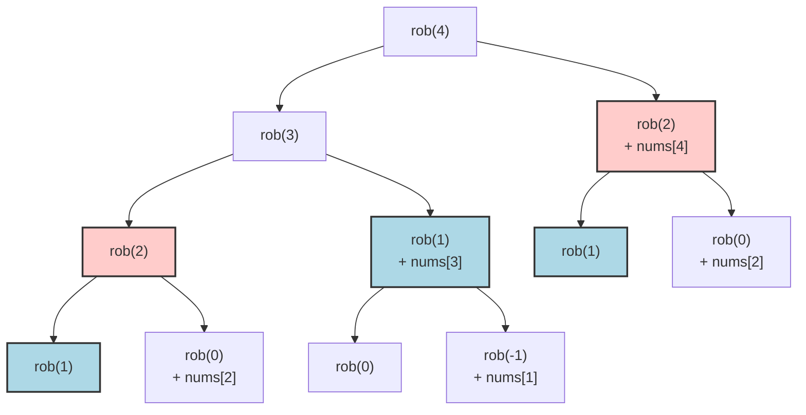

# 02. House Robber

## Problem Description

You are a professional robber planning to rob houses along a street. Each house has a certain amount of money stashed, the only constraint stopping you from robbing each of them is that adjacent houses have security systems connected and it will automatically contact the police if two adjacent houses were broken into on the same night.

Given an integer array `nums` representing the amount of money of each house, return the maximum amount of money you can rob tonight without alerting the police.

**Example 1:**
- **Input:** `nums = [1,2,3,1]`
- **Output:** `4`
- **Explanation:** Rob house 1 (money = 1) and then rob house 3 (money = 3). Total amount you can rob = 1 + 3 = 4.

**Example 2:**
- **Input:** `nums = [2,7,9,3,1]`
- **Output:** `12`
- **Explanation:** Rob house 1 (money = 2), rob house 3 (money = 9) and rob house 5 (money = 1). Total amount you can rob = 2 + 9 + 1 = 12.

**Constraints:**
- `1 <= nums.length <= 100`
- `0 <= nums[i] <= 400`

---

## 1. Recursive Solution (Intuitive Approach)

At any given house `i`, you have two choices:
1. **Rob house `i`**: You get the money from house `i` (`nums[i]`), but you **cannot** rob house `n-1` (the adjacent house). You can only add the maximum money robbed from all houses up to `i-2`.
2. **Skip house `i`**: You don't rob house `i`. Your total money is whatever the maximum was up to house `i-1`.

So, the maximum money up to house `i` is the maximum of these two choices:
`max(rob(i-2) + nums[i], rob(i-1))`

### Java Implementation (Naive Recursion)

```java
class Solution {
    public int rob(int[] nums) {
        return robFrom(nums, nums.length - 1);
    }
    
    private int robFrom(int[] nums, int i) {
        // Base cases
        if (i < 0) return 0;
        if (i == 0) return nums[0];
        
        // Recursive step: max of (robbing current + i-2) OR (skipping current and taking i-1)
        return Math.max(robFrom(nums, i - 2) + nums[i], robFrom(nums, i - 1));
    }
}
```

---

## 2. Recursion Tree Visualization

Let's visualize the recursive calls for `nums = [2, 7, 9, 3, 1]`, starting from index `4` (last house). Notice the **overlapping subproblems**.



*Notice how `rob(2)` is calculated twice (red nodes) and `rob(1)` is calculated three times (blue nodes). As the number of houses grows, this causes exponential time complexity.*

---

## 3. Bottom-Up DP Solution (Tabulation)

We can avoid evaluating the same subproblems by solving them iteratively from the smallest subproblem (house 0) up to house `n-1`. 

Wait, similarly to Climbing Stairs, do we need to keep the entire DP array? We only ever look back `2` steps (`i-1` and `i-2`). We can optimize our space boundary to $O(1)$ by just keeping track of `rob1` (max up to `i-2`) and `rob2` (max up to `i-1`).

### Java Implementation (Iterative DP with Space Optimization)

```java
class Solution {
    public int rob(int[] nums) {
        if (nums == null || nums.length == 0) return 0;
        if (nums.length == 1) return nums[0];
        
        // DP variables initialized for step 0 and 1
        int rob1 = 0; // max money up to i-2
        int rob2 = 0; // max money up to i-1
        
        // Iterating through each house
        for (int n : nums) {
            int current = Math.max(rob1 + n, rob2);
            
            // Shift perspective forward
            rob1 = rob2;
            rob2 = current;
        }
        
        return rob2; // The last calculated max is the answer
    }
}
```

---

## 4. Complete Visual Mapping: DP Array Trace

To truly understand tabulation, let's trace exactly how a purely array-based DP would be filled for `nums = [2, 7, 9, 3, 1]`.

Let `dp[i]` represent the max money robbed from house 0 up to house `i`.

### ITERATION 1: Initialization & Base Cases

```text
nums array → [2]  [7]  [9]  [3]  [1]
Index (i)  →  0    1    2    3    4

Base case 0:
dp[0] = nums[0] = 2

Base case 1:
dp[1] = max(nums[0], nums[1]) = max(2, 7) = 7

dp array   → [2]  [7]  [0]  [0]  [0]
```

---

### ITERATION 2: Fill for House 2 (i=2, nums[2]=9)

#### Cell dp[2]: "Max money from house 0 to 2"

**Recursive thinking:**
```text
dp[2] = max(dp[1], dp[0] + nums[2])
```

**Breaking it down:**
```text
dp[1] = 7 (Skipping house 2)
dp[0] + nums[2] = 2 + 9 = 11 (Robbing house 2)

Result = max(7, 11) = 11
```

**Array filling:**
```text
Index (i)  →  0    1    2    3    4
nums array → [2]  [7]  [9]  [3]  [1]
dp array   → [2]  [7] [11]  [0]  [0]
                        ↑
                   Filled dp[2]
```

---

### ITERATION 3: Fill for House 3 (i=3, nums[3]=3)

#### Cell dp[3]: "Max money from house 0 to 3"

**Breaking it down:**
```text
dp[2] = 11 (Skipping house 3)
dp[1] + nums[3] = 7 + 3 = 10 (Robbing house 3)

Result = max(11, 10) = 11
```

**Array filling:**
```text
Index (i)  →  0    1    2    3    4
dp array   → [2]  [7] [11] [11]  [0]
                             ↑
                        Filled dp[3]
```

---

### ITERATION 4: Fill for House 4 (i=4, nums[4]=1)

#### Cell dp[4]: "Max money from house 0 to 4"

**Breaking it down:**
```text
dp[3] = 11 (Skipping house 4)
dp[2] + nums[4] = 11 + 1 = 12 (Robbing house 4)

Result = max(11, 12) = 12
```

**Array filling:**
```text
Index (i)  →  0    1    2    3    4
dp array   → [2]  [7] [11] [11] [12] ← ANSWER at dp[4]
```

---

## 5. The Complete Mapping Pattern

### Every Recursive Call Maps to an Array Cell
```text
Recursion:                    Tabulation:
rob(i)                ←→      dp[i]

rob(i-1)              ←→      dp[i-1]      (1 house to the left - skip)

rob(i-2) + nums[i]    ←→      dp[i-2] + nums[i]  (2 houses left + current - rob)
```

### Visual Dependency Pattern
```text
When filling ANY cell dp[i]:

Index (i) →   ...   i-2    i-1     i
dp array  →   ...  [val]  [val]   [?]
                     |      |      ↑
                     |      └──────┤← max(dp[i-1], 
                     └─────────────┘          dp[i-2] + nums[i])
```

---

## 6. Side-by-Side: Final Comparison

### Recursion (Top-Down)
```java
rob(i) {
  return Math.max(rob(i-1), rob(i-2) + nums[i]); 
}
```

### Tabulation (Bottom-Up)
```java
dp[i] = Math.max(dp[i-1], dp[i-2] + nums[i]);
```

**Same logic, but:**
- Recursion: Explores choices by calling functions backwards ($O(2^n)$ time without memoization).
- Tabulation: Builds answers forwards by looking up previously calculated values ($O(n)$ time).

---

## 7. Complexity Analysis

### Naive Recursive Solution
- **Time Complexity:** $O(2^n)$. At each step, we branch into two recursive calls, checking both configurations.
- **Space Complexity:** $O(n)$. Stack space used by recursive calls, which goes $n$ levels deep.

### Bottom-Up DP Solution 
- **Time Complexity:** $O(n)$. We iterate through the `nums` array exactly once.
- **Space Complexity:** $O(1)$. We only are tracking `rob1` and `rob2` variables instead of full `dp` array.
