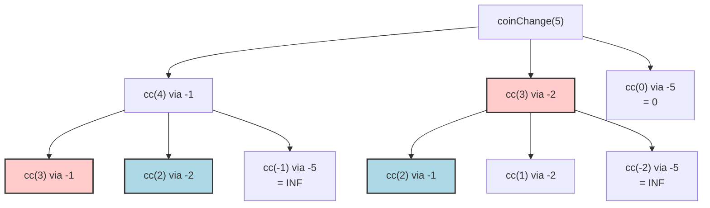

# 03. Coin Change

## Problem Description

You are given an integer array `coins` representing coins of different denominations and an integer `amount` representing a total amount of money.

Return the fewest number of coins that you need to make up that amount. If that amount of money cannot be made up by any combination of the coins, return `-1`.

You may assume that you have an infinite number of each kind of coin.

**Example 1:**
- **Input:** `coins = [1,2,5]`, `amount = 11`
- **Output:** `3`
- **Explanation:** 11 = 5 + 5 + 1

**Example 2:**
- **Input:** `coins = [2]`, `amount = 3`
- **Output:** `-1`

**Example 3:**
- **Input:** `coins = [1]`, `amount = 0`
- **Output:** `0`

**Constraints:**
- `1 <= coins.length <= 12`
- `1 <= coins[i] <= 2^31 - 1`
- `0 <= amount <= 10^4`

---

## 1. Recursive Solution (Intuitive Approach)

To find the minimum coins to make `amount`, you can try taking each available coin `c` from `coins`, and finding the minimum coins needed to make `amount - c`.
The minimum coins for `amount` is `1 + min(coins needed for (amount - c))` across all `c` that can fit the remaining amount.

### Java Implementation (Naive Recursion)

```java
class Solution {
    public int coinChange(int[] coins, int amount) {
        int res = helper(coins, amount);
        return res == Integer.MAX_VALUE ? -1 : res;
    }
    
    private int helper(int[] coins, int remainder) {
        // Base cases
        if (remainder < 0) return Integer.MAX_VALUE;
        if (remainder == 0) return 0;
        
        int minCoins = Integer.MAX_VALUE;
        
        // For each coin, recursively find the count of coins for the remaining amount
        for (int coin : coins) {
            int res = helper(coins, remainder - coin);
            if (res != Integer.MAX_VALUE) {
                minCoins = Math.min(minCoins, res + 1);
            }
        }
        return minCoins;
    }
}
```

---

## 2. Recursion Tree Visualization

Let's visualize the recursive calls for `coins = [1, 2, 5]` and `amount = 5`.



*Notice `cc(3)` is calculated multiple times (red nodes) and `cc(2)` multiple times (blue nodes). The amount of duplicated work cascades and explodes as `amount` increases.*

---

## 3. Bottom-Up DP Solution (Tabulation)

We can build an array `dp` of size `amount + 1`, where `dp[a]` stores the minimum coins to make amount `a`.

We initialize the array with a dummy "infinity" value. Since the maximum possible number of coins to make `amount` is `amount` (e.g., using all `1` denomination coins), `amount + 1` acts as a safe unreachable high value. `dp[0]` is initialized to 0.

### Java Implementation (Iterative DP)

```java
class Solution {
    public int coinChange(int[] coins, int amount) {
        int[] dp = new int[amount + 1];
        
        // Initialize DP array with a max value (amount + 1 is safe/impossible)
        Arrays.fill(dp, amount + 1);
        dp[0] = 0;
        
        // Iterate through all amounts from 1 up to 'amount'
        for (int a = 1; a <= amount; a++) {
            // Check each coin 
            for (int c : coins) {
                if (a - c >= 0) {
                    // Update if we found a better/smaller coin combination
                    dp[a] = Math.min(dp[a], 1 + dp[a - c]);
                }
            }
        }
        
        // If dp[amount] is still amount + 1, we couldn't find a combo
        return dp[amount] > amount ? -1 : dp[amount];
    }
}
```

---

## 4. Complete Visual Mapping: DP Array Trace

Let's do a strict visual trace for `coins = [1, 2, 5]` and `amount = 5`.

Initially, `dp` array size 6 (`amount + 1`), filled with `amount + 1 = 6` as max infinity placeholder. `dp[0] = 0`.

### ITERATION 1: Initialization & Base Cases

```text
Amount (a) →  0    1    2    3    4    5
dp array   → [0]  [6]  [6]  [6]  [6]  [6]
              ↑
          Base case
```

---

### ITERATION For amount a = 1

Check coins: 1, 2, 5
- coin 1: `a - c = 1 - 1 = 0 >= 0`. `dp[1] = min(6, 1 + dp[0]) = min(6, 1+0) = 1`
- coin 2 & 5: too large.

```text
Amount (a) →  0    1    2    3    4    5
dp array   → [0]  [1]  [6]  [6]  [6]  [6]
                   ↑
```

---

### ITERATION For amount a = 2

Check coins: 1, 2, 5
- coin 1: `a - c = 2 - 1 = 1`. `dp[2] = min(6, 1 + dp[1]) = min(6, 2) = 2`
- coin 2: `a - c = 2 - 2 = 0`. `dp[2] = min(2, 1 + dp[0]) = min(2, 1) = 1`
- coin 5: too large.

```text
Amount (a) →  0    1    2    3    4    5
dp array   → [0]  [1]  [1]  [6]  [6]  [6]
                        ↑
```

---

### ITERATION For amount a = 3

Check coins: 1, 2, 5
- coin 1: `a - c = 3 - 1 = 2`. `dp[3] = min(6, 1 + dp[2]) = min(6, 2) = 2`
- coin 2: `a - c = 3 - 2 = 1`. `dp[3] = min(2, 1 + dp[1]) = min(2, 2) = 2`
- coin 5: too large.

```text
Amount (a) →  0    1    2    3    4    5
dp array   → [0]  [1]  [1]  [2]  [6]  [6]
                             ↑
```

---

### ITERATION For amount a = 4

Check coins: 1, 2, 5
- coin 1: `a - c = 4 - 1 = 3`. `dp[4] = min(6, 1 + dp[3]) = min(6, 3) = 3`
- coin 2: `a - c = 4 - 2 = 2`. `dp[4] = min(3, 1 + dp[2]) = min(3, 2) = 2`
- coin 5: too large.

```text
Amount (a) →  0    1    2    3    4    5
dp array   → [0]  [1]  [1]  [2]  [2]  [6]
                                  ↑
```

---

### ITERATION For amount a = 5

Check coins: 1, 2, 5
- coin 1: `a - c = 5 - 1 = 4`. `dp[5] = min(6, 1 + dp[4]) = min(6, 3) = 3`
- coin 2: `a - c = 5 - 2 = 3`. `dp[5] = min(3, 1 + dp[3]) = min(3, 3) = 3`
- coin 5: `a - c = 5 - 5 = 0`. `dp[5] = min(3, 1 + dp[0]) = min(3, 1) = 1`

```text
Amount (a) →  0    1    2    3    4    5
dp array   → [0]  [1]  [1]  [2]  [2]  [1]  ← ANSWER at dp[5] = 1
```

---

## 5. The Complete Mapping Pattern

```text
Recursion:                              Tabulation:
helper(remainder)               ←→      dp[a]

1 + helper(remainder - c)       ←→      1 + dp[a - c] for all coins c

min(all valid recursive paths)  ←→      min(all lookup values)
```

### Visual Dependency
To calculate `dp[a]`, you look back `c` steps for each valid coin `c` to find the path that required the fewest coins.
```text
For a = 5, coins=[1,2,5]:
Amount (a) →   0    1    2    3    4    5
dp array   →  [0]  [1]  [1]  [2]  [2]  [?]
               ↑              ↑    ↑    |
               |              |    |    |
   from coin 5 ┘  from coin 2 ┘    |    |
                       from coin 1 ┘    |
                       All routes feed into dp[5]
```

---

## 6. Side-by-Side: Final Comparison

### Recursion (Top-Down)
```java
int minCoins = maxVal;
for (int c : coins) {
    if (remainder - c >= 0) {
        minCoins = Math.min(minCoins, 1 + helper(coins, remainder - c));
    }
}
return minCoins;
```

### Tabulation (Bottom-Up)
```java
for (int c : coins) {
    if (a - c >= 0) {
        dp[a] = Math.min(dp[a], 1 + dp[a - c]);
    }
}
```

---

## 7. Complexity Analysis

### Naive Recursive Solution
- **Time Complexity:** $O(S^n)$ where $S$ is the amount and $n$ is the number of coins. It's the number of nodes in the recursion tree which branches out $n$ times at each level up to depth $S$.
- **Space Complexity:** $O(S)$. In the worst case, the maximum depth of the recursion tree would be $S$ (if a coin of size 1 is present).

### Bottom-Up DP Solution 
- **Time Complexity:** $O(S * n)$. We iterate from amount $1$ to $S$. For each amount, we compute a minimum over the $n$ coins.
- **Space Complexity:** $O(S)$. We use an extra `dp` array of size `S + 1`.
