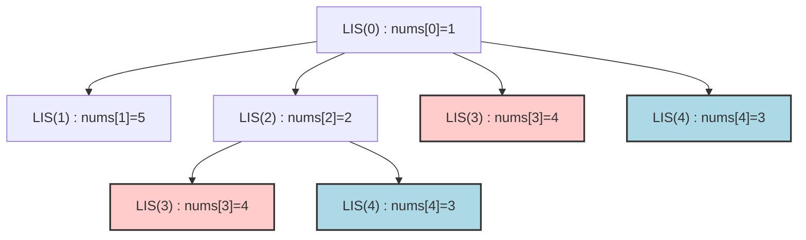

# 04. Longest Increasing Subsequence

## Problem Description

Given an integer array `nums`, return the length of the longest strictly increasing subsequence.

A **subsequence** is an array that can be derived from another array by deleting some or no elements without changing the order of the remaining elements.

**Example 1:**
- **Input:** `nums = [10,9,2,5,3,7,101,18]`
- **Output:** `4`
- **Explanation:** The longest increasing subsequence is `[2,3,7,101]`, therefore the length is 4.

**Example 2:**
- **Input:** `nums = [0,1,0,3,2,3]`
- **Output:** `4`

**Example 3:**
- **Input:** `nums = [7,7,7,7,7,7,7]`
- **Output:** `1`

**Constraints:**
- `1 <= nums.length <= 2500`
- `-10^4 <= nums[i] <= 10^4`

---

## 1. Recursive Solution (Intuitive Approach)

To find the Longest Increasing Subsequence (LIS), we can think of it in terms of choices at every element:
For each element `nums[i]`, what is the length of the longest increasing subsequence that *starts* at `i`?

To answer this, we can look at all subsequent elements `nums[j]` where `j > i`. 
If `nums[j] > nums[i]`, we can append `nums[j]` to our increasing subsequence. 
So, `LIS_starting_at(i) = 1 + max(LIS_starting_at(j))` for all `j > i` where `nums[j] > nums[i]`.

The overall answer is the max of `LIS_starting_at(k)` for all possible starting indices `k`.

### Java Implementation (Naive Recursion)

```java
class Solution {
    public int lengthOfLIS(int[] nums) {
        int maxLIS = 1;
        for (int i = 0; i < nums.length; i++) {
            maxLIS = Math.max(maxLIS, getLISFrom(nums, i));
        }
        return maxLIS;
    }
    
    // Returns the length of LIS constrained to start at index i
    private int getLISFrom(int[] nums, int i) {
        int maxFromI = 1; // Base case: the element itself is a sequence of length 1
        
        // Try all elements after i to see if they can extend the sequence
        for (int j = i + 1; j < nums.length; j++) {
            if (nums[j] > nums[i]) {
                maxFromI = Math.max(maxFromI, 1 + getLISFrom(nums, j));
            }
        }
        return maxFromI;
    }
}
```

---

## 2. Recursion Tree Visualization

Let's visualize the recursive calls for exploring sub-sequences starting at different index paths. We'll abbreviate `getLISFrom(i)` as `LIS(i)`.
Consider a smaller array: `nums = [1, 5, 2, 4, 3]`.



*Notice `LIS(3)` is evaluated multiple times (red) and `LIS(4)` is evaluated multiple times (blue).*

---

## 3. Bottom-Up DP Solution (Tabulation)

We can avoid evaluating the same starting positions over and over by computing the answer from right to left (bottom-up), or conversely left to right, maintaining the max LIS ending or starting at each index.

Let's compute left to right and define `dp[i]` as the Longest Increasing Subsequence **ending** at index `i`.
This is slightly more standard than starting at `i`.

If we know the LIS ending at every index `j < i`, we can compute `dp[i]`:
`dp[i] = 1 + max(dp[j])` for all `j < i` where `nums[i] > nums[j]`.

We initialize the DP array with `1`, since each element is at least an LIS of length 1 by itself.

### Java Implementation (Iterative DP)

```java
class Solution {
    public int lengthOfLIS(int[] nums) {
        if (nums == null || nums.length == 0) return 0;
        
        int[] dp = new int[nums.length];
        Arrays.fill(dp, 1); // Base case: every element is an LIS of length 1
        
        int maxLIS = 1;
        
        // i represents the end element of the sequence we are evaluating
        for (int i = 1; i < nums.length; i++) {
            // j looks back at all previous elements
            for (int j = 0; j < i; j++) {
                if (nums[i] > nums[j]) {
                    // Update the max LIS ending at i
                    dp[i] = Math.max(dp[i], 1 + dp[j]);
                }
            }
            // Keep track of the maximum LIS length found so far
            maxLIS = Math.max(maxLIS, dp[i]);
        }
        
        return maxLIS;
    }
}
```

---

## 4. Complete Visual Mapping: DP Array Trace

Let's do a strict visual trace for `nums = [10, 9, 2, 5, 3]`.
`dp` array holds the max LIS ending at index `i`. Start fully initialized to 1.

### Initialization Box
```text
Index (i)  →   0    1    2    3    4  
nums       → [10]  [9]  [2]  [5]  [3]
dp array   →  [1]  [1]  [1]  [1]  [1]
```

---

### ITERATION i=1: nums[1]=9

Check all `j < 1`:
- `j=0` (nums[0]=10). `nums[1] > nums[0]` (9 > 10) is False. Do nothing.

```text
Index (i)  →   0    1    2    3    4  
dp array   →  [1]  [1]  [1]  [1]  [1]
                    ↑
```

---

### ITERATION i=2: nums[2]=2

Check all `j < 2`:
- `j=0` (10). 2 > 10 is False.
- `j=1` (9). 2 > 9 is False.

```text
Index (i)  →   0    1    2    3    4  
dp array   →  [1]  [1]  [1]  [1]  [1]
                         ↑
```

---

### ITERATION i=3: nums[3]=5

Check all `j < 3`:
- `j=0` (10). 5 > 10 is False.
- `j=1` (9). 5 > 9 is False.
- `j=2` (2). **5 > 2 is True!**
  `dp[3] = max(dp[3], 1 + dp[j=2]) = max(1, 1 + 1) = 2`.

```text
Index (i)  →   0    1    2    3    4  
dp array   →  [1]  [1]  [1]  [2]  [1]
                              ↑
```

---

### ITERATION i=4: nums[4]=3

Check all `j < 4`:
- `j=0` (10). 3 > 10 is False.
- `j=1` (9). 3 > 9 is False.
- `j=2` (2). **3 > 2 is True!**
  `dp[4] = max(dp[4], 1 + dp[j=2]) = max(1, 1 + 1) = 2`.
- `j=3` (5). 3 > 5 is False.

```text
Index (i)  →   0    1    2    3    4  
dp array   →  [1]  [1]  [1]  [2]  [2]   
                                   ↑
```

**Final Result**: We scan the computed `dp` array `[1, 1, 1, 2, 2]` to find the maximum value, which is `2`. (Sequences `[2,5]` and `[2,3]`).

---

## 5. The Complete Mapping Pattern

```text
Recursion (starting at i):              Tabulation (ending at i):
getLISFrom(i)                   ←→      dp[i]

1 + getLISFrom(j) (for j > i)   ←→      1 + dp[j] (for j < i)

max(all valid paths)            ←→      max(all valid previous ending positions)
```

### Visual Dependency
To calculate `dp[i]`, you look back at all previous indices `j` where `nums[i] > nums[j]`.
```text
For i=3, nums=[10, 9, 2, 5]:
nums       → [10]  [9]  [2]  [5]
             /    /      \    | 
          ❌    ❌       ✅  | 5 > 2
                           \  |
dp array   →  [1]  [1]  [1]  [?]
                              ↑
```

---

## 6. Side-by-Side: Final Comparison

### Recursion (Top-Down, ending at i for equivalence)
```java
int getLISEndingAt(int[] nums, int i) {
    int maxLIS = 1;
    for (int j = 0; j < i; j++) {
        if (nums[i] > nums[j]) {
            maxLIS = Math.max(maxLIS, 1 + getLISEndingAt(nums, j));
        }
    }
    return maxLIS;
}
```

### Tabulation (Bottom-Up)
```java
for (int i = 1; i < nums.length; i++) {
    for (int j = 0; j < i; j++) {
        if (nums[i] > nums[j]) {
            dp[i] = Math.max(dp[i], 1 + dp[j]);
        }
    }
}
```

---

## 7. Complexity Analysis

### Naive Recursive Solution
- **Time Complexity:** $O(2^n)$. At each step in the recursion, we could potentially branch out to all remaining elements, creating a massive combination of subsets.
- **Space Complexity:** $O(n)$. Stack space used by recursive calls, bounded by $n$.

### Bottom-Up DP Solution 
- **Time Complexity:** $O(n^2)$. We have an outer loop running $n$ times and an inner loop running up to $n$ times.
- **Space Complexity:** $O(n)$. We use an extra `dp` array of size $n$.

> **Note:** There is an even more optimal solution for LIS using Binary Search scaling to $O(n \log n)$, but the $n^2$ DP solution is the standard dynamic programming approach expected as a foundation in interviews.
