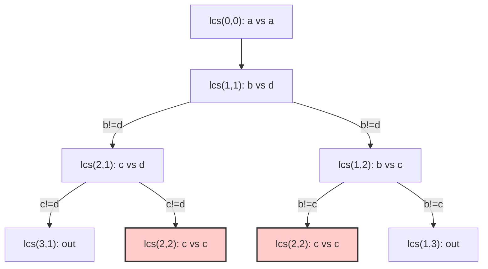

# 05. Longest Common Subsequence

## Problem Description

Given two strings `text1` and `text2`, return the length of their longest common subsequence. If there is no common subsequence, return `0`.

A **subsequence** of a string is a new string generated from the original string with some characters (can be none) deleted without changing the relative order of the remaining characters.
- For example, `"ace"` is a subsequence of `"abcde"`.

A **common subsequence** of two strings is a subsequence that is common to both strings.

**Example 1:**
- **Input:** `text1 = "abcde"`, `text2 = "ace"` 
- **Output:** `3`  
- **Explanation:** The longest common subsequence is "ace" and its length is 3.

**Example 2:**
- **Input:** `text1 = "abc"`, `text2 = "abc"`
- **Output:** `3`

**Example 3:**
- **Input:** `text1 = "abc"`, `text2 = "def"`
- **Output:** `0`

**Constraints:**
- `1 <= text1.length, text2.length <= 1000`
- `text1` and `text2` consist of only lowercase English characters.

---

## 1. Recursive Solution (Intuitive Approach)

To find the Longest Common Subsequence (LCS), we compare characters from the strings one by one. Let's start from the beginning of both strings with pointers `i` and `j`.

- If `text1[i] == text2[j]`: They match! We add 1 to our length and move both pointers forward by 1: `1 + LCS(i+1, j+1)`.
- If `text1[i] != text2[j]`: They don't match. We have two choices—we can either advance the pointer in `text1` or advance the pointer in `text2`, and we want the maximum length from either choice:
`max(LCS(i+1, j), LCS(i, j+1))`.

### Java Implementation (Naive Recursion)

```java
class Solution {
    public int longestCommonSubsequence(String text1, String text2) {
        return lcs(text1, text2, 0, 0);
    }
    
    private int lcs(String s1, String s2, int i, int j) {
        // Base cases: if out of bounds, no more characters to match
        if (i == s1.length() || j == s2.length()) {
            return 0;
        }
        
        // Characters match
        if (s1.charAt(i) == s2.charAt(j)) {
            return 1 + lcs(s1, s2, i + 1, j + 1);
        } 
        // Characters don't match: find max of branching choices
        else {
            return Math.max(
                lcs(s1, s2, i + 1, j),
                lcs(s1, s2, i, j + 1)
            );
        }
    }
}
```

---

## 2. Recursion Tree Visualization

Let's trace `text1 = "abc"`, `text2 = "adc"`. We will represent the state as `lcs(i,j)`.



*Notice how `lcs(2,2)` is reached and calculated twice (red nodes). In longer strings with lots of mismatches, this overlap is immense.*

---

## 3. Bottom-Up DP Solution (Tabulation)

We have two variables changing: pointer `i` for `text1` and pointer `j` for `text2`. This calls for a **2D DP Grid**. 

We will build a 2D array `dp[i][j]` where `dp[i][j]` represents the LCS length of the prefixes up to index `i` in `text1` and `j` in `text2`. 
We pad the DP grid by 1 so `dp[0][0]` handles the empty strings.
Thus, `dp[i][j]` is the LCS of `text1.substring(0, i)` and `text2.substring(0, j)`.

### Java Implementation (Iterative 2D DP)

```java
class Solution {
    public int longestCommonSubsequence(String text1, String text2) {
        int m = text1.length();
        int n = text2.length();
        
        // DP Grid with 1 extra row and column for empty string padding
        int[][] dp = new int[m + 1][n + 1];
        
        // Iterate through both strings
        for (int i = 1; i <= m; i++) {
            for (int j = 1; j <= n; j++) {
                // If characters match, take diagonal + 1
                if (text1.charAt(i - 1) == text2.charAt(j - 1)) {
                    dp[i][j] = 1 + dp[i - 1][j - 1];
                } 
                // If no match, take max of top or left cell
                else {
                    dp[i][j] = Math.max(dp[i - 1][j], dp[i][j - 1]);
                }
            }
        }
        
        return dp[m][n];
    }
}
```

---

## 4. Complete Visual Mapping: 2D DP Grid Trace

Let's do a strict visual trace for `text1 = "abc"` (rows) and `text2 = "adc"` (cols).
Grid size `4 x 4`. Row 0 and Col 0 are initialized to `0` (empty string LCS).

### Initial Empty Grid
`Col J`: `""`, `a`(1), `d`(2), `c`(3)
`Row I`: `""`, `a`(1), `b`(2), `c`(3)

```text
       ""   a    d    c
       0    1    2    3
"" 0 [ 0 ][ 0 ][ 0 ][ 0 ]
a  1 [ 0 ][   ][   ][   ]
b  2 [ 0 ][   ][   ][   ]
c  3 [ 0 ][   ][   ][   ]
```

---

### Row 1: `i=1 ('a')`

- `i=1, j=1` ('a' vs 'a'): match!
  `dp[1][1] = 1 + dp[0][0] = 1 + 0 = 1`.
- `i=1, j=2` ('a' vs 'd'): mismatch.
  `dp[1][2] = max(dp[0][2], dp[1][1]) = max(0, 1) = 1`.
- `i=1, j=3` ('a' vs 'c'): mismatch.
  `dp[1][3] = max(dp[0][3], dp[1][2]) = max(0, 1) = 1`.

```text
       ""   a    d    c
       0    1    2    3
"" 0 [ 0 ][ 0 ][ 0 ][ 0 ]
a  1 [ 0 ][ 1 ][ 1 ][ 1 ]
b  2 [ 0 ][   ][   ][   ]
c  3 [ 0 ][   ][   ][   ]
```

---

### Row 2: `i=2 ('b')`

- `i=2, j=1` ('b' vs 'a'): mismatch. `max(left:0, top:1) = 1`.
- `i=2, j=2` ('b' vs 'd'): mismatch. `max(left:1, top:1) = 1`.
- `i=2, j=3` ('b' vs 'c'): mismatch. `max(left:1, top:1) = 1`.

```text
       ""   a    d    c
       0    1    2    3
"" 0 [ 0 ][ 0 ][ 0 ][ 0 ]
a  1 [ 0 ][ 1 ][ 1 ][ 1 ]
b  2 [ 0 ][ 1 ][ 1 ][ 1 ]
c  3 [ 0 ][   ][   ][   ]
```

---

### Row 3: `i=3 ('c')`

- `i=3, j=1` ('c' vs 'a'): mismatch. `max(left:0, top:1) = 1`.
- `i=3, j=2` ('c' vs 'd'): mismatch. `max(left:1, top:1) = 1`.
- `i=3, j=3` ('c' vs 'c'): match! `1 + diagonal[2][2] = 1 + 1 = 2`.

```text
       ""   a    d    c
       0    1    2    3
"" 0 [ 0 ][ 0 ][ 0 ][ 0 ]
a  1 [ 0 ][ 1 ][ 1 ][ 1 ]
b  2 [ 0 ][ 1 ][ 1 ][ 1 ]
c  3 [ 0 ][ 1 ][ 1 ][ 2 ]  ← ANSWER at dp[3][3] = 2
```

---

## 5. The Complete Mapping Pattern

```text
Recursion:                               Tabulation:
lcs(S1 to i, S2 to j)            ←→      dp[i][j]

// Match:
1 + lcs(..., i-1, j-1)           ←→      1 + dp[i-1][j-1]     (Diagonal up-left)

// Mismatch:
max(lcs(i-1,j), lcs(i,j-1))      ←→      max(dp[i-1][j], dp[i][j-1])  (Top vs Left)
```

### Visual Dependency Grid Pattern
```text
[ i-1, j-1 ]   [ i-1,  j ]  <- Top (skip char from text1)
  (Diag)    \       |
             \      v
[ i,   j-1 ] ->[  i,   j ]  <- Current
^              
Left (skip char from text2)
```
- A **diagonal** movement implies characters matched, consuming 1 character from both.
- A **vertical/horizontal** movement implies characters mismatched, taking the best result of consuming a character from only one string.

---

## 6. Side-by-Side: Final Comparison

### Recursion (Top-Down, reverse string indexing)
```java
if (text1.charAt(i) == text2.charAt(j)) {
    return 1 + lcs(i - 1, j - 1);
} else {
    return Math.max(lcs(i - 1, j), lcs(i, j - 1));
}
```

### Tabulation (Bottom-Up)
```java
if (text1.charAt(i - 1) == text2.charAt(j - 1)) {
    dp[i][j] = 1 + dp[i - 1][j - 1];
} else {
    dp[i][j] = Math.max(dp[i - 1][j], dp[i][j - 1]);
}
```

---

## 7. Complexity Analysis

### Naive Recursive Solution
- **Time Complexity:** $O(2^{m+n})$. At worst, characters never match and we always branch into 2 new recursive paths. The recursion tree depth can be $m+n$.
- **Space Complexity:** $O(m+n)$. The height of the recursion tree.

### Bottom-Up DP Solution 
- **Time Complexity:** $O(m * n)$ where `m` and `n` are the lengths of `text1` and `text2`. We compute the cell answers filling a 2D matrix.
- **Space Complexity:** $O(m * n)$ to maintain the 2D `dp` grid. *Note: space can be optimized to $O(\min(m, n))$ by only keeping track of the previous row since `dp[i][j]` only relies on the current and previous rows.*
