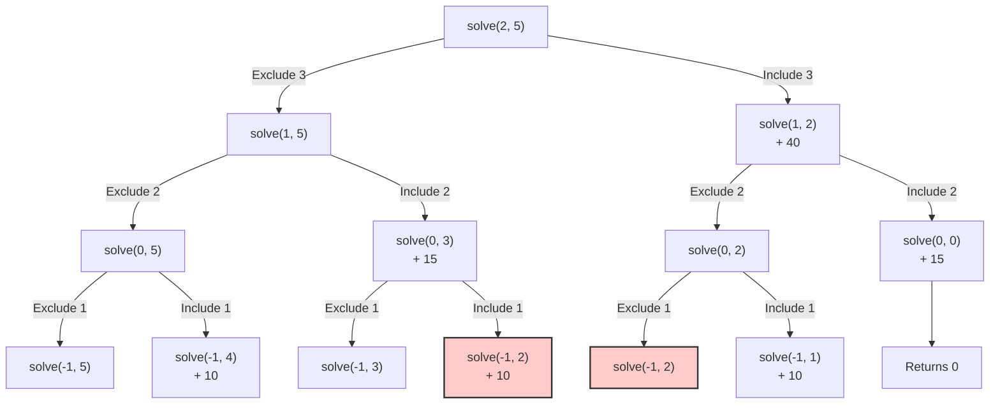

# 06. 0/1 Knapsack

## Problem Description

Given `N` items where each item has some weight and profit associated with it, and a knapsack of capacity `W`. 

The task is to put the items into the knapsack such that the sum of profits associated with them is the maximum possible. 

The constraint is that you can either put an item completely into the knapsack or not put it at all (0/1 property). You cannot put a fraction of an item into the knapsack.

**Example 1:**
- **Input:** `weights = [1, 2, 3]`, `values = [10, 15, 40]`, `W = 6`
- **Output:** `65`
- **Explanation:** Choose all three items: `10 + 15 + 40 = 65`. Weight is `1 + 2 + 3 = 6 <= 6`.

**Example 2:**
- **Input:** `weights = [1, 2, 3]`, `values = [10, 15, 40]`, `W = 5`
- **Output:** `55`
- **Explanation:** Choose items 2 and 3: `15 + 40 = 55`. Weight is `2 + 3 = 5 <= 5`.

**Constraints:**
- `1 <= N <= 1000`
- `1 <= W <= 1000`
- `1 <= weights[i], values[i] <= 100`

---

## 1. Recursive Solution (Intuitive Approach)

For every item, we have two choices:
1. **Include the item**: Add its value to the total, subtract its weight from the remaining capacity. (Only possible if the item's weight $\le$ remaining capacity).
2. **Exclude the item**: Move to the next item without changing the current value or capacity.

The maximum value at any step is the maximum of these two choices.

### Java Implementation (Naive Recursion)

```java
class Solution {
    public int knapsack(int[] weights, int[] values, int W) {
        return solve(weights, values, W, weights.length - 1);
    }
    
    // Returns the max value from items 0 to index with 'capacity' remaining
    private int solve(int[] weights, int[] values, int capacity, int index) {
        // Base cases: no more items or no more capacity
        if (index < 0 || capacity == 0) {
            return 0;
        }
        
        // If the current item's weight is more than the capacity, 
        // we HAVE to exclude it
        if (weights[index] > capacity) {
            return solve(weights, values, capacity, index - 1);
        }
        
        // Option 1: Include the item
        int include = values[index] + solve(weights, values, capacity - weights[index], index - 1);
        
        // Option 2: Exclude the item
        int exclude = solve(weights, values, capacity, index - 1);
        
        // Return the max of both options
        return Math.max(include, exclude);
    }
}
```

---

## 2. Recursion Tree Visualization

Let's visualize the recursive calls. State is defined by `(index, capacity)`. We evaluate right-to-left.
`weights = [1, 2, 3]`, `values = [10, 15, 40]`, `W = 5`



*Notice overlapping subproblems like `solve(-1, 2)` appearing in different branches.*

---

## 3. Bottom-Up DP Solution (Tabulation)

We have two changing states: `index` (which item we are considering) and `capacity` (the remaining weight). Thus, we need a 2D DP table.

`dp[i][w]` represents the maximum value that can be obtained using the first `i` items with a knapsack capacity of `w`.

### Java Implementation (Iterative 2D DP)

```java
class Solution {
    public int knapsack(int[] weights, int[] values, int W) {
        int n = weights.length;
        // dp[i][w] = max value with first i items and capacity w
        int[][] dp = new int[n + 1][W + 1];
        
        for (int i = 1; i <= n; i++) {
            for (int w = 1; w <= W; w++) {
                // If current item can fit in the knapsack
                if (weights[i - 1] <= w) {
                    // Max of including vs excluding
                    dp[i][w] = Math.max(
                        values[i - 1] + dp[i - 1][w - weights[i - 1]], // Include
                        dp[i - 1][w]                                   // Exclude
                    );
                } else {
                    // Cannot fit, must exclude
                    dp[i][w] = dp[i - 1][w];
                }
            }
        }
        
        return dp[n][W];
    }
}
```

*Note: This can actually be optimized to 1D array space $O(W)$ since `dp[i]` only depends on `dp[i-1]`.*

---

## 4. Complete Visual Mapping: 2D DP Grid Trace

Trace for `weights = [1, 2, 3]`, `values = [10, 15, 40]`, `W = 5`.
`dp` size: 4 rows (0 to 3), 6 columns (capacity 0 to 5)

### Initial State (Row 0 = 0 items, Col 0 = 0 capacity)
```text
Item \ Cap  0   1   2   3   4   5
0 (none)  [ 0][ 0][ 0][ 0][ 0][ 0]
1 (w=1,v=10)[ 0][  ][  ][  ][  ][  ]
2 (w=2,v=15)[ 0][  ][  ][  ][  ][  ]
3 (w=3,v=40)[ 0][  ][  ][  ][  ][  ]
```

### Row 1: Item 1 (weight=1, value=10)
Capacity `w` from 1 to 5. Since `weight=1 <= w` for all, we can include it.
`dp[1][w] = max(dp[0][w], 10 + dp[0][w-1]) = 10`

```text
Item \ Cap  0   1   2   3   4   5
0 (none)  [ 0][ 0][ 0][ 0][ 0][ 0]
1 (w=1,v=10)[ 0][10][10][10][10][10]
2 (w=2,v=15)[ 0][  ][  ][  ][  ][  ]
3 (w=3,v=40)[ 0][  ][  ][  ][  ][  ]
```

### Row 2: Item 2 (weight=2, value=15)
- `w=1`: `2 > 1`. Cannot include. `dp[2][1] = dp[1][1] = 10`.
- `w=2`: `2 <= 2`. Can include. `max(10, 15 + dp[1][0]) = 15`.
- `w=3`: `2 <= 3`. Can include. `max(dp[1][3]=10, 15 + dp[1][1]=25) = 25`.
- ... and so on.

```text
Item \ Cap  0   1   2   3   4   5
0 (none)  [ 0][ 0][ 0][ 0][ 0][ 0]
1 (w=1,v=10)[ 0][10][10][10][10][10]
2 (w=2,v=15)[ 0][10][15][25][25][25]
3 (w=3,v=40)[ 0][  ][  ][  ][  ][  ]
```

### Row 3: Item 3 (weight=3, value=40)
- `w=1, 2`: Cannot include. Copy from above. `10, 15`.
- `w=3`: `max(dp[2][3]=25, 40 + dp[2][0]=40) = 40`.
- `w=4`: `max(dp[2][4]=25, 40 + dp[2][1]=50) = 50`.
- `w=5`: `max(dp[2][5]=25, 40 + dp[2][2]=55) = 55`.

```text
Item \ Cap  0   1   2   3   4   5
0 (none)  [ 0][ 0][ 0][ 0][ 0][ 0]
1 (w=1,v=10)[ 0][10][10][10][10][10]
2 (w=2,v=15)[ 0][10][15][25][25][25]
3 (w=3,v=40)[ 0][10][15][40][50][55]  ← ANSWER at dp[3][5] = 55
```

---

## 5. The Complete Mapping Pattern

```text
Recursion:                                     Tabulation:
solve(index, capacity)                 ←→      dp[i][w]

// Exclude:
solve(index - 1, capacity)             ←→      dp[i - 1][w]           (Look straight up)

// Include:
value + solve(index - 1, cap - weight) ←→      value + dp[i - 1][w - weight] (Look up & left)
```

### Visual Dependency Grid Pattern
```text
           w-weight        w
             |             |
           [val 1] . . . [val 2]  <- Previous row (i-1)
             \             |
 (Include path)\           | (Exclude path)
                \          v
                 ----->[Current]  <- Current row (i)
```

---

## 6. Side-by-Side: Final Comparison

### Recursion (Top-Down)
```java
if (weights[index] <= capacity) {
    return Math.max(
        solve(weights, values, capacity - weights[index], index - 1) + values[index], 
        solve(weights, values, capacity, index - 1)
    );
} else {
    return solve(weights, values, capacity, index - 1);
}
```

### Tabulation (Bottom-Up)
```java
if (weights[i - 1] <= w) {
    dp[i][w] = Math.max(
        dp[i - 1][w - weights[i - 1]] + values[i - 1], 
        dp[i - 1][w]
    );
} else {
    dp[i][w] = dp[i - 1][w];
}
```

---

## 7. Complexity Analysis

### Naive Recursive Solution
- **Time Complexity:** $O(2^N)$ where $N$ is the number of items. Each item presents 2 choices (include or exclude), forming a binary tree of height $N$.
- **Space Complexity:** $O(N)$ for the recursion stack depth.

### Bottom-Up DP Solution 
- **Time Complexity:** $O(N * W)$ where $N$ is the number of items and $W$ is the total capacity.
- **Space Complexity:** $O(N * W)$ for the 2D DP array. Space can be optimized to $O(W)$ by utilizing a single 1D array, traversing backwards from `W` to `0`.
