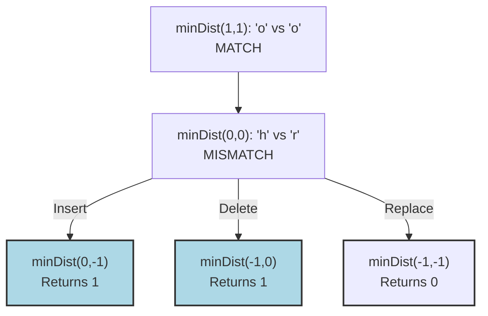

# 07. Edit Distance

## Problem Description

Given two strings `word1` and `word2`, return the minimum number of operations required to convert `word1` to `word2`.

You have the following three operations permitted on a word:
1. **Insert** a character
2. **Delete** a character
3. **Replace** a character

**Example 1:**
- **Input:** `word1 = "horse"`, `word2 = "ros"`
- **Output:** `3`
- **Explanation:** 
  horse -> rorse (replace 'h' with 'r')
  rorse -> rose (delete 'r')
  rose -> ros (delete 'e')

**Example 2:**
- **Input:** `word1 = "intention"`, `word2 = "execution"`
- **Output:** `5`

**Constraints:**
- `0 <= word1.length, word2.length <= 500`
- `word1` and `word2` consist of lowercase English letters.

---

## 1. Recursive Solution (Intuitive Approach)

Let's maintain two pointers, `i` for `word1` and `j` for `word2`, starting from the end of both strings.

We compare `word1[i]` and `word2[j]`:
1. **If characters match**: No operation is needed. The cost is 0, and we move both pointers backwards: `solve(i-1, j-1)`.
2. **If characters don't match**: We must perform one of the three operations. The total cost will be `1 + min(Insert, Delete, Replace)`.
   - **Insert**: Conceptually insert `word2[j]` into `word1`. Now they match, so we move `j` backwards, but `i` stays exactly where it was. Cost: `solve(i, j-1)`
   - **Delete**: Delete `word1[i]`. Thus we move `i` backwards, but `j` stays where it was. Cost: `solve(i-1, j)`
   - **Replace**: Replace `word1[i]` with `word2[j]`. Now they match, so move both backwards. Cost: `solve(i-1, j-1)`

### Java Implementation (Naive Recursion)

```java
class Solution {
    public int minDistance(String word1, String word2) {
        return minDist(word1, word2, word1.length() - 1, word2.length() - 1);
    }
    
    private int minDist(String word1, String word2, int i, int j) {
        // Base cases: if one string is exhausted, 
        // we have to insert/delete all remaining characters of the other
        if (i < 0) return j + 1; // Insert j+1 characters
        if (j < 0) return i + 1; // Delete i+1 characters
        
        // Characters match
        if (word1.charAt(i) == word2.charAt(j)) {
            return minDist(word1, word2, i - 1, j - 1);
        }
        
        // Characters don't match: try all 3 operations
        int insert = minDist(word1, word2, i, j - 1);
        int delete = minDist(word1, word2, i - 1, j);
        int replace = minDist(word1, word2, i - 1, j - 1);
        
        return 1 + Math.min(insert, Math.min(delete, replace));
    }
}
```

---

## 2. Recursion Tree Visualization

Let's trace `word1 = "ho"`, `word2 = "ro"`. State is `(i, j)`.
Starting at `(1, 1)` ('o' vs 'o').


*At `(0,0)`, the Replace operation leads cleanly to base cases with no remaining characters (returning 0), resulting in a minimal total cost of `1 (the replace cost) + 0 = 1`.*

---

## 3. Bottom-Up DP Solution (Tabulation)

We have two moving pointers, making this a 2D DP problem.

Let `dp[i][j]` be the minimum edit distance between the prefix `word1[0...i-1]` and `word2[0...j-1]`.
Padding the table by 1 to represent empty strings is the standard way to handle the base cases smoothly.

### Java Implementation (Iterative 2D DP)

```java
class Solution {
    public int minDistance(String word1, String word2) {
        int m = word1.length();
        int n = word2.length();
        
        int[][] dp = new int[m + 1][n + 1];
        
        // Base cases initialization
        // Distance from empty string to a string of length j is j (all inserts)
        for (int j = 0; j <= n; j++) {
            dp[0][j] = j;
        }
        // Distance from a string of length i to empty string is i (all deletes)
        for (int i = 0; i <= m; i++) {
            dp[i][0] = i;
        }
        
        // Fill the DP table
        for (int i = 1; i <= m; i++) {
            for (int j = 1; j <= n; j++) {
                if (word1.charAt(i - 1) == word2.charAt(j - 1)) {
                    // Match: copy diagonal cost
                    dp[i][j] = dp[i - 1][j - 1];
                } else {
                    // Mismatch: 1 + min(insert, delete, replace)
                    dp[i][j] = 1 + Math.min(
                        dp[i][j - 1],     // Insert (Left)
                        Math.min(
                            dp[i - 1][j], // Delete (Top)
                            dp[i - 1][j - 1] // Replace (Diagonal)
                        )
                    );
                }
            }
        }
        
        return dp[m][n];
    }
}
```

---

## 4. Complete Visual Mapping: 2D DP Grid Trace

Let's do a strict trace for `word1 = "ho"`, `word2 = "ro"`.
`dp` size: 3 x 3. (Prefixes from length 0 to 2)

### Initial Base Cases
Row 0 represents empty `word1`. We need `j` insertions to match `word2`. 
Col 0 represents empty `word2`. We need `i` deletions from `word1` to match.

```text
       ""   r    o
       0    1    2
"" 0 [ 0 ][ 1 ][ 2 ]
h  1 [ 1 ][   ][   ]
o  2 [ 2 ][   ][   ]
```

### Row 1: `i=1` ('h')
`j=1` ('r'): 'h' != 'r'. Minimum of (Left:1, Top:1, Diag:0) is `0 (Diag)`.
`dp[1][1] = 1 + 0 = 1`.  *(Replace 'h' with 'r')*
`j=2` ('o'): 'h' != 'o'. Minimum of (Left:1, Top:2, Diag:1) is `1 (Left)`.
`dp[1][2] = 1 + 1 = 2`.  *(Replace 'h' with 'o' + Insert 'r')*

```text
       ""   r    o
       0    1    2
"" 0 [ 0 ][ 1 ][ 2 ]
h  1 [ 1 ][ 1 ][ 2 ]
o  2 [ 2 ][   ][   ]
```

### Row 2: `i=2` ('o')
`j=1` ('r'): 'o' != 'r'. Minimum of (Left:2, Top:1, Diag:1) is `1 (Diag or Top)`.
`dp[2][1] = 1 + 1 = 2`.  *(Delete 'o' + Replace 'h' with 'r')*
`j=2` ('o'): 'o' == 'o'. **MATCH!** Copy diagonal (`dp[1][1]`).
`dp[2][2] = dp[1][1] = 1`. *(Characters match, so cost stays the same as "h" vs "r")*

```text
       ""   r    o
       0    1    2
"" 0 [ 0 ][ 1 ][ 2 ]
h  1 [ 1 ][ 1 ][ 2 ]
o  2 [ 2 ][ 2 ][ 1 ] ← ANSWER at dp[2][2] = 1
```

---

## 5. The Complete Mapping Pattern

```text
Recursion:                               Tabulation:
minDist(prefix i, prefix j)       ←→      dp[i][j]

// Match:
minDist(i-1, j-1)                 ←→      dp[i-1][j-1]                (Diagonal)

// Mismatch (Insert, Delete, Replace):
1 + min(
    minDist(i, j-1),              ←→      dp[i][j-1],                 (Left)
    minDist(i-1, j),              ←→      dp[i-1][j],                 (Top)
    minDist(i-1, j-1)             ←→      dp[i-1][j-1]                (Diagonal)
)
```

### Visual Dependency Grid Pattern
```text
[ i-1, j-1 ]   [ i-1,  j ]  <- Delete
  (Replace) \       |
  (Match)    \      v
[ i,   j-1 ] ->[  i,   j ]  <- Current
^              
Insert 
```

---

## 6. Side-by-Side: Final Comparison

### Recursion (Top-Down)
```java
if (word1.charAt(i) == word2.charAt(j)) {
    return minDist(i - 1, j - 1);
} else {
    return 1 + Math.min(
        minDist(i, j - 1), 
        Math.min(minDist(i - 1, j), minDist(i - 1, j - 1))
    );
}
```

### Tabulation (Bottom-Up)
```java
if (word1.charAt(i - 1) == word2.charAt(j - 1)) {
    dp[i][j] = dp[i - 1][j - 1];
} else {
    dp[i][j] = 1 + Math.min(
        dp[i][j - 1], 
        Math.min(dp[i - 1][j], dp[i - 1][j - 1])
    );
}
```

---

## 7. Complexity Analysis

### Naive Recursive Solution
- **Time Complexity:** $O(3^{\max(m, n)})$. For every mismatch, we branch into 3 recursive calls. This is horribly inefficient and will Time Out on LeetCode immediately.
- **Space Complexity:** $O(\max(m, n))$. Maximum recursion depth.

### Bottom-Up DP Solution 
- **Time Complexity:** $O(m * n)$. We iterate through two nested loops filling up the `m x n` table exactly once.
- **Space Complexity:** $O(m * n)$ for the DP matrix. This can be optimized to $O(\min(m,n))$ by just keeping two rows (current and previous) since we only look at `i` and `i-1` rows to calculate the current state.
