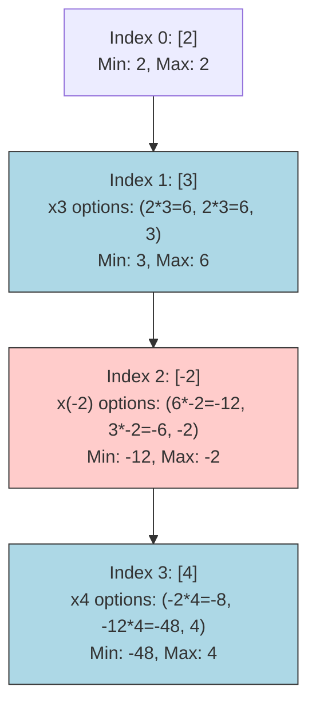

# 08. Maximum Product Subarray

## Problem Description

Given an integer array `nums`, find a contiguous non-empty subarray within the array that has the largest product, and return the product.

The test cases are generated so that the answer will fit in a **32-bit** integer.
A **subarray** is a contiguous subsequence of the array.

**Example 1:**
- **Input:** `nums = [2,3,-2,4]`
- **Output:** `6`
- **Explanation:** `[2,3]` has the largest product 6.

**Example 2:**
- **Input:** `nums = [-2,0,-1]`
- **Output:** `0`
- **Explanation:** The result cannot be 2, because `[-2,-1]` is not a subarray (not contiguous).

**Constraints:**
- `1 <= nums.length <= 2 * 10^4`
- `-10 <= nums[i] <= 10`

---

## 1. Recursive Solution (Intuitive Approach)

Since we are looking for a contiguous subarray ending at any position, the question to ask at each step `i` is: 
*What is the maximum product of a subarray ending exactly at `nums[i]`?*

However, there's a catch with multiplication: multiplying by a negative number flips the sign. A highly negative product could become the maximum product if multiplied by another negative number.

Because of this, we cannot just keep track of the maximum product ending at `i`. We **must also track the minimum (most negative) product** ending at `i`.

For a subarray ending at index `i`, the state relies on:
1. `maxProd(i-1) * nums[i]`
2. `minProd(i-1) * nums[i]`
3. `nums[i]` (starting a fresh subarray at `i`)

### Java Implementation (Naive Recursion)
*Note: We usually return an object or array to pass back both min and max, but here's the conceptual structure using an array of `[min, max]`.*

```java
class Solution {
    int globalMax;
    
    public int maxProduct(int[] nums) {
        globalMax = nums[0];
        getMinMaxEndingAt(nums, nums.length - 1);
        return globalMax;
    }
    
    // Returns [min_product_ending_at_i, max_product_ending_at_i]
    private int[] getMinMaxEndingAt(int[] nums, int i) {
        if (i == 0) {
            return new int[]{nums[0], nums[0]};
        }
        
        int[] prev = getMinMaxEndingAt(nums, i - 1);
        int prevMin = prev[0];
        int prevMax = prev[1];
        
        int current = nums[i];
        
        // Calculate the 3 possible choices for extending or starting fresh
        int option1 = prevMax * current;
        int option2 = prevMin * current;
        int option3 = current; // Start fresh
        
        int currentMin = Math.min(option3, Math.min(option1, option2));
        int currentMax = Math.max(option3, Math.max(option1, option2));
        
        globalMax = Math.max(globalMax, currentMax);
        
        return new int[]{currentMin, currentMax};
    }
}
```

---

## 2. Recursion Tree Visualization

Let's visualize how the state flows forward for `nums = [2, 3, -2, 4]`.
We need both MIN and MAX at each step because of the potential sign flip.



*At index 2, the `Max: 6` became `Min: -12` because of the negative number. If index 3 was `-4` instead of `4`, that `Min: -12` would flip back to a massive `Max: 48`!*

---

## 3. Bottom-Up DP Solution (Tabulation)

We can maintain the `curMax` and `curMin` dynamically as we iterate through the array. 
Space optimization: Since `dp[i]` only depends on `dp[i-1]`, we only need $O(1)$ space—just two variables to hold the previous max and min.

### Java Implementation (Iterative DP with Space Optimization)

```java
class Solution {
    public int maxProduct(int[] nums) {
        if (nums == null || nums.length == 0) return 0;
        
        // Initialize everything strictly to the first element
        int curMax = nums[0];
        int curMin = nums[0];
        int globalMax = nums[0];
        
        for (int i = 1; i < nums.length; i++) {
            int num = nums[i];
            
            // If num is negative, the next Max is found by multiplying by the previous Min.
            // So we swap curMax and curMin BEFORE multiplying.
            if (num < 0) {
                int temp = curMax;
                curMax = curMin;
                curMin = temp;
            }
            
            // Either continue the subarray (curMax * num) or start fresh (num)
            curMax = Math.max(num, curMax * num);
            curMin = Math.min(num, curMin * num);
            
            // Record the largest max seen so far
            globalMax = Math.max(globalMax, curMax);
        }
        
        return globalMax;
    }
}
```

---

## 4. Complete Visual Mapping: DP Arrays Trace

Let's do a strict trace for `nums = [2, 3, -2, 4]`.
We conceptually track two DP variables tracing equivalent arrays: `maxDP` and `minDP`.

### Initialization
```text
Index (i)  →    0    1    2    3
nums array →  [ 2] [ 3] [-2] [ 4]
maxDP      →  [ 2] [ ?] [ ?] [ ?]
minDP      →  [ 2] [ ?] [ ?] [ ?]

globalMax = 2
```

---

### ITERATION i=1 (nums[1] = 3)
`num` is positive.
`maxDP[1] = max(3, maxDP[0] * 3) = max(3, 2 * 3) = 6`
`minDP[1] = min(3, minDP[0] * 3) = min(3, 2 * 3) = 3`
`globalMax = max(2, 6) = 6`

```text
Index (i)  →    0    1    2    3
nums array →  [ 2] [ 3] [-2] [ 4]
maxDP      →  [ 2] [ 6] [ ?] [ ?]
minDP      →  [ 2] [ 3] [ ?] [ ?]
```

---

### ITERATION i=2 (nums[2] = -2)
`num` is negative. **The previous MAX multiplied by negative becomes the new MIN, and vice versa.**
`maxDP[2] = max(-2, minDP[1] * -2) = max(-2, 3 * -2) = -2`
`minDP[2] = min(-2, maxDP[1] * -2) = min(-2, 6 * -2) = -12`
`globalMax = max(6, -2) = 6`

```text
Index (i)  →    0    1    2    3
nums array →  [ 2] [ 3] [-2] [ 4]
maxDP      →  [ 2] [ 6] [-2] [ ?]
minDP      →  [ 2] [ 3] [-12] [ ?]
```

---

### ITERATION i=3 (nums[3] = 4)
`num` is positive.
`maxDP[3] = max(4, maxDP[2] * 4) = max(4, -2 * 4) = 4` *(Starts a fresh subarray!)*
`minDP[3] = min(4, minDP[2] * 4) = min(4, -12 * 4) = -48`
`globalMax = max(6, 4) = 6`

```text
Index (i)  →    0    1    2    3
nums array →  [ 2] [ 3] [-2] [ 4]
maxDP      →  [ 2] [ 6] [-2] [ 4]
minDP      →  [ 2] [ 3] [-12][-48]
```

**Result:** `globalMax` remains `6`.

---

## 5. The Complete Mapping Pattern

```text
Recursion (returning a pair):                 Tabulation (2 variables):
[minReturn, maxReturn]                ←→      curMin, curMax

// When nums[i] >= 0:
maxRet = max(num, prevMax * num)      ←→      curMax = max(num, curMax * num)
minRet = min(num, prevMin * num)      ←→      curMin = min(num, curMin * num)

// When nums[i] < 0 (Cross-wire):
maxRet = max(num, prevMin * num)      ←→      curMax = max(num, curMin * num)
minRet = min(num, prevMax * num)      ←→      curMin = min(num, curMax * num)
```

### Visual Dependency
```text
If num > 0:            If num < 0 (SWAP path):
prevMax ----> curMax   prevMax --\ /--> curMax
                          X
prevMin ----> curMin   prevMin --/ \--> curMin
```

---

## 6. Side-by-Side: Final Comparison

### Recursion (Handling states via array returns)
```java
int option1 = prevMax * current;
int option2 = prevMin * current;
int currentMax = Math.max(current, Math.max(option1, option2));
int currentMin = Math.min(current, Math.min(option1, option2));
```

### Tabulation (Optimized swap logic)
```java
if (num < 0) {
    int temp = curMax;
    curMax = curMin;
    curMin = temp;
}
curMax = Math.max(num, curMax * num);
curMin = Math.min(num, curMin * num);
```

---

## 7. Complexity Analysis

### Naive Recursive Solution
- **Time Complexity:** $O(N)$ assuming basic recursion matching state frame by frame passing an array of `[min, max]`. Without memoization and calculating `option1` and `option2` from two separate branches, it would explode to $O(2^N)$ or $O(3^N)$.
- **Space Complexity:** $O(N)$ recursion depth stack.

### Bottom-Up DP Solution 
- **Time Complexity:** $O(N)$. We do a single pass across the array.
- **Space Complexity:** $O(1)$. Only holding 3 integers: `curMax`, `curMin`, and `globalMax`.
