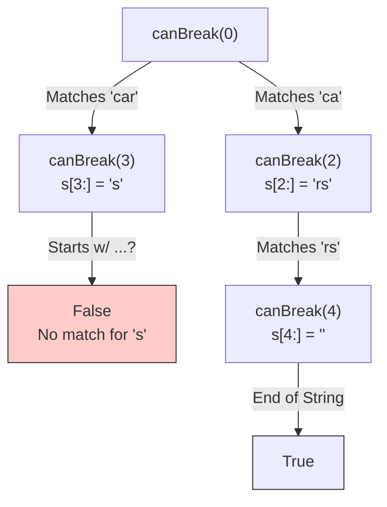

# 09. Word Break

## Problem Description

Given a string `s` and a dictionary of strings `wordDict`, return `true` if `s` can be segmented into a space-separated sequence of one or more dictionary words.

**Note** that the same word in the dictionary may be reused multiple times in the segmentation.

**Example 1:**
- **Input:** `s = "leetcode"`, `wordDict = ["leet","code"]`
- **Output:** `true`
- **Explanation:** Return `true` because `"leetcode"` can be segmented as `"leet code"`.

**Example 2:**
- **Input:** `s = "applepenapple"`, `wordDict = ["apple","pen"]`
- **Output:** `true`
- **Explanation:** Return `true` because `"applepenapple"` can be segmented as `"apple pen apple"`.

**Example 3:**
- **Input:** `s = "catsandog"`, `wordDict = ["cats","dog","sand","and","cat"]`
- **Output:** `false`

**Constraints:**
- `1 <= s.length <= 300`
- `1 <= wordDict.length <= 1000`
- `1 <= wordDict[i].length <= 20`

---

## 1. Recursive Solution (Intuitive Approach)

Can we break the string `s` starting from index 0?
To answer this, let's look at all valid words in `wordDict`. If `s` starts with a word from `wordDict` (say, `"leet"` which is length 4), the remaining question is:
*Can we break the rest of the string starting from index 4?*

So, `canBreak(start)` is true if there exists some word in `wordDict` where:
1. `s` starts with `word` at index `start`
2. `canBreak(start + word.length)` also returns true.

### Java Implementation (Naive Recursion)

```java
class Solution {
    public boolean wordBreak(String s, List<String> wordDict) {
        return canBreak(s, wordDict, 0);
    }
    
    private boolean canBreak(String s, List<String> wordDict, int start) {
        // Base case: successfully reached the end of the string
        if (start == s.length()) {
            return true;
        }
        
        // Try every word in the dictionary
        for (String word : wordDict) {
            // If the substring starting at 'start' matches the word
            if (s.startsWith(word, start)) {
                // Recursively check if the remainder of the string can be broken
                if (canBreak(s, wordDict, start + word.length())) {
                    return true;
                }
            }
        }
        
        return false;
    }
}
```

---

## 2. Recursion Tree Visualization

Let `s = "cars"`, `wordDict = ["car", "ca", "rs"]`. Start at index 0.


*In a string like `"aaaaab"` with `wordDict = ["a", "aa", "aaa", "aaaa"]`, the recursion tree branches factorially resulting in thousands of overlapping `canBreak(index)` calls.*

---

## 3. Bottom-Up DP Solution (Tabulation)

We want to flip the perspective. Instead of calling functions forward, we build an array `dp` from left to right.
Let `dp[i]` be a boolean: *Can the prefix of `s` of length `i` be segmented into words?*

`dp[i]` is true if:
There exists a valid word of length `len` that ends at `i`, AND the prefix up to `i-len` was also valid (`dp[i-len] == true`).

`dp[0] = true` handles the empty base case smoothly.

### Java Implementation (Iterative DP)

```java
class Solution {
    public boolean wordBreak(String s, List<String> wordDict) {
        // Build a Set for O(1) lookups instead of checking each word
        Set<String> wordSet = new HashSet<>(wordDict);
        boolean[] dp = new boolean[s.length() + 1];
        
        // Base case: empty string is valid
        dp[0] = true;
        
        // Iterate through string lengths from 1 to s.length()
        for (int i = 1; i <= s.length(); i++) {
            // Test all possible splits j < i
            for (int j = 0; j < i; j++) {
                // If the first j characters can be segmented, 
                // AND the remaining part s.substring(j, i) is in dict:
                if (dp[j] && wordSet.contains(s.substring(j, i))) {
                    dp[i] = true;
                    // Found a valid segmenting, no need to check other splits
                    break;
                }
            }
        }
        
        return dp[s.length()]; // Result for the massive whole string
    }
}
```

*Note: Instead of checking splits `j` from 0 to `i`, we can loop through the `wordDict` directly which is often faster if the dict is small and the string is long (like in the recursion approach).*

---

## 4. Complete Visual Mapping: DP Array Trace

Let `s = "leetcode"`, `wordDict = ["leet", "code"]`.
`dp` size is 9 (indices 0 to 8).

### Initial Array
```text
Indices (i) →   0    1    2    3    4    5    6    7    8
Characters  →      l    e    e    t    c    o    d    e
dp array    →  [T]  [F]  [F]  [F]  [F]  [F]  [F]  [F]  [F]
```

### Iterate i to 4: `i=4, 'leet'`
- `j=0`: `s.substring(0, 4)` is `"leet"`. 
  `dp[0]` is **T** AND `"leet"` is in dict. 
  Therefore, `dp[4] = true`. Break inner loop.

```text
Indices (i) →   0    1    2    3    4    5    6    7    8
Characters  →      |---leet---|
dp array    →  [T]  [F]  [F]  [F]  [T]  [F]  [F]  [F]  [F]
                                    ↑
```

### Iterate i to 8: `i=8, 'leetcode'`
- Inner loop checks `j` from 0 to 7. 
- Fast forward to `j=4`: `s.substring(4, 8)` is `"code"`.
  `dp[4]` is **T** AND `"code"` is in dict.
  Therefore, `dp[8] = true`. Break inner loop.

```text
Indices (i) →   0    1    2    3    4    5    6    7    8
Characters  →                     |---code---|
dp array    →  [T]  [F]  [F]  [F]  [T]  [F]  [F]  [F]  [T]  ← ANSWER
                                                      ↑
```

---

## 5. The Complete Mapping Pattern

```text
Recursion (Can we break from start to end?):    Tabulation (Can we break from 0 to i?):
canBreak(start)                         ←→      dp[i]

if (canBreak(j) and s.substring(j, i))  ←→      if (dp[j] && dict.contains(s[j:i]))

Returns True down the tree line         ←→      Marks True rightwards on array
```

### Visual Dependency
```text
To set dp[8] = true, we need:
1. dp[4] == true
2. substring(4, 8) to be in the dictionary
   
|----------|----------|
0   [T]    4   [T]    8   <- dp Array dependency link
```

---

## 6. Side-by-Side: Final Comparison

### Recursion (Forward-Checking)
```java
// Check all words that match prefix to step forward
for (String w : wordDict) {
    if (s.startsWith(w, start)) {
        if (canBreak(s, wordDict, start + w.length())) return true;
    }
}
```

### Tabulation (Backward-Checking)
```java
// Check all valid past break points to link to current
for (int j = 0; j < i; j++) {
    if (dp[j] && wordDict.contains(s.substring(j, i))) {
        dp[i] = true;
        break;
    }
}
```

---

## 7. Complexity Analysis

### Naive Recursive Solution
- **Time Complexity:** $O(2^n)$. In the worst case (e.g., `s = "aaaaab"`, `dict = ["a","aa","aaa"]`), we check every possible partition, creating a branching factor equal to the number of combinations.
- **Space Complexity:** $O(n)$ stack frames for recursion tree depth.

### Bottom-Up DP Solution 
- **Time Complexity:** $O(n^3)$ worst-case. The outer loop runs $n$ times, inner loop runs $n$ times ($n^2$). The substring creation inside the loop takes $O(n)$ time. Adding up to $O(n^3)$. 
*(Note: If we iterate through `wordDict` inside the loop instead of `j`, it becomes $O(n \cdot m \cdot k)$ where `m` is dictionary size and `k` is max word length).*
- **Space Complexity:** $O(n)$ for the `dp` array of size `n+1`. Also extra space if creating the HashSet `O(m * k)`.
