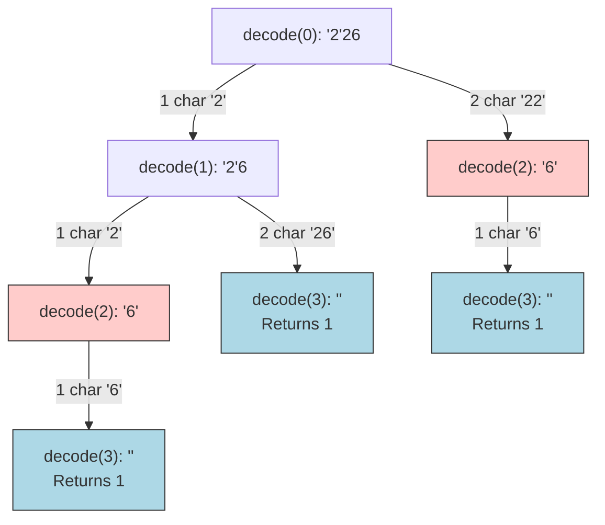

# 10. Decode Ways

## Problem Description

A message containing letters from `A-Z` can be **encoded** into numbers using the following mapping:
- `'A' -> "1"`
- `'B' -> "2"`
- ...
- `'Z' -> "26"`

To **decode** an encoded message, all the digits must be grouped then mapped back into letters using the reverse of the mapping above (there may be multiple ways). For example, `"11106"` can be mapped into:
- `"AAJF"` with the grouping `(1 1 10 6)`
- `"KJF"` with the grouping `(11 10 6)`

Given a string `s` containing only digits, return the **number of ways** to decode it.

**Example 1:**
- **Input:** `s = "12"`
- **Output:** `2`
- **Explanation:** `"12"` could be decoded as `"AB"` (1 2) or `"L"` (12).

**Example 2:**
- **Input:** `s = "226"`
- **Output:** `3`
- **Explanation:** `"226"` could be decoded as `"BZ"` (2 26), `"VF"` (22 6), or `"BBF"` (2 2 6).

**Example 3:**
- **Input:** `s = "06"`
- **Output:** `0`
- **Explanation:** "06" cannot be mapped to "F" because of the leading zero ("6" is different from "06").

**Constraints:**
- `1 <= s.length <= 100`
- `s` contains only digits and may contain leading zero(s).

---

## 1. Recursive Solution (Intuitive Approach)

Since we are finding the *total number of ways*, we evaluate our choices at every character index `i`:
1. **Single Digit Decode**: If the digit at `s[i]` is not `'0'`, we can decode it as a single letter. So we add `decode(i + 1)`.
2. **Double Digit Decode**: If the digits `s[i]` and `s[i+1]` form a valid number between `"10"` and `"26"`, we can decode them together as a single letter. We add `decode(i + 2)`.

The total ways from index `i` is the sum of choices 1 and 2. This operates very similarly to Climbing Stairs (1 step or 2 steps).

### Java Implementation (Naive Recursion)

```java
class Solution {
    public int numDecodings(String s) {
        return decode(s, 0);
    }
    
    private int decode(String s, int index) {
        // Base case: Reached the end successfully
        if (index == s.length()) {
            return 1;
        }
        
        // Base case: String starts with '0', invalid decode
        if (s.charAt(index) == '0') {
            return 0;
        }
        
        // Option 1: Take 1 character
        int ways = decode(s, index + 1);
        
        // Option 2: Take 2 characters (if within bounds and valid form 10-26)
        if (index + 1 < s.length()) {
            int twoDigit = Integer.parseInt(s.substring(index, index + 2));
            if (twoDigit >= 10 && twoDigit <= 26) {
                ways += decode(s, index + 2);
            }
        }
        
        return ways;
    }
}
```

---

## 2. Recursion Tree Visualization

Let's trace `s = "226"`. Find calls for `decode(i)`.


*Notice overlapping subproblems. `decode(2)` is hit multiple times. Adding memoization or converting to bottom-up DP fixes this.*

---

## 3. Bottom-Up DP Solution (Tabulation)

We create a DP array where `dp[i]` is the number of ways to decode a string of length `i`. 
- `dp[0] = 1` (empty string has 1 way to be "decoded")
- `dp[1] = 1 if s[0] != '0' else 0`

For `i` from 2 to `s.length()`:
- Check single digit `s[i-1]`. If it's valid (1-9), add `dp[i-1]`.
- Check double digit `s[i-2...i]`. If it's valid (10-26), add `dp[i-2]`.

### Java Implementation (Iterative DP)

```java
class Solution {
    public int numDecodings(String s) {
        if (s == null || s.length() == 0 || s.charAt(0) == '0') {
            return 0;
        }
        
        int n = s.length();
        int[] dp = new int[n + 1];
        
        // Base cases
        dp[0] = 1;
        dp[1] = 1; // Checked s[0] != '0' above
        
        for (int i = 2; i <= n; i++) {
            // Check single digit
            int oneDigit = s.charAt(i - 1) - '0';
            if (oneDigit >= 1) {
                dp[i] += dp[i - 1];
            }
            
            // Check two digits
            int twoDigits = Integer.parseInt(s.substring(i - 2, i));
            if (twoDigits >= 10 && twoDigits <= 26) {
                dp[i] += dp[i - 2];
            }
        }
        
        return dp[n];
    }
}
```
*Note: Since `dp[i]` only depends on `dp[i-1]` and `dp[i-2]`, space can be optimized to $O(1)$ just like Climbing Stairs!*

---

## 4. Complete Visual Mapping: DP Array Trace

Trace for `s = "226"`. Array `dp` size is `n + 1 = 4`.

### Initialization
```text
String chars →      '2'   '2'   '6'
Length (i)   →   0   1     2     3
dp array     →  [1] [1]   [0]   [0]
```

### Iterate i=2: Char '2' (Two at i=2)
- One digit: `'2'` is valid. Add `dp[1]` (1). `dp[2] += 1 (Total: 1)`.
- Two digit: `"22"` is valid (10 <= 22 <= 26). Add `dp[0]` (1). `dp[2] += 1 (Total: 2)`.

```text
String chars →      '2'   '2'   '6'
Length (i)   →   0   1     2     3
dp array     →  [1] [1]   [2]   [0]
                         ↑
                    Filled dp[2]
```

### Iterate i=3: Char '6' (Six at i=3)
- One digit: `'6'` is valid. Add `dp[2]` (2). `dp[3] += 2 (Total: 2)`.
- Two digit: `"26"` is valid. Add `dp[1]` (1). `dp[3] += 1 (Total: 3)`.

```text
String chars →      '2'   '2'   '6'
Length (i)   →   0   1     2     3
dp array     →  [1] [1]   [2]   [3] ← ANSWER at dp[3]
```

---

## 5. The Complete Mapping Pattern

```text
Recursion:                                     Tabulation:
decode(index)                          ←→      dp[i]

if (single valid): decode(idx+1)       ←→      if (single valid): dp[i] += dp[i-1]
if (double valid): decode(idx+2)       ←→      if (double valid): dp[i] += dp[i-2]
```

### Visual Dependency
This is identical to **Climbing Stairs**, but with validation conditionals attached to the backward-looking steps.
```text
[ dp[i-2] ]     [ dp[i-1] ]     [  dp[i]  ]
      \             |             /
     Valid 10-26? Valid 1-9?    Add both
```

---

## 6. Side-by-Side: Final Comparison

### Recursion (Forward Steps)
```java
int ways = 0;
if (s.charAt(i) != '0') 
    ways += decode(i + 1);
if (parseInt(s.substring(i, i+2)) <= 26) 
    ways += decode(i + 2);
```

### Tabulation (Backward Summation)
```java
if (s.charAt(i-1) != '0') 
    dp[i] += dp[i - 1];
if (parseInt(s.substring(i-2, i)) <= 26) 
    dp[i] += dp[i - 2];
```

---

## 7. Complexity Analysis

### Naive Recursive Solution
- **Time Complexity:** $O(2^n)$. Branching factor of 2 at each step.
- **Space Complexity:** $O(n)$ recursion stack.

### Bottom-Up DP Solution 
- **Time Complexity:** $O(n)$. Single loop iterating forward analyzing previous states in constant $O(1)$ time. 
- **Space Complexity:** $O(n)$ for the `dp` array. This is strictly optimizable to $O(1)$ by using `prev1` and `prev2` variables exactly as in Climbing Stairs space optimization.
