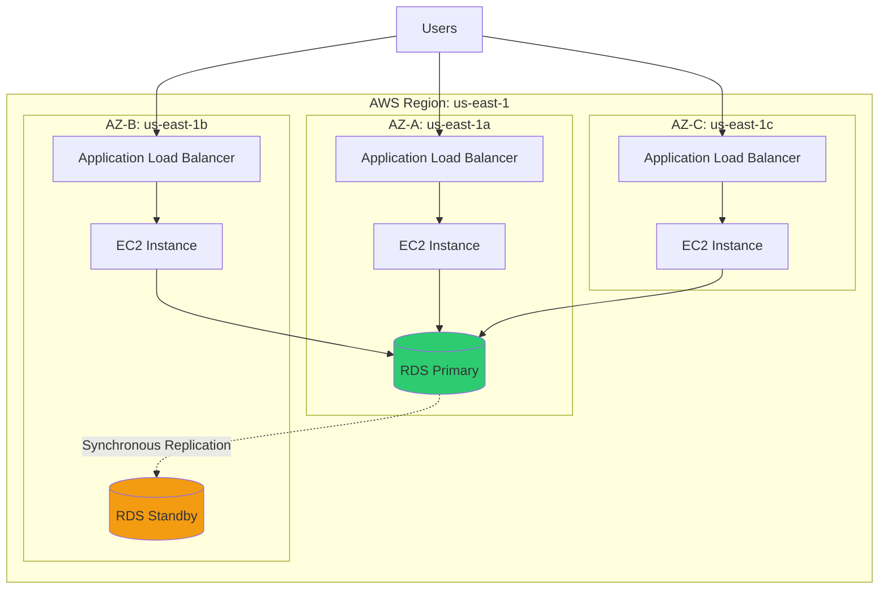
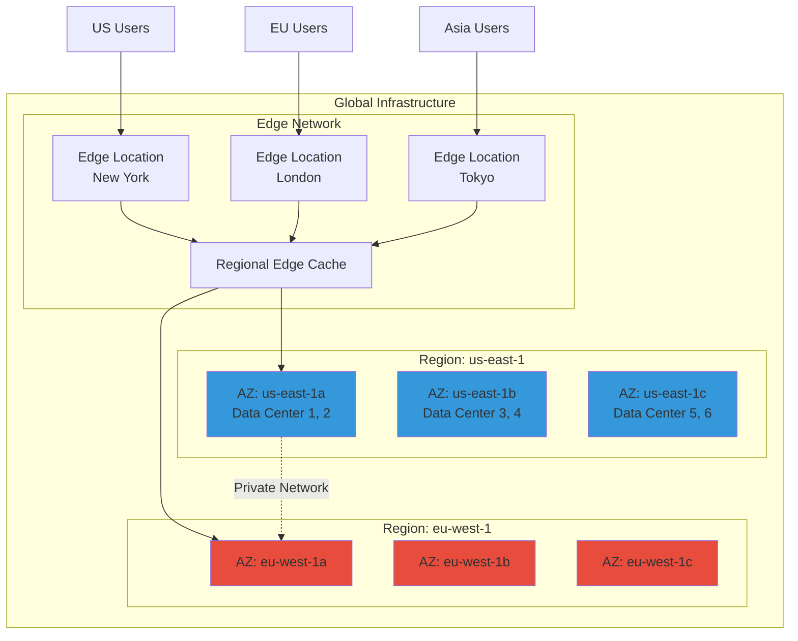
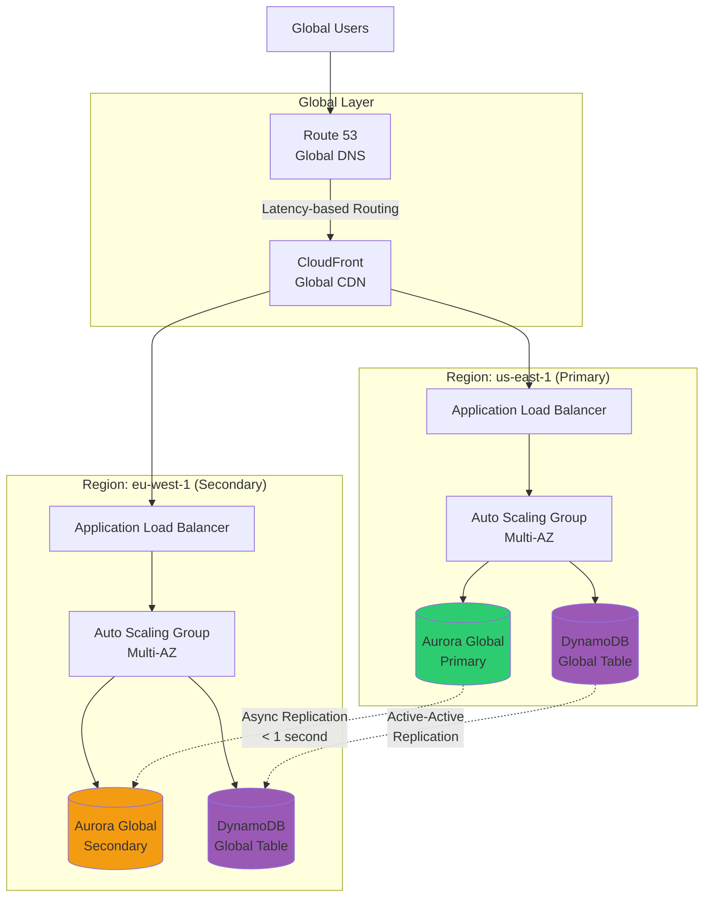

# AWS Global Infrastructure

## Overview

AWS Global Infrastructure is the foundation of all AWS services and understanding it is critical for designing highly available, fault-tolerant, and compliant cloud architectures. In enterprise banking interviews, you'll be expected to explain how AWS's physical and logical infrastructure enables regulatory compliance, data sovereignty, disaster recovery, and global application delivery.

**Why interviewers ask about this**: Global infrastructure decisions directly impact availability, latency, compliance, and cost. Staff/Principal Engineers must understand how to leverage AWS's global footprint to meet business requirements while managing complexity and cost.

**Real-world relevance**: In banking, you need to design systems that comply with data residency regulations (e.g., EU data must stay in EU), achieve 99.99%+ uptime across regions, and deliver low-latency experiences to global customers while maintaining disaster recovery capabilities.

## Foundational Concepts

### Regions

An **AWS Region** is a physical geographic area containing multiple isolated Availability Zones. As of 2024, AWS operates 33+ Regions globally.

**Key characteristics:**
- Each Region is completely independent and isolated
- Resources don't replicate across Regions automatically (except for specific services like S3 CRR, DynamoDB Global Tables)
- Pricing varies by Region
- Not all services are available in all Regions
- Regions are connected via AWS's private global network backbone

**Region naming**: `us-east-1` (N. Virginia), `eu-west-1` (Ireland), `ap-southeast-1` (Singapore)

### Availability Zones (AZs)

An **Availability Zone** is one or more discrete data centers with redundant power, networking, and connectivity within a Region. Each Region has a minimum of 3 AZs (most have 3-6).

**Key characteristics:**
- AZs within a Region are physically separated (typically 10s of miles apart)
- Connected via low-latency, high-bandwidth private fiber
- Single-digit millisecond latency between AZs
- Independent failure domains (power, cooling, networking)
- AZ IDs (e.g., `use1-az1`) are consistent across accounts, while AZ names (e.g., `us-east-1a`) are randomized per account

**Common misconception**: AZ names like `us-east-1a` map to the same physical location across all AWS accounts. **FALSE** - AWS randomizes AZ name mappings to prevent all customers from launching resources in the same physical AZ.

### Edge Locations and CloudFront

**Edge Locations** are AWS data centers designed to deliver content to end users with low latency. AWS operates 400+ Edge Locations globally.

**Use cases:**
- CloudFront (CDN) content caching
- Route 53 DNS queries
- AWS Shield DDoS protection
- AWS WAF filtering
- Lambda@Edge function execution

**Regional Edge Caches**: Intermediate caching layer between Edge Locations and origin servers, with larger cache capacity.

### Local Zones

**AWS Local Zones** extend AWS infrastructure closer to large population centers, industries, and IT hubs. They provide single-digit millisecond latency for applications requiring ultra-low latency.

**Use cases:**
- Real-time gaming
- Live video streaming
- Machine learning inference
- Hybrid cloud with on-premises data centers

**Example**: `us-east-1-bos-1` (Boston Local Zone)

### Wavelength Zones

**AWS Wavelength** embeds AWS compute and storage services within telecommunications providers' 5G networks, enabling ultra-low latency (single-digit milliseconds) for mobile edge computing.

**Use cases:**
- Mobile gaming
- AR/VR applications
- Real-time video processing
- IoT applications

### AWS Outposts

**AWS Outposts** brings native AWS services, infrastructure, and operating models to on-premises data centers. It's a fully managed service where AWS delivers and installs hardware in your facility.

**Use cases:**
- Data residency requirements
- Low-latency access to on-premises systems
- Local data processing before cloud migration
- Hybrid cloud architectures

**Outposts configurations:**
- Outposts racks (42U racks)
- Outposts servers (1U/2U form factor)

## Technical Deep Dive

### Region Selection Criteria

When choosing an AWS Region for enterprise banking applications, consider:

#### 1. **Compliance and Data Sovereignty**
- **GDPR**: EU customer data must be stored in EU Regions
- **PCI DSS**: Payment card data may require specific geographic controls
- **Banking regulations**: Some countries require financial data to remain within national borders
- **Example**: A European bank must use `eu-west-1`, `eu-central-1`, or `eu-west-2` for customer PII

#### 2. **Latency and User Location**
- Choose Regions closest to end users
- Use CloudFront for global content delivery
- Consider multi-region active-active for global applications
- **Rule of thumb**: Each 1,000 miles adds ~10ms latency

#### 3. **Service Availability**
- Not all services launch in all Regions simultaneously
- Check [AWS Regional Services](https://aws.amazon.com/about-aws/global-infrastructure/regional-product-services/)
- Newer services often launch in `us-east-1` first
- **Example**: Some AI/ML services may only be available in select Regions

#### 4. **Cost**
- Pricing varies significantly by Region
- `us-east-1` is often the cheapest
- Data transfer between Regions incurs charges ($0.02/GB typically)
- **Example**: EC2 in `us-east-1` may be 10-20% cheaper than `ap-southeast-1`

#### 5. **Disaster Recovery**
- Choose a secondary Region for DR
- Ensure sufficient geographic separation (1000+ miles)
- Consider paired Regions (e.g., `us-east-1` + `us-west-2`)

### Availability Zone Architecture

#### Multi-AZ Deployment Pattern



**Key points:**
- Application Load Balancer spans all AZs automatically
- EC2 instances distributed across AZs via Auto Scaling Group
- RDS Multi-AZ provides synchronous replication to standby
- If one AZ fails, traffic automatically routes to healthy AZs

#### AZ Failure Scenarios

**Scenario 1: Single AZ Failure**
- Impact: 33% capacity loss (if evenly distributed across 3 AZs)
- Recovery: Auto Scaling launches new instances in healthy AZs
- RTO: Minutes (time to launch and warm up instances)
- **Banking requirement**: Design for N+1 capacity (can lose 1 AZ and still handle peak load)

**Scenario 2: AZ Network Partition**
- Impact: AZ is isolated but instances still running
- Challenge: Split-brain scenarios if not handled properly
- Mitigation: Use quorum-based consensus (e.g., 3 AZs, require 2 for writes)

### Service Limits and Quotas

**Regional Limits** (examples, check current limits):
- EC2 On-Demand instances: 20 vCPUs per instance family (soft limit)
- VPCs per Region: 5 (soft limit)
- Elastic IPs: 5 per Region (soft limit)
- S3 buckets: 100 per account (soft limit, can request increase to 1000)

**AZ-Specific Considerations**:
- Some instance types may not be available in all AZs
- Capacity constraints can occur during high-demand periods
- Use multiple instance types in Auto Scaling for better availability

### Pricing Model

**Data Transfer Costs**:
- Within same AZ: FREE (using private IP)
- Between AZs in same Region: $0.01/GB in/out
- Between Regions: $0.02/GB (varies by Region pair)
- To Internet: $0.09/GB (first 10TB, decreases with volume)
- From Internet: FREE

**Cost optimization tip**: Keep frequently communicating services in the same AZ when possible, but balance with availability requirements.

## Visual Representations

### AWS Global Infrastructure Overview



### Multi-Region Architecture for Global Banking Application



## Configuration Examples

### CloudFormation: Multi-AZ Auto Scaling Group

```yaml
AWSTemplateFormatVersion: '2010-09-09'
Description: Multi-AZ Auto Scaling Group for High Availability

Parameters:
  VpcId:
    Type: AWS::EC2::VPC::Id
    Description: VPC ID for deployment
  
  SubnetIds:
    Type: List<AWS::EC2::Subnet::Id>
    Description: Subnet IDs across multiple AZs
  
  InstanceType:
    Type: String
    Default: t3.medium
    Description: EC2 instance type

Resources:
  # Launch Template
  LaunchTemplate:
    Type: AWS::EC2::LaunchTemplate
    Properties:
      LaunchTemplateName: MultiAZTemplate
      LaunchTemplateData:
        ImageId: !Sub '{{resolve:ssm:/aws/service/ami-amazon-linux-latest/amzn2-ami-hvm-x86_64-gp2}}'
        InstanceType: !Ref InstanceType
        IamInstanceProfile:
          Arn: !GetAtt InstanceProfile.Arn
        SecurityGroupIds:
          - !Ref InstanceSecurityGroup
        UserData:
          Fn::Base64: !Sub |
            #!/bin/bash
            yum update -y
            yum install -y httpd
            systemctl start httpd
            systemctl enable httpd
            INSTANCE_ID=$(ec2-metadata --instance-id | cut -d " " -f 2)
            AZ=$(ec2-metadata --availability-zone | cut -d " " -f 2)
            echo "<h1>Instance $INSTANCE_ID in AZ $AZ</h1>" > /var/www/html/index.html
        TagSpecifications:
          - ResourceType: instance
            Tags:
              - Key: Name
                Value: MultiAZ-Instance
  
  # Auto Scaling Group spanning multiple AZs
  AutoScalingGroup:
    Type: AWS::AutoScaling::AutoScalingGroup
    Properties:
      AutoScalingGroupName: MultiAZ-ASG
      VPCZoneIdentifier: !Ref SubnetIds  # Subnets in different AZs
      LaunchTemplate:
        LaunchTemplateId: !Ref LaunchTemplate
        Version: !GetAtt LaunchTemplate.LatestVersionNumber
      MinSize: 3
      MaxSize: 9
      DesiredCapacity: 3
      HealthCheckType: ELB
      HealthCheckGracePeriod: 300
      TargetGroupARNs:
        - !Ref TargetGroup
      Tags:
        - Key: Name
          Value: MultiAZ-Instance
          PropagateAtLaunch: true
  
  # Application Load Balancer (automatically multi-AZ)
  ApplicationLoadBalancer:
    Type: AWS::ElasticLoadBalancingV2::LoadBalancer
    Properties:
      Name: MultiAZ-ALB
      Scheme: internet-facing
      Type: application
      Subnets: !Ref SubnetIds  # ALB spans all AZs
      SecurityGroups:
        - !Ref ALBSecurityGroup
      Tags:
        - Key: Name
          Value: MultiAZ-ALB
  
  # Target Group
  TargetGroup:
    Type: AWS::ElasticLoadBalancingV2::TargetGroup
    Properties:
      Name: MultiAZ-TG
      Port: 80
      Protocol: HTTP
      VpcId: !Ref VpcId
      HealthCheckEnabled: true
      HealthCheckPath: /
      HealthCheckIntervalSeconds: 30
      HealthCheckTimeoutSeconds: 5
      HealthyThresholdCount: 2
      UnhealthyThresholdCount: 3
      TargetType: instance
  
  # Listener
  Listener:
    Type: AWS::ElasticLoadBalancingV2::Listener
    Properties:
      LoadBalancerArn: !Ref ApplicationLoadBalancer
      Port: 80
      Protocol: HTTP
      DefaultActions:
        - Type: forward
          TargetGroupArn: !Ref TargetGroup
  
  # Security Groups
  ALBSecurityGroup:
    Type: AWS::EC2::SecurityGroup
    Properties:
      GroupDescription: Security group for ALB
      VpcId: !Ref VpcId
      SecurityGroupIngress:
        - IpProtocol: tcp
          FromPort: 80
          ToPort: 80
          CidrIp: 0.0.0.0/0
      Tags:
        - Key: Name
          Value: ALB-SG
  
  InstanceSecurityGroup:
    Type: AWS::EC2::SecurityGroup
    Properties:
      GroupDescription: Security group for instances
      VpcId: !Ref VpcId
      SecurityGroupIngress:
        - IpProtocol: tcp
          FromPort: 80
          ToPort: 80
          SourceSecurityGroupId: !Ref ALBSecurityGroup
      Tags:
        - Key: Name
          Value: Instance-SG
  
  # IAM Role for EC2
  InstanceRole:
    Type: AWS::IAM::Role
    Properties:
      AssumeRolePolicyDocument:
        Version: '2012-10-17'
        Statement:
          - Effect: Allow
            Principal:
              Service: ec2.amazonaws.com
            Action: sts:AssumeRole
      ManagedPolicyArns:
        - arn:aws:iam::aws:policy/CloudWatchAgentServerPolicy
        - arn:aws:iam::aws:policy/AmazonSSMManagedInstanceCore
  
  InstanceProfile:
    Type: AWS::IAM::InstanceProfile
    Properties:
      Roles:
        - !Ref InstanceRole

Outputs:
  LoadBalancerDNS:
    Description: DNS name of the load balancer
    Value: !GetAtt ApplicationLoadBalancer.DNSName
  
  AutoScalingGroupName:
    Description: Name of the Auto Scaling Group
    Value: !Ref AutoScalingGroup
```

### AWS CLI: Check AZ Availability

```bash
# List all available AZs in a Region
aws ec2 describe-availability-zones \
  --region us-east-1 \
  --query 'AvailabilityZones[*].[ZoneName,ZoneId,State]' \
  --output table

# Check which instance types are available in specific AZ
aws ec2 describe-instance-type-offerings \
  --location-type availability-zone \
  --filters Name=location,Values=us-east-1a \
  --region us-east-1 \
  --query 'InstanceTypeOfferings[*].InstanceType' \
  --output table

# Get AZ ID (consistent across accounts)
aws ec2 describe-availability-zones \
  --region us-east-1 \
  --query 'AvailabilityZones[?ZoneName==`us-east-1a`].ZoneId' \
  --output text
```

### Best Practice: Multi-Region S3 Replication

```bash
# Enable versioning on source bucket (required for replication)
aws s3api put-bucket-versioning \
  --bucket source-bucket-us-east-1 \
  --versioning-configuration Status=Enabled \
  --region us-east-1

# Enable versioning on destination bucket
aws s3api put-bucket-versioning \
  --bucket destination-bucket-eu-west-1 \
  --versioning-configuration Status=Enabled \
  --region eu-west-1

# Create replication configuration
cat > replication-config.json <<EOF
{
  "Role": "arn:aws:iam::123456789012:role/S3ReplicationRole",
  "Rules": [
    {
      "Status": "Enabled",
      "Priority": 1,
      "DeleteMarkerReplication": { "Status": "Enabled" },
      "Filter": {},
      "Destination": {
        "Bucket": "arn:aws:s3:::destination-bucket-eu-west-1",
        "ReplicationTime": {
          "Status": "Enabled",
          "Time": { "Minutes": 15 }
        },
        "Metrics": {
          "Status": "Enabled",
          "EventThreshold": { "Minutes": 15 }
        }
      }
    }
  ]
}
EOF

# Apply replication configuration
aws s3api put-bucket-replication \
  --bucket source-bucket-us-east-1 \
  --replication-configuration file://replication-config.json \
  --region us-east-1
```

## Interview Questions & Model Answers

### ⭐ Foundational Questions

**Q1: What is the difference between a Region and an Availability Zone?**

**Model Answer:**
"A Region is a geographic area containing multiple isolated Availability Zones. For example, `us-east-1` is the N. Virginia Region. An Availability Zone is one or more discrete data centers within a Region, each with redundant power, networking, and connectivity. Each Region has at least 3 AZs, which are physically separated but connected via low-latency private fiber.

The key distinction is that Regions are completely independent—resources don't replicate automatically between them—while AZs within a Region are designed to work together for high availability. If I deploy an application across multiple AZs in the same Region, I get fault isolation against data center failures while maintaining low-latency communication between components."

**Follow-up**: How does AWS ensure AZ independence?
**Answer**: "Each AZ has independent power sources, cooling systems, and network connectivity. They're physically separated by meaningful distances (typically 10s of miles) to protect against localized disasters like floods or power grid failures, but close enough to maintain single-digit millisecond latency for synchronous replication."

---

**Q2: Why does AWS randomize AZ name mappings across accounts?**

**Model Answer:**
"AWS randomizes AZ names like `us-east-1a` across accounts to prevent all customers from concentrating resources in the same physical AZ. If everyone could see that `us-east-1a` was the 'first' or 'best' AZ, there would be a tendency to launch resources there, creating capacity imbalances and potential single points of failure.

Instead, AWS uses AZ IDs like `use1-az1` which are consistent across accounts. This allows AWS to balance load across physical infrastructure while still enabling customers to coordinate AZ placement when needed, such as when using VPC peering or Transit Gateway across accounts."

---

**Q3: What factors should you consider when selecting an AWS Region?**

**Model Answer:**
"For enterprise banking applications, I consider five key factors:

1. **Compliance and data sovereignty**: GDPR requires EU customer data in EU Regions. Some banking regulations mandate data stay within national borders.

2. **Latency**: Choose Regions closest to end users. Each 1,000 miles adds roughly 10ms latency.

3. **Service availability**: Not all services launch in all Regions simultaneously. Check if required services are available.

4. **Cost**: Pricing varies by Region. `us-east-1` is often cheapest, but data transfer between Regions costs $0.02/GB.

5. **Disaster recovery**: Select a secondary Region with sufficient geographic separation (1000+ miles) for DR.

For a global banking application, I might use `us-east-1` for US customers, `eu-west-1` for EU customers, and `ap-southeast-1` for Asia, with CloudFront for global content delivery and Route 53 latency-based routing."

---

### ⭐⭐ Intermediate Questions

**Q4: How would you design a multi-AZ architecture for a critical banking application?**

**Model Answer:**
"For a critical banking application requiring 99.99% availability, I would:

1. **Compute tier**: Deploy an Auto Scaling Group with instances distributed across 3 AZs. Set minimum capacity to N+1 (can lose one AZ and still handle peak load).

2. **Load balancing**: Use an Application Load Balancer which automatically spans all AZs and performs health checks.

3. **Database**: Use RDS Multi-AZ for synchronous replication to a standby in a different AZ. For higher performance, consider Aurora with read replicas in each AZ.

4. **Storage**: Use EBS with snapshots to S3 (which is automatically multi-AZ). For shared storage, use EFS which is natively multi-AZ.

5. **Caching**: Deploy ElastiCache with cluster mode enabled across multiple AZs.

6. **Monitoring**: Set up CloudWatch alarms for AZ-level metrics and enable cross-AZ health checks.

The key is ensuring no single AZ failure can take down the application. I'd test this with chaos engineering—intentionally failing an AZ to verify failover works."

---

**Q5: What are the cost implications of multi-AZ deployments?**

**Model Answer:**
"Multi-AZ deployments have several cost implications:

1. **Data transfer**: $0.01/GB between AZs in the same Region. For chatty applications, this adds up. Mitigation: Keep frequently communicating services in the same AZ when possible.

2. **Redundant resources**: Running instances in 3 AZs instead of 1 triples compute costs. However, this is necessary for availability.

3. **RDS Multi-AZ**: Doubles database costs (primary + standby). The standby can't serve read traffic in standard Multi-AZ.

4. **Load balancer**: ALB charges per hour and per LCU. Multi-AZ doesn't directly increase this, but higher traffic across AZs may increase LCU consumption.

5. **Storage**: EBS volumes are AZ-specific. If you need the same data in multiple AZs, you're paying for multiple volumes.

Cost optimization strategies:
- Use Aurora instead of RDS Multi-AZ (read replicas can serve traffic)
- Implement caching to reduce cross-AZ database calls
- Use VPC endpoints to avoid NAT Gateway data transfer charges
- Right-size instances and use Savings Plans for predictable workloads

For a banking application, the cost of multi-AZ is justified by the cost of downtime—even 1 hour of outage could cost millions in lost transactions and regulatory fines."

---

**Q6: Explain the difference between Edge Locations, Local Zones, and Wavelength Zones.**

**Model Answer:**
"These are all extensions of AWS infrastructure, but serve different purposes:

**Edge Locations** (400+ globally):
- Purpose: Content delivery and DNS
- Services: CloudFront, Route 53, WAF, Shield
- Use case: Caching static content close to users
- Latency: 10-50ms to end users
- Example: Serving a banking app's static assets (JS, CSS, images)

**Local Zones** (30+ locations):
- Purpose: Extend AWS compute/storage to metro areas
- Services: EC2, EBS, VPC, ELB (subset of AWS services)
- Use case: Ultra-low latency applications (< 10ms)
- Latency: Single-digit milliseconds
- Example: Real-time fraud detection for a bank in Boston using `us-east-1-bos-1`

**Wavelength Zones** (embedded in 5G networks):
- Purpose: Mobile edge computing
- Services: EC2, EBS, VPC (limited set)
- Use case: 5G mobile applications
- Latency: < 10ms to mobile devices
- Example: Mobile banking app with AR features

In banking, I'd use Edge Locations for global content delivery, Local Zones for latency-sensitive applications in specific cities, and Wavelength only for specialized mobile use cases like AR/VR banking experiences."

---

### ⭐⭐⭐ Advanced Questions

**Q7: How does AWS ensure low latency between AZs within a Region?**

**Model Answer:**
"AWS connects AZs within a Region using dedicated, redundant, high-bandwidth private fiber optic networks. Key technical details:

1. **Network architecture**: Multiple diverse fiber paths between each AZ pair to prevent single points of failure.

2. **Latency characteristics**: Typically single-digit milliseconds (1-2ms in most cases). AWS guarantees this is suitable for synchronous replication.

3. **Bandwidth**: High-bandwidth connections (100+ Gbps) to support large-scale data transfer.

4. **Routing**: Traffic between AZs stays on AWS's private network backbone, never traverses the public internet.

5. **Consistency**: Because AZ IDs (e.g., `use1-az1`) are consistent across accounts, AWS can engineer network topology for optimal performance.

This low latency enables:
- Synchronous database replication (RDS Multi-AZ, Aurora)
- Distributed consensus protocols (etcd, Zookeeper)
- Cross-AZ load balancing without noticeable latency
- Real-time data synchronization

For banking applications, this means we can achieve both high availability (multi-AZ) and strong consistency (synchronous replication) without sacrificing performance. However, I'd still minimize cross-AZ traffic for cost optimization—each GB costs $0.01."

---

**Q8: What are the trade-offs between multi-AZ and multi-Region architectures?**

**Model Answer:**
"Multi-AZ and multi-Region architectures solve different problems:

**Multi-AZ (within a Region):**
- **Purpose**: High availability against AZ failures
- **Latency**: 1-2ms between AZs
- **Consistency**: Synchronous replication possible (strong consistency)
- **Failover**: Automatic (seconds to minutes)
- **Cost**: $0.01/GB data transfer between AZs
- **Use case**: 99.99% availability for regional application
- **Limitation**: Doesn't protect against Region-wide outages

**Multi-Region:**
- **Purpose**: Disaster recovery, global performance, compliance
- **Latency**: 50-200ms between Regions
- **Consistency**: Asynchronous replication (eventual consistency)
- **Failover**: Manual or automated (minutes to hours)
- **Cost**: $0.02/GB data transfer between Regions
- **Use case**: 99.999% availability, global application, data sovereignty
- **Limitation**: Higher complexity, higher cost

**Trade-offs:**

| Aspect | Multi-AZ | Multi-Region |
|--------|----------|--------------|
| Availability | 99.99% | 99.999% |
| RPO | Near-zero | Seconds to minutes |
| RTO | Minutes | Minutes to hours |
| Complexity | Low | High |
| Cost | Moderate | High |
| Consistency | Strong | Eventual |

**Banking recommendation**: Use multi-AZ as baseline for all production workloads. Add multi-Region for:
- Disaster recovery (pilot light or warm standby)
- Global applications (active-active with Route 53 latency routing)
- Compliance (data residency requirements)

For example, a US bank might run active-active in `us-east-1` and `us-west-2` for DR, with a read-only replica in `eu-west-1` for European operations."

---

**Q9: How would you handle an AZ failure in production?**

**Model Answer:**
"Handling an AZ failure depends on whether the architecture is properly designed for multi-AZ:

**If properly designed (multi-AZ):**

1. **Detection** (0-30 seconds):
   - ALB health checks detect unhealthy instances
   - CloudWatch alarms trigger on AZ-level metrics
   - Auto Scaling marks instances as unhealthy

2. **Automatic failover** (30 seconds - 2 minutes):
   - ALB stops routing traffic to failed AZ
   - Auto Scaling launches replacement instances in healthy AZs
   - RDS Multi-AZ promotes standby to primary (60-120 seconds)
   - Route 53 health checks update DNS if using multi-Region

3. **Capacity restoration** (2-10 minutes):
   - New instances launch and pass health checks
   - Application warms up (load caches, establish connections)
   - Auto Scaling reaches desired capacity

4. **Monitoring and communication** (ongoing):
   - Monitor CloudWatch for cascading failures
   - Check AWS Service Health Dashboard
   - Communicate with stakeholders
   - Prepare incident report

**If NOT properly designed (single AZ):**
- Application is down until AZ recovers
- Manual intervention required to launch in different AZ
- Potential data loss if database wasn't Multi-AZ
- RTO: Hours, RPO: Potentially significant

**Post-incident:**
1. Review AWS Service Health Dashboard for root cause
2. Analyze CloudWatch logs and metrics
3. Conduct blameless post-mortem
4. Identify architecture improvements
5. Test failover procedures (chaos engineering)

**Banking context**: For a critical payment processing system, I'd design for N+1 capacity (can lose one AZ and still handle peak load), implement automated runbooks for common failure scenarios, and conduct quarterly disaster recovery drills."

---

### ⭐⭐⭐⭐ Tricky Questions

**Q10: Why might you choose NOT to deploy across all available AZs in a Region?**

**Model Answer:**
"While multi-AZ is generally best practice, there are scenarios where you might limit AZ usage:

**1. Cost optimization for non-critical workloads:**
- Dev/test environments don't need 99.99% availability
- Deploying in 2 AZs instead of 3 reduces costs by 33%
- Example: Staging environment for a banking app

**2. Data transfer costs:**
- Applications with high inter-service communication
- $0.01/GB adds up quickly at scale
- Mitigation: Use placement groups or keep chatty services in same AZ
- Example: High-frequency trading system with microsecond latency requirements

**3. Licensing constraints:**
- Some commercial software licenses are per-instance
- Running in 3 AZs triples licensing costs
- Example: Oracle Database with per-core licensing

**4. AZ capacity constraints:**
- During high-demand periods, some AZs may have limited capacity
- Newer instance types may not be available in all AZs
- Strategy: Use multiple instance types in Auto Scaling

**5. Latency-sensitive applications:**
- Some applications require sub-millisecond latency
- Cross-AZ latency (1-2ms) may be unacceptable
- Example: In-memory database cluster with synchronous replication

**6. Operational complexity:**
- Smaller teams may struggle with multi-AZ complexity
- Start with 2 AZs, add 3rd as team matures
- Example: Startup banking fintech

**Best practice**: For production banking workloads, default to 3 AZs unless there's a compelling reason not to. The cost of downtime far exceeds the cost of multi-AZ deployment."

---

**Q11: How do you ensure consistent AZ placement across multiple AWS accounts?**

**Model Answer:**
"This is a common challenge in enterprise multi-account strategies. The problem: AZ names (`us-east-1a`) are randomized per account, but you need consistent placement for VPC peering, Transit Gateway, or data transfer optimization.

**Solution: Use AZ IDs instead of AZ names**

AZ IDs (e.g., `use1-az1`, `use1-az2`) are consistent across all accounts in an organization.

**Step 1: Discover AZ IDs**
```bash
aws ec2 describe-availability-zones \
  --region us-east-1 \
  --query 'AvailabilityZones[*].[ZoneName,ZoneId]' \
  --output table
```

**Step 2: Use AZ IDs in Infrastructure as Code**

CloudFormation example:
```yaml
Parameters:
  TargetAZId:
    Type: String
    Default: use1-az1
    Description: AZ ID for consistent placement

Mappings:
  AZIdToName:
    us-east-1:
      use1-az1: us-east-1a  # This mapping is account-specific
      use1-az2: us-east-1b
      use1-az3: us-east-1c

Resources:
  Subnet:
    Type: AWS::EC2::Subnet
    Properties:
      AvailabilityZone: !FindInMap [AZIdToName, !Ref 'AWS::Region', !Ref TargetAZId]
```

**Step 3: Centralized AZ mapping**
- Store AZ ID to AZ name mappings in Systems Manager Parameter Store
- Use AWS Organizations to enforce consistent tagging
- Automate discovery with Lambda functions

**Enterprise banking use case:**
- Hub-and-spoke architecture with Transit Gateway
- Shared services VPC in central account
- Application VPCs in multiple accounts
- Need to ensure all accounts use same physical AZs for optimal routing and cost

**Terraform example:**
```hcl
data "aws_availability_zones" "available" {
  state = "available"
}

# Filter by AZ ID
locals {
  target_az_id = "use1-az1"
  target_az_name = [
    for az in data.aws_availability_zones.available.zone_ids :
    data.aws_availability_zones.available.names[index(data.aws_availability_zones.available.zone_ids, az)]
    if az == local.target_az_id
  ][0]
}
```

**Gotcha**: AZ IDs are Region-specific. `use1-az1` is different from `usw2-az1`."

---

### ⭐⭐⭐⭐⭐ Scenario-Based Questions

**Q12: Design a multi-Region disaster recovery architecture for a banking application that processes $10B in daily transactions. Requirements: RPO < 1 minute, RTO < 15 minutes, must comply with PCI DSS.**

**Model Answer:**
"This requires a **warm standby** or **active-active** multi-Region architecture. Given the transaction volume and strict RPO/RTO, I'd design:

**Architecture:**

**Primary Region: us-east-1**
- 3 AZs with Auto Scaling Groups (N+1 capacity)
- Application Load Balancer
- Aurora Global Database (primary cluster)
- DynamoDB Global Tables for session state
- ElastiCache Redis cluster mode for caching
- S3 with Cross-Region Replication (CRR)

**Secondary Region: us-west-2**
- 3 AZs with Auto Scaling Groups (warm standby, 50% capacity)
- Application Load Balancer
- Aurora Global Database (secondary cluster, read-only)
- DynamoDB Global Tables (active-active)
- ElastiCache Redis cluster mode
- S3 with CRR

**Global Layer:**
- Route 53 with health checks and failover routing
- CloudFront for static assets
- AWS WAF for DDoS protection (PCI DSS requirement)

**Data Replication:**
- Aurora Global Database: < 1 second replication lag (meets RPO)
- DynamoDB Global Tables: Active-active, sub-second replication
- S3 CRR: Asynchronous, typically < 15 minutes
- Transaction logs to S3 with CRR for audit trail (PCI DSS)

**Failover Process (automated):**

1. **Detection** (30 seconds):
   - Route 53 health checks fail in us-east-1
   - CloudWatch alarms trigger Lambda function

2. **Promotion** (2-3 minutes):
   - Lambda promotes Aurora secondary to primary
   - Updates Route 53 to point to us-west-2
   - Auto Scaling in us-west-2 scales to 100% capacity

3. **Verification** (2-5 minutes):
   - Smoke tests verify application functionality
   - Monitor transaction processing rates
   - Alert operations team

4. **Total RTO**: 5-8 minutes (meets < 15 minute requirement)

**PCI DSS Compliance:**
- Encryption in transit: TLS 1.2+ for all connections
- Encryption at rest: KMS for Aurora, DynamoDB, S3, EBS
- Network segmentation: VPC with private subnets, no direct internet access
- Audit logging: CloudTrail, VPC Flow Logs, application logs to S3
- Access control: IAM with MFA, least privilege
- Monitoring: CloudWatch, GuardDuty, Security Hub

**Cost Optimization:**
- Warm standby runs at 50% capacity (vs. 100% for active-active)
- Use Savings Plans for predictable baseline
- Spot instances for non-critical batch processing
- S3 Intelligent-Tiering for long-term storage

**Testing:**
- Monthly DR drills (failover to us-west-2)
- Chaos engineering (simulate AZ/Region failures)
- Load testing to verify capacity
- Compliance audits quarterly

**Estimated costs** (monthly):
- Primary Region: $150K (compute, database, storage, data transfer)
- Secondary Region: $80K (50% capacity)
- Data transfer between Regions: $20K ($0.02/GB * 1TB/day)
- Total: ~$250K/month

**Trade-offs:**
- Warm standby vs. active-active: Saves ~40% cost but adds 5 minutes to RTO
- Aurora Global vs. DMS: Aurora Global is more expensive but meets RPO/RTO
- Multi-Region vs. multi-AZ only: 3x cost but protects against Region failure

This architecture meets all requirements while balancing cost and complexity."

---

### 🏗️ Architecture Design Exercise

**Q13: Whiteboard Exercise - Design a global banking application serving customers in US, EU, and Asia with data residency requirements.**

**Model Answer:**

"I'll design a multi-Region active-active architecture with data residency compliance.

**Requirements clarification:**
- Data residency: EU customer data must stay in EU, US in US, Asia in Asia
- Performance: < 100ms latency for all users
- Availability: 99.99% per Region
- Compliance: GDPR, PCI DSS, SOX

**Architecture:**

```
[Whiteboard diagram]

Global Layer:
- Route 53 (geolocation routing)
- CloudFront (global CDN for static assets)

Region: us-east-1 (US customers)
- Multi-AZ: ALB + ASG + Aurora + DynamoDB
- S3 for documents (US customer data only)

Region: eu-west-1 (EU customers)
- Multi-AZ: ALB + ASG + Aurora + DynamoDB
- S3 for documents (EU customer data only)

Region: ap-southeast-1 (Asia customers)
- Multi-AZ: ALB + ASG + Aurora + DynamoDB
- S3 for documents (Asia customer data only)

Cross-Region:
- Shared services (fraud detection, analytics) in us-east-1
- Encrypted VPN/Direct Connect between Regions
- Metadata replication (non-PII) via DynamoDB Global Tables
```

**Data residency implementation:**

1. **User authentication:**
   - Cognito user pools per Region
   - User's home Region determined at signup (based on address)
   - Session token includes Region affinity

2. **Request routing:**
   - Route 53 geolocation routing directs to nearest Region
   - Application validates user's home Region matches current Region
   - If mismatch, redirect to home Region

3. **Data storage:**
   - Customer PII stored only in home Region
   - S3 buckets with region-specific policies
   - Aurora clusters per Region (no cross-Region replication of PII)
   - DynamoDB Global Tables for non-PII metadata (product catalog, etc.)

4. **Compliance:**
   - KMS keys per Region for encryption
   - CloudTrail per Region for audit logs
   - VPC Flow Logs per Region
   - Data classification tags (PII, non-PII)

**Failure scenarios:**

- **Single AZ failure**: Auto Scaling + ALB handle automatically
- **Region failure**: Users redirected to nearest Region, but can only access non-PII data (degraded mode)
- **Cross-Region access**: Denied by application logic + IAM policies

**Cost considerations:**
- 3 full production Regions (high cost)
- No cross-Region data transfer for PII (saves cost)
- Shared services in us-east-1 (centralized cost)

**Trade-offs:**
- Data residency vs. disaster recovery: Can't replicate PII across Regions
- Performance vs. cost: 3 active Regions more expensive than 1 primary + 2 DR
- Complexity: Managing 3 independent data stores

This design ensures data residency compliance while providing global performance and high availability."

---

## Real-World Enterprise Scenarios

### Scenario 1: Banking Regulatory Compliance

**Challenge**: A European bank must comply with GDPR, which requires customer data to remain within the EU. However, the bank wants to use AWS services for analytics and machine learning, some of which are only available in US Regions.

**Solution:**
1. **Data residency**: Store all customer PII in `eu-west-1` or `eu-central-1`
2. **Data anonymization**: Use AWS Glue to anonymize/pseudonymize data before transferring to US Regions
3. **Encryption**: Use KMS with customer-managed keys in EU Regions
4. **Audit trail**: CloudTrail logs stored in EU S3 buckets with Object Lock
5. **Data processing**: Run SageMaker training jobs in EU Regions, or use anonymized data in US Regions
6. **Governance**: AWS Organizations with SCPs to prevent data transfer outside EU

**AWS services for compliance:**
- AWS Artifact: Download compliance reports (SOC, PCI DSS, ISO)
- AWS Config: Monitor compliance with data residency rules
- AWS Macie: Detect PII in S3 buckets
- AWS Security Hub: Centralized compliance dashboard

---

### Scenario 2: Multi-Region Disaster Recovery for Payment Processing

**Challenge**: A payment processor handles $5B daily transactions. Current architecture is single-Region (`us-east-1`). Need to implement DR with RPO < 5 minutes, RTO < 30 minutes.

**Solution: Pilot Light DR in us-west-2**

**Primary Region (us-east-1) - Active:**
- Full production environment
- Aurora cluster with 3 read replicas
- Auto Scaling Group (100% capacity)
- ElastiCache Redis cluster

**DR Region (us-west-2) - Pilot Light:**
- Aurora Global Database secondary (continuously replicating)
- Minimal EC2 instances (1 per AZ for health checks)
- Auto Scaling Group (0% capacity, ready to scale)
- ElastiCache Redis cluster (minimal size)
- S3 Cross-Region Replication for transaction logs

**Failover automation:**
```python
# Lambda function triggered by CloudWatch alarm
import boto3

def failover_to_dr(event, context):
    # 1. Promote Aurora secondary to primary
    rds = boto3.client('rds', region_name='us-west-2')
    rds.failover_global_cluster(
        GlobalClusterIdentifier='payment-global-cluster',
        TargetDbClusterIdentifier='payment-cluster-us-west-2'
    )
    
    # 2. Scale up Auto Scaling Group
    asg = boto3.client('autoscaling', region_name='us-west-2')
    asg.set_desired_capacity(
        AutoScalingGroupName='payment-asg-dr',
        DesiredCapacity=20
    )
    
    # 3. Update Route 53
    route53 = boto3.client('route53')
    route53.change_resource_record_sets(
        HostedZoneId='Z1234567890ABC',
        ChangeBatch={
            'Changes': [{
                'Action': 'UPSERT',
                'ResourceRecordSet': {
                    'Name': 'api.payment.com',
                    'Type': 'A',
                    'AliasTarget': {
                        'HostedZoneId': 'Z0987654321XYZ',
                        'DNSName': 'alb-us-west-2.elb.amazonaws.com',
                        'EvaluateTargetHealth': True
                    }
                }
            }]
        }
    )
    
    # 4. Send notifications
    sns = boto3.client('sns')
    sns.publish(
        TopicArn='arn:aws:sns:us-east-1:123456789012:dr-failover',
        Subject='DR Failover Initiated',
        Message='Failover to us-west-2 in progress'
    )
```

**Cost analysis:**
- Primary Region: $100K/month
- DR Region (pilot light): $15K/month (Aurora Global, minimal EC2, S3 CRR)
- Total: $115K/month (15% overhead for DR)

**Testing:**
- Quarterly DR drills
- Automated failover testing in non-production
- Measure actual RTO/RPO vs. targets

---

### Scenario 3: Cost Optimization for Multi-AZ Deployment

**Challenge**: A banking application runs in 3 AZs with high cross-AZ data transfer costs ($50K/month). Need to reduce costs without compromising availability.

**Analysis:**
```bash
# Use VPC Flow Logs to identify cross-AZ traffic
aws ec2 create-flow-logs \
  --resource-type VPC \
  --resource-ids vpc-12345678 \
  --traffic-type ALL \
  --log-destination-type s3 \
  --log-destination arn:aws:s3:::vpc-flow-logs

# Query with Athena
SELECT srcaddr, dstaddr, bytes, packets
FROM vpc_flow_logs
WHERE srcaddr LIKE '10.0.1.%' AND dstaddr LIKE '10.0.2.%'
ORDER BY bytes DESC
LIMIT 100;
```

**Optimization strategies:**

1. **Implement caching:**
   - Deploy ElastiCache in each AZ
   - Reduce database queries by 70%
   - Savings: $20K/month

2. **Use VPC endpoints:**
   - Gateway endpoints for S3, DynamoDB (free)
   - Interface endpoints for other services ($7.20/month per AZ)
   - Avoid NAT Gateway data processing charges
   - Savings: $5K/month

3. **Optimize application architecture:**
   - Keep frequently communicating services in same AZ
   - Use asynchronous messaging (SQS) instead of synchronous HTTP calls
   - Batch database writes
   - Savings: $10K/month

4. **Right-size instances:**
   - Use AWS Compute Optimizer recommendations
   - Move to graviton2 instances (20% cheaper, 40% better performance)
   - Savings: $8K/month

**Total savings: $43K/month (86% reduction in cross-AZ costs)**

**Trade-offs:**
- Added complexity (caching layer, VPC endpoints)
- Potential cache invalidation issues
- Need to monitor cache hit rates

---

## Common Pitfalls & Best Practices

### Pitfalls ❌

**1. Assuming AZ names are consistent across accounts**
- **Problem**: `us-east-1a` in Account A is not the same physical AZ as `us-east-1a` in Account B
- **Impact**: Inefficient data transfer, capacity planning issues
- **Solution**: Use AZ IDs (`use1-az1`) for cross-account coordination

**2. Not testing AZ failover**
- **Problem**: Assuming multi-AZ architecture will work without testing
- **Impact**: Downtime during actual AZ failure
- **Solution**: Conduct quarterly chaos engineering exercises

**3. Ignoring cross-AZ data transfer costs**
- **Problem**: $0.01/GB adds up quickly for chatty applications
- **Impact**: Unexpected AWS bills
- **Solution**: Monitor VPC Flow Logs, implement caching, use VPC endpoints

**4. Single-AZ database deployments**
- **Problem**: RDS in single AZ has no automatic failover
- **Impact**: Extended downtime during AZ failure
- **Solution**: Always use RDS Multi-AZ for production databases

**5. Not considering service availability across AZs**
- **Problem**: Some instance types may not be available in all AZs
- **Impact**: Auto Scaling failures during AZ outages
- **Solution**: Use multiple instance types in Auto Scaling launch templates

**6. Hardcoding AZ names in application code**
- **Problem**: Application assumes specific AZ names
- **Impact**: Breaks when deployed in different accounts
- **Solution**: Use dynamic AZ discovery via AWS APIs

**7. Insufficient capacity planning for AZ failures**
- **Problem**: Running at 80% capacity across 3 AZs
- **Impact**: Can't handle load when 1 AZ fails
- **Solution**: Design for N+1 capacity (can lose 1 AZ and still handle peak)

**8. Not enabling cross-Region replication for critical data**
- **Problem**: All data in single Region
- **Impact**: Data loss during Region-wide outage
- **Solution**: S3 CRR, Aurora Global Database, DynamoDB Global Tables

### Best Practices ✅

**1. Always deploy production workloads across multiple AZs**
- Use Auto Scaling Groups with subnets in 3 AZs
- Enable RDS Multi-AZ
- Use ALB/NLB which automatically span AZs

**2. Design for N+1 capacity**
- If you have 3 AZs, ensure you can lose 1 and still handle peak load
- Example: If peak requires 30 instances, deploy 45 (15 per AZ)

**3. Use health checks at every layer**
- ALB target group health checks
- Route 53 health checks for multi-Region
- Auto Scaling instance health checks
- Application-level health endpoints

**4. Implement automated failover**
- Use Route 53 failover routing
- Enable RDS Multi-AZ automatic failover
- Configure Auto Scaling to replace unhealthy instances

**5. Monitor AZ-level metrics**
- CloudWatch metrics per AZ
- Alarms for AZ-specific failures
- Dashboards showing AZ distribution

**6. Test disaster recovery regularly**
- Quarterly DR drills
- Chaos engineering (intentionally fail AZs)
- Measure actual RTO/RPO

**7. Use Infrastructure as Code**
- CloudFormation/Terraform for consistent multi-AZ deployments
- Version control for infrastructure changes
- Automated testing of infrastructure

**8. Optimize for cost**
- Use VPC endpoints to reduce NAT Gateway costs
- Implement caching to reduce cross-AZ traffic
- Right-size instances based on actual usage

**9. Plan for Region-wide outages**
- Implement multi-Region DR (pilot light minimum)
- Use S3 CRR for critical data
- Document manual failover procedures

**10. Understand service-specific multi-AZ behavior**
- S3: Automatically multi-AZ (11 9's durability)
- EBS: Single AZ (use snapshots for DR)
- EFS: Automatically multi-AZ
- RDS: Multi-AZ is optional (enable for production)
- DynamoDB: Automatically multi-AZ

---

## Comparison Tables

### Multi-AZ vs. Multi-Region Comparison

| Feature | Multi-AZ | Multi-Region |
|---------|----------|--------------|
| **Purpose** | High availability within Region | DR, global performance, compliance |
| **Latency** | 1-2ms | 50-200ms |
| **Failover** | Automatic (seconds-minutes) | Manual or automated (minutes-hours) |
| **Data consistency** | Synchronous (strong) | Asynchronous (eventual) |
| **Cost** | $0.01/GB between AZs | $0.02/GB between Regions |
| **Complexity** | Low | High |
| **Availability** | 99.99% | 99.999% |
| **RPO** | Near-zero | Seconds to minutes |
| **RTO** | Minutes | Minutes to hours |
| **Use case** | Standard production deployment | DR, global apps, compliance |

### AWS Global Infrastructure Components

| Component | Count | Purpose | Latency to Users | Services |
|-----------|-------|---------|------------------|----------|
| **Regions** | 33+ | Independent geographic areas | 50-200ms | All AWS services |
| **Availability Zones** | 105+ | Isolated data centers within Region | N/A (internal) | All AWS services |
| **Edge Locations** | 400+ | Content delivery | 10-50ms | CloudFront, Route 53, WAF, Shield |
| **Regional Edge Caches** | 13+ | Intermediate caching | 20-100ms | CloudFront |
| **Local Zones** | 30+ | Metro-area extensions | < 10ms | EC2, EBS, VPC, ELB |
| **Wavelength Zones** | 20+ | 5G edge computing | < 10ms | EC2, EBS, VPC |
| **Outposts** | Customer sites | On-premises AWS | < 1ms | EC2, EBS, S3, RDS, ECS, EKS |

### Region Selection Decision Matrix

| Requirement | Primary Factor | Secondary Factor | Example |
|-------------|----------------|------------------|---------|
| **EU customer data** | Compliance (GDPR) | Latency | `eu-west-1` or `eu-central-1` |
| **US banking app** | Compliance (SOX, PCI DSS) | Cost | `us-east-1` (primary) + `us-west-2` (DR) |
| **Global e-commerce** | Latency | Service availability | Multi-Region active-active |
| **Cost-sensitive workload** | Cost | Service availability | `us-east-1` (cheapest) |
| **AI/ML workload** | Service availability | Cost | `us-east-1`, `us-west-2`, `eu-west-1` |
| **Low-latency trading** | Latency | Proximity to exchange | `us-east-1` (NYSE proximity) |

---

## Key Takeaways

1. **Regions are independent**: Resources don't replicate automatically between Regions. You must explicitly configure cross-Region replication.

2. **AZs provide fault isolation**: Each AZ has independent power, cooling, and networking. Deploy across 3 AZs for 99.99% availability.

3. **AZ names are randomized**: `us-east-1a` maps to different physical AZs in different accounts. Use AZ IDs (`use1-az1`) for consistency.

4. **Low latency between AZs**: 1-2ms latency enables synchronous replication and strong consistency within a Region.

5. **Multi-AZ is baseline for production**: Always deploy production workloads across multiple AZs. Single-AZ is only acceptable for dev/test.

6. **Design for N+1 capacity**: Ensure you can lose one AZ and still handle peak load.

7. **Cross-AZ data transfer costs money**: $0.01/GB between AZs. Optimize with caching and VPC endpoints.

8. **Multi-Region for DR and compliance**: Use multi-Region for disaster recovery, global applications, and data sovereignty requirements.

9. **Edge Locations for global performance**: Use CloudFront and Route 53 to deliver content with low latency worldwide.

10. **Service limits vary by Region**: Check service quotas in each Region. Not all services are available in all Regions.

11. **Test failover regularly**: Conduct quarterly DR drills and chaos engineering exercises to verify multi-AZ/multi-Region architectures work.

12. **Use Infrastructure as Code**: CloudFormation/Terraform ensures consistent multi-AZ deployments and makes DR easier.

---

## Further Reading

### Official AWS Documentation
- [AWS Global Infrastructure](https://aws.amazon.com/about-aws/global-infrastructure/)
- [Regions and Availability Zones](https://docs.aws.amazon.com/AWSEC2/latest/UserGuide/using-regions-availability-zones.html)
- [AWS Local Zones](https://aws.amazon.com/about-aws/global-infrastructure/localzones/)
- [AWS Wavelength](https://aws.amazon.com/wavelength/)
- [AWS Outposts](https://aws.amazon.com/outposts/)

### AWS Well-Architected Framework
- [Reliability Pillar](https://docs.aws.amazon.com/wellarchitected/latest/reliability-pillar/welcome.html)
- [Disaster Recovery Whitepaper](https://docs.aws.amazon.com/whitepapers/latest/disaster-recovery-workloads-on-aws/disaster-recovery-workloads-on-aws.html)

### AWS Whitepapers
- [AWS Global Infrastructure Whitepaper](https://docs.aws.amazon.com/whitepapers/latest/aws-overview/global-infrastructure.html)
- [Fault-Tolerant Components on AWS](https://d1.awsstatic.com/whitepapers/aws-building-fault-tolerant-applications.pdf)

### AWS re:Invent Sessions
- [AWS Global Infrastructure Deep Dive](https://www.youtube.com/results?search_query=aws+reinvent+global+infrastructure)
- [Multi-Region Architectures](https://www.youtube.com/results?search_query=aws+reinvent+multi-region)

### AWS Blogs
- [AWS Architecture Blog](https://aws.amazon.com/blogs/architecture/)
- [AWS Compute Blog](https://aws.amazon.com/blogs/compute/)

### Service-Specific Documentation
- [RDS Multi-AZ Deployments](https://docs.aws.amazon.com/AmazonRDS/latest/UserGuide/Concepts.MultiAZ.html)
- [Aurora Global Database](https://docs.aws.amazon.com/AmazonRDS/latest/AuroraUserGuide/aurora-global-database.html)
- [DynamoDB Global Tables](https://docs.aws.amazon.com/amazondynamodb/latest/developerguide/GlobalTables.html)
- [S3 Cross-Region Replication](https://docs.aws.amazon.com/AmazonS3/latest/userguide/replication.html)
- [Route 53 Routing Policies](https://docs.aws.amazon.com/Route53/latest/DeveloperGuide/routing-policy.html)

---

**Next**: [Module 02: Networking and VPC](02-networking-and-vpc.md)
