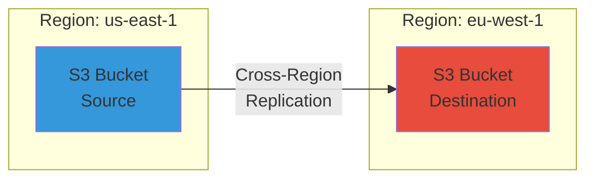
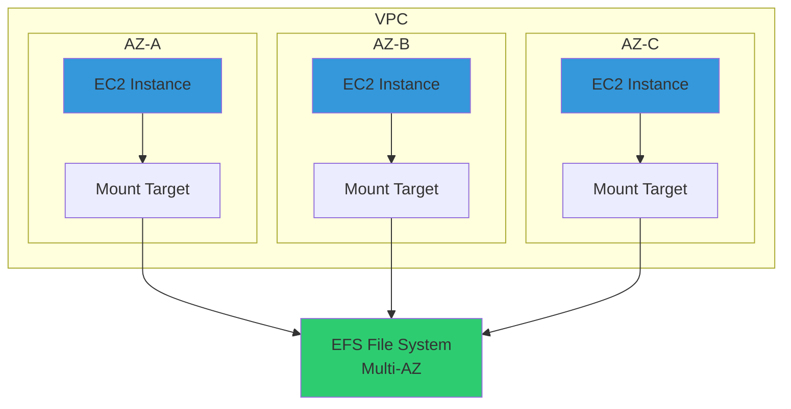
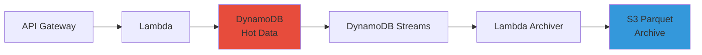

# AWS Storage Services

## Overview

AWS provides a comprehensive portfolio of storage services designed for different use cases, from object storage to block storage to file systems. Understanding when to use each service and how they integrate is critical for designing scalable, durable, and cost-effective cloud architectures.

**Why interviewers ask about this**: Storage decisions impact performance, cost, durability, and compliance. Staff/Principal Engineers must architect storage solutions that meet business requirements while optimizing for cost and operational complexity.

**Real-world relevance**: In banking, storage requirements include: transaction logs (high durability, compliance), customer documents (long-term retention, encryption), application data (high performance, low latency), and backups (cost-effective, disaster recovery).

## Foundational Concepts

### Storage Categories

**Object Storage**: S3 - Store and retrieve any amount of data from anywhere
**Block Storage**: EBS - Persistent block-level storage for EC2 instances
**File Storage**: EFS, FSx - Shared file systems accessible from multiple instances
**Hybrid Storage**: Storage Gateway - Bridge on-premises and cloud storage

## Amazon S3 (Simple Storage Service)

### Overview

S3 is an object storage service offering industry-leading scalability, data availability, security, and performance. It's designed for 99.999999999% (11 9's) durability and 99.99% availability.

### Storage Classes

| Storage Class | Use Case | Durability | Availability | Retrieval | Cost |
|--------------|----------|------------|--------------|-----------|------|
| **S3 Standard** | Frequently accessed data | 11 9's | 99.99% | Immediate | $$$ |
| **S3 Intelligent-Tiering** | Unknown/changing access patterns | 11 9's | 99.9% | Immediate | $$ (auto-optimized) |
| **S3 Standard-IA** | Infrequent access (monthly) | 11 9's | 99.9% | Immediate | $$ |
| **S3 One Zone-IA** | Infrequent, non-critical data | 11 9's (single AZ) | 99.5% | Immediate | $ |
| **S3 Glacier Instant Retrieval** | Archive, quarterly access | 11 9's | 99.9% | Milliseconds | $ |
| **S3 Glacier Flexible Retrieval** | Archive, 1-2x/year | 11 9's | 99.99% | Minutes-hours | $ |
| **S3 Glacier Deep Archive** | Long-term archive, rarely accessed | 11 9's | 99.99% | 12-48 hours | ¢ |

### S3 Architecture

```mermaid
graph TB
    subgraph "S3 Bucket: banking-transactions"
        subgraph "Lifecycle Policies"
            Standard[S3 Standard<br/>0-30 days<br/>Hot data]
            IA[S3 Standard-IA<br/>30-90 days<br/>Warm data]
            Glacier[S3 Glacier<br/>90-365 days<br/>Cold data]
            DeepArchive[S3 Glacier Deep Archive<br/>365+ days<br/>Compliance]
        end
    end
    
    Upload[Upload Transaction] --> Standard
    Standard -->|After 30 days| IA
    IA -->|After 90 days| Glacier
    Glacier -->|After 365 days| DeepArchive
    
    style Standard fill:#e74c3c
    style IA fill:#f39c12
    style Glacier fill:#3498db
    style DeepArchive fill:#2c3e50
```



### S3 Features

#### Versioning
- **Purpose**: Preserve, retrieve, and restore every version of every object
- **Use case**: Protect against accidental deletion, ransomware
- **Cost**: Storage for all versions (use lifecycle policies to delete old versions)

#### Replication

**Cross-Region Replication (CRR)**:
- Replicate objects across AWS Regions
- Use case: Disaster recovery, compliance, lower latency

**Same-Region Replication (SRR)**:
- Replicate objects within same Region
- Use case: Log aggregation, live replication between accounts

**Requirements**:
- Versioning must be enabled on source and destination buckets
- S3 Replication Time Control (RTC): 99.99% of objects replicated within 15 minutes



#### Encryption

**Encryption at Rest**:
- **SSE-S3**: Server-side encryption with S3-managed keys (AES-256)
- **SSE-KMS**: Server-side encryption with AWS KMS keys (audit trail, key rotation)
- **SSE-C**: Server-side encryption with customer-provided keys
- **Client-side encryption**: Encrypt before uploading

**Encryption in Transit**:
- TLS/SSL (HTTPS)
- Enforce with bucket policy: `aws:SecureTransport` condition

**Best practice for banking**: Use SSE-KMS for audit trail and key rotation

#### S3 Object Lock

**Purpose**: Write-once-read-many (WORM) model for regulatory compliance

**Modes**:
- **Governance mode**: Users with special permissions can override
- **Compliance mode**: No one can override (including root user)

**Retention**:
- **Retention period**: Fixed time period (days/years)
- **Legal hold**: Indefinite retention until explicitly removed

**Use case**: Banking transaction logs (SOX, SEC Rule 17a-4)

#### S3 Access Control

**Bucket Policies**: JSON-based resource policies
**IAM Policies**: Identity-based policies
**ACLs (Access Control Lists)**: Legacy, avoid for new applications
**S3 Block Public Access**: Account/bucket-level settings to prevent public access

**Best practice**: Use bucket policies + IAM policies, enable Block Public Access

### S3 Performance Optimization

#### Request Rate Performance
- **Baseline**: 3,500 PUT/COPY/POST/DELETE and 5,500 GET/HEAD requests per second per prefix
- **Prefix**: Everything between bucket name and object name (`bucket/folder1/folder2/object.txt` → prefix is `folder1/folder2/`)
- **Optimization**: Distribute objects across multiple prefixes for higher throughput

#### Transfer Acceleration
- **Purpose**: Fast, easy, and secure transfers over long distances
- **How**: Uses CloudFront edge locations
- **Cost**: $0.04-$0.08/GB (in addition to S3 data transfer)
- **Use case**: Global uploads, large files

#### Multipart Upload
- **Purpose**: Upload large objects in parts
- **Required**: Objects > 5GB
- **Recommended**: Objects > 100MB
- **Benefits**: Improved throughput, quick recovery from failures

#### S3 Select
- **Purpose**: Retrieve subset of data using SQL expressions
- **Benefits**: Reduce data transfer (up to 80%), lower cost, faster queries
- **Use case**: Query CSV/JSON files without loading entire object

### S3 Pricing (us-east-1, approximate)

| Component | Cost |
|-----------|------|
| **Storage (Standard)** | $0.023/GB/month (first 50TB) |
| **Storage (IA)** | $0.0125/GB/month |
| **Storage (Glacier)** | $0.004/GB/month |
| **Storage (Deep Archive)** | $0.00099/GB/month |
| **PUT/COPY/POST** | $0.005 per 1,000 requests |
| **GET/SELECT** | $0.0004 per 1,000 requests |
| **Data Transfer Out** | $0.09/GB (first 10TB) |
| **Replication** | Storage + requests + data transfer |

## Amazon EBS (Elastic Block Store)

### Overview

EBS provides persistent block-level storage volumes for EC2 instances. Volumes are automatically replicated within their Availability Zone for high availability and durability.

### Volume Types

| Type | Use Case | Size | IOPS | Throughput | Cost |
|------|----------|------|------|------------|------|
| **gp3** | General purpose SSD | 1GB-16TB | 3,000-16,000 | 125-1,000 MB/s | $0.08/GB/month |
| **gp2** | General purpose SSD (legacy) | 1GB-16TB | 100-16,000 (3 IOPS/GB) | 128-250 MB/s | $0.10/GB/month |
| **io2 Block Express** | Mission-critical, low-latency | 4GB-64TB | 256,000 | 4,000 MB/s | $0.125/GB + $0.065/IOPS |
| **io2** | High-performance SSD | 4GB-16TB | 64,000 | 1,000 MB/s | $0.125/GB + $0.065/IOPS |
| **io1** | High-performance SSD (legacy) | 4GB-16TB | 64,000 | 1,000 MB/s | $0.125/GB + $0.065/IOPS |
| **st1** | Throughput-optimized HDD | 125GB-16TB | 500 | 500 MB/s | $0.045/GB/month |
| **sc1** | Cold HDD | 125GB-16TB | 250 | 250 MB/s | $0.015/GB/month |

**Recommendation**:
- **gp3**: Default choice (better price/performance than gp2)
- **io2**: Databases requiring > 16,000 IOPS or 99.999% durability
- **st1**: Big data, data warehouses, log processing
- **sc1**: Infrequently accessed data

### EBS Features

#### Snapshots
- **Purpose**: Point-in-time backups stored in S3
- **Incremental**: Only changed blocks are saved
- **Cross-Region copy**: For disaster recovery
- **Fast Snapshot Restore (FSR)**: Eliminate latency when restoring from snapshot ($0.75/hour per AZ)

#### Encryption
- **At rest**: AES-256 encryption
- **In transit**: Encrypted between instance and volume
- **Key management**: AWS-managed or customer-managed KMS keys
- **Performance**: No impact on IOPS or throughput

#### Multi-Attach (io2 only)
- **Purpose**: Attach single volume to multiple EC2 instances
- **Use case**: Clustered applications (Oracle RAC, Teradata)
- **Limitation**: Same AZ only, up to 16 instances

### EBS vs. Instance Store

| Feature | EBS | Instance Store |
|---------|-----|----------------|
| **Persistence** | Persistent (survives instance stop/start) | Ephemeral (lost on stop/terminate) |
| **Durability** | 99.8-99.999% (replicated within AZ) | No replication |
| **Performance** | Up to 256,000 IOPS | Very high (NVMe SSD) |
| **Snapshots** | Yes | No |
| **Use case** | Databases, persistent storage | Temporary storage, caching, buffers |
| **Cost** | $0.08-$0.125/GB/month | Included with instance |

## Amazon EFS (Elastic File System)

### Overview

EFS provides a scalable, elastic, cloud-native NFS file system that can be accessed from multiple EC2 instances simultaneously across multiple AZs.

### Performance Modes

**General Purpose** (default):
- Latency: Low (sub-millisecond)
- Use case: Web serving, content management, home directories

**Max I/O**:
- Latency: Higher
- Throughput: Higher aggregate throughput
- Use case: Big data, media processing

### Throughput Modes

**Bursting** (default):
- Throughput scales with file system size
- Baseline: 50 MB/s per TB
- Burst: Up to 100 MB/s

**Provisioned**:
- Fixed throughput independent of size
- Use case: Small file systems needing high throughput

**Elastic** (recommended):
- Automatically scales throughput up/down
- Pay for what you use

### Storage Classes

**EFS Standard**: Frequently accessed files
**EFS Infrequent Access (IA)**: Files not accessed for 30+ days (92% cost savings)

**Lifecycle Management**: Automatically move files to IA after N days

### EFS Architecture



### EFS vs. EBS vs. S3

| Feature | EFS | EBS | S3 |
|---------|-----|-----|-----|
| **Type** | File storage (NFS) | Block storage | Object storage |
| **Access** | Multiple instances, multiple AZs | Single instance (Multi-Attach: 16 instances, same AZ) | HTTP/S API |
| **Durability** | 99.999999999% (11 9's) | 99.8-99.999% | 99.999999999% (11 9's) |
| **Availability** | 99.99% (Multi-AZ) | 99.99% (Single AZ) | 99.99% |
| **Max size** | Petabytes | 64 TB | Unlimited |
| **Performance** | Up to 10 GB/s, 500,000 IOPS | Up to 4 GB/s, 256,000 IOPS | 5,500 GET/s per prefix |
| **Use case** | Shared file storage, content management | Boot volumes, databases | Backups, static content, data lakes |
| **Cost** | $0.30/GB/month (Standard) | $0.08/GB/month (gp3) | $0.023/GB/month (Standard) |

## Amazon FSx

### FSx for Windows File Server

**Purpose**: Fully managed Windows file system with SMB protocol

**Features**:
- Active Directory integration
- DFS namespaces
- Windows ACLs
- Shadow copies (user-initiated backups)

**Use case**: Windows applications, SQL Server, SharePoint

### FSx for Lustre

**Purpose**: High-performance file system for compute-intensive workloads

**Features**:
- Sub-millisecond latencies
- Up to hundreds of GB/s throughput
- Millions of IOPS
- S3 integration (read/write directly to S3)

**Use case**: Machine learning, HPC, video processing, financial modeling

### FSx for NetApp ONTAP

**Purpose**: Fully managed NetApp ONTAP file system

**Features**:
- Multi-protocol (NFS, SMB, iSCSI)
- Snapshots, clones, replication
- Data deduplication and compression

**Use case**: Enterprise applications requiring NetApp features

### FSx for OpenZFS

**Purpose**: Fully managed OpenZFS file system

**Features**:
- Up to 1 million IOPS
- Point-in-time snapshots
- Data compression

**Use case**: Linux workloads requiring high performance

## AWS Storage Gateway

### Overview

Storage Gateway is a hybrid cloud storage service that provides on-premises access to virtually unlimited cloud storage.

### Gateway Types

#### File Gateway
- **Protocol**: NFS, SMB
- **Backend**: S3
- **Use case**: File shares, backup, archiving

#### Volume Gateway
- **Modes**: Cached volumes (frequently accessed data on-premises), Stored volumes (entire dataset on-premises)
- **Backend**: EBS snapshots in S3
- **Use case**: Block storage, disaster recovery

#### Tape Gateway
- **Protocol**: iSCSI
- **Backend**: S3, Glacier
- **Use case**: Replace physical tape libraries

```mermaid
graph LR
    subgraph "On-Premises Data Center"
        App[Applications]
        SG[Storage Gateway<br/>VM/Hardware]
    end
    
    subgraph "AWS Cloud"
        S3[Amazon S3]
        Glacier[S3 Glacier]
    end
    
    App -->|NFS/SMB/iSCSI| SG
    SG -->|HTTPS| S3
    S3 -->|Lifecycle| Glacier
    
    style SG fill:#f39c12
    style S3 fill:#3498db
    style Glacier fill:#2c3e50
```



## Interview Questions & Model Answers

### ⭐ Foundational Questions

**Q1: What's the difference between S3, EBS, and EFS?**

**Model Answer:**
"These are three different types of storage for different use cases:

**S3 (Object Storage)**:
- Store and retrieve any amount of data via HTTP/S API
- 11 9's durability, unlimited scalability
- Use case: Backups, static website hosting, data lakes, archives
- Access: HTTP/S API, not mountable as file system
- Cost: $0.023/GB/month (Standard)

**EBS (Block Storage)**:
- Persistent block-level storage for EC2 instances
- Attached to single instance (except Multi-Attach for io2)
- Use case: Boot volumes, databases, transactional workloads
- Access: Mounted as block device (ext4, NTFS)
- Cost: $0.08/GB/month (gp3)

**EFS (File Storage)**:
- Shared NFS file system accessible from multiple instances across AZs
- Elastic, scales automatically
- Use case: Shared file storage, content management, home directories
- Access: Mounted via NFS protocol
- Cost: $0.30/GB/month (Standard)

For a banking application:
- **S3**: Transaction logs, customer documents, backups
- **EBS**: Database volumes (RDS uses EBS), application boot volumes
- **EFS**: Shared configuration files, user uploads accessible from multiple servers"

---

**Q2: Explain S3 storage classes and when to use each.**

**Model Answer:**
"S3 offers 7 storage classes optimized for different access patterns:

**S3 Standard** ($0.023/GB/month):
- Frequently accessed data
- 99.99% availability
- Use case: Active data, website content

**S3 Intelligent-Tiering** (auto-optimized):
- Unknown or changing access patterns
- Automatically moves objects between tiers
- Use case: Data with unpredictable access

**S3 Standard-IA** ($0.0125/GB/month):
- Infrequently accessed (monthly)
- Retrieval fee: $0.01/GB
- Use case: Backups, disaster recovery data

**S3 One Zone-IA** ($0.01/GB/month):
- Non-critical, infrequent access
- Single AZ (lower durability)
- Use case: Reproducible data, thumbnails

**S3 Glacier Instant Retrieval** ($0.004/GB/month):
- Archive data accessed quarterly
- Millisecond retrieval
- Use case: Medical images, news archives

**S3 Glacier Flexible Retrieval** ($0.0036/GB/month):
- Archive data accessed 1-2x/year
- Retrieval: 1-5 minutes (Expedited), 3-5 hours (Standard), 5-12 hours (Bulk)
- Use case: Long-term backups

**S3 Glacier Deep Archive** ($0.00099/GB/month):
- Rarely accessed (7-10 years retention)
- Retrieval: 12-48 hours
- Use case: Regulatory archives, compliance data

**Banking example**:
- **Standard**: Current month transactions
- **Standard-IA**: 1-12 month old transactions
- **Glacier Flexible**: 1-7 year old transactions
- **Deep Archive**: 7+ year old transactions (regulatory requirement)"

---

**Q3: What is S3 versioning and when should you enable it?**

**Model Answer:**
"S3 versioning preserves, retrieves, and restores every version of every object stored in a bucket. When enabled, S3 assigns a unique version ID to each object.

**How it works**:
- **Upload new object**: Creates version ID (e.g., `111111`)
- **Overwrite object**: Creates new version ID (e.g., `222222`), previous version retained
- **Delete object**: Adds delete marker (soft delete), all versions retained
- **Permanently delete**: Delete specific version ID

**Benefits**:
1. **Protect against accidental deletion**: Can restore deleted objects
2. **Ransomware protection**: Can restore to pre-encryption state
3. **Audit trail**: Track all changes to objects
4. **Compliance**: Meet regulatory requirements for data retention

**When to enable**:
- Production data (always)
- Compliance requirements (banking, healthcare)
- Critical business data
- Source code repositories

**Considerations**:
- **Cost**: Storage for all versions (use lifecycle policies to delete old versions after N days)
- **Performance**: No impact on read/write performance
- **Cannot disable**: Once enabled, can only suspend (existing versions retained)

**Best practice for banking**:
Enable versioning + lifecycle policy:
```yaml
LifecycleConfiguration:
  Rules:
    - Id: DeleteOldVersions
      Status: Enabled
      NoncurrentVersionExpiration:
        NoncurrentDays: 90  # Delete versions older than 90 days
```

This protects against accidental deletion while controlling costs."

---

### ⭐⭐ Intermediate Questions

**Q4: How would you design an S3 bucket structure for a banking application with compliance requirements?**

**Model Answer:**
"For a banking application with PCI DSS and SOX compliance, I'd design:

**Bucket Structure**:
```
banking-prod-transactions-us-east-1
├── active/                    # S3 Standard
│   ├── 2024/01/              # Current month
│   └── 2024/02/
├── archive/                   # S3 Glacier
│   ├── 2023/
│   └── 2022/
└── compliance/                # S3 Glacier Deep Archive
    └── 2015-2021/            # 7+ years
```

**Configuration**:

1. **Versioning**: Enabled (protect against accidental deletion)

2. **Encryption**: SSE-KMS with customer-managed key
   - Audit trail via CloudTrail
   - Key rotation enabled

3. **Object Lock**: Compliance mode
   - Retention: 7 years (regulatory requirement)
   - Legal hold for disputed transactions

4. **Lifecycle Policy**:
```yaml
Rules:
  - Id: TransitionToArchive
    Status: Enabled
    Transitions:
      - Days: 30
        StorageClass: STANDARD_IA      # 30-90 days
      - Days: 90
        StorageClass: GLACIER_IR       # 90-365 days
      - Days: 365
        StorageClass: GLACIER          # 1-7 years
      - Days: 2555  # 7 years
        StorageClass: DEEP_ARCHIVE     # 7+ years
```

5. **Replication**: Cross-Region Replication to `us-west-2` for DR

6. **Access Control**:
   - Block Public Access: Enabled
   - Bucket Policy: Deny non-SSL requests
   - IAM policies: Least privilege
   - VPC Endpoint: Private access from VPC

7. **Logging**:
   - S3 Server Access Logs: Enabled
   - CloudTrail: Log all API calls
   - VPC Flow Logs: Monitor network access

8. **Monitoring**:
   - CloudWatch metrics: Monitor request rates, errors
   - S3 Inventory: Daily inventory reports
   - Macie: Detect PII/sensitive data

**Cost optimization**:
- Lifecycle policies reduce storage costs by 90%+
- Intelligent-Tiering for unpredictable access patterns
- S3 Select for querying (reduce data transfer)

**Compliance**:
- Object Lock ensures WORM compliance
- Encryption at rest/in transit
- Audit trail via CloudTrail
- 7-year retention meets regulatory requirements"

---

**Q5: What's the difference between EBS gp2 and gp3, and when would you choose each?**

**Model Answer:**
"gp3 is the newer generation of general-purpose SSD volumes with better price/performance:

**gp2 (legacy)**:
- IOPS: 3 IOPS per GB (100-16,000 IOPS)
- Throughput: 128-250 MB/s (depends on volume size)
- Baseline: 100 IOPS for volumes < 33.33 GB
- Burst: Up to 3,000 IOPS using I/O credits
- Cost: $0.10/GB/month

**gp3 (recommended)**:
- IOPS: 3,000 baseline (independent of size)
- Throughput: 125 MB/s baseline
- Scalable: Up to 16,000 IOPS and 1,000 MB/s (additional cost)
- Cost: $0.08/GB/month + $0.005/IOPS (above 3,000) + $0.04/MB/s (above 125)

**Comparison**:

| Scenario | gp2 | gp3 | Winner |
|----------|-----|-----|--------|
| 100 GB volume | 300 IOPS, 128 MB/s, $10/month | 3,000 IOPS, 125 MB/s, $8/month | **gp3** (10x IOPS, 20% cheaper) |
| 1 TB volume | 3,000 IOPS, 250 MB/s, $100/month | 3,000 IOPS, 125 MB/s, $80/month | **gp3** (20% cheaper) |
| 5 TB volume | 15,000 IOPS, 250 MB/s, $500/month | 3,000 IOPS, 125 MB/s, $400/month | **gp2** (5x IOPS, but can upgrade gp3) |

**When to choose gp3**:
- New deployments (default choice)
- Small volumes needing high IOPS (< 1 TB)
- Cost optimization (20% cheaper for same performance)
- Predictable performance (no I/O credits)

**When to choose gp2**:
- Existing deployments (migration not urgent)
- Large volumes (> 5 TB) needing high IOPS without additional cost
- Burst workloads (can use I/O credits)

**Recommendation**: Always use gp3 for new volumes. Migrate gp2 to gp3 for cost savings (no downtime, can modify while attached)."

---

### ⭐⭐⭐ Advanced Questions

**Q6: Explain S3 Cross-Region Replication and how you'd implement it for disaster recovery.**

**Model Answer:**
"S3 Cross-Region Replication (CRR) automatically replicates objects from a source bucket to destination bucket(s) in different AWS Regions.

**How it works**:
1. Enable versioning on source and destination buckets
2. Create replication configuration with IAM role
3. S3 asynchronously replicates new objects (typically within minutes)
4. Optional: Replication Time Control (RTC) for 99.99% replication within 15 minutes

**What gets replicated**:
- New objects created after replication is enabled
- Object metadata, ACLs, tags
- Object Lock retention information
- Delete markers (optional)

**What doesn't get replicated**:
- Existing objects (use S3 Batch Replication)
- Objects encrypted with SSE-C
- Objects in Glacier/Deep Archive (must restore first)

**DR Implementation for Banking**:

**Architecture**:
```
Primary Region (us-east-1)
├── banking-prod-transactions
│   ├── Versioning: Enabled
│   ├── Encryption: SSE-KMS
│   └── Replication: Enabled

Secondary Region (us-west-2)
├── banking-dr-transactions
│   ├── Versioning: Enabled
│   ├── Encryption: SSE-KMS (different key)
│   └── Replication: Destination
```

**Configuration**:
```json
{
  \"Role\": \"arn:aws:iam::123456789012:role/S3ReplicationRole\",
  \"Rules\": [{
    \"Status\": \"Enabled\",
    \"Priority\": 1,
    \"DeleteMarkerReplication\": { \"Status\": \"Enabled\" },
    \"Filter\": {},
    \"Destination\": {
      \"Bucket\": \"arn:aws:s3:::banking-dr-transactions\",
      \"ReplicationTime\": {
        \"Status\": \"Enabled\",
        \"Time\": { \"Minutes\": 15 }
      },
      \"Metrics\": {
        \"Status\": \"Enabled\",
        \"EventThreshold\": { \"Minutes\": 15 }
      },
      \"EncryptionConfiguration\": {
        \"ReplicaKmsKeyID\": \"arn:aws:kms:us-west-2:123456789012:key/xxx\"
      }
    }
  }]
}
```

**IAM Role** (S3ReplicationRole):
```json
{
  \"Version\": \"2012-10-17\",
  \"Statement\": [
    {
      \"Effect\": \"Allow\",
      \"Action\": [
        \"s3:GetReplicationConfiguration\",
        \"s3:ListBucket\"
      ],
      \"Resource\": \"arn:aws:s3:::banking-prod-transactions\"
    },
    {
      \"Effect\": \"Allow\",
      \"Action\": [
        \"s3:GetObjectVersionForReplication\",
        \"s3:GetObjectVersionAcl\"
      ],
      \"Resource\": \"arn:aws:s3:::banking-prod-transactions/*\"
    },
    {
      \"Effect\": \"Allow\",
      \"Action\": [
        \"s3:ReplicateObject\",
        \"s3:ReplicateDelete\"
      ],
      \"Resource\": \"arn:aws:s3:::banking-dr-transactions/*\"
    },
    {
      \"Effect\": \"Allow\",
      \"Action\": [
        \"kms:Decrypt\"
      ],
      \"Resource\": \"arn:aws:kms:us-east-1:123456789012:key/xxx\"
    },
    {
      \"Effect\": \"Allow\",
      \"Action\": [
        \"kms:Encrypt\"
      ],
      \"Resource\": \"arn:aws:kms:us-west-2:123456789012:key/xxx\"
    }
  ]
}
```

**Monitoring**:
- CloudWatch metrics: `ReplicationLatency`, `BytesPendingReplication`
- S3 Replication metrics: Track replication progress
- Alarms: Alert if replication lag > 15 minutes

**Failover process**:
1. Update application configuration to point to DR bucket
2. Verify data integrity (compare object counts, checksums)
3. Switch DNS/Route 53 to DR Region

**Cost**:
- Replication: Storage in both Regions + PUT requests + data transfer ($0.02/GB)
- RTC: $0.015/GB replicated
- Example: 1TB/day = $30/day replication + $15/day RTC = $1,350/month

**Best practices**:
- Enable RTC for critical data (15-minute RPO)
- Use S3 Batch Replication for existing objects
- Test failover regularly (quarterly DR drills)
- Monitor replication metrics continuously"

---

### ⭐⭐⭐⭐ Tricky Questions

**Q7: How would you optimize S3 costs for a banking application with 100TB of transaction data growing at 1TB/month?**

**Model Answer:**
"For 100TB existing + 1TB/month growth, I'd implement a multi-pronged cost optimization strategy:

**Current cost** (all S3 Standard):
- Storage: 100TB * $0.023/GB = $2,300/month
- Growth: +$23/month

**Optimized architecture**:

**1. Lifecycle Policies** (80% savings on old data):
```yaml
Rules:
  - Id: OptimizeTransactionStorage
    Status: Enabled
    Transitions:
      - Days: 30
        StorageClass: STANDARD_IA      # $0.0125/GB
      - Days: 90
        StorageClass: GLACIER_IR       # $0.004/GB
      - Days: 365
        StorageClass: GLACIER          # $0.0036/GB
      - Days: 2555  # 7 years
        StorageClass: DEEP_ARCHIVE     # $0.00099/GB
```

**Cost breakdown**:
- 0-30 days (1TB): $23/month (Standard)
- 30-90 days (2TB): $25/month (Standard-IA)
- 90-365 days (9TB): $36/month (Glacier IR)
- 1-7 years (42TB): $151/month (Glacier)
- 7+ years (46TB): $46/month (Deep Archive)
- **Total: $281/month** (88% savings from $2,300)

**2. S3 Intelligent-Tiering** (for unpredictable access):
- Automatically moves objects between tiers
- No retrieval fees for frequent/infrequent tiers
- Use for: Customer documents, reports

**3. Compression** (50% reduction):
- Compress JSON/CSV transaction logs before upload
- Use gzip, bzip2, or Parquet (columnar format)
- **Savings**: 50% storage cost

**4. S3 Select** (reduce data transfer):
- Query CSV/JSON files with SQL
- Reduce data transfer by 80%
- **Savings**: $0.072/GB (data transfer) → $0.014/GB (S3 Select)

**5. Requester Pays** (for external access):
- External partners pay for data transfer
- Use for: Regulatory reporting, audits

**6. S3 Inventory** (identify optimization opportunities):
- Daily inventory reports
- Identify: Old versions, incomplete multipart uploads, unused objects

**7. Delete Old Versions** (versioning overhead):
```yaml
NoncurrentVersionExpiration:
  NoncurrentDays: 90  # Delete versions older than 90 days
```

**8. Abort Incomplete Multipart Uploads**:
```yaml
AbortIncompleteMultipartUpload:
  DaysAfterInitiation: 7
```

**9. VPC Endpoint** (avoid NAT Gateway costs):
- Gateway Endpoint for S3 (free)
- **Savings**: $0.045/GB NAT Gateway data processing

**10. CloudFront** (reduce S3 GET requests):
- Cache frequently accessed objects
- **Savings**: $0.0004/1K requests (S3) → $0.0075/10K requests (CloudFront)

**Total optimized cost**:
- Storage: $281/month (lifecycle policies)
- Compression: $140/month (50% reduction)
- Data transfer: $500/month → $100/month (S3 Select, VPC Endpoint)
- **Total: $240/month** (90% savings from $2,300)

**Additional considerations**:
- **Retrieval costs**: Glacier retrieval is $0.01-$0.03/GB (budget for compliance requests)
- **Monitoring**: CloudWatch metrics, S3 Storage Lens
- **Automation**: Lambda functions for lifecycle management
- **Testing**: Verify retrieval times meet SLAs

**ROI**: $2,060/month savings = $24,720/year"

---

### ⭐⭐⭐⭐⭐ Scenario-Based Questions

**Q8: Design a storage architecture for a banking application that processes 1 million transactions/day, stores customer documents, and requires 7-year retention for compliance.**

**Model Answer:**
"I'll design a multi-tier storage architecture optimized for performance, cost, and compliance:

**Architecture Overview**:

```
Application Layer
├── Transaction Processing (hot data)
├── Document Management (warm data)
└── Compliance Archive (cold data)
```

**1. Transaction Processing (Hot Data)**:

**Requirements**:
- 1M transactions/day = ~12 transactions/second
- Low latency (< 10ms)
- High durability (no data loss)
- 7-year retention

**Storage Solution**:
- **Primary**: DynamoDB (real-time transactions)
  - Partition key: `transaction_id`
  - Sort key: `timestamp`
  - Point-in-time recovery: Enabled
  - Streams: Enabled (trigger Lambda for S3 archival)

- **Archive**: S3 (long-term storage)
  - Bucket: `banking-transactions-archive`
  - Format: Parquet (columnar, compressed)
  - Partitioning: `year/month/day/hour/`

**Data Flow**:


**Lifecycle**:
- DynamoDB: 30 days (then delete)
- S3 Standard: 0-30 days
- S3 Standard-IA: 30-90 days
- S3 Glacier: 90-2555 days (7 years)
- S3 Deep Archive: 2555+ days

**2. Customer Documents (Warm Data)**:

**Requirements**:
- PDF statements, account documents
- Infrequent access (monthly)
- Encryption required (PCI DSS)
- Versioning (audit trail)

**Storage Solution**:
- **S3 Intelligent-Tiering**:
  - Automatically optimizes costs
  - No retrieval fees for frequent/infrequent tiers
  - Versioning: Enabled
  - Encryption: SSE-KMS

**Bucket Structure**:
```
banking-customer-documents
├── statements/
│   ├── 2024/01/customer_id/
│   └── 2024/02/customer_id/
├── account_opening/
└── kyc_documents/
```

**3. Compliance Archive (Cold Data)**:

**Requirements**:
- 7-year retention (SOX, SEC Rule 17a-4)
- Write-once-read-many (WORM)
- Immutable (cannot be deleted)
- Rare access (audits, legal holds)

**Storage Solution**:
- **S3 Glacier Deep Archive**:
  - Cost: $0.00099/GB/month (99% cheaper than Standard)
  - Retrieval: 12-48 hours (acceptable for audits)
  - Object Lock: Compliance mode (7-year retention)

**Configuration**:
```yaml
ObjectLockConfiguration:
  ObjectLockEnabled: Enabled
  Rule:
    DefaultRetention:
      Mode: COMPLIANCE
      Years: 7
```

**4. Database Volumes (EBS)**:

**Requirements**:
- PostgreSQL RDS for customer accounts
- High IOPS (10,000+)
- Snapshots for backup

**Storage Solution**:
- **EBS gp3**: 1TB volume
  - IOPS: 10,000 (provisioned)
  - Throughput: 500 MB/s
  - Cost: $80/month + $35/month (IOPS) = $115/month

- **Snapshots**: Daily to S3
  - Retention: 30 days
  - Cross-Region copy to `us-west-2` (DR)

**5. Shared File Storage (EFS)**:

**Requirements**:
- Application logs, configuration files
- Accessible from multiple EC2 instances
- Automatic scaling

**Storage Solution**:
- **EFS Standard**:
  - Performance mode: General Purpose
  - Throughput mode: Elastic
  - Lifecycle: Move to IA after 30 days

**Complete Architecture**:

```mermaid
graph TB
    subgraph "Application Tier"
        API[API Gateway]
        Lambda[Lambda Functions]
        EC2[EC2 Auto Scaling]
    end
    
    subgraph "Data Tier"
        DDB[DynamoDB<br/>Transactions]
        RDS[(RDS PostgreSQL<br/>Accounts)]
        EFS[EFS<br/>Shared Files]
    end
    
    subgraph "Archive Tier"
        S3_Hot[S3 Standard<br/>0-30 days]
        S3_Warm[S3 IA<br/>30-90 days]
        S3_Cold[S3 Glacier<br/>90-2555 days]
        S3_Archive[S3 Deep Archive<br/>2555+ days]
    end
    
    API --> Lambda
    Lambda --> DDB
    EC2 --> RDS
    EC2 --> EFS
    
    DDB --> S3_Hot
    S3_Hot --> S3_Warm
    S3_Warm --> S3_Cold
    S3_Cold --> S3_Archive
    
    style DDB fill:#e74c3c
    style RDS fill:#2ecc71
    style S3_Archive fill:#2c3e50
```



**Cost Analysis** (1M transactions/day, 100GB/day):

| Component | Cost/Month |
|-----------|------------|
| DynamoDB (30 days retention) | $150 |
| S3 Standard (0-30 days, 3TB) | $69 |
| S3 IA (30-90 days, 6TB) | $75 |
| S3 Glacier (90-2555 days, 250TB) | $900 |
| S3 Deep Archive (2555+ days, 500TB) | $495 |
| EBS gp3 (1TB + 10K IOPS) | $115 |
| EFS (100GB) | $30 |
| **Total** | **$1,834/month** |

**Compliance**:
- ✅ 7-year retention (S3 Glacier + Deep Archive)
- ✅ WORM (S3 Object Lock Compliance mode)
- ✅ Encryption at rest (SSE-KMS)
- ✅ Encryption in transit (TLS 1.2+)
- ✅ Audit trail (CloudTrail, S3 Access Logs)
- ✅ Immutability (Object Lock prevents deletion)

**Disaster Recovery**:
- DynamoDB: Point-in-time recovery (35 days)
- S3: Cross-Region Replication to `us-west-2`
- RDS: Automated backups (30 days) + manual snapshots
- EFS: AWS Backup (daily snapshots)

**Monitoring**:
- CloudWatch metrics: Storage usage, request rates
- S3 Storage Lens: Cost optimization insights
- CloudTrail: API audit logs
- Macie: Detect PII/sensitive data

**Scalability**:
- DynamoDB: Auto-scaling (1-40K WCU/RCU)
- S3: Unlimited scalability
- RDS: Read replicas for read scaling
- EFS: Automatic scaling

This architecture provides:
- **Performance**: Sub-10ms latency for hot data
- **Cost-efficiency**: 90% savings via lifecycle policies
- **Compliance**: 7-year retention, WORM, encryption
- **Durability**: 11 9's for S3, Multi-AZ for RDS
- **Scalability**: Handles 10x growth without re-architecture"

---

## Key Takeaways

1. **S3 is for objects, EBS is for blocks, EFS is for files** - Choose based on access pattern and use case
2. **S3 storage classes** - Use lifecycle policies to automatically transition data and save 90%+ on storage costs
3. **S3 versioning** - Enable for production data to protect against accidental deletion and ransomware
4. **S3 encryption** - Use SSE-KMS for audit trail and key rotation (banking requirement)
5. **S3 replication** - Use CRR for disaster recovery, SRR for log aggregation
6. **EBS gp3 is the default** - 20% cheaper than gp2 with better performance
7. **EBS snapshots are incremental** - Only changed blocks are saved, stored in S3
8. **EFS is multi-AZ by default** - Automatically replicated across AZs for high availability
9. **FSx for specialized workloads** - Windows (FSx for Windows), HPC (FSx for Lustre)
10. **Storage Gateway for hybrid** - Bridge on-premises and cloud storage
11. **S3 Object Lock for compliance** - WORM model for regulatory requirements (7-year retention)
12. **Lifecycle policies are critical** - Automate data transitions to optimize costs

## Further Reading

- [S3 User Guide](https://docs.aws.amazon.com/AmazonS3/latest/userguide/)
- [EBS User Guide](https://docs.aws.amazon.com/AWSEC2/latest/UserGuide/AmazonEBS.html)
- [EFS User Guide](https://docs.aws.amazon.com/efs/latest/ug/)
- [S3 Storage Classes](https://aws.amazon.com/s3/storage-classes/)
- [S3 Lifecycle Policies](https://docs.aws.amazon.com/AmazonS3/latest/userguide/object-lifecycle-mgmt.html)
- [AWS Storage Blog](https://aws.amazon.com/blogs/storage/)

---

**Next**: [Module 05: Database Services](05-database-services.md)
