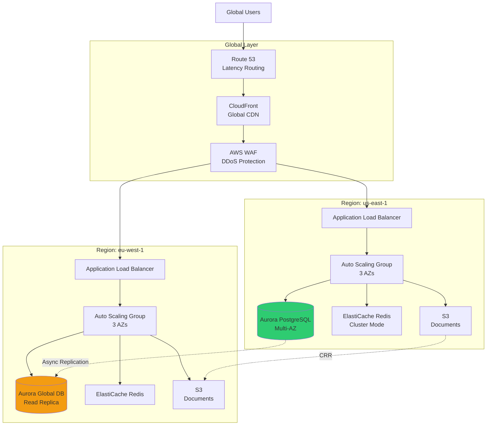
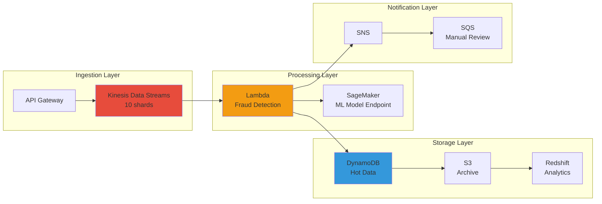

# AWS Comprehensive Interview Q&A

> **Consolidated interview questions, system design exercises, and troubleshooting scenarios**

## Table of Contents

1. [Cross-Service Architecture Questions](#cross-service-architecture-questions)
2. [System Design Exercises](#system-design-exercises)
3. [Troubleshooting Scenarios](#troubleshooting-scenarios)
4. [Cost Optimization Challenges](#cost-optimization-challenges)
5. [Security and Compliance](#security-and-compliance)
6. [Performance Optimization](#performance-optimization)
7. [Disaster Recovery](#disaster-recovery)

---

## Cross-Service Architecture Questions

### Q1: Design a highly available, scalable web application for a banking portal serving 10 million customers.

**Requirements**:
- 99.99% availability
- Global user base (US, EU, Asia)
- PCI DSS compliant
- Sub-second response times
- Handle 100K concurrent users

**Model Answer**:

**Architecture**:



**Component Breakdown**:

**1. Global Layer**:
- **Route 53**: Latency-based routing to nearest Region, health checks for failover
- **CloudFront**: Cache static assets (CSS, JS, images) at 400+ edge locations
- **AWS WAF**: Protect against SQL injection, XSS, DDoS attacks (PCI DSS requirement)
- **Shield Standard**: Free DDoS protection

**2. Application Tier** (per Region):
- **ALB**: Layer 7 load balancing, SSL termination, path-based routing
- **Auto Scaling Group**: 
  - Min: 10 instances (N+1 capacity across 3 AZs)
  - Max: 100 instances
  - Target Tracking: CPU 70%
  - Scheduled Scaling: Business hours (9 AM - 5 PM)
- **EC2 Instances**: 
  - Type: `m6i.xlarge` (4 vCPU, 16 GB RAM)
  - AMI: Hardened Amazon Linux 2
  - Security: No SSH, use Systems Manager Session Manager

**3. Data Tier**:
- **Aurora PostgreSQL Global Database**:
  - Primary: `us-east-1` (write operations)
  - Secondary: `eu-west-1` (read-only, < 1 second replication lag)
  - Multi-AZ: Automatic failover within Region
  - Read replicas: 3 per Region (distribute read load)
  - Backtrack: 24 hours (recover from user errors)
  
- **ElastiCache Redis**:
  - Cluster mode enabled (sharding for scalability)
  - Multi-AZ with automatic failover
  - Cache: Session data, frequently accessed account info
  - TTL: 15 minutes for session data

- **S3**:
  - Customer documents (statements, tax forms)
  - Encryption: SSE-KMS
  - Versioning: Enabled
  - Cross-Region Replication: `us-east-1` → `eu-west-1`
  - Lifecycle: Transition to Glacier after 90 days

**4. Security**:
- **VPC**: Multi-tier (public, private, database subnets)
- **Security Groups**: Least privilege (ALB → App → DB)
- **NACLs**: Block known malicious IPs
- **KMS**: Customer-managed keys for encryption
- **Secrets Manager**: Database credentials, API keys
- **CloudTrail**: API audit logs
- **GuardDuty**: Threat detection
- **VPC Flow Logs**: Network traffic analysis

**5. Monitoring**:
- **CloudWatch**: Metrics, logs, alarms
- **X-Ray**: Distributed tracing
- **CloudWatch Synthetics**: Synthetic monitoring (canaries)
- **CloudWatch RUM**: Real user monitoring

**High Availability**:
- **Multi-AZ**: All components deployed across 3 AZs
- **Multi-Region**: Active-active in `us-east-1` and `eu-west-1`
- **Auto Scaling**: Automatic replacement of unhealthy instances
- **Aurora**: Automatic failover within 30 seconds
- **ElastiCache**: Automatic failover within 1-2 minutes

**Scalability**:
- **Horizontal**: Auto Scaling adds instances based on demand
- **Database**: Aurora read replicas for read scaling
- **Caching**: ElastiCache reduces database load by 80%
- **CDN**: CloudFront offloads static content

**Performance**:
- **Response time**: < 500ms (target)
  - CloudFront: 50ms (cache hit)
  - ALB: 10ms
  - Application: 100ms
  - ElastiCache: 1ms (cache hit)
  - Aurora: 5ms (read replica)
- **Throughput**: 100K concurrent users = 10K requests/second
  - ALB: 50K requests/second capacity
  - Auto Scaling: 100 instances * 100 req/s = 10K req/s

**PCI DSS Compliance**:
- ✅ Encryption at rest (KMS)
- ✅ Encryption in transit (TLS 1.2+)
- ✅ Network segmentation (VPC, Security Groups)
- ✅ Audit logging (CloudTrail, VPC Flow Logs)
- ✅ Access control (IAM, MFA)
- ✅ Vulnerability scanning (Inspector)
- ✅ Intrusion detection (GuardDuty)

**Cost** (monthly estimate):
- EC2 (50 instances avg, `m6i.xlarge`): $6,000
- ALB: $500
- Aurora (2 clusters, 6 read replicas): $3,000
- ElastiCache (Redis cluster): $1,000
- S3 (10TB): $230
- CloudFront (100TB): $8,500
- Data Transfer: $2,000
- **Total: ~$21,000/month**

**Disaster Recovery**:
- **RPO**: < 1 second (Aurora Global Database)
- **RTO**: < 5 minutes (Route 53 failover + Aurora promotion)
- **Backup**: Aurora automated backups (35 days), S3 versioning

**Trade-offs**:
- **Multi-Region vs. Single Region**: 2x cost, but 99.99% → 99.999% availability
- **Aurora vs. RDS**: 3x cost, but better performance and availability
- **ElastiCache vs. No cache**: Additional complexity, but 80% database load reduction

---

### Q2: Design a real-time fraud detection system for a payment processor handling 10,000 transactions/second.

**Requirements**:
- Real-time processing (< 100ms latency)
- Machine learning-based fraud detection
- Store all transactions for 7 years (compliance)
- 99.99% availability
- Scalable to 50,000 TPS

**Model Answer**:

**Architecture**:



**Component Breakdown**:

**1. Ingestion**:
- **API Gateway**: REST API for transaction submission
  - Throttling: 10,000 requests/second
  - Authorization: IAM, API keys
  - Validation: JSON schema validation

- **Kinesis Data Streams**:
  - Shards: 10 (1,000 TPS per shard)
  - Retention: 7 days
  - Enhanced fan-out: Multiple consumers

**2. Real-Time Processing**:
- **Lambda** (Fraud Detection):
  - Concurrency: 1,000 (reserved)
  - Memory: 1,024 MB
  - Timeout: 30 seconds
  - Trigger: Kinesis (batch size: 100, window: 1 second)
  
  **Logic**:
  ```python
  def lambda_handler(event, context):
      for record in event['Records']:
          transaction = json.loads(base64.b64decode(record['kinesis']['data']))
          
          # Feature engineering
          features = extract_features(transaction)
          
          # ML inference
          prediction = sagemaker_client.invoke_endpoint(
              EndpointName='fraud-detection-model',
              Body=json.dumps(features)
          )
          
          fraud_score = json.loads(prediction['Body'].read())['score']
          
          # Decision logic
          if fraud_score > 0.9:
              # High risk - block transaction
              transaction['status'] = 'BLOCKED'
              sns.publish(TopicArn='fraud-alert', Message=json.dumps(transaction))
          elif fraud_score > 0.7:
              # Medium risk - manual review
              transaction['status'] = 'REVIEW'
              sqs.send_message(QueueUrl='manual-review-queue', MessageBody=json.dumps(transaction))
          else:
              # Low risk - approve
              transaction['status'] = 'APPROVED'
          
          # Store in DynamoDB
          dynamodb.put_item(
              TableName='transactions',
              Item={
                  'transaction_id': transaction['id'],
                  'timestamp': transaction['timestamp'],
                  'fraud_score': fraud_score,
                  'status': transaction['status'],
                  'ttl': int(time.time()) + 2592000  # 30 days
              }
          )
  ```

- **SageMaker Endpoint**:
  - Model: XGBoost (trained on historical fraud data)
  - Instance: `ml.c5.2xlarge` (8 vCPU, 16 GB RAM)
  - Auto-scaling: 2-10 instances based on invocations
  - Latency: < 10ms per inference

**3. Storage**:
- **DynamoDB** (Hot Data - 30 days):
  - Partition key: `transaction_id`
  - Sort key: `timestamp`
  - GSI: `user_id-timestamp-index` (query user transactions)
  - Capacity: On-Demand (auto-scaling)
  - Streams: Enabled (trigger archival Lambda)
  - TTL: 30 days (auto-delete old records)

- **S3** (Archive - 7 years):
  - Format: Parquet (columnar, compressed)
  - Partitioning: `year/month/day/hour/`
  - Lifecycle: Standard (0-30 days) → IA (30-90 days) → Glacier (90-2555 days) → Deep Archive (2555+ days)
  - Encryption: SSE-KMS
  - Object Lock: Compliance mode (7-year retention)

- **Redshift** (Analytics):
  - Cluster: `dc2.large` (2 nodes)
  - Data source: S3 (via Redshift Spectrum)
  - Use case: Fraud pattern analysis, model retraining

**4. Notification**:
- **SNS**: Alert fraud analysts for high-risk transactions
- **SQS**: Queue for manual review (medium-risk transactions)

**Performance**:
- **Latency**: < 100ms
  - API Gateway: 10ms
  - Kinesis: 20ms
  - Lambda: 50ms (including SageMaker inference)
  - DynamoDB: 10ms
  - Total: ~90ms

- **Throughput**: 10,000 TPS
  - Kinesis: 10 shards * 1,000 TPS = 10,000 TPS
  - Lambda: 1,000 concurrent executions * 10 TPS = 10,000 TPS
  - DynamoDB: On-Demand (unlimited)
  - SageMaker: 10 instances * 1,000 TPS = 10,000 TPS

**Scalability**:
- **50,000 TPS**: Increase Kinesis shards to 50, Lambda concurrency to 5,000, SageMaker instances to 50

**Cost** (10,000 TPS = 864M transactions/day):
- Kinesis: $0.015/shard/hour * 10 * 730 = $110/month
- Lambda: 864M requests * $0.20/1M + 864M * 1 second * 1GB * $0.0000166667 = $173 + $14,400 = $14,573/month
- SageMaker: `ml.c5.2xlarge` * 5 instances * $0.408/hour * 730 = $1,489/month
- DynamoDB: 864M writes * $1.25/1M = $1,080/month
- S3: 100TB * $0.023/GB = $2,300/month
- **Total: ~$19,500/month**

**Compliance**:
- ✅ 7-year retention (S3 Glacier + Deep Archive)
- ✅ Immutability (S3 Object Lock)
- ✅ Encryption (KMS)
- ✅ Audit trail (CloudTrail)

---

## System Design Exercises

### Exercise 1: Design a Multi-Tenant SaaS Platform on AWS

**Requirements**:
- 1,000 enterprise customers
- Data isolation between tenants
- 99.95% SLA
- Usage-based billing
- Self-service onboarding

**Key Considerations**:
1. **Tenant Isolation**:
   - **Option A**: Separate VPC per tenant (strong isolation, high cost)
   - **Option B**: Shared VPC, separate database per tenant (moderate isolation, moderate cost)
   - **Option C**: Shared infrastructure, logical isolation (weak isolation, low cost)
   - **Recommendation**: Option B for enterprise customers

2. **Database Strategy**:
   - **Silo**: Separate database per tenant (Aurora)
   - **Bridge**: Separate schema per tenant (PostgreSQL)
   - **Pool**: Shared tables with tenant_id column (DynamoDB)
   - **Recommendation**: Silo for large tenants, Pool for small tenants

3. **Billing**:
   - CloudWatch metrics per tenant
   - Lambda function to aggregate usage
   - Store in DynamoDB
   - Generate invoices with Step Functions

4. **Onboarding**:
   - API Gateway + Lambda for signup
   - Step Functions orchestrate provisioning
   - CloudFormation StackSets for infrastructure
   - Cognito for user management

---

### Exercise 2: Design a Video Streaming Platform

**Requirements**:
- 1 million concurrent viewers
- 4K video quality
- Global audience
- Live streaming + VOD
- Low latency (< 3 seconds)

**Architecture**:
1. **Ingestion**: MediaLive (live streaming), S3 (VOD uploads)
2. **Transcoding**: MediaConvert (multiple bitrates, resolutions)
3. **Storage**: S3 (HLS/DASH segments)
4. **CDN**: CloudFront (global distribution)
5. **Player**: HTML5 video player with adaptive bitrate
6. **Analytics**: Kinesis Data Streams → Lambda → DynamoDB

**Cost Optimization**:
- S3 Intelligent-Tiering for VOD content
- CloudFront Reserved Capacity for predictable traffic
- Spot Instances for batch transcoding

---

## Troubleshooting Scenarios

### Scenario 1: High Latency in Web Application

**Symptoms**:
- Response time increased from 200ms to 2 seconds
- Affecting 30% of users
- Started 2 hours ago

**Troubleshooting Steps**:

1. **Check CloudWatch Metrics**:
   - ALB TargetResponseTime: Normal
   - EC2 CPUUtilization: Normal
   - RDS DatabaseConnections: **Maxed out (100/100)**
   - **Root cause**: Database connection pool exhausted

2. **Immediate Mitigation**:
   - Increase RDS max_connections: 100 → 200
   - Restart application servers to reset connection pools

3. **Long-term Fix**:
   - Implement RDS Proxy (connection pooling)
   - Add ElastiCache Redis (reduce database queries)
   - Optimize slow queries (use Performance Insights)

4. **Prevention**:
   - CloudWatch alarm: DatabaseConnections > 80
   - Auto Scaling based on database connections
   - Regular load testing

---

### Scenario 2: S3 Access Denied Errors

**Symptoms**:
- Application cannot read objects from S3
- Error: "Access Denied"
- Worked yesterday, broken today

**Troubleshooting Steps**:

1. **Check IAM Policy**:
   - EC2 instance role has `s3:GetObject` permission ✅
   
2. **Check Bucket Policy**:
   - Recently added: `"Effect": "Deny", "Principal": "*", "Action": "s3:*", "Condition": {"Bool": {"aws:SecureTransport": "false"}}`
   - **Root cause**: Bucket policy requires HTTPS, application using HTTP

3. **Fix**:
   - Update application to use HTTPS: `s3://bucket` → `https://bucket.s3.amazonaws.com`

4. **Verification**:
   - Test with AWS CLI: `aws s3 cp s3://bucket/object.txt . --debug`
   - Check CloudTrail for access denied events

---

## Cost Optimization Challenges

### Challenge 1: Reduce AWS Bill by 30% Without Impacting Performance

**Current Spend**: $100,000/month
- EC2: $50,000 (all On-Demand)
- RDS: $20,000
- Data Transfer: $15,000
- S3: $10,000
- Other: $5,000

**Optimization Strategy**:

1. **EC2** ($50,000 → $25,000):
   - Compute Savings Plans: 60% of capacity → 72% savings = $21,600 saved
   - Spot Instances: 20% of capacity (batch jobs) → 70% savings = $7,000 saved
   - Right-sizing: Use Compute Optimizer → 10% savings = $2,100 saved
   - **Total savings: $30,700**

2. **RDS** ($20,000 → $14,000):
   - Reserved Instances: 3-year commitment → 60% savings = $12,000 saved
   - Aurora Serverless v2: For dev/test → $2,000 saved
   - **Total savings: $6,000** (but only $6,000 after RI purchase)

3. **Data Transfer** ($15,000 → $10,000):
   - VPC Endpoints: Avoid NAT Gateway for S3/DynamoDB → $3,000 saved
   - CloudFront: Cache more aggressively → $2,000 saved
   - **Total savings: $5,000**

4. **S3** ($10,000 → $3,000):
   - Lifecycle policies: Transition to IA/Glacier → $6,000 saved
   - Delete old versions: $1,000 saved
   - **Total savings: $7,000**

**Total Savings**: $30,700 + $6,000 + $5,000 + $7,000 = **$48,700 (49%)**

---

## Security and Compliance

### Q: How would you secure an AWS environment for a bank?

**Model Answer**:

**1. Identity and Access Management**:
- **IAM**: Least privilege, MFA for all users, no root account usage
- **AWS SSO**: Centralized access management
- **SAML Federation**: Integrate with corporate Active Directory
- **Service Control Policies**: Prevent risky actions at Organization level

**2. Network Security**:
- **VPC**: Multi-tier architecture (public, private, database subnets)
- **Security Groups**: Stateful firewall, least privilege
- **NACLs**: Stateless firewall, block known malicious IPs
- **Network Firewall**: Deep packet inspection for egress traffic
- **PrivateLink**: Private connectivity to AWS services

**3. Data Protection**:
- **Encryption at Rest**: KMS for all data (S3, EBS, RDS, DynamoDB)
- **Encryption in Transit**: TLS 1.2+ for all connections
- **Secrets Manager**: Rotate credentials automatically
- **Macie**: Detect PII in S3 buckets

**4. Threat Detection**:
- **GuardDuty**: Threat detection (malware, crypto mining, unauthorized access)
- **Security Hub**: Centralized security findings
- **Inspector**: Vulnerability scanning for EC2, ECR, Lambda
- **CloudWatch Logs Insights**: Analyze logs for anomalies

**5. Compliance**:
- **AWS Artifact**: Download compliance reports (SOC 2, PCI DSS, ISO 27001)
- **Config**: Monitor compliance with rules
- **CloudTrail**: API audit logs (immutable, encrypted)
- **VPC Flow Logs**: Network traffic logs

**6. Incident Response**:
- **CloudWatch Alarms**: Alert on suspicious activity
- **SNS**: Notify security team
- **Lambda**: Automated remediation (e.g., isolate compromised instance)
- **Systems Manager**: Incident Manager for coordination

---

## Performance Optimization

### Q: How would you optimize a slow-performing API?

**Troubleshooting Process**:

1. **Identify Bottleneck**:
   - **X-Ray**: Trace requests end-to-end
   - **CloudWatch Logs Insights**: Analyze application logs
   - **RDS Performance Insights**: Identify slow queries

2. **Common Issues**:
   - **Slow database queries**: Add indexes, optimize queries, use read replicas
   - **N+1 queries**: Use eager loading, batch queries
   - **No caching**: Add ElastiCache Redis
   - **Large payloads**: Compress responses, paginate results
   - **Cold starts** (Lambda): Provisioned Concurrency

3. **Optimization Techniques**:
   - **Caching**: ElastiCache (80% hit rate → 80% database load reduction)
   - **CDN**: CloudFront for static assets
   - **Database**: Read replicas, connection pooling (RDS Proxy)
   - **Async processing**: SQS for non-critical operations
   - **Compression**: gzip responses

---

## Disaster Recovery

### Q: Design a DR strategy with RPO < 1 hour, RTO < 4 hours

**Strategy: Warm Standby**

**Primary Region** (us-east-1):
- Full production environment
- Aurora cluster (Multi-AZ)
- Auto Scaling Group (100% capacity)

**DR Region** (us-west-2):
- Aurora Global Database (read-only, < 1 second lag)
- Auto Scaling Group (25% capacity, ready to scale)
- S3 Cross-Region Replication

**Failover Process**:
1. **Detection** (5 minutes): Route 53 health checks fail
2. **Promotion** (10 minutes): Promote Aurora secondary to primary
3. **Scaling** (15 minutes): Scale Auto Scaling Group to 100%
4. **DNS Update** (5 minutes): Update Route 53 to DR Region
5. **Verification** (10 minutes): Smoke tests
6. **Total RTO**: 45 minutes ✅

**RPO**: < 1 second (Aurora Global Database) ✅

**Cost**: 30% of primary Region (warm standby at 25% capacity)

---

## Key Takeaways

1. **Architecture is about trade-offs** - Cost vs. performance vs. complexity
2. **Multi-AZ is baseline** - Always deploy across 3 AZs for production
3. **Caching is critical** - ElastiCache can reduce database load by 80%
4. **Monitor everything** - CloudWatch, X-Ray, CloudTrail
5. **Automate DR** - Test failover quarterly
6. **Security in depth** - Multiple layers (VPC, SG, NACL, WAF, encryption)
7. **Cost optimization is ongoing** - Use Savings Plans, Spot, lifecycle policies
8. **Compliance is non-negotiable** - Encryption, audit logs, data residency

---

**This concludes the AWS Cloud Platform Interview Guide. Good luck with your interviews!** 🚀
