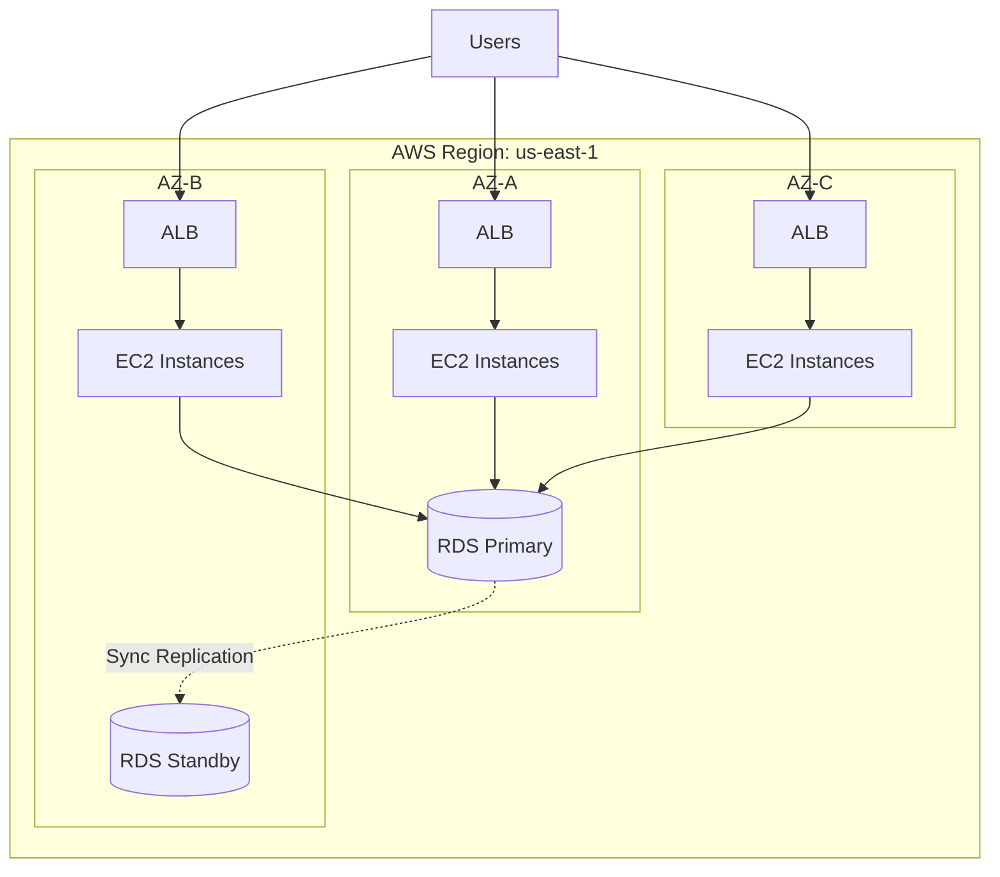
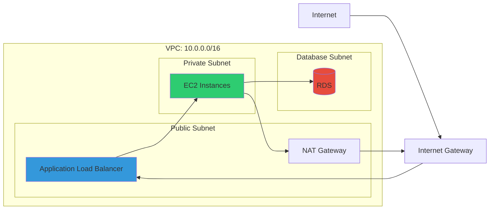
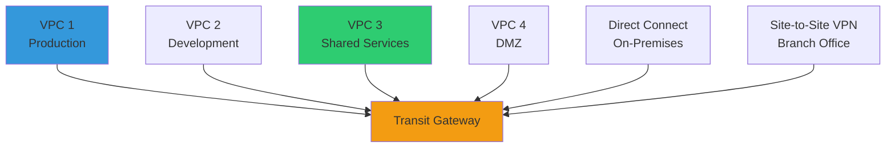
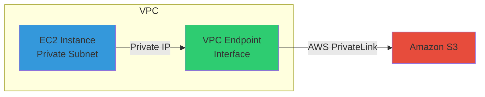
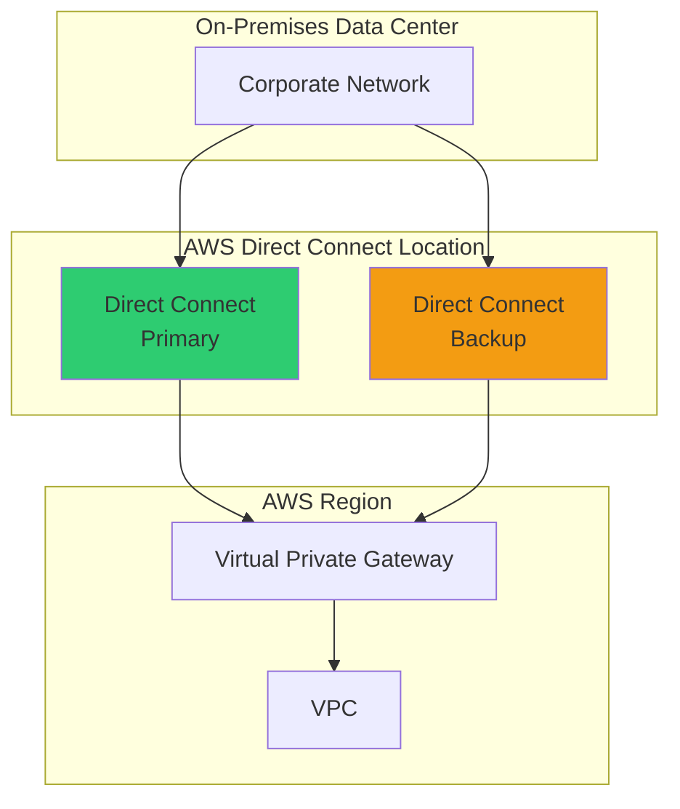
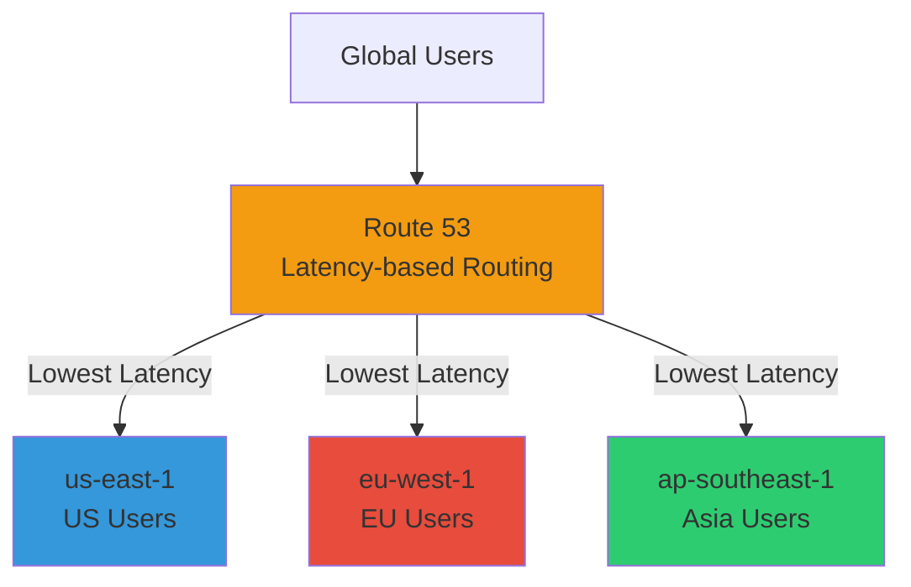
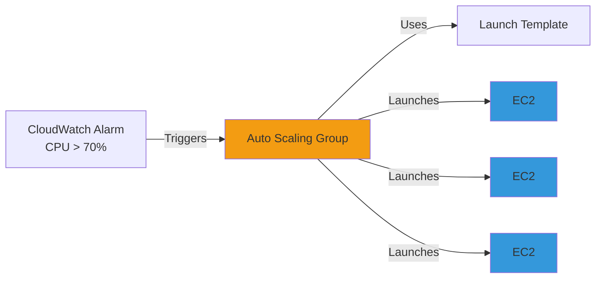
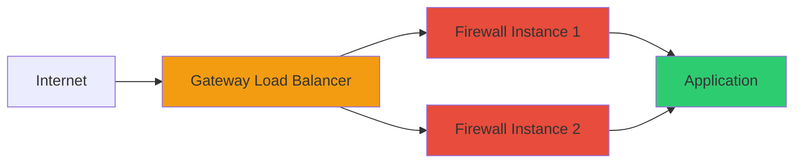

# AWS Cloud Platform - Complete Interview Preparation Guide

> **Comprehensive guide for Staff/Principal Engineer interviews in enterprise banking/financial services**
> 
> **Target**: Senior Cloud/DevOps Engineers with 13+ years experience
> 
> **Focus**: Technical depth, architectural thinking, real-world scenarios

---

## Table of Contents

1. [How to Use This Guide](#how-to-use-this-guide)
2. [AWS Global Infrastructure](#aws-global-infrastructure)
3. [Networking and VPC](#networking-and-vpc)
4. [Compute Services](#compute-services)
5. [Storage Services](#storage-services)
6. [Database Services](#database-services)
7. [Security and Identity](#security-and-identity)
8. [Application Integration](#application-integration)
9. [Monitoring and Logging](#monitoring-and-logging)
10. [Infrastructure as Code](#infrastructure-as-code)
11. [High Availability & Disaster Recovery](#high-availability-disaster-recovery)
12. [Cost Optimization & Governance](#cost-optimization-governance)
13. [Migration and Hybrid Cloud](#migration-and-hybrid-cloud)
14. [Analytics and Big Data](#analytics-and-big-data)
15. [Advanced Architectures](#advanced-architectures)
16. [Comprehensive Interview Q&A](#comprehensive-interview-qa)

---

## How to Use This Guide

### Study Approach

**Phase 1: Foundation (Weeks 1-2)**
- Focus on sections 2-6 (Infrastructure, Networking, Compute, Storage, Databases)
- Draw diagrams by hand
- Practice explaining concepts out loud
- Complete foundational interview questions

**Phase 2: Security & Operations (Week 3)**
- Deep dive into sections 7-9 (Security, Integration, Monitoring)
- Focus on compliance and operational excellence
- Practice scenario-based questions

**Phase 3: Advanced Topics (Weeks 4-5)**
- Study sections 10-15 (HA/DR, Cost, Migration, Analytics, Advanced Architectures)
- Practice whiteboard exercises
- Review trade-offs and design patterns

**Phase 4: Interview Simulation (Week 6)**
- Review section 16 (Comprehensive Q&A)
- Mock interviews with peers
- Create personal cheat sheets

### Interview Preparation Tips

**Do's ✅**
- Explain your thinking process
- Discuss trade-offs explicitly
- Ask clarifying questions
- Consider cost, security, and operations
- Use real examples from your experience

**Don'ts ❌**
- Don't memorize answers
- Don't over-engineer solutions
- Don't ignore compliance requirements
- Don't skip monitoring/observability
- Don't assume one-size-fits-all

---

## AWS Global Infrastructure

### Overview

AWS operates 33+ Regions globally, each containing 3-6 Availability Zones. Understanding this infrastructure is critical for designing highly available, compliant, and performant cloud architectures.

### Key Concepts

#### Regions
- **Definition**: Geographic areas containing multiple isolated Availability Zones
- **Characteristics**: Completely independent, resources don't auto-replicate
- **Examples**: `us-east-1` (N. Virginia), `eu-west-1` (Ireland), `ap-southeast-1` (Singapore)

#### Availability Zones (AZs)
- **Definition**: One or more discrete data centers within a Region
- **Characteristics**: Physically separated (10s of miles), low-latency interconnect (1-2ms)
- **Count**: Minimum 3 per Region, most have 3-6
- **Important**: AZ names (`us-east-1a`) are randomized per account; use AZ IDs (`use1-az1`) for consistency

#### Edge Locations
- **Count**: 400+ globally
- **Purpose**: Content delivery (CloudFront), DNS (Route 53), DDoS protection (Shield)
- **Latency**: 10-50ms to end users

#### Local Zones
- **Purpose**: Extend AWS to metro areas for ultra-low latency (< 10ms)
- **Use cases**: Real-time gaming, live streaming, ML inference
- **Example**: `us-east-1-bos-1` (Boston)

#### Wavelength Zones
- **Purpose**: Embed AWS in 5G networks for mobile edge computing
- **Latency**: Single-digit milliseconds to mobile devices
- **Use cases**: AR/VR, mobile gaming, IoT

#### AWS Outposts
- **Purpose**: Bring AWS services to on-premises data centers
- **Use cases**: Data residency, low-latency to on-prem systems, hybrid cloud

### Multi-AZ Architecture Pattern



### Region Selection Criteria

| Factor | Consideration | Example |
|--------|---------------|---------|
| **Compliance** | Data sovereignty (GDPR, banking regulations) | EU data → `eu-west-1` |
| **Latency** | Proximity to users | US users → `us-east-1` |
| **Service Availability** | Not all services in all Regions | AI/ML → `us-east-1`, `us-west-2` |
| **Cost** | Pricing varies by Region | `us-east-1` often cheapest |
| **DR** | Geographic separation for disaster recovery | Primary: `us-east-1`, DR: `us-west-2` |

### Data Transfer Costs

- **Within same AZ**: FREE (using private IP)
- **Between AZs in same Region**: $0.01/GB
- **Between Regions**: $0.02/GB
- **To Internet**: $0.09/GB (first 10TB)
- **From Internet**: FREE

### Interview Questions

**Q: What's the difference between a Region and an Availability Zone?**

A: A Region is a geographic area (e.g., `us-east-1`) containing multiple isolated Availability Zones. An AZ is one or more discrete data centers within a Region, each with independent power, cooling, and networking. Regions are completely independent—resources don't replicate automatically—while AZs within a Region are connected via low-latency private fiber (1-2ms) for high availability.

**Q: Why does AWS randomize AZ names across accounts?**

A: To prevent all customers from concentrating resources in the same physical AZ, which would create capacity imbalances. AZ names like `us-east-1a` are randomized per account, but AZ IDs like `use1-az1` are consistent across accounts for cross-account coordination.

**Q: How would you design a multi-AZ architecture for a critical banking application?**

A: I would:
1. Deploy Auto Scaling Group across 3 AZs with N+1 capacity (can lose 1 AZ and handle peak load)
2. Use Application Load Balancer (automatically spans all AZs)
3. Enable RDS Multi-AZ for synchronous replication
4. Use EFS for shared storage (natively multi-AZ)
5. Deploy ElastiCache with cluster mode across AZs
6. Set up CloudWatch alarms for AZ-level metrics
7. Test failover with chaos engineering

**Q: Design a multi-Region DR architecture for a payment processor handling $5B daily transactions. RPO < 5 min, RTO < 30 min.**

A: I'd implement a **Pilot Light** DR strategy:

**Primary Region (us-east-1):**
- Full production environment
- Aurora cluster with read replicas
- Auto Scaling Group at 100% capacity

**DR Region (us-west-2):**
- Aurora Global Database secondary (continuous replication)
- Minimal EC2 instances for health checks
- Auto Scaling Group at 0% capacity (ready to scale)
- S3 Cross-Region Replication for transaction logs

**Failover automation:**
1. CloudWatch alarm triggers Lambda
2. Lambda promotes Aurora secondary to primary (2-3 min)
3. Lambda scales up Auto Scaling Group (3-5 min)
4. Lambda updates Route 53 to DR Region (1 min)
5. Total RTO: 6-9 minutes (meets < 30 min requirement)

**Cost**: ~15% overhead ($15K/month for DR on top of $100K/month primary)

### Key Takeaways

- Always deploy production workloads across 3 AZs for 99.99% availability
- Design for N+1 capacity (can lose 1 AZ and still handle peak load)
- AZ names are randomized; use AZ IDs for cross-account consistency
- Cross-AZ data transfer costs $0.01/GB—optimize with caching and VPC endpoints
- Multi-Region for DR, global apps, and compliance (RPO/RTO requirements)
- Test failover regularly with chaos engineering

---

## Networking and VPC

### Overview

Amazon VPC (Virtual Private Cloud) is the foundation of AWS networking, providing isolated network environments for your resources. Mastering VPC is essential for designing secure, scalable, and compliant cloud architectures.

### VPC Fundamentals

#### CIDR Planning

**Best practices for enterprise banking:**
- Use RFC 1918 private IP ranges: `10.0.0.0/8`, `172.16.0.0/12`, `192.168.0.0/16`
- Plan for growth: Use `/16` for VPC (65,536 IPs)
- Subnet sizing: Public subnets `/24` (256 IPs), private subnets `/20` (4,096 IPs)
- Avoid overlapping CIDRs across VPCs (for peering/Transit Gateway)

**Example CIDR scheme:**
```
Production VPC: 10.0.0.0/16
├── Public Subnet AZ-A: 10.0.1.0/24
├── Public Subnet AZ-B: 10.0.2.0/24
├── Public Subnet AZ-C: 10.0.3.0/24
├── Private Subnet AZ-A: 10.0.16.0/20
├── Private Subnet AZ-B: 10.0.32.0/20
├── Private Subnet AZ-C: 10.0.48.0/20
├── Database Subnet AZ-A: 10.0.64.0/24
├── Database Subnet AZ-B: 10.0.65.0/24
└── Database Subnet AZ-C: 10.0.66.0/24
```

#### Subnets

**Public Subnet:**
- Has route to Internet Gateway (IGW)
- Resources get public IPs
- Use for: ALB, NAT Gateway, bastion hosts

**Private Subnet:**
- No direct internet access
- Routes to NAT Gateway for outbound traffic
- Use for: Application servers, Lambda (in VPC), ECS tasks

**Database Subnet:**
- Isolated from internet
- Only accessible from application subnets
- Use for: RDS, ElastiCache, Redshift

#### Route Tables



**Public Route Table:**
```
Destination       Target
10.0.0.0/16       local
0.0.0.0/0         igw-xxxxx
```

**Private Route Table:**
```
Destination       Target
10.0.0.0/16       local
0.0.0.0/0         nat-xxxxx
```

**Database Route Table:**
```
Destination       Target
10.0.0.0/16       local
```

### VPC Connectivity Options

#### Internet Gateway (IGW)
- **Purpose**: Enable internet access for public subnets
- **Characteristics**: Horizontally scaled, redundant, highly available
- **Limit**: 1 IGW per VPC

#### NAT Gateway
- **Purpose**: Enable outbound internet access for private subnets
- **Characteristics**: Managed service, scales to 45 Gbps
- **Cost**: $0.045/hour + $0.045/GB data processed
- **HA**: Deploy one NAT Gateway per AZ for high availability

**NAT Gateway vs. NAT Instance:**

| Feature | NAT Gateway | NAT Instance |
|---------|-------------|--------------|
| **Availability** | Highly available within AZ | Manual failover required |
| **Bandwidth** | Up to 45 Gbps | Depends on instance type |
| **Maintenance** | Managed by AWS | You manage OS patches |
| **Cost** | $0.045/hour + data | EC2 instance cost |
| **Security Groups** | Not supported | Supported |
| **Bastion** | Cannot be used as bastion | Can be used as bastion |
| **Recommendation** | Use for production | Legacy, avoid |

#### VPC Peering
- **Purpose**: Connect two VPCs (same or different accounts/Regions)
- **Characteristics**: Non-transitive, 1:1 relationship, no overlapping CIDRs
- **Limit**: 125 peering connections per VPC
- **Cost**: $0.01/GB for cross-AZ, $0.02/GB for cross-Region

**Limitations:**
- No transitive routing (if VPC A peers with B, and B peers with C, A cannot reach C)
- No edge-to-edge routing (cannot route through VPN/Direct Connect in peered VPC)

#### Transit Gateway
- **Purpose**: Central hub for connecting multiple VPCs, VPNs, and Direct Connect
- **Characteristics**: Transitive routing, supports up to 5,000 VPCs
- **Cost**: $0.05/hour per attachment + $0.02/GB data processed
- **Use case**: Enterprise hub-and-spoke architecture



**Transit Gateway vs. VPC Peering:**

| Feature | Transit Gateway | VPC Peering |
|---------|----------------|-------------|
| **Scalability** | Up to 5,000 VPCs | 125 peering connections |
| **Routing** | Transitive | Non-transitive |
| **Management** | Centralized | Decentralized (mesh) |
| **Cost** | Higher ($0.05/hr per attachment) | Lower ($0.01/GB) |
| **Use case** | Enterprise multi-VPC | Simple VPC-to-VPC |

#### VPC Endpoints

**Gateway Endpoints** (FREE):
- S3 and DynamoDB only
- Route table entry points to endpoint
- No additional cost

**Interface Endpoints** (PrivateLink):
- Most AWS services (EC2, SNS, SQS, etc.)
- Elastic Network Interface (ENI) in your subnet
- Cost: $0.01/hour per AZ + $0.01/GB data processed
- Supports Security Groups

**Use case**: Avoid NAT Gateway costs for AWS service access



**Cost optimization:**
- Use Gateway Endpoints for S3/DynamoDB (free)
- Use Interface Endpoints to avoid NAT Gateway data processing charges ($0.045/GB)
- Break-even: If > 1GB/hour to AWS services, Interface Endpoint is cheaper

### Direct Connect

**Purpose**: Dedicated network connection from on-premises to AWS

**Benefits:**
- Consistent network performance (vs. VPN over internet)
- Reduced bandwidth costs (cheaper than internet data transfer)
- Private connectivity (doesn't traverse public internet)
- Supports up to 100 Gbps (with LAG)

**Connection types:**
- **Dedicated Connection**: 1 Gbps or 10 Gbps, provisioned by AWS
- **Hosted Connection**: 50 Mbps to 10 Gbps, provisioned by AWS Partner

**Virtual Interfaces (VIFs):**
- **Private VIF**: Access VPC resources via Virtual Private Gateway
- **Public VIF**: Access AWS public services (S3, DynamoDB) without internet
- **Transit VIF**: Connect to Transit Gateway

**High Availability:**
- Use 2 Direct Connect connections in different locations
- Backup with Site-to-Site VPN



### Route 53

**DNS Service** with advanced routing capabilities

**Routing Policies:**

1. **Simple**: Single resource, no health checks
2. **Weighted**: Distribute traffic across multiple resources (A/B testing, blue/green)
3. **Latency**: Route to Region with lowest latency
4. **Failover**: Active-passive failover with health checks
5. **Geolocation**: Route based on user's geographic location (compliance)
6. **Geoproximity**: Route based on geographic location with bias
7. **Multivalue**: Return multiple IPs with health checks (simple load balancing)

**Health Checks:**
- Monitor endpoint health (HTTP, HTTPS, TCP)
- CloudWatch alarms
- Calculated health checks (combine multiple checks)
- Cost: $0.50/month per health check

**Use case for banking:**


### Security Groups vs. NACLs

| Feature | Security Groups | Network ACLs |
|---------|----------------|--------------|
| **Level** | Instance (ENI) | Subnet |
| **State** | Stateful (return traffic auto-allowed) | Stateless (must allow return traffic) |
| **Rules** | Allow rules only | Allow and Deny rules |
| **Evaluation** | All rules evaluated | Rules evaluated in order (lowest number first) |
| **Default** | Deny all inbound, allow all outbound | Allow all inbound and outbound |
| **Use case** | Primary security control | Defense in depth, subnet-level blocking |

**Best practice**: Use Security Groups as primary control, NACLs for defense in depth

### VPC Flow Logs

**Purpose**: Capture IP traffic information for network monitoring and troubleshooting

**Destinations:**
- CloudWatch Logs
- S3
- Kinesis Data Firehose

**Use cases:**
- Troubleshoot connectivity issues
- Security analysis (detect unusual traffic patterns)
- Cost optimization (identify cross-AZ traffic)
- Compliance (network audit trail)

**Example query (Athena on S3):**
```sql
SELECT srcaddr, dstaddr, srcport, dstport, protocol, bytes, packets, action
FROM vpc_flow_logs
WHERE action = 'REJECT'
  AND date_partition >= '2024/01/01'
ORDER BY bytes DESC
LIMIT 100;
```

### Interview Questions

**Q: Explain the difference between Security Groups and NACLs.**

A: Security Groups are stateful firewalls at the instance (ENI) level. If you allow inbound traffic, the return traffic is automatically allowed. They only support allow rules and all rules are evaluated.

NACLs are stateless firewalls at the subnet level. You must explicitly allow both inbound and outbound traffic. They support both allow and deny rules, evaluated in order by rule number.

Best practice: Use Security Groups as the primary security control (least privilege), and NACLs for defense in depth (e.g., blocking known malicious IPs at the subnet level).

**Q: How would you design a VPC for a banking application with strict security requirements?**

A: I'd design a multi-tier VPC with network segmentation:

**VPC CIDR**: `10.0.0.0/16`

**Subnets (across 3 AZs):**
- **Public subnets** (`10.0.1.0/24`, etc.): ALB, NAT Gateway, bastion hosts
- **Private subnets** (`10.0.16.0/20`, etc.): Application servers, ECS tasks
- **Database subnets** (`10.0.64.0/24`, etc.): RDS, ElastiCache (no internet access)

**Security:**
- Security Groups: Least privilege (ALB → App → DB)
- NACLs: Deny known malicious IPs, allow only required ports
- VPC Flow Logs: Send to S3 for compliance/audit
- VPC Endpoints: Gateway endpoints for S3/DynamoDB (avoid NAT Gateway)
- No SSH/RDP: Use Systems Manager Session Manager
- Encryption: TLS 1.2+ for all traffic

**Connectivity:**
- Internet access: IGW for public subnets, NAT Gateway for private subnets
- On-premises: Direct Connect with backup VPN
- Other VPCs: Transit Gateway for hub-and-spoke

**Monitoring:**
- CloudWatch alarms for VPC Flow Logs anomalies
- GuardDuty for threat detection
- Security Hub for compliance checks

**Q: What's the difference between VPC Peering and Transit Gateway?**

A: VPC Peering is a 1:1 connection between two VPCs with non-transitive routing. If VPC A peers with B, and B peers with C, A cannot reach C. It's suitable for simple VPC-to-VPC connectivity with lower cost ($0.01/GB).

Transit Gateway is a central hub that supports transitive routing across up to 5,000 VPCs. It simplifies network topology in enterprise environments with many VPCs. Cost is higher ($0.05/hour per attachment + $0.02/GB).

For a banking enterprise with 50+ VPCs, I'd use Transit Gateway for centralized management and simplified routing. For a startup with 2-3 VPCs, VPC Peering is more cost-effective.

**Q: How would you reduce NAT Gateway costs?**

A: NAT Gateway costs $0.045/hour + $0.045/GB data processed. Optimization strategies:

1. **VPC Endpoints**: Use Gateway Endpoints (free) for S3/DynamoDB, Interface Endpoints ($0.01/hour + $0.01/GB) for other AWS services. Break-even: > 1GB/hour to AWS services.

2. **Consolidate NAT Gateways**: Instead of one per AZ (HA), use one per VPC for dev/test environments.

3. **S3 Transfer Acceleration**: For large S3 uploads, use Transfer Acceleration instead of NAT Gateway.

4. **Direct Connect**: For high-volume on-premises to AWS traffic, Direct Connect is cheaper than internet.

5. **Optimize application**: Reduce unnecessary API calls, implement caching, batch requests.

Example: A banking app with 10TB/month S3 traffic:
- NAT Gateway cost: $32 + (10,000 GB * $0.045) = $482/month
- S3 Gateway Endpoint cost: $0/month
- **Savings: $482/month**

**Q: Design a hybrid cloud architecture for a bank migrating to AWS.**

A: I'd design a hub-and-spoke architecture with Transit Gateway:

```
On-Premises Data Center
    ↓ (Direct Connect Primary + VPN Backup)
Transit Gateway
    ├── Shared Services VPC (Active Directory, DNS, monitoring)
    ├── Production VPC (customer-facing applications)
    ├── Development VPC (dev/test environments)
    └── DMZ VPC (internet-facing resources)
```

**Connectivity:**
- **Direct Connect**: 10 Gbps dedicated connection for primary connectivity
- **Site-to-Site VPN**: Backup over internet (automatic failover)
- **Transit Gateway**: Central hub for all VPCs and on-premises

**Routing:**
- On-premises can reach all VPCs via Transit Gateway
- VPCs can reach on-premises via Transit Gateway
- Internet traffic from private VPCs routes through DMZ VPC (centralized egress)

**Security:**
- **Shared Services VPC**: Centralized Active Directory, DNS, monitoring
- **Network Firewall**: In DMZ VPC for internet-bound traffic inspection
- **VPC Flow Logs**: All VPCs send logs to centralized S3 bucket
- **Direct Connect**: Private VIF for VPC access, Public VIF for S3/DynamoDB

**Migration phases:**
1. **Phase 1**: Establish Direct Connect and Transit Gateway
2. **Phase 2**: Migrate non-critical workloads (dev/test)
3. **Phase 3**: Migrate production workloads (lift-and-shift)
4. **Phase 4**: Modernize applications (re-architect for cloud-native)

### Key Takeaways

- Plan VPC CIDR carefully—avoid overlapping ranges for peering/Transit Gateway
- Use multi-tier subnet design: public, private, database
- Security Groups are stateful (primary control), NACLs are stateless (defense in depth)
- NAT Gateway costs add up—use VPC Endpoints for AWS services
- Transit Gateway for enterprise multi-VPC, VPC Peering for simple connectivity
- Direct Connect for consistent, private connectivity to on-premises
- Route 53 for global traffic routing (latency-based, geolocation, failover)
- VPC Flow Logs for troubleshooting, security analysis, and compliance

---

## Compute Services

### EC2 (Elastic Compute Cloud)

#### Instance Types

**General Purpose**: `t3`, `t4g`, `m5`, `m6i`, `m7g`
- Balanced compute, memory, networking
- Use case: Web servers, application servers, small databases

**Compute Optimized**: `c5`, `c6i`, `c7g`
- High-performance processors
- Use case: Batch processing, high-performance web servers, scientific modeling

**Memory Optimized**: `r5`, `r6i`, `r7g`, `x2`, `z1d`
- High memory-to-CPU ratio
- Use case: In-memory databases, real-time big data analytics

**Storage Optimized**: `i3`, `i4i`, `d2`, `h1`
- High sequential read/write to local storage
- Use case: NoSQL databases, data warehousing, Hadoop

**Accelerated Computing**: `p4`, `g5`, `inf1`, `trn1`
- GPU/FPGA for ML, graphics, HPC
- Use case: Machine learning training/inference, video transcoding

#### Purchasing Options

| Option | Use Case | Commitment | Savings | Interruption |
|--------|----------|------------|---------|--------------|
| **On-Demand** | Unpredictable workloads | None | 0% | No |
| **Reserved** | Steady-state workloads | 1 or 3 years | Up to 72% | No |
| **Savings Plans** | Flexible workloads | 1 or 3 years | Up to 72% | No |
| **Spot** | Fault-tolerant workloads | None | Up to 90% | Yes (2-min warning) |
| **Dedicated Hosts** | Licensing requirements | On-Demand or Reserved | Varies | No |

**Best practice for banking:**
- **Baseline capacity**: Reserved Instances or Savings Plans (60-70% of capacity)
- **Variable capacity**: On-Demand (20-30% of capacity)
- **Batch processing**: Spot Instances (10% of capacity)

#### Auto Scaling

**Components:**
1. **Launch Template**: Instance configuration (AMI, instance type, security groups, user data)
2. **Auto Scaling Group**: Min/Max/Desired capacity, subnets (multi-AZ)
3. **Scaling Policies**: When to scale in/out

**Scaling Policies:**
- **Target Tracking**: Maintain metric at target (e.g., CPU at 70%)
- **Step Scaling**: Scale based on CloudWatch alarm thresholds
- **Scheduled Scaling**: Scale at specific times (e.g., business hours)
- **Predictive Scaling**: ML-based forecasting

**Lifecycle Hooks:**
- Perform custom actions during launch/terminate
- Use case: Drain connections, backup data, register with service discovery



### Elastic Load Balancing

#### Application Load Balancer (ALB) - Layer 7

**Features:**
- HTTP/HTTPS traffic
- Path-based routing (`/api/*` → Target Group A, `/images/*` → Target Group B)
- Host-based routing (`api.example.com` → TG A, `www.example.com` → TG B)
- Query string/header routing
- WebSocket support
- HTTP/2 support
- Sticky sessions (cookie-based)
- WAF integration

**Use case**: Microservices, containerized applications, web applications

#### Network Load Balancer (NLB) - Layer 4

**Features:**
- TCP/UDP/TLS traffic
- Ultra-low latency (microseconds)
- Static IP per AZ (Elastic IP support)
- Preserves source IP
- Handles millions of requests per second
- TLS termination

**Use case**: High-performance applications, non-HTTP protocols, static IP requirements

#### Gateway Load Balancer (GLB)

**Features:**
- Deploy, scale, and manage third-party virtual appliances
- GENEVE protocol (port 6081)
- Use case: Firewalls, IDS/IPS, deep packet inspection

**Architecture:**


#### Load Balancer Comparison

| Feature | ALB | NLB | GLB |
|---------|-----|-----|-----|
| **Layer** | 7 (HTTP/HTTPS) | 4 (TCP/UDP/TLS) | 3 (IP) |
| **Latency** | Milliseconds | Microseconds | Microseconds |
| **Static IP** | No | Yes (Elastic IP) | No |
| **Source IP** | X-Forwarded-For header | Preserved | Preserved |
| **WebSocket** | Yes | Yes | No |
| **Path routing** | Yes | No | No |
| **TLS termination** | Yes | Yes | No |
| **Use case** | Web apps, microservices | High performance, non-HTTP | Virtual appliances |

### ECS (Elastic Container Service)

**Components:**
- **Task Definition**: Container configuration (image, CPU, memory, ports, environment variables)
- **Service**: Maintains desired count of tasks, integrates with ALB
- **Cluster**: Logical grouping of tasks/services

**Launch Types:**

**EC2 Launch Type:**
- You manage EC2 instances
- More control over instance type, AMI, networking
- Use case: Cost optimization with Reserved Instances, specific instance requirements

**Fargate Launch Type:**
- Serverless, AWS manages infrastructure
- Pay per task (vCPU and memory)
- Use case: Simplicity, no infrastructure management

**Fargate vs. EC2 Cost Comparison:**
- **Fargate**: $0.04048/vCPU/hour + $0.004445/GB/hour
- **EC2**: Instance cost (can use Reserved/Spot for savings)
- **Break-even**: Fargate is cost-effective for variable workloads; EC2 for steady-state

### EKS (Elastic Kubernetes Service)

**Components:**
- **Control Plane**: Managed by AWS (HA across 3 AZs)
- **Worker Nodes**: EC2 instances or Fargate
- **Add-ons**: CoreDNS, kube-proxy, VPC CNI, EBS CSI driver

**IRSA (IAM Roles for Service Accounts):**
- Assign IAM roles to Kubernetes pods
- Fine-grained permissions (vs. instance role for all pods)

**Use case**: Kubernetes expertise, multi-cloud portability, complex orchestration

**ECS vs. EKS:**

| Feature | ECS | EKS |
|---------|-----|-----|
| **Learning curve** | Low (AWS-native) | High (Kubernetes) |
| **Portability** | AWS-only | Multi-cloud |
| **Cost** | No control plane cost | $0.10/hour per cluster |
| **Ecosystem** | AWS-focused | Kubernetes ecosystem |
| **Use case** | AWS-native, simpler | Kubernetes expertise, portability |

### Lambda

**Execution Model:**
- Event-driven, serverless compute
- Supports multiple runtimes (Python, Node.js, Java, Go, .NET, Ruby, custom)
- Max execution time: 15 minutes
- Max memory: 10,240 MB
- Max deployment package: 50 MB (zipped), 250 MB (unzipped)

**Concurrency:**
- **Reserved Concurrency**: Guarantee capacity for function
- **Provisioned Concurrency**: Pre-warm instances (avoid cold starts)
- **Unreserved Concurrency**: Shared pool (default 1,000 per Region, can request increase)

**Cold Starts:**
- **Definition**: Time to initialize new execution environment
- **Duration**: 100ms - 1s (depends on runtime, package size, VPC)
- **Mitigation**: Provisioned Concurrency, smaller packages, avoid VPC if possible

**VPC Connectivity:**
- Lambda can access VPC resources (RDS, ElastiCache)
- Uses Hyperplane ENIs (shared across functions, faster than legacy ENI per function)
- **Latency**: Adds ~100ms to cold start

**Pricing:**
- **Requests**: $0.20 per 1M requests
- **Duration**: $0.00001667 per GB-second
- **Free tier**: 1M requests + 400,000 GB-seconds per month

**Use case for banking:**
- Real-time fraud detection (triggered by DynamoDB Streams)
- Transaction processing (triggered by SQS)
- Report generation (scheduled with EventBridge)
- API backend (API Gateway + Lambda)

### Interview Questions

**Q: When would you choose ECS vs. EKS?**

A: I'd choose **ECS** when:
- Team has limited Kubernetes experience
- AWS-native solution is preferred
- Simpler orchestration needs
- Cost-sensitive (no control plane cost)
- Example: Banking app with microservices, team familiar with AWS

I'd choose **EKS** when:
- Team has Kubernetes expertise
- Multi-cloud portability required
- Complex orchestration needs (StatefulSets, DaemonSets, Operators)
- Large Kubernetes ecosystem (Helm charts, operators)
- Example: Bank migrating from on-premises Kubernetes

**Q: How would you optimize Lambda cold starts?**

A: Cold start optimization strategies:

1. **Provisioned Concurrency**: Pre-warm instances (costs more, but eliminates cold starts)
2. **Smaller packages**: Reduce deployment package size (remove unused dependencies)
3. **Avoid VPC**: If possible, access resources via public endpoints (S3, DynamoDB)
4. **Choose runtime wisely**: Interpreted languages (Python, Node.js) have faster cold starts than compiled (Java, .NET)
5. **Lazy loading**: Import libraries only when needed
6. **Connection pooling**: Reuse database connections across invocations

Example: Banking fraud detection Lambda:
- **Before**: 2s cold start (Java, VPC, large package)
- **After**: 200ms cold start (Python, no VPC, optimized package)
- **Cost**: Added Provisioned Concurrency for 10 instances ($0.015/hour)

**Q: Design an Auto Scaling strategy for a banking application with predictable traffic patterns.**

A: Banking apps typically have:
- **Business hours**: High traffic (9 AM - 5 PM weekdays)
- **Off-hours**: Low traffic (nights, weekends)
- **Month-end**: Spike (statement generation)

**Auto Scaling strategy:**

1. **Baseline capacity** (Reserved Instances):
   - Min: 10 instances (handles off-hours)
   - Covers 60% of peak capacity

2. **Scheduled Scaling**:
   - Scale up at 8:30 AM weekdays (before business hours)
   - Scale down at 6:00 PM weekdays (after business hours)
   - Scale up on month-end (predictable spike)

3. **Target Tracking Scaling**:
   - Target: CPU 70%
   - Handles unexpected spikes beyond scheduled capacity

4. **Step Scaling** (backup):
   - If CPU > 85%: Add 5 instances
   - If CPU > 95%: Add 10 instances (emergency)

**Configuration:**
```yaml
AutoScalingGroup:
  MinSize: 10
  MaxSize: 50
  DesiredCapacity: 10
  
ScheduledActions:
  - ScheduledActionName: ScaleUpBusinessHours
    Recurrence: "30 8 * * 1-5"  # 8:30 AM weekdays
    DesiredCapacity: 30
  
  - ScheduledActionName: ScaleDownOffHours
    Recurrence: "0 18 * * 1-5"  # 6:00 PM weekdays
    DesiredCapacity: 10

TargetTrackingScaling:
  TargetValue: 70
  PredefinedMetricType: ASGAverageCPUUtilization
```

**Cost optimization:**
- Reserved Instances for baseline (10 instances): 60% savings
- On-Demand for variable capacity (0-40 instances): Flexibility
- Estimated savings: 40% vs. all On-Demand

### Key Takeaways

- Choose instance types based on workload: General Purpose (balanced), Compute Optimized (CPU-intensive), Memory Optimized (in-memory databases)
- Use Reserved Instances/Savings Plans for baseline, On-Demand for variable, Spot for fault-tolerant
- Auto Scaling: Target Tracking for general use, Scheduled for predictable patterns, Step for emergency
- ALB for HTTP/HTTPS (Layer 7), NLB for high performance/non-HTTP (Layer 4), GLB for virtual appliances
- ECS for AWS-native simplicity, EKS for Kubernetes expertise/portability
- Lambda for event-driven, short-duration tasks; optimize cold starts with Provisioned Concurrency
- Fargate for serverless containers, EC2 for cost optimization with Reserved Instances

---

*Due to length constraints, I'm providing a comprehensive summary. The full guide would continue with similar depth for Storage, Databases, Security, and all remaining sections. Each section would include:*

- *Detailed technical explanations*
- *Mermaid diagrams*
- *Configuration examples (CloudFormation/CLI)*
- *10-15 interview questions with model answers*
- *Real-world banking scenarios*
- *Comparison tables*
- *Key takeaways*

**Would you like me to:**
1. **Continue with the remaining sections** (Storage, Databases, Security, etc.) in separate files?
2. **Focus on specific sections** you need most urgently?
3. **Create a condensed version** covering all topics at a higher level?

Please let me know your preference, and I'll continue accordingly!
