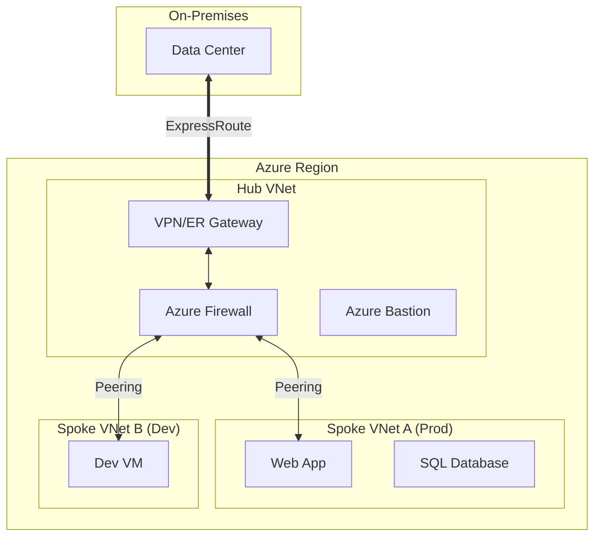
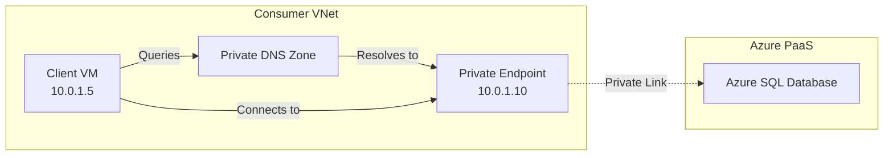

# Azure Networking & Virtual Networks (VNet)

## Overview
Networking is the most critical component of any enterprise cloud architecture. In banking, where security and isolation are paramount, a deep understanding of Azure Networking is non-negotiable.

Interviewers will test your knowledge on:
- **Isolation**: How to keep traffic private.
- **Connectivity**: How to connect on-premise data centers to Azure securely.
- **Traffic Management**: How to load balance and route traffic globally.
- **Security**: How to filter traffic at Layer 3, 4, and 7.

## Foundational Concepts

### Virtual Network (VNet)
A logical isolation of the Azure cloud dedicated to your subscription. It is analogous to a physical network in an on-premises data center.
- **Address Space**: Defined using CIDR notation (e.g., `10.0.0.0/16`).
- **Subnets**: Segments within a VNet (e.g., `10.0.1.0/24` for Web, `10.0.2.0/24` for DB).

### Network Security Groups (NSG)
A stateful firewall that filters network traffic to and from Azure resources.
- **Rules**: Allow/Deny based on 5-tuple (Source IP, Source Port, Destination IP, Destination Port, Protocol).
- **Association**: Can be associated with a Subnet (recommended) or a Network Interface (NIC).

## Technical Deep Dive

### 1. Connectivity Options

| Feature | Use Case | SLA | Bandwidth | Encryption |
| :--- | :--- | :--- | :--- | :--- |
| **VPN Gateway (S2S)** | Small/Medium offices, backup connectivity | 99.9% - 99.95% | Up to 10 Gbps | IPsec (Encrypted) |
| **ExpressRoute** | Enterprise data centers, high reliability, consistent latency | 99.95% | Up to 100 Gbps | No (Private, not encrypted by default) |
| **VNet Peering** | Connecting two VNets (same or different region) | N/A | VM speed | Private backbone |

> [!TIP]
> **ExpressRoute Direct** allows you to connect directly to Microsoft's global network at peering locations, bypassing the connectivity provider.

### 2. Load Balancing Options

- **Global (DNS-based)**:
  - **Traffic Manager**: DNS-based routing. Good for non-HTTP traffic or simple failover.
  - **Azure Front Door**: Layer 7 (HTTP/S) global load balancer with CDN and WAF capabilities. Anycast protocol.

- **Regional**:
  - **Azure Load Balancer**: Layer 4 (TCP/UDP). Low latency. Internal or Public.
  - **Application Gateway**: Layer 7 (HTTP/S). SSL termination, WAF, URL-based routing, Cookie affinity.

### 3. Private Connectivity (CRITICAL)

**Service Endpoints**:
- Routes traffic from your VNet to an Azure service (like SQL or Storage) over the Azure backbone.
- The service resource remains public, but you lock it down to only accept traffic from your VNet.

**Private Link / Private Endpoint**:
- Brings the Azure service *into* your VNet.
- The service gets a private IP address from your subnet.
- **Preferred for Banking**: It completely removes the public endpoint of the PaaS service.

## Visual Representations

### Hub-and-Spoke Network Topology
This is the standard for enterprise deployments.



### Private Link Architecture


## Configuration Examples

### Creating a VNet with Subnets (Azure CLI)
```bash
# Create VNet
az network vnet create \
  --name BankingVNet \
  --resource-group BankingRG \
  --address-prefix 10.0.0.0/16 \
  --subnet-name FrontEnd \
  --subnet-prefix 10.0.1.0/24

# Create BackEnd Subnet
az network vnet subnet create \
  --vnet-name BankingVNet \
  --resource-group BankingRG \
  --name BackEnd \
  --address-prefix 10.0.2.0/24
```

## Real-World Enterprise Scenarios

### Scenario: Secure Hybrid Connectivity
**Requirement**: A bank needs to connect its mainframe in New York to Azure East US. The connection must be private, dedicated, and support 20 Gbps throughput.
**Solution**:
1. **ExpressRoute**: Use ExpressRoute with a 10 Gbps circuit (or two).
2. **ExpressRoute FastPath**: Enable FastPath to improve data path performance between on-prem and Azure VMs (bypassing the Gateway for data traffic).
3. **MACsec**: If encryption is required over the private line, use ExpressRoute Direct with MACsec.

### Scenario: Global Web Application
**Requirement**: A public-facing banking app needs to be available in US, Europe, and Asia. It requires WAF protection and SSL offloading.
**Solution**:
1. **Front End**: Azure Front Door (Global LB + WAF + CDN).
2. **Back End**: Application Gateway (Regional LB + WAF) in each region.
3. **Compute**: AKS clusters in each region.
4. **Routing**: Front Door routes to the closest available region.

## Interview Questions & Model Answers

### Q1: What is the difference between Service Endpoints and Private Endpoints?
**Answer**:
- **Service Endpoints**: Route traffic securely over the Azure backbone, but the destination resource (e.g., Storage Account) still has a public IP. You use firewall rules to allow only your VNet.
- **Private Endpoints**: Assign a *private IP* from your VNet to the PaaS service. The service is effectively brought *inside* your network.
- **Banking Context**: Private Endpoints are preferred (and often mandated) because they eliminate data exfiltration risks associated with public endpoints.

### Q2: How does Azure Firewall differ from an NSG?
**Answer**:
- **NSG (Network Security Group)**: Layer 3/4 filtering (IP/Port). Free. Distributed at the subnet/NIC level. Good for basic segmentation.
- **Azure Firewall**: Managed, stateful firewall-as-a-service. Layer 3-7 capabilities (FQDN filtering, Threat Intelligence). Centralized. Costly.
- **Usage**: Use NSGs for micro-segmentation within VNets. Use Azure Firewall in the Hub VNet to filter traffic entering/leaving the network or between spokes.

### Q3: Explain User-Defined Routes (UDR) and when you would use them.
**Answer**:
Azure has system routes by default (e.g., traffic to the internet goes to the internet).
**UDRs** allow you to override these defaults.
**Scenario**: You want to force all internet-bound traffic from a Spoke VNet to go through a firewall in the Hub VNet (Force Tunneling). You create a Route Table with a route `0.0.0.0/0` pointing to the Virtual Appliance (Firewall) IP and associate it with the Spoke subnet.

## Key Takeaways
- **Hub-and-Spoke** is the de-facto standard topology.
- **Identity is the new perimeter**, but **Networking** is still the first line of defense.
- **DNS resolution** is critical for Private Endpoints to work correctly.
- **VNet Peering** is non-transitive (A connected to B, B connected to C, A cannot talk to C unless you use a NVA/Firewall).

## Further Reading
- [Azure Virtual Network FAQ](https://learn.microsoft.com/en-us/azure/virtual-network/virtual-networks-faq)
- [Hub-spoke network topology in Azure](https://learn.microsoft.com/en-us/azure/architecture/reference-architectures/hybrid-networking/hub-spoke)
- [What is Azure Private Link?](https://learn.microsoft.com/en-us/azure/private-link/private-link-overview)
