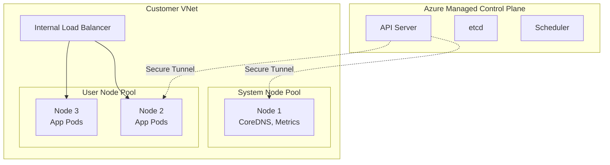
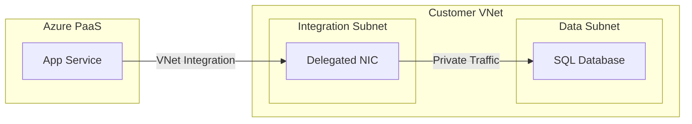

# Azure Compute Services

## Overview
Compute is the engine of the cloud. For a Staff Engineer, the challenge isn't just "spinning up a VM," but choosing the *right* compute model (IaaS vs. PaaS vs. Serverless vs. Containers) based on cost, operational overhead, and scalability requirements.

## Foundational Concepts

### Compute Decision Tree
- **Full Control / Legacy App?** -> **Virtual Machines (IaaS)**
- **Containerized Microservices?** -> **Azure Kubernetes Service (AKS)**
- **Simple Web App / API?** -> **Azure App Service (PaaS)**
- **Event-Driven / Short Jobs?** -> **Azure Functions (Serverless)**
- **Batch Processing?** -> **Azure Batch**

## Technical Deep Dive

### 1. Virtual Machines (VMs)
- **VM Families**:
  - **D-Series**: General purpose (Enterprise apps).
  - **E-Series**: Memory optimized (Databases, SAP).
  - **F-Series**: Compute optimized (Web servers, gaming).
  - **N-Series**: GPU enabled (AI/ML, Rendering).
- **Spot VMs**: Unused Azure capacity at deep discounts (up to 90%). Can be evicted at any time. Use for stateless, interruptible workloads.
- **VM Scale Sets (VMSS)**: Manage a group of identical, load-balanced VMs. Provides true auto-scaling (scale-out/scale-in) based on metrics.

### 2. Azure Kubernetes Service (AKS)
Managed Kubernetes. Microsoft manages the Control Plane (API Server, etcd) for free (Standard tier). You pay for the Worker Nodes.
- **Networking**:
  - **Kubenet**: Simple, conserves IP addresses. NATs traffic.
  - **Azure CNI**: Advanced. Every pod gets a VNet IP. High performance, but IP hungry.
- **Identity**: **Workload Identity** (replaces Pod Identity) allows pods to authenticate to Azure AD securely.
- **Scaling**:
  - **HPA**: Horizontal Pod Autoscaler (adds pods).
  - **Cluster Autoscaler**: Adds nodes when pods are pending.
  - **KEDA**: Event-driven autoscaling (scale to zero).

### 3. Azure App Service
Fully managed platform for building web apps.
- **App Service Plan (ASP)**: The underlying compute infrastructure (server farm). You scale the ASP, not the individual app.
- **Deployment Slots**: Swap production and staging slots for zero-downtime deployments.
- **VNet Integration**: Allows the PaaS app to access resources in a VNet (like a private SQL DB).

### 4. Azure Functions
Serverless compute.
- **Plans**:
  - **Consumption**: Pay per execution. Cold starts exist.
  - **Premium**: Pre-warmed instances. No cold starts. VNet integration included.
  - **Dedicated**: Run on an App Service Plan.
- **Durable Functions**: Extension to write stateful functions in a serverless environment (Orchestrator pattern).

## Visual Representations

### AKS Cluster Architecture (Enterprise)


### App Service VNet Integration


## Configuration Examples

### Create a VM Scale Set with Autoscale (CLI)
```bash
az vmss create \
  --resource-group MyRG \
  --name MyVMSS \
  --image Ubuntu2204 \
  --upgrade-policy-mode Automatic \
  --admin-username azureuser \
  --generate-ssh-keys

# Configure Autoscale Rule
az monitor autoscale create \
  --resource-group MyRG \
  --resource MyVMSS \
  --resource-type Microsoft.Compute/virtualMachineScaleSets \
  --name AutoscaleSettings \
  --min-count 2 \
  --max-count 10 \
  --count 2
```

## Real-World Enterprise Scenarios

### Scenario: Microservices Migration
**Requirement**: A bank wants to migrate a monolithic Java app to microservices. They need auto-scaling, rolling updates, and integration with their existing VNet.
**Solution**: **AKS**.
- Use **Azure CNI** for direct VNet integration (pods get real IPs).
- Use **Ingress Controller** (AGIC or Nginx) for routing.
- Use **Helm** charts for deployment.
- Use **Azure Policy** to enforce governance (e.g., no public IPs on nodes).

### Scenario: Event-Driven Fraud Detection
**Requirement**: Analyze transaction logs dropped into Blob Storage. Traffic is bursty.
**Solution**: **Azure Functions (Consumption Plan)**.
- **Trigger**: Blob Trigger.
- **Binding**: Output to Cosmos DB.
- **Why**: Cost-effective for bursty traffic. Scales to zero when no logs are present.

## Interview Questions & Model Answers

### Q1: When would you choose Azure CNI over Kubenet for AKS?
**Answer**:
- **Azure CNI**: Every pod gets an IP from the VNet subnet.
  - **Pros**: No NAT (better performance), direct connectivity to on-prem/other VMs, supports Windows node pools.
  - **Cons**: IP exhaustion risk (requires careful planning).
- **Kubenet**: Only nodes get VNet IPs; pods use an overlay network.
  - **Pros**: Conserves IP addresses.
  - **Cons**: Extra hop (NAT), slightly lower performance.
- **Decision**: For enterprise banking, **Azure CNI** is preferred for visibility and direct connectivity, provided IP space is available.

### Q2: Explain the difference between a "Web Job" and an "Azure Function".
**Answer**:
- **WebJobs**: Part of App Service. Good for background tasks running in the *same context* as your web app (sharing resources).
- **Azure Functions**: Evolution of WebJobs. Serverless, event-driven, independent scaling.
- **Decision**: Use Functions for decoupled, event-driven tasks. Use WebJobs if the background task is tightly coupled to the web app code or needs to run on the exact same VM.

### Q3: How do you handle "Cold Starts" in Azure Functions?
**Answer**:
Cold starts happen when the Functions host shuts down due to inactivity (Consumption plan).
**Mitigation**:
1. **Premium Plan**: Keeps instances perpetually warm.
2. **Dedicated (App Service) Plan**: Runs on dedicated VMs (always on).
3. **Keep-Alive**: Artificial "pings" (hacky, not recommended for prod).
4. **Language Choice**: C#/.NET starts faster than Java/Node in some contexts.

## Key Takeaways
- **AKS** is the standard for modern container orchestration, but requires significant operational skill.
- **App Service** is the "easy button" for web apps—don't underestimate it.
- **Spot VMs** can save massive amounts of money but require your app to be fault-tolerant.
- **SLA**: Single VM SLA requires Premium SSD.

## Further Reading
- [Choose an Azure compute service](https://learn.microsoft.com/en-us/azure/architecture/guide/technology-choices/compute-decision-tree)
- [AKS Networking Concepts](https://learn.microsoft.com/en-us/azure/aks/concepts-network)
- [Azure App Service Plans](https://learn.microsoft.com/en-us/azure/app-service/overview-hosting-plans)
