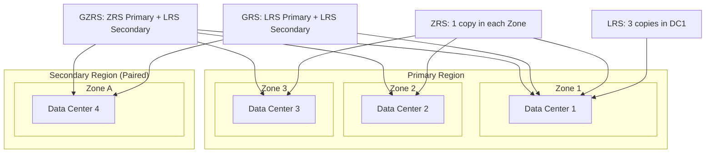
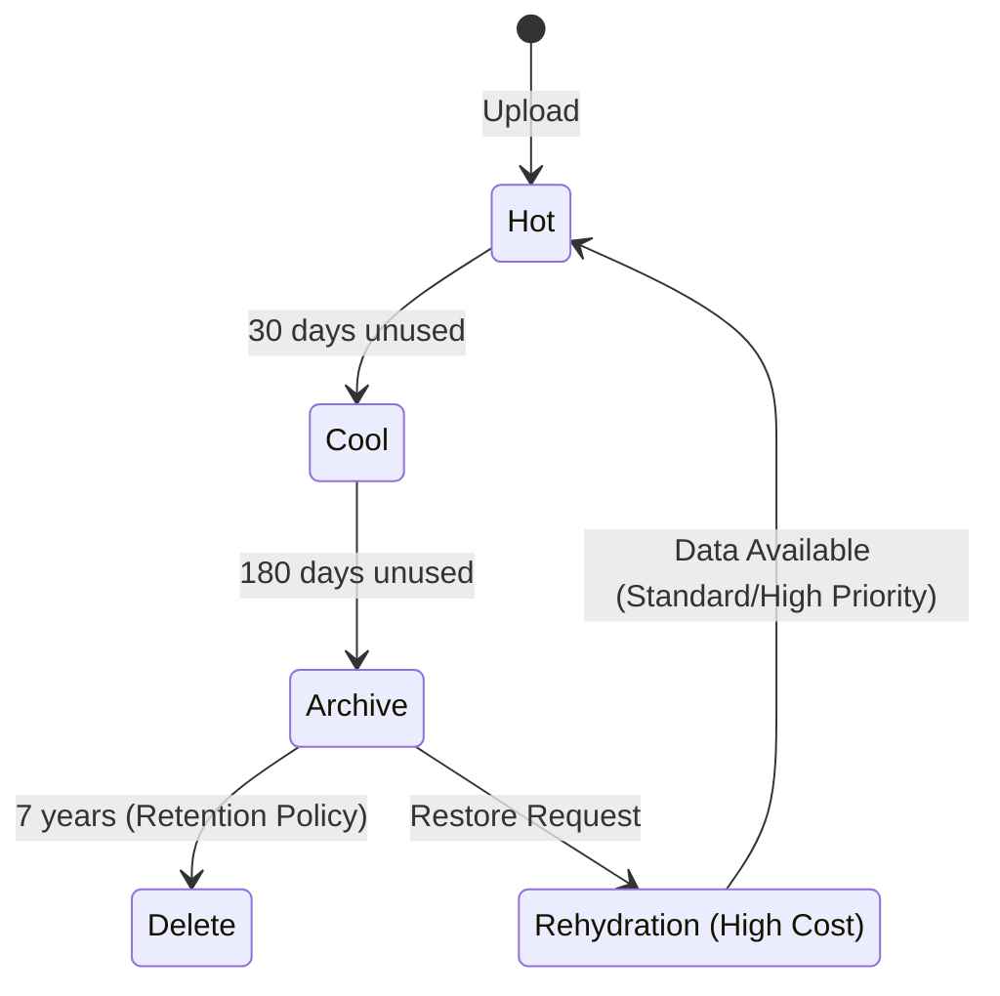

# Azure Storage Services

## Overview
Data is the lifeblood of banking. Azure Storage is not just a "hard drive in the cloud"; it is a massively scalable, durable, and secure distributed storage system.
Interviewers focus on **Durability** (Redundancy), **Security** (Encryption/Access), and **Cost** (Lifecycle Management).

## Foundational Concepts

### Storage Account
The top-level container for all Azure Storage data objects: blobs, files, queues, and tables.
- **Standard General Purpose v2 (GPv2)**: The default. Supports all storage types.
- **Premium**: High performance (SSD-backed). Specialized for Block Blobs, File Shares, or Page Blobs.

### Redundancy (The "Durability" Question)
- **LRS (Locally Redundant)**: 3 copies in 1 data center. (11 nines durability).
- **ZRS (Zone Redundant)**: 3 copies across 3 Availability Zones in 1 region. (12 nines).
- **GRS (Geo-Redundant)**: LRS in primary + LRS in secondary region. (16 nines).
- **GZRS (Geo-Zone-Redundant)**: ZRS in primary + LRS in secondary region. (16 nines).

## Technical Deep Dive

### 1. Blob Storage
Object storage for unstructured data.
- **Blob Types**:
  - **Block Blob**: Text/Binary data (documents, videos).
  - **Append Blob**: Optimized for append operations (logging).
  - **Page Blob**: Random access files (VHDs).
- **Access Tiers**:
  - **Hot**: Frequent access. High storage cost, low access cost.
  - **Cool**: Infrequent access (>30 days). Lower storage cost, higher access cost.
  - **Cold**: Very infrequent (>90 days).
  - **Archive**: Rare access (>180 days). Lowest storage, highest rehydration cost (hours to retrieve).

### 2. Azure Data Lake Storage Gen2 (ADLS Gen2)
Built on top of Blob Storage.
- **Hierarchical Namespace**: Adds a true file system (directories/subdirectories) to object storage.
- **Performance**: Atomic directory operations (renaming a folder with 1M files takes milliseconds, not hours).
- **Security**: POSIX-style ACLs (Access Control Lists).

### 3. Azure Disk Storage
Block storage for VMs.
- **Ultra Disk**: Sub-millisecond latency, adjustable IOPS/Throughput at runtime.
- **Premium SSD v2**: High performance, decoupled storage/IOPS pricing.
- **Shared Disks**: Attach a managed disk to multiple VMs (for clustered apps like SQL FCI).

## Visual Representations

### Storage Redundancy Options


### Lifecycle Management Policy Flow


## Configuration Examples

### Lifecycle Management Policy (JSON)
```json
{
  "rules": [
    {
      "name": "MoveToCoolAndArchive",
      "enabled": true,
      "type": "Lifecycle",
      "definition": {
        "filters": {
          "blobTypes": ["blockBlob"],
          "prefixMatch": ["logs/"]
        },
        "actions": {
          "baseBlob": {
            "tierToCool": { "daysAfterModificationGreaterThan": 30 },
            "tierToArchive": { "daysAfterModificationGreaterThan": 90 },
            "delete": { "daysAfterModificationGreaterThan": 2555 }
          }
        }
      }
    }
  ]
}
```

## Real-World Enterprise Scenarios

### Scenario: Regulatory Archive
**Requirement**: A bank must keep all transaction logs for 7 years (SEC Rule 17a-4). Data must be immutable (WORM - Write Once Read Many).
**Solution**:
1. **Storage**: ADLS Gen2 or Blob Storage.
2. **Policy**: **Immutable Storage** (Legal Hold or Time-Based Retention).
3. **Tiering**: Lifecycle policy to move to **Archive** tier after 90 days.
4. **Security**: Enable **Infrastructure Encryption** (double encryption) for highest security.

### Scenario: High-Performance File Share
**Requirement**: A legacy risk modeling app runs on Linux VMs and needs a shared file system with sub-millisecond latency.
**Solution**: **Azure NetApp Files**.
- Enterprise-grade NFS/SMB.
- Bare-metal performance.
- Not just "Azure Files" (which is slower/standard SMB).

## Interview Questions & Model Answers

### Q1: What is the difference between Azure Files and Azure NetApp Files?
**Answer**:
- **Azure Files**: Fully managed file shares (SMB/NFS). Good for general purpose, lift-and-shift.
  - *Standard*: HDD-backed.
  - *Premium*: SSD-backed.
- **Azure NetApp Files**: NetApp ONTAP storage running bare-metal in Azure data centers.
  - *Use Case*: High-performance workloads (SAP HANA, HPC, Oracle) requiring extremely low latency and high throughput. Expensive.

### Q2: Explain the "Hierarchical Namespace" in ADLS Gen2. Why do we need it?
**Answer**:
Standard Blob Storage is flat. Folders are "virtual" (part of the name `folder/file.txt`).
- **Problem**: Renaming a folder `folder/` to `archive/` involves copying and deleting every single blob inside it. For Big Data (millions of files), this is impossible.
- **Solution**: Hierarchical Namespace (HNS) makes it a real file system. Renaming a folder is an atomic metadata operation on the parent folder. Essential for Hadoop/Spark performance.

### Q3: How do you secure a Storage Account in a banking environment?
**Answer**:
1. **Network**: Disable "Allow access from all networks". Use **Private Endpoints** to access from VNet.
2. **Identity**: Disable "Shared Key" access. Enforce **Azure AD Authentication** (RBAC).
3. **Encryption**: Enable **Customer-Managed Keys (CMK)** stored in Key Vault.
4. **Data Protection**: Enable Soft Delete, Versioning, and Immutable Storage policies.

## Key Takeaways
- **Storage Accounts** are the Swiss Army Knife of Azure data.
- **Lifecycle Management** is the #1 way to save money on storage.
- **Private Endpoints** are mandatory for storage in secure environments.
- **ADLS Gen2** is simply Blob Storage with HNS enabled.

## Further Reading
- [Azure Storage redundancy](https://learn.microsoft.com/en-us/azure/storage/common/storage-redundancy)
- [Lifecycle management policy](https://learn.microsoft.com/en-us/azure/storage/blobs/lifecycle-management-overview)
- [Azure NetApp Files](https://learn.microsoft.com/en-us/azure/azure-netapp-files/azure-netapp-files-introduction)
