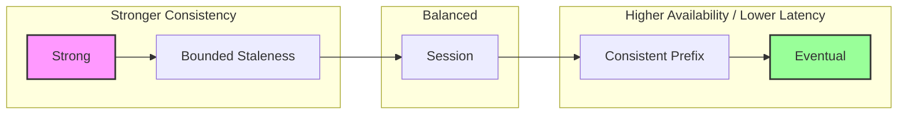

# Azure Database Services

## Overview
Data persistence is the core of any application. Azure offers a spectrum of managed databases.
For Staff Engineers, the choice is rarely "SQL vs NoSQL." It's about **Consistency Models**, **Global Distribution**, **Write Scalability**, and **Cost**.

## Foundational Concepts

### Relational vs. NoSQL (Azure Context)
- **Azure SQL Database**: PaaS version of SQL Server. Best for relational data, transactions (ACID), and legacy compatibility.
- **Azure Cosmos DB**: Global, multi-model NoSQL. Best for massive scale, low latency, and flexible schemas.

## Technical Deep Dive

### 1. Azure SQL Database
- **Deployment Models**:
  - **Single Database**: Isolated, managed database.
  - **Elastic Pool**: Shared resources (eDTUs/vCores) for multiple databases. Cost-effective for unpredictable usage.
  - **Managed Instance (MI)**: Near 100% compatibility with on-prem SQL Server. VNet-native.
- **Service Tiers**:
  - **General Purpose**: Remote storage (latency sensitive).
  - **Business Critical**: Local SSD storage (high performance), Read Scale-Out.
  - **Hyperscale**: Separates compute and storage. Storage grows to 100TB+. Fast scaling.

### 2. Azure Cosmos DB (CRITICAL)
The "Swiss Army Knife" of NoSQL.
- **APIs**: Core (SQL), MongoDB, Cassandra, Gremlin (Graph), Table.
- **Consistency Levels** (The "CAP Theorem" slider):
  - **Strong**: Linearizability. Highest latency, lowest availability.
  - **Bounded Staleness**: Reads lag by X minutes or Y versions.
  - **Session**: (Default) Read your own writes.
  - **Consistent Prefix**: No out-of-order reads.
  - **Eventual**: Lowest latency, highest availability.
- **Partitioning**:
  - **Logical Partition**: Defined by Partition Key. Max 20GB.
  - **Physical Partition**: Managed by Azure.
  - **Hot Partition**: A partition that receives disproportionate traffic. **Avoid this!**

### 3. Azure Cache for Redis
- **Tiers**:
  - **Basic**: No SLA, single node.
  - **Standard**: HA (Replication).
  - **Premium**: Persistence (RDB/AOF), Clustering, VNet support.
  - **Enterprise**: Redis Labs modules (RediSearch, RedisBloom), Active Geo-Replication.

## Visual Representations

### Cosmos DB Consistency Levels Trade-off


### Azure SQL HA Architecture (Business Critical)
```mermaid
graph TB
    subgraph "Region A"
        subgraph "Always On Availability Group"
            Primary[Primary Replica<br/>(Read/Write)]
            Sec1[Secondary Replica<br/>(Read Only)]
            Sec2[Secondary Replica<br/>(HA)]
            Sec3[Secondary Replica<br/>(HA)]
        end
    end
    
    App[Application] -->|Read-Write| Primary
    App -.->|Read-Only Intent| Sec1
    
    Primary -- Sync Commit --> Sec1 & Sec2 & Sec3
```

## Configuration Examples

### Create Cosmos DB Container with Autoscale (CLI)
```bash
az cosmosdb sql container create \
  --resource-group MyRG \
  --account-name MyCosmosDB \
  --database-name MyDatabase \
  --name MyContainer \
  --partition-key-path "/customerId" \
  --throughput 4000 \
  --max-throughput 40000
```

## Real-World Enterprise Scenarios

### Scenario: Global E-Commerce Platform
**Requirement**: A shopping cart service needs to be available in US, Europe, and Asia. Latency must be <10ms for 99% of requests.
**Solution**: **Cosmos DB (Multi-Region Writes)**.
- **Consistency**: Session (users see their own cart updates immediately).
- **Partition Key**: `/userId` (evenly distributes data).
- **Distribution**: Replicate to all 3 regions. Enable Multi-Region Writes so users write to their local region.

### Scenario: Legacy Banking Core Migration
**Requirement**: Migrate a 5TB SQL Server 2008 cluster to Azure. It uses CLR assemblies, SQL Agent jobs, and cross-database queries.
**Solution**: **Azure SQL Managed Instance**.
- **Why**: It supports nearly all SQL Server features (unlike Single DB).
- **Tier**: Business Critical (for performance and HA).
- **Migration**: Use Azure Database Migration Service (DMS) for near-zero downtime.

## Interview Questions & Model Answers

### Q1: Explain the difference between DTU and vCore purchasing models in Azure SQL.
**Answer**:
- **DTU (Database Transaction Unit)**: Blended measure of CPU, Memory, and IO. Good for simple, pre-configured performance. "T-shirt sizing."
- **vCore**: Independent scaling of Compute and Storage. Allows you to use Azure Hybrid Benefit (bring your own license).
- **Decision**: Enterprise customers almost always use **vCore** for transparency, flexibility, and cost savings via Hybrid Benefit.

### Q2: How do you choose a Partition Key for Cosmos DB?
**Answer**:
This is the most critical design decision.
1. **High Cardinality**: Many distinct values (e.g., UserID, DeviceID).
2. **Even Distribution**: Request volume and storage should be roughly equal across keys.
3. **Query Pattern**: Ideally, queries should target a single partition (Single Partition Query) for efficiency. Cross-partition queries are expensive.
- **Bad Key**: `City` (New York will be a hot partition).
- **Good Key**: `TransactionID` or `Composite(City + Date)`.

### Q3: What happens if I run out of RUs (Request Units) in Cosmos DB?
**Answer**:
The request is throttled.
- **Status Code**: 429 (Too Many Requests).
- **Client Behavior**: The Azure SDK automatically retries based on the `Retry-After` header.
- **Solution**:
  1. Optimize queries (reduce RU cost).
  2. Increase Provisioned Throughput.
  3. Enable Autoscale.

## Key Takeaways
- **Cosmos DB** is expensive if modeled poorly. Partitioning is everything.
- **SQL Managed Instance** is the bridge for legacy apps.
- **Consistency** is a spectrum, not a binary choice.
- **Read Replicas** offload reporting workloads from the primary transactional DB.

## Further Reading
- [Choose the right consistency level](https://learn.microsoft.com/en-us/azure/cosmos-db/consistency-levels)
- [Partitioning and horizontal scaling in Azure Cosmos DB](https://learn.microsoft.com/en-us/azure/cosmos-db/partitioning-overview)
- [Azure SQL Database purchasing models](https://learn.microsoft.com/en-us/azure/azure-sql/database/purchasing-models)
