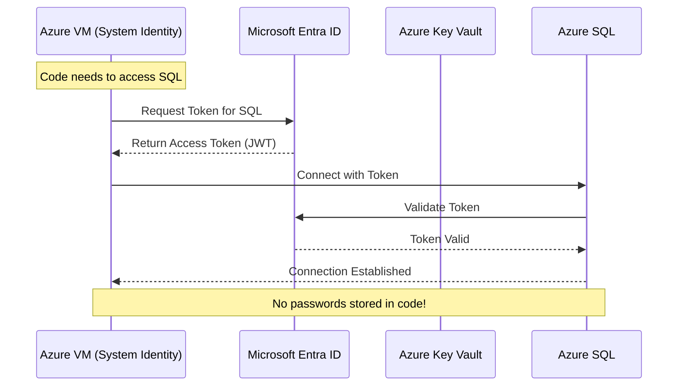
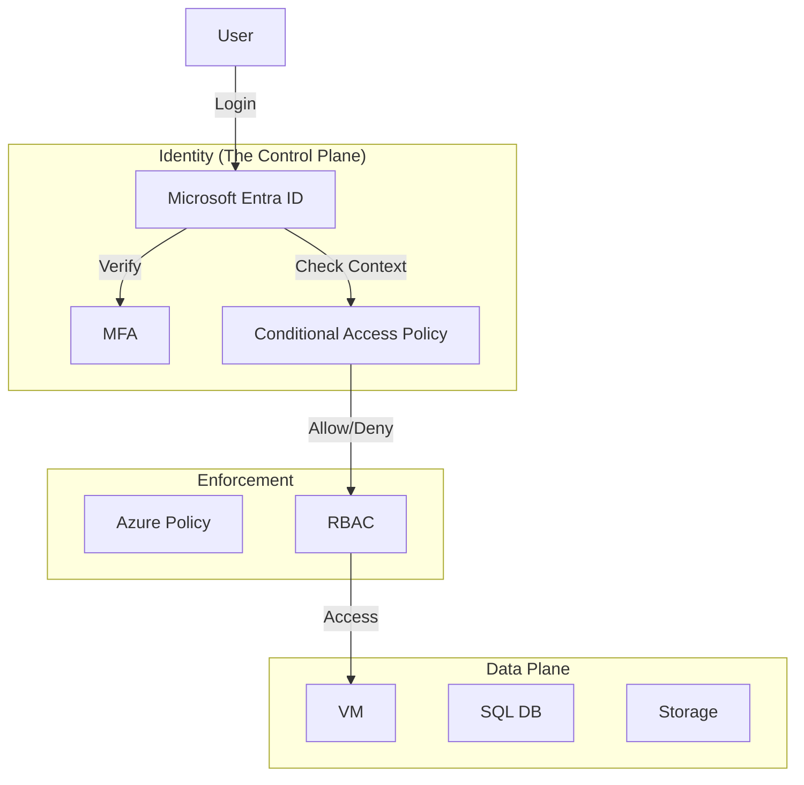

# Azure Security & Identity (Microsoft Entra ID)

## Overview
In the cloud, **Identity is the new Perimeter**. Firewalls are necessary but insufficient.
For Staff Engineers, security is not a "team" you hand off to; it is baked into every architectural decision.
Interviewers look for a **Zero Trust** mindset: "Never Trust, Always Verify."

## Foundational Concepts

### Microsoft Entra ID (formerly Azure AD)
The cloud-native identity and access management (IAM) service.
- **Tenant**: A dedicated instance of Entra ID representing an organization.
- **Subscription**: A logical container for resources and billing. A subscription trusts *one* directory.
- **Service Principal**: An identity for an application (like a "Service Account").
- **Managed Identity**: A wrapper around a Service Principal that is automatically managed by Azure. **Always prefer this.**

### RBAC (Role-Based Access Control)
- **Security Principal**: Who? (User, Group, Service Principal, Managed Identity).
- **Role Definition**: What? (Owner, Contributor, Reader).
- **Scope**: Where? (Management Group > Subscription > Resource Group > Resource).

## Technical Deep Dive

### 1. Managed Identities
Eliminates the need for developers to manage credentials (secrets/passwords).
- **System-Assigned**: Tied to the lifecycle of the resource (e.g., a VM). If the VM dies, the identity dies.
- **User-Assigned**: Created as a standalone resource. Can be assigned to multiple resources. Good for sharing permissions.

### 2. Azure Key Vault
Securely stores secrets, keys, and certificates.
- **Access Policies**: Legacy model. "All or nothing" for a principal.
- **RBAC for Key Vault**: Modern model. Granular control (e.g., "Key Vault Secrets User").
- **HSM (Hardware Security Module)**: FIPS 140-2 Level 2/3 validated hardware for high-security key generation.

### 3. Microsoft Defender for Cloud (CSPM & CWPP)
- **CSPM (Cloud Security Posture Management)**: "Are my doors locked?" Scans config against benchmarks (CIS, NIST).
- **CWPP (Cloud Workload Protection Platform)**: "Is there a burglar inside?" Detects threats on running resources (e.g., SQL Injection attempt, RDP Brute Force).

### 4. Azure Sentinel (SIEM + SOAR)
- **SIEM**: Collects logs from everywhere (Azure, AWS, On-prem).
- **SOAR**: Automated response (Playbooks).
- **KQL**: Uses Kusto Query Language to hunt for threats.

## Visual Representations

### Managed Identity Flow


### Zero Trust Architecture


## Configuration Examples

### Assign a Managed Identity to a VM and Grant Access to Key Vault (CLI)
```bash
# 1. Enable System-Assigned Identity on VM
az vm identity assign -g MyRG -n MyVM

# 2. Get the Principal ID (Object ID)
spID=$(az vm identity show -g MyRG -n MyVM --query principalId -o tsv)

# 3. Grant 'Key Vault Secrets User' role
az role assignment create \
    --assignee $spID \
    --role "Key Vault Secrets User" \
    --scope "/subscriptions/{subId}/resourceGroups/MyRG/providers/Microsoft.KeyVault/vaults/MyVault"
```

## Real-World Enterprise Scenarios

### Scenario: Secure CI/CD Pipeline
**Requirement**: GitHub Actions needs to deploy to Azure without storing long-lived credentials (Client Secrets) in GitHub.
**Solution**: **Workload Identity Federation (OIDC)**.
- GitHub acts as an OIDC provider.
- Azure trusts tokens issued by GitHub for a specific repo/branch.
- **Benefit**: No secrets to rotate. No secrets to leak.

### Scenario: Just-In-Time (JIT) Access
**Requirement**: Admins need RDP/SSH access to VMs, but ports 3389/22 cannot be open to the internet 24/7.
**Solution**: **Defender for Cloud JIT Access**.
- Ports are closed by default (NSG Deny).
- Admin requests access via Portal.
- If approved (RBAC), Azure opens the NSG for that specific Source IP for a limited time (e.g., 1 hour).

## Interview Questions & Model Answers

### Q1: What is the difference between Authentication and Authorization?
**Answer**:
- **Authentication (AuthN)**: "Who are you?" Verifying identity (Password, MFA, Cert). Handled by Entra ID.
- **Authorization (AuthZ)**: "What can you do?" Verifying permissions. Handled by RBAC.
- **Analogy**: AuthN is your badge to enter the building. AuthZ is which rooms your badge opens.

### Q2: Explain Conditional Access Policies.
**Answer**:
It's an "If-Then" engine for Zero Trust.
- **Signals**: User (Group), Location (IP), Device (Compliant?), Application, Risk (Leaked creds?).
- **Decision**: Block, Grant, or Grant with MFA.
- **Example**: "If user is accessing 'Payroll App' from 'Non-Corporate Device', REQUIRE MFA."

### Q3: Why should I use Managed Identities instead of Service Principals with Client Secrets?
**Answer**:
- **Secret Management**: With Service Principals, you have a "Client Secret" (password) that expires and must be rotated. It often gets hardcoded or leaked.
- **Managed Identity**: Azure manages the secret rotation automatically. The developer never sees a credential. It is inherently more secure and operationally simpler.

## Key Takeaways
- **Identity** is the new firewall.
- **Managed Identities** are mandatory for Azure-to-Azure communication.
- **Key Vault** should be used for anything that *cannot* use Managed Identity (e.g., third-party API keys).
- **Conditional Access** is the heart of Zero Trust.

## Further Reading
- [What is Microsoft Entra ID?](https://learn.microsoft.com/en-us/entra/fundamentals/whatis)
- [Managed identities for Azure resources](https://learn.microsoft.com/en-us/entra/identity/managed-identities-azure-resources/overview)
- [Azure RBAC best practices](https://learn.microsoft.com/en-us/azure/role-based-access-control/best-practices)
