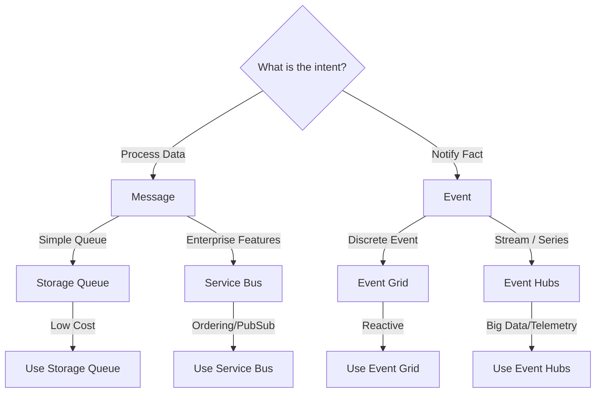
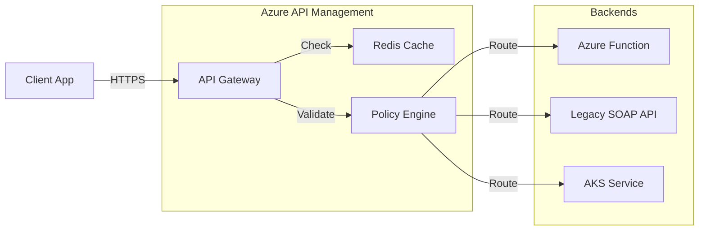

# Azure Application Integration & Messaging

## Overview
In a distributed system (microservices), components need to talk.
Interviewers want to know if you understand the difference between **Messages** (intent) and **Events** (facts), and if you can choose the right tool for the job.

## Foundational Concepts

### Message vs. Event
- **Message**: Contains the data itself. The sender expects the receiver to process it. "Please create Order #123." -> **Service Bus**.
- **Event**: A notification that something happened. The sender doesn't care who listens. "Order #123 was created." -> **Event Grid / Event Hubs**.

## Technical Deep Dive

### 1. Azure Service Bus (Enterprise Messaging)
- **Queues**: 1:1 communication. Load leveling.
- **Topics**: 1:N communication (Pub/Sub).
- **Features**:
  - **FIFO**: Guaranteed ordering (via Sessions).
  - **Dead Letter Queue (DLQ)**: Holds messages that failed processing.
  - **Duplicate Detection**: Prevents processing the same message twice.
  - **Transactions**: Atomic operations.

### 2. Azure Event Hubs (Big Data Streaming)
- **Kafka Compatible**: Can replace Apache Kafka.
- **Partitions**: Unit of scale. Parallelism.
- **Capture**: Automatically dump data to Blob Storage (Data Lake).
- **Throughput Units (TU)**: Pricing model.

### 3. Azure Event Grid (Reactive Event Routing)
- **Push Model**: Pushes events to handlers (Functions, Webhooks).
- **System Events**: Built-in events (Blob Created, VM Started).
- **Filtering**: Filter by subject or data.

### 4. Azure API Management (APIM)
The "Front Door" for your APIs.
- **Policies**: XML-based logic (Rate Limiting, Caching, JWT Validation, Transformation).
- **Developer Portal**: Documentation and testing for API consumers.
- **Backends**: Route to Function, Logic App, App Service, or Kubernetes.

## Visual Representations

### Messaging Decision Tree


### API Management Architecture


## Configuration Examples

### APIM Policy: Rate Limiting & JWT Validation (XML)
```xml
<policies>
    <inbound>
        <base />
        <!-- Validate JWT from Azure AD -->
        <validate-jwt header-name="Authorization" failed-validation-httpcode="401">
            <openid-config url="https://login.microsoftonline.com/{tenantId}/v2.0/.well-known/openid-configuration" />
            <required-claims>
                <claim name="aud">
                    <value>api://my-api-id</value>
                </claim>
            </required-claims>
        </validate-jwt>
        
        <!-- Rate Limit by Key (User ID) -->
        <rate-limit-by-key calls="100" renewal-period="60" counter-key="@(context.Request.Headers.GetValueOrDefault("Authorization","").AsJwt()?.Subject)" />
    </inbound>
    <backend>
        <base />
    </backend>
    <outbound>
        <base />
    </outbound>
</policies>
```

## Real-World Enterprise Scenarios

### Scenario: Order Processing System
**Requirement**: Decouple the "Checkout" service from the "Inventory" and "Shipping" services. Ensure no orders are lost.
**Solution**: **Service Bus Topics**.
1. Checkout Service publishes `OrderCreated` message to a Topic.
2. **Inventory Subscription**: Listens to topic, decrements stock.
3. **Shipping Subscription**: Listens to topic, generates label.
4. **Resilience**: If Shipping is down, messages pile up in its subscription (not lost).

### Scenario: IoT Telemetry Ingestion
**Requirement**: Ingest 1 million sensor readings per second from smart meters. Archive raw data and calculate real-time averages.
**Solution**: **Event Hubs + Stream Analytics**.
1. **Ingest**: Event Hubs (Auto-inflate TUs).
2. **Archive**: Event Hubs Capture -> ADLS Gen2.
3. **Process**: Stream Analytics reads from Event Hub -> SQL DB (Dashboard).

## Interview Questions & Model Answers

### Q1: When would you use Event Grid vs. Service Bus?
**Answer**:
- **Event Grid**: "Fire and forget." I want to tell the world *something happened* (e.g., a file was uploaded). I don't care if anyone is listening right now. Push model.
- **Service Bus**: "High value transaction." I need to ensure *someone processes this* (e.g., move money). Pull model. Guaranteed delivery.

### Q2: Can Event Hubs guarantee message ordering?
**Answer**:
Yes, but only **within a partition**.
- If you send messages without a partition key, they are round-robined (no global order).
- If you specify a Partition Key (e.g., `DeviceID`), all messages for that device go to the same partition and are ordered.

### Q3: Why use API Management instead of just hitting the backend directly?
**Answer**:
APIM provides a façade that decouples the consumer from the implementation.
1. **Security**: Centralized AuthN/AuthZ (JWT validation).
2. **Throttling**: Protect backends from DOS attacks.
3. **Transformation**: Convert XML to JSON (legacy modernization).
4. **Versioning**: Introduce v2 without breaking v1 clients.

## Key Takeaways
- **Decoupling** is the primary goal of integration services.
- **Service Bus** is for enterprise transactions.
- **Event Hubs** is for big data streaming.
- **APIM** is mandatory for any public-facing API.

## Further Reading
- [Choose between Azure messaging services](https://learn.microsoft.com/en-us/azure/service-bus-messaging/service-bus-azure-and-service-bus-queues-comparisons-contrast)
- [API Management policies](https://learn.microsoft.com/en-us/azure/api-management/api-management-howto-policies)
