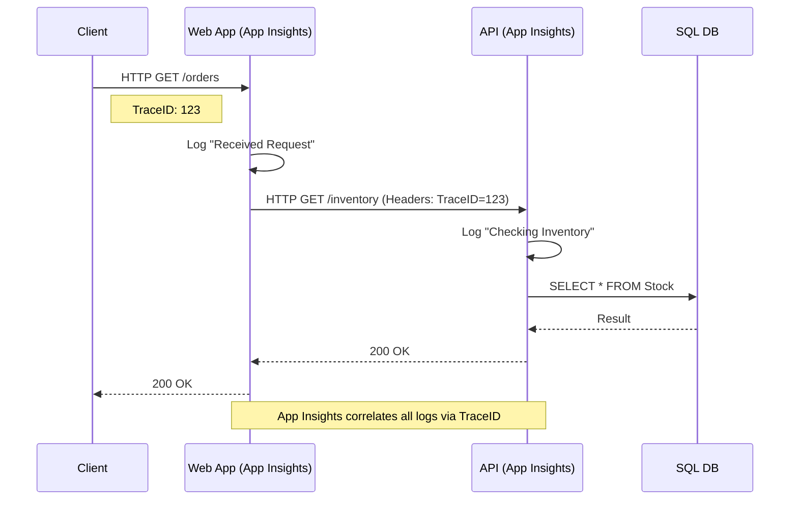
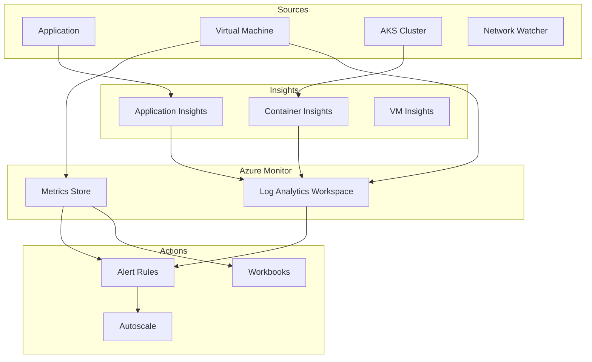

# Azure Monitoring, Logging & Observability

## Overview
"If you can't measure it, you can't manage it."
For Staff Engineers, observability is not just about CPU graphs. It's about **Distributed Tracing**, **Business Metrics**, and **Automated Remediation**.
Interviewers want to see how you debug a slow microservice in a complex mesh.

## Foundational Concepts

### Metrics vs. Logs
- **Metrics**: Numerical data (CPU %, Memory Used, Request Count). Lightweight, real-time. Good for alerting.
- **Logs**: Textual records (Stack traces, Access logs). Heavy, delayed. Good for debugging and root cause analysis.

### Azure Monitor
The umbrella service that collects data from all Azure resources.
- **Log Analytics Workspace**: The central repository for logs.
- **Application Insights**: The APM (Application Performance Management) tool for code-level insights.

## Technical Deep Dive

### 1. Log Analytics & KQL
The heart of Azure observability.
- **KQL (Kusto Query Language)**: Powerful, read-only query language optimized for large datasets.
- **Agents**:
  - **Azure Monitor Agent (AMA)**: The new standard. Replaces MMA/OMS agents. Supports Data Collection Rules (DCR) to filter data *before* ingestion (cost saving).

### 2. Application Insights
- **Live Metrics Stream**: Real-time view of health (1-second latency).
- **Application Map**: Visualizes dependencies (SQL, HTTP, Service Bus) and their health/latency.
- **Distributed Tracing**: Uses correlation IDs to trace a request across microservices.

### 3. Alerts & Action Groups
- **Metric Alerts**: "CPU > 80% for 5 mins." Fast.
- **Log Alerts**: "Find 'Exception' in logs." Slower.
- **Action Groups**: What to do? Email, SMS, Webhook (call Logic App), ITSM (ServiceNow ticket).

## Visual Representations

### Distributed Tracing Flow


### Azure Monitor Architecture


## Configuration Examples

### KQL Query: Find Slow Requests (>1s)
```kusto
requests
| where duration > 1000
| where success == true
| project timestamp, name, duration, resultCode
| order by timestamp desc
| take 100
```

### KQL Query: Join Exceptions with Requests
```kusto
requests
| where success == false
| join kind=inner (
    exceptions
) on operation_Id
| project timestamp, operation_Id, problemId, outerMessage
```

## Real-World Enterprise Scenarios

### Scenario: "The Site is Slow"
**Requirement**: Users complain the checkout page is slow. You need to find the bottleneck.
**Solution**: **Application Map**.
1. Open App Insights -> Application Map.
2. Look for red lines or high latency numbers.
3. You see the call from `CheckoutAPI` to `SQL Database` is taking 5 seconds.
4. Click the line -> "Investigate Performance".
5. See the specific SQL query causing the delay (e.g., missing index).

### Scenario: Cost Control for Logs
**Requirement**: Log Analytics bill is exploding.
**Solution**: **Data Collection Rules (DCR)**.
1. Identify noisy logs (e.g., `Debug` level logs from Dev environment).
2. Create a DCR to *filter out* Debug logs at the agent level (before they leave the VM).
3. Set the Log Analytics retention to 30 days (instead of 730) for non-audit data.
4. Move long-term logs to **Storage Account (Archive Tier)** via Data Export.

## Interview Questions & Model Answers

### Q1: What is the difference between Azure Monitor and Log Analytics?
**Answer**:
- **Azure Monitor** is the *brand name* for the entire observability suite.
- **Log Analytics** is a *service within* Azure Monitor. It is the database and query engine (KQL) where logs are stored.
- You "use Azure Monitor to set up an alert based on a query run in Log Analytics."

### Q2: How do you monitor a Kubernetes cluster in Azure?
**Answer**:
Enable **Container Insights**.
- It deploys a DaemonSet (OMS Agent) to every node.
- Collects stdout/stderr logs from containers.
- Collects performance metrics (CPU/Mem) from nodes.
- Visualizes the cluster topology in the Portal.
- Integrates with Prometheus metrics.

### Q3: Explain "Smart Detection" in Application Insights.
**Answer**:
It uses Machine Learning to detect anomalies without you setting manual rules.
- **Failure Anomalies**: "The failure rate for the POST /login API has risen to 5% (normally 0.1%)."
- **Performance Anomalies**: "Page load time is slower than usual for customers in France."
- It reduces "alert fatigue" by only notifying on statistically significant deviations.

## Key Takeaways
- **KQL** is a superpower. Learn the basics (`where`, `summarize`, `project`).
- **Application Insights** is mandatory for custom code.
- **Log Analytics** costs money (Ingestion + Retention). Filter at the source!
- **Workbooks** are the modern way to build dashboards (replacing the old Portal Dashboards).

## Further Reading
- [Kusto Query Language (KQL) Overview](https://learn.microsoft.com/en-us/azure/data-explorer/kusto/query/)
- [Azure Monitor overview](https://learn.microsoft.com/en-us/azure/azure-monitor/overview)
- [Design a monitoring strategy](https://learn.microsoft.com/en-us/azure/cloud-adoption-framework/manage/monitor/)
