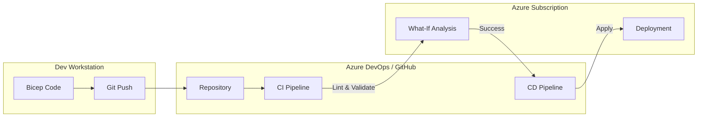

# Infrastructure as Code (IaC) & DevOps

## Overview
"ClickOps" (using the Portal) is forbidden in enterprise production.
Staff Engineers define infrastructure as software: versioned, tested, and repeatable.
Interviewers want to know your preference (Bicep vs. Terraform) and your strategy for **State Management** and **Secret Handling**.

## Foundational Concepts

### Imperative vs. Declarative
- **Imperative (Scripting)**: "Create a VM. Then create a Disk. Then attach it." (Azure CLI, PowerShell). Fragile.
- **Declarative (IaC)**: "I want a VM with a Disk attached." (ARM, Bicep, Terraform). The engine figures out *how* to do it. Idempotent.

### The Tools
- **ARM Templates (JSON)**: The native language of Azure. Verbose, hard to read.
- **Bicep**: Domain-Specific Language (DSL) for ARM. Cleaner syntax, first-class Azure support. Transpiles to ARM JSON.
- **Terraform**: Open-source, multi-cloud. Uses a State File (`terraform.tfstate`) to track resources.

## Technical Deep Dive

### 1. Bicep
- **Modularity**: Break templates into small files (`module vnet 'modules/vnet.bicep'`).
- **No State File**: It queries Azure directly. Less "drift detection" capability than Terraform, but simpler to manage.
- **Day 0 Support**: New Azure features are supported immediately (unlike Terraform providers which lag).

### 2. Terraform on Azure
- **Provider**: `azurerm`.
- **Remote State**: Store the state file in an **Azure Storage Account** (Blob) with locking (Lease) to prevent concurrent edits.
- **Authentication**: Use a Service Principal or Managed Identity (on the build agent).

### 3. CI/CD Pipelines
- **Azure DevOps (ADO)**:
  - **Pipelines**: YAML-based.
  - **Agents**: Self-hosted (in your VNet) or Microsoft-hosted.
- **GitHub Actions**:
  - **Workflows**: YAML-based.
  - **Runners**: Equivalent to Agents.
  - **OIDC**: Secure authentication without secrets.

## Visual Representations

### CI/CD Pipeline Flow (Bicep)


### Terraform State Management
```mermaid
graph TB
    User[DevOps Engineer]
    TF[Terraform CLI]
    State[Storage Account<br/>(Remote State)]
    Azure[Azure Resources]
    
    User -->|terraform apply| TF
    TF -->|Lock & Read| State
    TF -->|Compare| Azure
    TF -->|Create/Update| Azure
    TF -->|Write New State| State
    TF -->|Unlock| State
```

## Configuration Examples

### Bicep: Creating a Storage Account
```bicep
param location string = resourceGroup().location
param namePrefix string = 'st'

resource stg 'Microsoft.Storage/storageAccounts@2021-04-01' = {
  name: '${namePrefix}${uniqueString(resourceGroup().id)}'
  location: location
  sku: {
    name: 'Standard_LRS'
  }
  kind: 'StorageV2'
  properties: {
    supportsHttpsTrafficOnly: true
  }
}

output storageId string = stg.id
```

### Terraform: Backend Configuration (Remote State)
```hcl
terraform {
  backend "azurerm" {
    resource_group_name  = "tfstate-rg"
    storage_account_name = "tfstate123"
    container_name       = "tfstate"
    key                  = "prod.terraform.tfstate"
  }
}
```

## Real-World Enterprise Scenarios

### Scenario: Drift Detection
**Requirement**: A rogue admin manually opened port 22 on a Network Security Group (NSG) via the Portal. You need to detect and fix this.
**Solution**: **Terraform**.
1. Run `terraform plan`.
2. Terraform compares the State File (Port 22 closed) with Real World (Port 22 open).
3. It reports "Drift Detected".
4. Run `terraform apply` to revert the change (close the port).
*Note: Bicep/ARM cannot easily do this (Deployment Stacks is a new feature attempting to solve this).*

### Scenario: Private Build Agents
**Requirement**: You need to deploy code to a Private AKS Cluster (API Server is not public).
**Solution**: **Self-Hosted Agents**.
1. Deploy a VM (or container) inside the Hub VNet.
2. Install the Azure DevOps Agent / GitHub Runner software.
3. The pipeline runs on this agent, which has network line-of-sight to the Private AKS cluster.

## Interview Questions & Model Answers

### Q1: Why would you choose Bicep over Terraform (or vice versa)?
**Answer**:
- **Choose Bicep if**: You are 100% Azure shop. You want simplicity (no state file). You need immediate support for new features.
- **Choose Terraform if**: You are Multi-Cloud (AWS + Azure). You need strong drift detection. You have a large existing Terraform codebase.
- **Enterprise Trend**: Many banks use Terraform for the "Landing Zone" (Networking, Policy) and Bicep for the "Application Payload" (Web App, SQL).

### Q2: How do you handle secrets in IaC?
**Answer**:
**NEVER** commit secrets to Git.
1. Store the secret in **Azure Key Vault**.
2. In the pipeline, read the secret from Key Vault (using a Service Connection).
3. Pass it as a secure variable to the ARM/Bicep/Terraform deployment.
4. Alternatively, use **Managed Identities** so you don't need secrets at all.

### Q3: What is a "What-If" deployment in ARM/Bicep?
**Answer**:
It is the equivalent of `terraform plan`.
It predicts what changes will happen *before* you apply them.
- "This will create 1 resource, modify 2, and delete 0."
- Crucial for preventing accidental deletions in production.

## Key Takeaways
- **Idempotency**: Running the same code twice should produce the same result (not an error).
- **State Management**: The hardest part of Terraform. Protect that state file!
- **Secrets**: If I see a password in your repo, you fail the interview.

## Further Reading
- [What is Bicep?](https://learn.microsoft.com/en-us/azure/azure-resource-manager/bicep/overview)
- [Terraform on Azure documentation](https://learn.microsoft.com/en-us/azure/developer/terraform/)
- [Azure DevOps Pipelines](https://learn.microsoft.com/en-us/azure/devops/pipelines/get-started/what-is-azure-pipelines)
