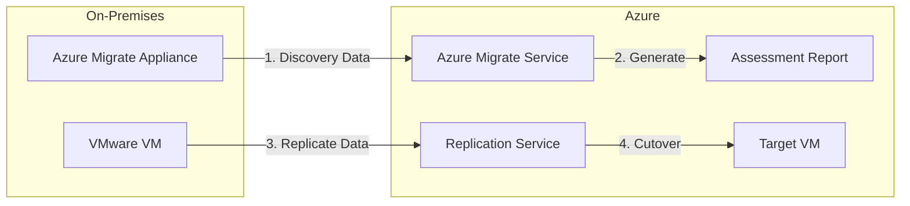
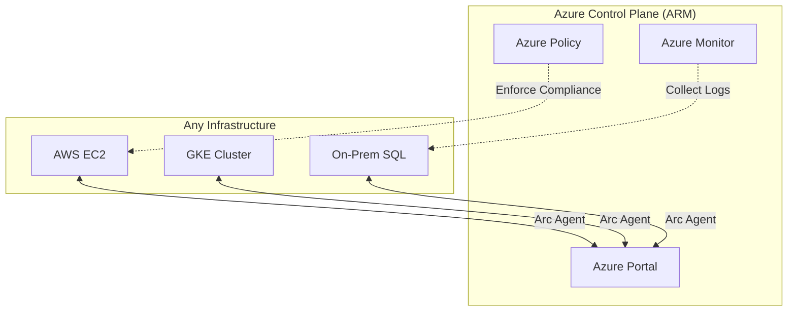

# Migration & Hybrid Cloud

## Overview
Enterprise banking is rarely "all-in" on public cloud. It is **Hybrid**.
Staff Engineers must know how to bridge the gap between the legacy mainframe in the basement and the Kubernetes cluster in the cloud.
Interviewers focus on **Migration Strategies** (6 Rs) and **Unified Management**.

## Foundational Concepts

### The 6 Rs of Migration
1. **Rehost (Lift & Shift)**: Move VM to Azure VM. (Azure Migrate).
2. **Refactor (Repackage)**: Move to PaaS (e.g., SQL on VM -> SQL MI).
3. **Rearchitect**: Rewrite as Microservices.
4. **Rebuild**: Rewrite from scratch (Cloud Native).
5. **Replace**: Buy SaaS (Exchange -> Office 365).
6. **Retain**: Keep on-prem (Mainframe).

### Hybrid Cloud
- **Connectivity**: ExpressRoute / VPN (Covered in Networking).
- **Management**: Azure Arc.
- **Compute**: Azure Stack.

## Technical Deep Dive

### 1. Azure Migrate
The central hub for migration.
- **Discovery**: Agentless appliance scans on-prem VMware/Hyper-V.
- **Assessment**: "Is this VM ready? How much will it cost? What size do I need?"
- **Migration**: Replicates data to Azure Blob, then spins up the VM.

### 2. Azure Arc
"Bring Azure to your infrastructure."
- **Arc-enabled Servers**: Manage Linux/Windows servers on AWS/GCP/On-prem as if they were Azure resources (Apply Policy, RBAC, Tags).
- **Arc-enabled Kubernetes**: Attach any K8s cluster (OpenShift, EKS, GKE) to Azure. Deploy apps via GitOps.
- **Arc-enabled Data Services**: Run Azure SQL Managed Instance on your own hardware.

### 3. Azure Stack
- **Azure Stack Hub**: A complete Azure region in your data center (Disconnected).
- **Azure Stack HCI**: Hyper-converged infrastructure (Virtualization).
- **Azure Stack Edge**: Hardware appliance for AI/ML at the edge (e.g., in a bank branch).

## Visual Representations

### Azure Migrate Workflow

### Azure Arc Architecture

## Real-World Enterprise Scenarios

### Scenario: "The Unmovable Mainframe"
**Requirement**: A core banking system runs on a mainframe and cannot be moved. New digital apps in Azure need to access it with low latency.
**Solution**: **ExpressRoute + Azure Arc**.
1. **Connectivity**: ExpressRoute Direct for high-bandwidth, low-latency link.
2. **Management**: Install Azure Arc agents on the satellite Windows servers running in the data center to manage them from the cloud.
3. **API**: Expose mainframe data via an API Gateway on-prem, connected to Azure APIM via VNet integration.

### Scenario: Multi-Cloud Compliance
**Requirement**: The CISO wants a single dashboard to see if servers in Azure, AWS, and On-Prem are patched.
**Solution**: **Azure Arc + Azure Update Management**.
1. Onboard AWS EC2 instances to Azure Arc.
2. Enable **Update Management** center.
3. View patch status for *all* servers in the Azure Portal.
4. Schedule patch deployments from Azure to AWS.

## Interview Questions & Model Answers

### Q1: What is the difference between Azure Stack and Azure Arc?
**Answer**:
- **Azure Stack**: Hardware. You buy/lease hardware to run Azure *services* on-prem. "I want the Azure cloud in my basement."
- **Azure Arc**: Software/Management. You use Azure *tools* to manage *existing* infrastructure anywhere. "I want to manage my basement from the Azure cloud."

### Q2: How does Azure Migrate estimate costs?
**Answer**:
It looks at **performance history** (CPU/RAM utilization) over time (e.g., 30 days).
- **Right-sizing**: If you have a 16-core VM on-prem but only use 5% CPU, Azure Migrate recommends a 2-core Azure VM.
- **Benefit**: This "Performance-based" sizing saves massive amounts compared to "As-On-Prem" sizing (1:1 mapping).

### Q3: Can I use Azure Policy on an AWS EC2 instance?
**Answer**:
**Yes**, via Azure Arc.
- The Arc agent ("Connected Machine Agent") pulls policies from Azure.
- **Guest Configuration**: It can audit settings inside the OS (e.g., "Password complexity", "Certificate expiry").

## Key Takeaways
- **Migration** is 20% technology, 80% planning.
- **Azure Arc** is Microsoft's answer to Multi-Cloud.
- **Right-sizing** during assessment is the easiest way to prove ROI.

## Further Reading
- [Azure Migrate documentation](https://learn.microsoft.com/en-us/azure/migrate/)
- [Azure Arc overview](https://learn.microsoft.com/en-us/azure/azure-arc/overview)
- [Cloud Adoption Framework - Migration](https://learn.microsoft.com/en-us/azure/cloud-adoption-framework/migrate/)
