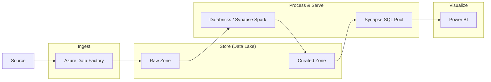

# Analytics, Big Data & AI

## Overview
"Data is the new oil."
Staff Engineers need to know how to refine that oil.
Interviewers focus on the **Modern Data Warehouse** architecture and the trade-offs between **Synapse** and **Databricks**.

## Foundational Concepts

### ETL vs. ELT
- **ETL (Extract, Transform, Load)**: Transform data *before* loading it into the warehouse. (Legacy).
- **ELT (Extract, Load, Transform)**: Load raw data into the Data Lake first, then transform it using the power of the cloud. (Modern).

### The "Modern Data Warehouse"
1. **Ingest**: Azure Data Factory.
2. **Store**: ADLS Gen2 (Data Lake).
3. **Process**: Synapse / Databricks.
4. **Serve**: Synapse SQL / Power BI.

## Technical Deep Dive

### 1. Azure Synapse Analytics
The unified analytics platform.
- **Dedicated SQL Pools**: Formerly SQL Data Warehouse. MPP (Massively Parallel Processing). Best for relational warehousing.
- **Serverless SQL Pools**: Query data *directly* in the Data Lake using T-SQL. No infrastructure to manage. Pay per TB scanned.
- **Spark Pools**: Apache Spark integration.

### 2. Azure Databricks
Apache Spark-based analytics platform (First-party service).
- **Delta Lake**: Adds ACID transactions to the Data Lake.
- **Unity Catalog**: Unified governance for data and AI.
- **Use Case**: Heavy data engineering, machine learning, data science.

### 3. Azure Data Factory (ADF)
The orchestrator.
- **Pipelines**: Logical grouping of activities.
- **Integration Runtime (IR)**: The compute infrastructure.
  - **Azure IR**: Cloud-to-Cloud.
  - **Self-Hosted IR**: On-Prem-to-Cloud (installed on a local VM).

### 4. Azure Stream Analytics
Real-time event processing.
- **Input**: Event Hubs / IoT Hub.
- **Query**: SQL-like language (`SELECT * INTO SQL FROM Hub WHERE Temperature > 100`).
- **Output**: Power BI / SQL / Blob.

## Visual Representations

### Modern Data Warehouse Architecture


### Stream Analytics Job Topology
```mermaid
graph LR
    IoT[IoT Devices] --> Hub[IoT Hub]
    Hub --> ASA[Stream Analytics Job]
    ASA -->|Hot Path| PBI[Power BI Dashboard]
    ASA -->|Cold Path| Blob[Blob Storage (Archive)]
```

## Configuration Examples

### Stream Analytics Query (Tumbling Window)
```sql
SELECT
    System.Timestamp AS WindowEnd,
    DeviceId,
    AVG(Temperature) AS AvgTemp
INTO
    AlertsOutput
FROM
    SensorInput TIMESTAMP BY EventTime
GROUP BY
    DeviceId,
    TumblingWindow(second, 10)
HAVING
    AVG(Temperature) > 80
```

## Real-World Enterprise Scenarios

### Scenario: Fraud Detection Pipeline
**Requirement**: Detect credit card fraud in < 2 seconds.
**Solution**: **Event Hubs + Stream Analytics + Functions**.
1. **Ingest**: Transactions sent to Event Hubs.
2. **Process**: Stream Analytics calculates "Average spend in last 5 mins".
3. **Detect**: If current transaction > 5x average, trigger Azure Function.
4. **Act**: Function denies transaction and sends SMS.

### Scenario: Nightly Batch Processing
**Requirement**: Process 50TB of daily logs from on-prem servers.
**Solution**: **ADF + Databricks**.
1. **ADF**: Triggers copy job (Self-Hosted IR) to move logs to ADLS Gen2.
2. **Databricks**: Mounts the Data Lake. Runs Spark job to clean/aggregate data.
3. **Synapse**: Databricks writes final "Gold" data to Synapse SQL Pool for reporting.

## Interview Questions & Model Answers

### Q1: Synapse Spark vs. Databricks - Which one do I choose?
**Answer**:
- **Databricks**: Best for heavy Data Engineering, AI/ML, and if you have a cross-cloud strategy (AWS/GCP). Deeper Spark features (Delta Engine).
- **Synapse Spark**: Best if you want a "Single Pane of Glass" (SQL + Spark in one UI). Good for teams already comfortable with the Microsoft ecosystem.
- **Enterprise Reality**: Many banks use *both*. Databricks for engineering, Synapse for warehousing.

### Q2: What is "PolyBase" (or COPY command) in Synapse?
**Answer**:
It is the high-performance data loading mechanism.
- Instead of inserting row-by-row (slow), PolyBase/COPY reads files directly from Blob Storage in parallel.
- **Interview Tip**: "Never use `INSERT INTO` for bulk loads in Synapse. Always use COPY."

### Q3: Explain the "Lambda Architecture".
**Answer**:
A design to handle massive data by splitting it into two paths:
1. **Batch Layer (Cold)**: Accurate, comprehensive, but slow (Hadoop/Spark).
2. **Speed Layer (Hot)**: Real-time, approximate, fast (Stream Analytics).
3. **Serving Layer**: Merges the views.
*Note: "Delta Lake" architecture (Kappa) is replacing this by allowing streaming and batch on the same table.*

## Key Takeaways
- **Separation of Compute and Storage** is the key to scaling analytics.
- **Data Lake** is the center of gravity.
- **Stream Analytics** makes real-time easy (SQL).

## Further Reading
- [What is Azure Synapse Analytics?](https://learn.microsoft.com/en-us/azure/synapse-analytics/overview-what-is)
- [Azure Databricks documentation](https://learn.microsoft.com/en-us/azure/databricks/)
- [Lambda architecture](https://learn.microsoft.com/en-us/azure/architecture/data-guide/big-data/real-time-processing)
