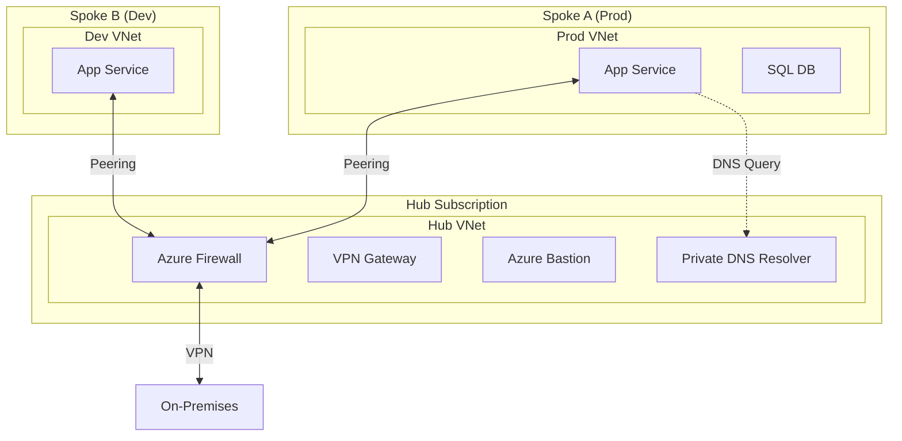
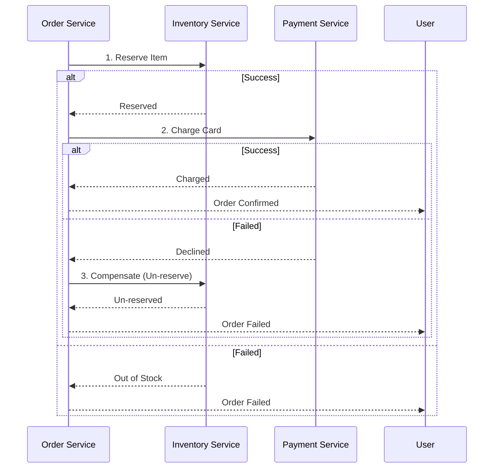

# Advanced Architectures & Patterns

## Overview
This is the "Principal Engineer" section.
It's not about individual services anymore; it's about how they fit together to solve complex business problems.
Interviewers want to see **System Design** skills.

## Foundational Concepts

### Microservices vs. Monolith
- **Monolith**: Single deployable unit. Simple to develop, hard to scale.
- **Microservices**: Independent deployable units. Hard to develop (distributed complexity), easy to scale.

### Serverless
- **Definition**: You don't manage the servers. You pay for value (execution time).
- **Benefit**: Extreme agility and cost scaling.
- **Drawback**: Cold starts, vendor lock-in.

## Technical Deep Dive

### 1. Microservices Patterns
- **Gateway Offloading**: Use APIM/App Gateway to handle SSL, Auth, and Rate Limiting. Don't do this in every service.
- **Sidecar (Dapr)**: Attach a helper process to your main app to handle networking, state, and secrets.
- **Saga Pattern**: Managing distributed transactions across services (since you don't have a single DB transaction).

### 2. Enterprise Landing Zone (Hub & Spoke)
The standard blueprint for banking.
- **Hub**: Shared services (Firewall, VPN, DNS, Bastion).
- **Spoke**: Workloads (Prod App, Dev App).
- **Peering**: Spokes peer to Hub. Spokes *do not* peer to each other (usually).

### 3. Serverless Orchestration
- **Chaining**: Function A calls Function B. (Bad - double billing).
- **Durable Functions**: Function A starts an Orchestrator, which calls B, waits, then calls C. (Good - state is managed).

## Visual Representations

### Enterprise Landing Zone (Hub & Spoke)


### Saga Pattern (Order Processing)


## Configuration Examples

### Durable Functions (Orchestrator) - C#
```csharp
[FunctionName("OrderOrchestrator")]
public static async Task RunOrchestrator(
    [OrchestrationTrigger] IDurableOrchestrationContext context)
{
    // Step 1: Reserve Inventory
    bool reserved = await context.CallActivityAsync<bool>("ReserveInventory", orderId);
    
    if (!reserved) {
        return; // Stop
    }

    // Step 2: Process Payment
    bool paid = await context.CallActivityAsync<bool>("ProcessPayment", orderId);

    if (!paid) {
        // Step 3: Compensate (Undo Reservation)
        await context.CallActivityAsync("ReleaseInventory", orderId);
    }
}
```

## Real-World Enterprise Scenarios

### Scenario: "The Strangler Fig"
**Requirement**: Replace a massive legacy monolith with microservices without downtime.
**Solution**: **Strangler Fig Pattern**.
1. Put **Azure Front Door** in front of the Monolith.
2. Build *one* new microservice (e.g., "User Profile") in AKS.
3. Configure Front Door to route `/users/*` to AKS, and everything else `/*` to the Monolith.
4. Repeat until the Monolith is gone.

### Scenario: Secure Multi-Tenant SaaS
**Requirement**: You are building a SaaS for other banks. Each bank's data must be isolated.
**Solution**: **Deployment Stamps**.
1. Create a standard "Stamp" (Resource Group with App Service + SQL).
2. Use **Bicep** to deploy one Stamp per customer.
3. Use **Front Door** to route `bankA.myapp.com` to Stamp A and `bankB.myapp.com` to Stamp B.

## Interview Questions & Model Answers

### Q1: How do you handle "Distributed Transactions" in Microservices?
**Answer**:
"You don't." (Ideally).
- **Avoidance**: Design service boundaries so transactions stay within one service.
- **Saga Pattern**: If you must, use Sagas (Sequence of local transactions).
- **Two-Phase Commit (2PC)**: Avoid in cloud (too slow, locks resources).

### Q2: Why use a Hub-and-Spoke topology?
**Answer**:
1. **Cost**: Share expensive resources (Firewall, ExpressRoute) across many workloads.
2. **Security**: Centralized inspection point (Firewall) for all traffic.
3. **Governance**: Separation of duties (Network team manages Hub, App teams manage Spokes).

### Q3: What is the "Sidecar" pattern?
**Answer**:
Decoupling application logic from infrastructure logic.
- Instead of importing a "Logging Library" into your Java code...
- You run a "Logging Container" (Sidecar) next to your Java container in the same Pod.
- The Java app writes to stdout. The Sidecar reads stdout and pushes to Splunk.
- **Benefit**: You can change the logging system without touching the Java code.

## Key Takeaways
- **Simplicity** is the ultimate sophistication. Don't build microservices if a monolith will do.
- **Hub-and-Spoke** is the law in enterprise networking.
- **Asynchronous** communication (Queues) is better than Synchronous (HTTP) for resilience.

## Further Reading
- [Azure Architecture Center](https://learn.microsoft.com/en-us/azure/architecture/)
- [Cloud Design Patterns](https://learn.microsoft.com/en-us/azure/architecture/patterns/)
- [Azure Landing Zones](https://learn.microsoft.com/en-us/azure/cloud-adoption-framework/ready/landing-zone/)
