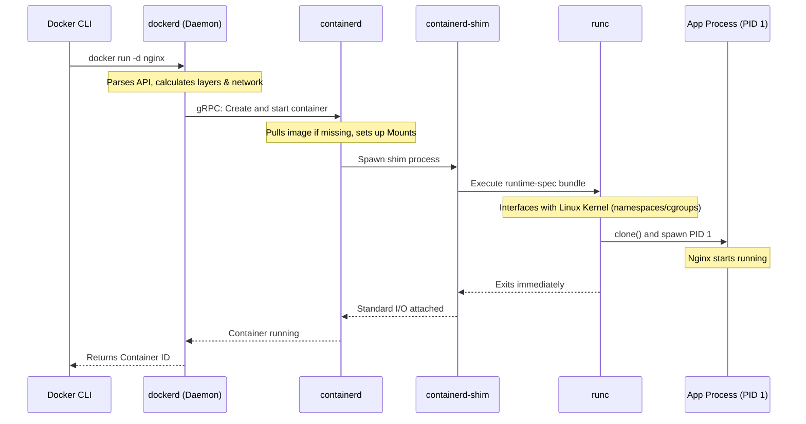

# Docker Fundamentals and Architecture

## Overview

Docker revolutionized the software delivery process by containerizing applications, fundamentally altering how operations and development teams interact. While the concept of containers (such as FreeBSD Jails, Solaris Zones, or LXC) existed long before Docker, it was Docker's unification of these concepts into a developer-friendly interface, a robust image packaging format, and a central registry (Docker Hub) that catalyzed the cloud-native computing era.

In enterprise banking and financial systems, Docker forms the atomic layer of immutable deployments. The consistency from a developer's local machine to an Azure Kubernetes Service (AKS) or Amazon EKS production cluster ensures resilient operations and strictly minimizes configuration drift—a cardinal compliance requirement for audited fintech environments. A Senior Platform or DevOps Engineer is expected to command a profound understanding of Docker’s underlying architecture, bridging the gap between high-level YAML orchestration and low-level Linux kernel isolation. 

Interviewers at top-tier financial institutions use Docker architecture questions to separate practitioners who just run `docker compose up` from engineers who understand the mechanics of the daemon, the role of `containerd`, and the interaction with the OCI (Open Container Initiative) specifications.

---

## Foundational Concepts

### What is Docker and Why It Matters

Docker is a platform for developing, shipping, and running applications inside isolated environments called containers. 

Before Docker, monolithic enterprise applications (like massive Spring/Java WebLogic clusters) suffered from the "it works on my machine" syndrome. Moving an application required moving the application code, the application server, the specific Java version, the OS libraries, and manually matching configuration files.

Docker encapsulates all of this—code, runtime, system tools, system libraries, and settings—into a standardized unit (an Image). 

### Containerization vs. Virtualization

The most common misconception is treating containers as "lightweight virtual machines." They operate at completely different abstraction layers.

*   **Virtual Machines (Hypervisor-Based)**: 
    *   Virtualize the **Hardware**. 
    *   A hypervisor (like VMware ESXi or KVM) takes physical CPU, memory, and storage, slicing it up. 
    *   Each VM boots its own entirely independent Guest Operating System kernel. This consumes gigabytes of memory and minutes of boot time before the application even starts.
*   **Containers (OS-Level Virtualization)**: 
    *   Virtualize the **Operating System**. 
    *   Containers share the *Host* OS kernel. A container is simply a standard Linux process running on the host, but it is placed in an isolated sandbox (Namespaces) and given strict resource limits (cgroups). 
    *   Because there is no guest kernel to boot, containers start in milliseconds and have negligible memory overhead.

---

## Technical Deep Dive

### The Docker Architecture (Daemon, containerd, runc)

Originally, Docker was a monolithic system. To support enterprise scale, Kubernetes integration, and industry standards, the architecture was shattered into distinct, modular components.

#### 1. The Docker Client (`docker` CLI)
The primary user interface. When you type `docker run nginx`, the CLI parses the command, translates it into a REST API call, and sends it to the Docker Daemon over a local UNIX socket (`/var/run/docker.sock`) or a TCP port.

#### 2. The Docker Daemon (`dockerd`)
The high-level server. It listens for Docker API requests and manages Docker objects such as images, containers, networks, and volumes. Crucially, `dockerd` **no longer runs the containers itself**. It delegates execution logic downward.

#### 3. containerd
Originally part of `dockerd`, `containerd` is now an independent, graduated CNCF project. It is an industry-standard container runtime designed for simplicity and robustness.
*   **Role**: It manages the complete lifecycle of a container on the host. It pushes/pulls images, manages storage overlays, and coordinates network attachment.
*   **Communication**: `dockerd` speaks to `containerd` via gRPC over a UNIX socket (`/run/containerd/containerd.sock`).

#### 4. The containerd-shim
When `containerd` needs to spawn a container, it doesn't spin it up directly. It uses a "shim" process (`containerd-shim`). 
*   **Purpose**: The shim sits between `containerd` and the running container. It serves two massive architectural benefits:
    1.  **Daemonless Execution**: It allows `containerd` or `dockerd` to crash, restart, or upgrade *without* killing the running containers (e.g., your production PostgreSQL DB doesn't die when you upgrade Docker).
    2.  **I/O Handling**: It keeps standard file descriptors (`stdout`, `stderr`) open and collects the container's exit code to report back to the daemon later.

#### 5. runc (The OCI Runtime)
`runc` is the lowest-level execution tool. Donated by Docker to the Open Container Initiative (OCI), it is a lightweight, strictly scoped CLI tool.
*   **Role**: It takes an OCI bundle (an extracted image and a `config.json`), talks directly to the Linux kernel to create the Namespaces and cgroups, spawns the container's initial process (PID 1), and then exactly finishes and exits. It does not stay alive. 

### OCI Standards

The Open Container Initiative (OCI) defines industry standards to prevent vendor lock-in. A Senior Engineer must know these:
1.  **Image Specification (image-spec)**: Defines how an image is structured (blobs, manifests, config). Docker images are OCI-compliant.
2.  **Runtime Specification (runtime-spec)**: Defines how a runtime (like `runc`) should unpack an image and execute it interacting with the kernel.
3.  **Distribution Specification (distribution-spec)**: Defines the API protocol a container registry (like Docker Hub, AWS ECR) uses to push and pull images.

---

## Visual Representations

### Container vs VM Architecture

```mermaid
graph TD
    classDef hardware fill:#f5f5f5,stroke:#9e9e9e,stroke-width:2px;
    classDef hypervisor fill:#ffe0b2,stroke:#f57c00,stroke-width:2px;
    classDef os fill:#bbdefb,stroke:#1976d2,stroke-width:2px;
    classDef app fill:#c8e6c9,stroke:#388e3c,stroke-width:2px;

    subgraph "Virtual Machine Architecture"
        direction BT
        HW1[Host Hardware] 
        HYP[Hypervisor / ESXi]
        GOS1[Guest OS 1\n(Full Kernel)]
        GOS2[Guest OS 2\n(Full Kernel)]
        APP1[App A + Bins/Libs]
        APP2[App B + Bins/Libs]
        
        HW1 --> HYP
        HYP --> GOS1
        HYP --> GOS2
        GOS1 --> APP1
        GOS2 --> APP2
    end
    
    subgraph "Container Architecture"
        direction BT
        HW2[Host Hardware]
        OS2[Host OS Linux Kernel]
        DE[Docker Engine / containerd]
        CAPP1[Container 1\nApp A + Bins/Libs]
        CAPP2[Container 2\nApp B + Bins/Libs]
        
        HW2 --> OS2
        OS2 --> DE
        DE --> CAPP1
        DE --> CAPP2
    end

    class HW1,HW2 hardware;
    class HYP hypervisor;
    class OS2,GOS1,GOS2 os;
    class DE,APP1,APP2,CAPP1,CAPP2 app;
```

### Docker Daemon Component Hierarchy



---

## Code/Configuration Examples

### Securing the Docker Daemon
In a distributed enterprise network, the Docker Daemon can listen on TCP. However, doing so unencrypted grants anyone full root access to the host. You must use mutual TLS (mTLS).

**`daemon.json` configuration for secure API exposure:**
```json
{
  "tlsverify": true,
  "tlscacert": "/etc/docker/certs/ca.pem",
  "tlscert": "/etc/docker/certs/server-cert.pem",
  "tlskey": "/etc/docker/certs/server-key.pem",
  "hosts": [
    "unix:///var/run/docker.sock",
    "tcp://0.0.0.0:2376"
  ],
  "log-driver": "json-file",
  "log-opts": {
    "max-size": "100m",
    "max-file": "3"
  }
}
```
*Note: The CLI client must then authenticate using its own client certificates to connect to port 2376.*

---

## Interview Questions & Model Answers

### Q1: What is the fundamental difference between a Docker container and a VM?
**Model Answer**: Virtual Machines emulate hardware. A hypervisor intercepts instruction sets and allows multiple complete Guest Operating Systems (kernels) to run on a single physical host. This adds gigabytes of memory footprint and minutes of boot latency. A container, on the other hand, is simply an isolated Linux process. It leverages the host OS kernel via Linux `namespaces` (for visibility isolation) and `cgroups` (for resource limiting). Because there is no guest kernel to boot, containers are lightweight, portable, and start in milliseconds.

**Follow-up**: *Are VMs obsolete then?*
**Answer**: Absolutely not. VMs provide strict tenant isolation at the hardware instruction level. In banking, we run Kubernetes worker nodes as VMs to ensure strong isolation between clusters, and then pack those VMs densely with Docker containers. They are complementary technologies.

### Q2: Walk me through exactly what happens internally when I execute `docker run nginx`.
**Model Answer**: 
1. The **Docker CLI** translates the command into a REST API payload and POSTs it to the `/containers/create` endpoint of `dockerd` via the UNIX socket.
2. `dockerd` receives it. If the `nginx` image isn't local, `dockerd` instructs `containerd` to pull it from the OCI registry over HTTPS.
3. `dockerd` allocates a network interface from the IPAM pool and prepares the storage overlay graph.
4. `dockerd` makes a gRPC call to `containerd` to start the execution.
5. `containerd` creates a `containerd-shim` process for this specific container.
6. The `shim` invokes `runc`.
7. `runc` interacts directly with the Linux kernel, calling `clone()` to create new namespaces (PID, NET, MNT) and writing to `cgroup` files to set resource constraints.
8. `runc` forks the execution to start the `nginx` binary as PID 1 inside the isolated environment, and then `runc` exits.
9. The `containerd-shim` remains alive, holding the `stdout/stderr` streams and waiting to report the exit code if `nginx` crashes.

### Q3: If the `dockerd` process crashes on my server, what happens to my running containers?
**Model Answer**: Thanks to the modular architecture introduced heavily in Docker 1.11, the running containers **will not crash**. The `dockerd` process is essentially a management API. The containers themselves are children of the `containerd-shim` processes (which are parented by systemd or containerd, depending on the OS state). Because the shim decouples the container from the daemon, `dockerd` (and even `containerd`) can be restarted or upgraded, and upon coming back online, it will simply re-attach to the state of the existing shims without interrupting the active application traffic.

### Q4: Our security auditor noted that our CI/CD pipelines use "Docker-out-of-Docker" by binding `-v /var/run/docker.sock:/var/run/docker.sock`. Why is this a CVSS 10.0 critical security risk?
**Model Answer**: The `docker.sock` is the control socket for the Docker Daemon, and the Daemon runs as `root`. By mounting this socket into an untrusted CI container, you grant any script running in that container the ability to talk to the Daemon. A malicious script could execute `docker run -v /:/host-root -it ubuntu chroot /host-root`. This commands the Daemon to spin up a new container, mount the physical host's entire root drive into it, and switch execution to it. The attacker now has instantaneous, passwordless root shell access to the underlying CI physical server. This breaks all isolation.

### Q5: What is the OCI, and why do enterprise architects care about it?
**Model Answer**: The Open Container Initiative (OCI) is a Linux Foundation project that defines an open standard for container runtimes and image formats. Enterprise architects care because it prevents vendor lock-in. Because Docker donated `runc` and adhered to the OCI Image specification, we are guaranteed that an image built with Docker Desktop locally can be securely shipped to an AWS ECR registry, pulled by `containerd` on a Kubernetes cluster, and executed flawlessly—completely removing Docker Inc.'s daemon from the production path if we choose.

---

## Real-World Enterprise Scenarios

### The "Failing Upgrades" Scenario
**Context**: A Tier-1 banking transfer service runs on standalone Docker Engine servers. The security team mandates a patch for the Docker Daemon due to an API vulnerability, but the transfer service cannot endure a 5-minute outage.
**Architectural Solution**: Because of Docker's decoupled architecture (`dockerd` -> `containerd` -> `shim`), we can safely achieve a live upgrade. We configure `--live-restore` in `daemon.json`. We can gracefully restart `dockerd`. The API goes down temporarily, meaning no *new* containers can be scheduled, but the existing `containerd-shims` keep the transfer service fully operational processing UDP/TCP traffic. The daemon reconnects upon startup.

---

## Common Pitfalls & Best Practices

1.  **Anti-Pattern: Assuming Docker provides Security Isolation Comparable to a VM.**
    *   *Reality*: Containers share the host kernel. A kernel panic triggered by one container crashes the host and ALL containers on it. A kernel exploit (like Dirty COW) allows root breakout. Default to defense-in-depth: use minimal base images (distroless), run as non-root, and drop Linux capabilities. For ultra-secure multi-tenancy (e.g., executing untrusted user code), utilize microVM runtimes like `Firecracker` or `gVisor` rather than standard `runc`.
2.  **Anti-Pattern: Bloated Image Architectures.**
    *   Treating a container like a VM by installing SSH (`sshd`), `systemd`, `cron`, and a web server inside a single container.
    *   *Best Practice*: Emulate the Single Responsibility Principle. One concern per container. Run logging as a sidecar. Run cron externally (e.g., Kubernetes CronJobs). Access via `docker exec`, not SSH.

---

## Comparison Tables

### Docker Engine vs Docker Desktop vs containerd

| Component | Target Audience | Primary Role | Requires VM/Hypervisor? |
| :--- | :--- | :--- | :--- |
| **Docker Engine (`dockerd`)** | Linux Servers / Production | Daemon API, Orchestration, Building | No (Runs native on Linux kernel) |
| **Docker Desktop** | Mac / Windows Devs | GUI, seamless VM management | Yes (Starts a Linux VM via WSL2/HyperKit to run Engine inside) |
| **containerd** | Kubernetes / Advanced Ops | Raw lifecycle management | No (Calls `runc` directly) |

---

## Key Takeaways

*   **OS-Level Virtualization**: Containers share the Linux kernel, making them magnitudes lighter than VMs. They are fundamentally just restricted processes.
*   **Modular Architecture**: The Docker ecosystem is tiered (`dockerd` → `containerd` → `shim` → `runc`). Memory of this flow is critical for system debugging.
*   **Live Restore**: Shims prevent containers from dying when the daemon crashes.
*   **OCI Standards**: Docker is effectively a highly polished UI and UX layer sitting on top of the open Linux Foundation OCI standards.
*   **socket = root**: Access to `/var/run/docker.sock` is equivalent to passwordless root access to the host node.

## Further Reading
*   [Docker Architecture Overview (Docker Docs)](https://docs.docker.com/get-started/overview/#docker-architecture)
*   [The Open Container Initiative](https://opencontainers.org/)
*   [Understanding containerd](https://containerd.io/)
